# AI_26090.md

## Kala Setu — AI & Intelligence Architecture / Specification

> **Purpose:** Define the complete intelligence backbone of Kala Setu: speech, language understanding, vision, catalog generation, translation, pricing advisory, demand matching, conversational action planning, AI governance, provider orchestration, evaluation, observability, privacy and failure handling.
>
> **Status:** AI baseline / implementation specification / ₹0-first SIH MVP
>
> **Position in the system:** AI is the intelligence layer that converts natural human input into structured proposals, recommendations and evidence. It is **not** the system of record and it never bypasses deterministic domain services.

---

# 0. AI Mission

Kala Setu's core technical challenge is not “adding an LLM.” The product must hide e-commerce complexity behind a multimodal interface that can understand artisan speech, photographs and natural commands, while remaining safe enough to operate real commerce data.

The AI layer therefore has five responsibilities:

1. **Understand** — convert speech, images and natural language into structured information.
2. **Prepare** — generate catalog text, translations, image derivatives and explanations.
3. **Advise** — produce transparent price recommendations and market matches.
4. **Act safely** — transform natural-language commands into proposals that can be authorized, confirmed and committed by deterministic domain services.
5. **Learn operationally** — capture corrections, evidence, confidence and outcomes for evaluation and future improvement.

It explicitly does **not** own:

- product ownership;
- inventory truth;
- reservation truth;
- order state;
- payment state;
- user role authority;
- seller identity;
- final publication state.

---

# 1. AI System Contract

## 1.1 Foundational Rule

> **AI proposes. Humans and deterministic domain services decide. PostgreSQL records the result.**

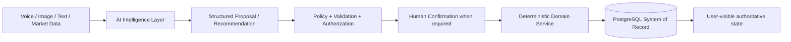

## 1.2 AI Boundary

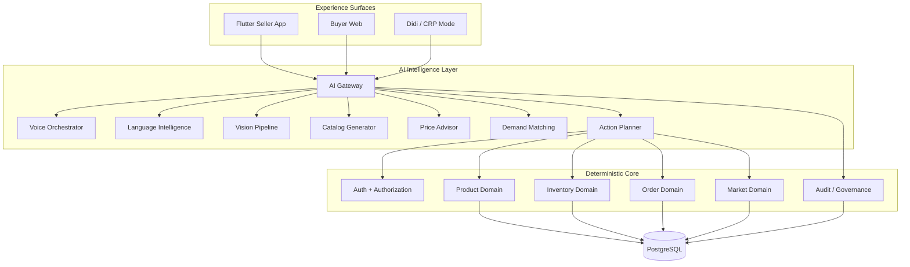

## 1.3 What AI May and May Not Do

| AI may do | AI may not do directly |
|---|---|
| transcribe speech | mutate `inventory` directly |
| detect language | create an authoritative order directly |
| extract product attributes | change payment truth |
| draft titles/descriptions | bypass RBAC |
| translate catalog text | change seller ownership |
| enhance images safely | silently publish consequential claims |
| recommend prices | reserve inventory without domain validation |
| rank candidate matches | bypass quotation/order rules |
| propose natural-language actions | grant Didi scope |
| explain recommendations | write authoritative commerce state without domain service |

---

# 2. Intelligence Capability Map

Kala Setu uses several specialized AI capabilities behind one logical gateway.

```mermaid
flowchart TB
    Gateway["AI Gateway"]
    Gateway --> Speech["Speech Intelligence"]
    Gateway --> Language["Language Intelligence"]
    Gateway --> Vision["Vision Intelligence"]
    Gateway --> Generation["Content Generation"]
    Gateway --> Decision["Decision Support"]
    Gateway --> Retrieval["Semantic Retrieval"]
    Gateway --> Safety["AI Safety / Policy"]

    Speech --> STT["Speech-to-Text"]
    Speech --> TTS["Text-to-Speech"]
    Speech --> LID["Language ID"]

    Language --> Intent["Intent Classification"]
    Language --> Entities["Entity Extraction"]
    Language --> Translate["Translation"]

    Vision --> Quality["Image Quality"]
    Vision --> Segment["Segmentation"]
    Vision --> Attributes["Visual Attributes"]

    Generation --> Catalog["Catalog Copy"]
    Generation --> Story["Craft Story"]
    Generation --> Explain["Explanation"]

    Decision --> Pricing["Price Advisory"]
    Decision --> Matching["Demand Matching"]
    Decision --> Actions["Action Planning"]

    Retrieval --> Similar["Comparable Search"]
    Retrieval --> Semantic["Semantic Search"]

    Safety --> Provenance["Provenance Checks"]
    Safety --> Risk["Risk Classification"]
    Safety --> Confirmation["Confirmation Policy"]
```

## 2.1 Capability Ownership

| Capability | Primary output | Authoritative owner after AI |
|---|---|---|
| STT | transcript | voice interaction record |
| Language ID | language code + confidence | interaction metadata |
| Intent extraction | intent + entities | action proposal |
| Vision | observations + quality findings | product/media domain after validation |
| Catalog | draft localized content | catalog domain after confirmation |
| Translation | translated text | catalog version after confirmation |
| Pricing | recommendation + factors | artisan/business owner |
| Matching | ranked opportunities | market domain |
| Action planning | proposed mutation | deterministic domain service |
| TTS | audio response | client presentation layer |

---

# 3. AI Architecture Layers

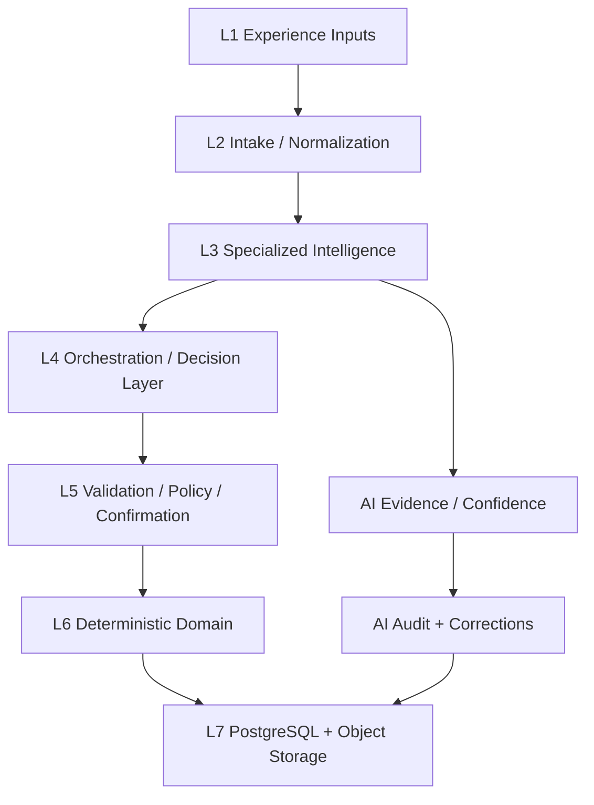

### L1 — Experience Inputs

- microphone;
- camera;
- typed corrections;
- seller taps;
- buyer search and requirement forms;
- market data;
- context from the current task.

### L2 — Intake / Normalization

- file validation;
- audio normalization;
- image normalization;
- locale normalization;
- language detection;
- context binding;
- request identifiers;
- privacy/retention classification.

### L3 — Specialized Intelligence

Individual models should remain narrow and replaceable.

### L4 — Orchestration / Decision Layer

The orchestration layer combines model outputs, deterministic calculations, retrieval results and user context into a structured proposal.

### L5 — Validation / Policy / Confirmation

The platform checks:

- schema validity;
- permission;
- field provenance;
- confidence/risk;
- business constraints;
- confirmation requirement;
- stale context / revision.

### L6 — Deterministic Domain

The domain service performs the actual mutation.

### L7 — Storage

PostgreSQL stores authoritative state and AI evidence references. Object storage stores media/audio artifacts where retention rules permit.

---

# 4. AI Gateway

## 4.1 Gateway Contract

All providers must sit behind adapter interfaces.

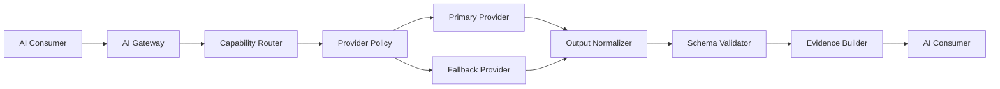

## 4.2 Adapter Interfaces

```text
SpeechProvider
  - transcribe()
  - detect_language()

TTSProvider
  - synthesize()

TranslationProvider
  - translate()

LLMProvider
  - generate_structured()
  - classify()
  - explain()

VisionProvider
  - inspect()
  - segment()
  - enhance()

EmbeddingProvider
  - embed()

MarketDataProvider
  - comparable_search()
  - demand_features()
```

Providers must never leak vendor-specific response objects into domain code.

## 4.3 Canonical AI Request Envelope

```json
{
  "request_id": "uuid",
  "trace_id": "uuid",
  "capability": "CATALOG_GENERATION",
  "actor_type": "ARTISAN",
  "actor_id": "uuid",
  "session_id": "uuid",
  "context": {
    "screen": "S36",
    "entity_type": "PRODUCT",
    "entity_id": "uuid",
    "locale": "hi-IN"
  },
  "input_refs": ["uuid"],
  "requested_output_schema": "CatalogDraftV1",
  "risk_class": "CONSEQUENTIAL",
  "requires_confirmation": true,
  "deadline_ms": 10000
}
```

## 4.4 Canonical AI Result Envelope

```json
{
  "request_id": "uuid",
  "decision_id": "uuid",
  "status": "SUCCEEDED",
  "capability": "CATALOG_GENERATION",
  "model": "qwen3-8b-local",
  "provider": "ollama-local",
  "confidence": 0.91,
  "risk_class": "CONSEQUENTIAL",
  "requires_confirmation": true,
  "proposal": {},
  "factors": [],
  "source_refs": [],
  "warnings": [],
  "expires_at": "timestamp"
}
```

---

# 5. Provider Strategy — ₹0 MVP

The architecture defines a local/open-source first order of preference.

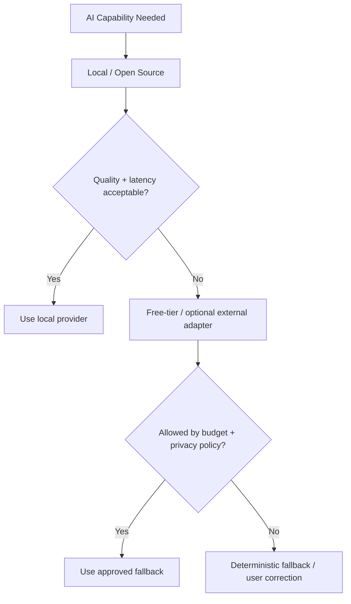

## 5.1 Baseline Provider Matrix

| Capability | Primary MVP baseline | Optional fallback | Important boundary |
|---|---|---|---|
| STT | AI4Bharat IndicConformer 600M locally | faster-whisper / Whisper-family | heavy inference outside edge runtime |
| Translation | IndicTrans2/IndicTrans3 locally | approved endpoint where available | do not force external provider dependency |
| LLM | Ollama + Qwen3 4B/8B locally | Gemini free tier for controlled fallback/testing | structured output required |
| Vision | OpenCV + lightweight local segmentation | SAM/SAM2 local | safe transformations only |
| TTS | Piper / compatible open Indian-language model | approved open/free path | cache where practical |
| Embeddings | sentence-transformers locally | none required | used for semantic matching/retrieval |

> These are the current architecture baseline, not immutable choices. Provider/model changes must occur behind the adapter interfaces.

## 5.2 Deployment

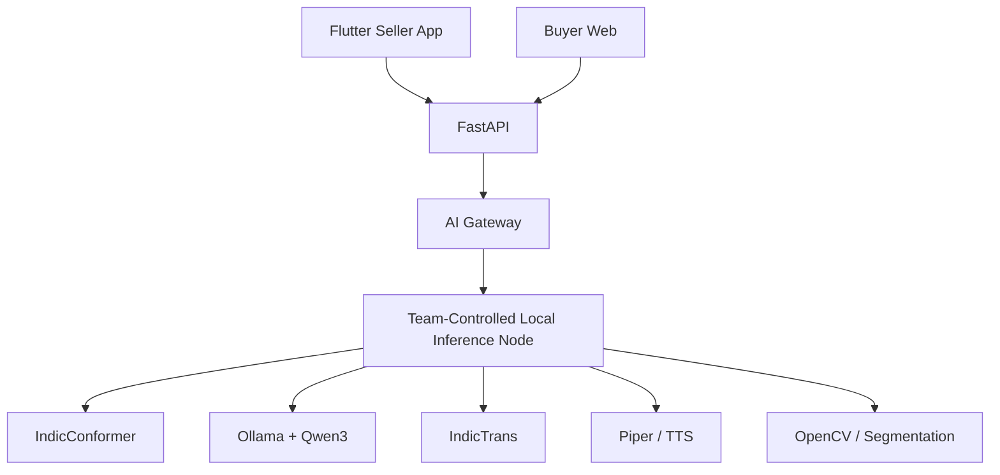

The MVP does not assume paid GPU hosting.

---

# 6. AI Job Orchestration

## 6.1 Synchronous vs Asynchronous Rule

| Operation | Default mode | Reason |
|---|---|---|
| language detection | synchronous | tiny result |
| short STT request | synchronous when latency allows | user waiting |
| intent extraction | synchronous after transcript | interactive |
| catalog generation | asynchronous | may require several stages |
| image enhancement | asynchronous | heavier media processing |
| price recommendation | synchronous or short async | user-facing decision |
| market matching | asynchronous | retrieval + ranking |
| bulk re-indexing | asynchronous | background |
| evaluation batch | asynchronous | offline process |

## 6.2 Job Lifecycle

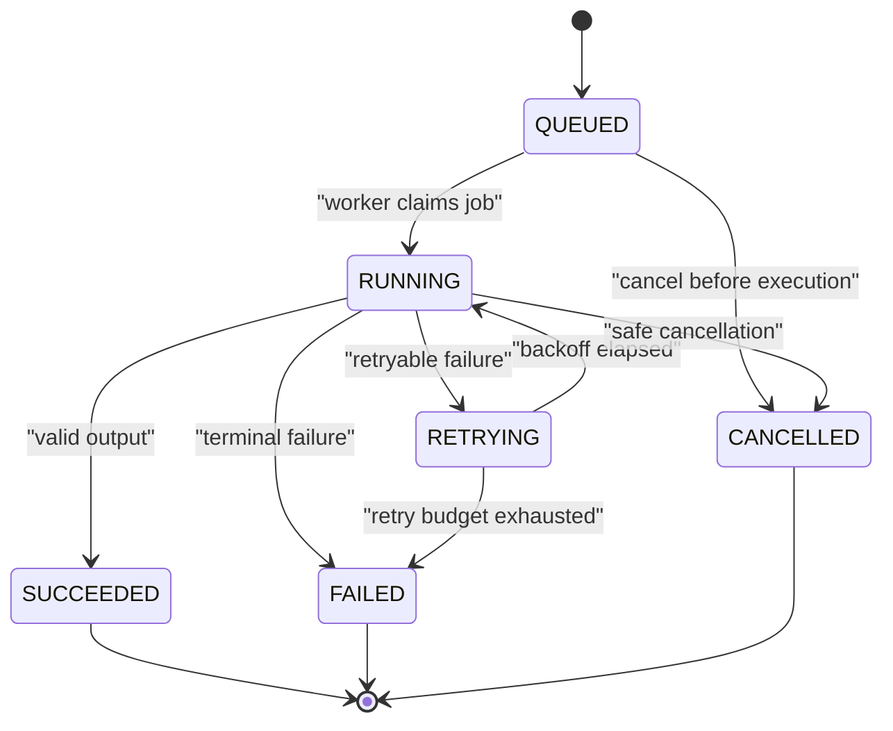

## 6.3 Priority Classes

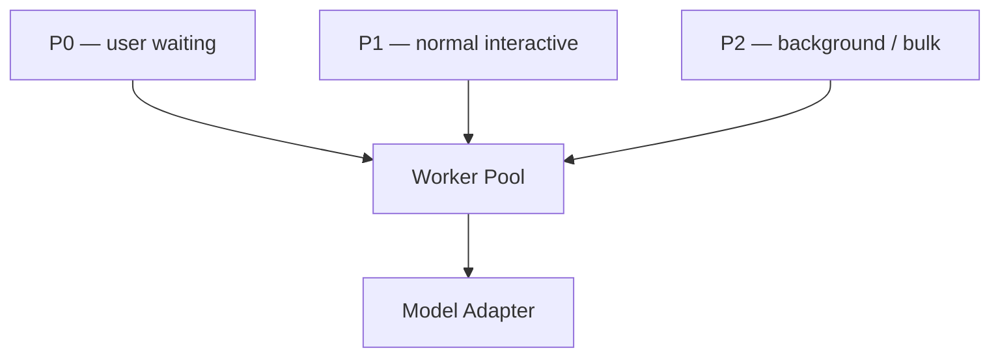

- **P0**: current user waiting for a screen result.
- **P1**: normal interactive/background operations directly supporting current work.
- **P2**: reprocessing, analytics, bulk evaluation, indexing and non-urgent jobs.

---

# 7. Universal AI Processing Lifecycle

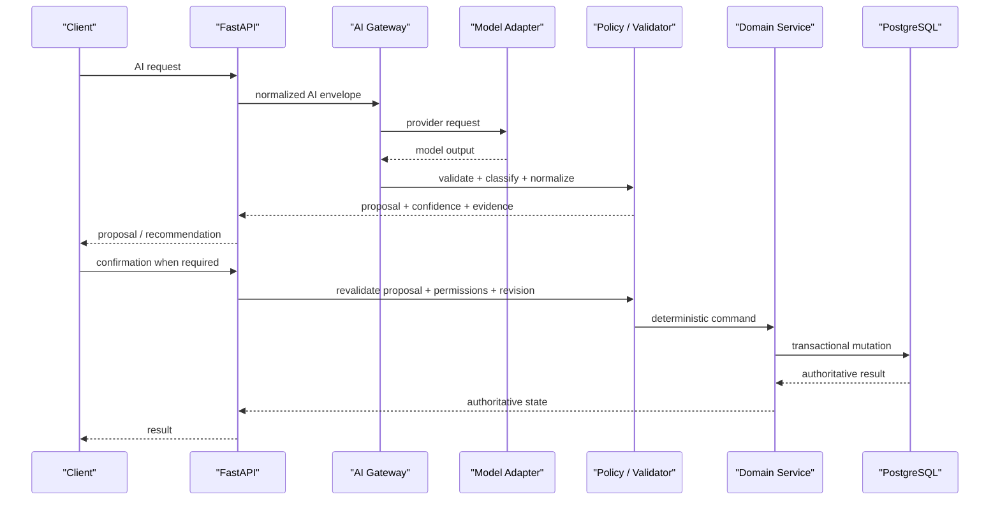

Critical rule: **confirmation does not skip revalidation**. The system must recheck permissions, entity version, product state and any expiry/risk conditions at commit time.

---

# 8. Context Model

AI quality depends on context without allowing uncontrolled memory.

## 8.1 Context Layers

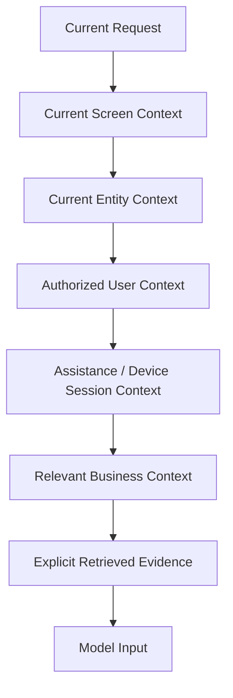

## 8.2 Context Must Be Scoped

AI may read only the minimum context needed for the operation.

Examples:

- product title generation → product draft + user speech + selected language;
- price recommendation → product facts + verified costs + allowed market comparables;
- Didi product correction → selected artisan + selected product + active assistance scope;
- order voice command → current order + permitted action set;
- B2B matching → buyer requirement + public/authorized supply features.

AI must not receive an entire database dump as conversational context.

---

# 9. Voice Intelligence Backbone

## 9.1 Voice Pipeline

```mermaid
flowchart LR
    Audio["Audio Capture"] --> Normalize["Audio Normalize"]
    Normalize --> LID["Language Identification"]
    LID --> STT["Speech-to-Text"]
    STT --> Transcript["Transcript + timestamps"]
    Transcript --> Intent["Intent Classification"]
    Intent --> Entities["Entity Extraction"]
    Entities --> Context["Context Resolution"]
    Context --> Planner["Action Planner"]
    Planner --> Risk["Risk / Confirmation Policy"]
    Risk --> Response["Voice + Visual Proposal"]
    Response --> Confirm["User Confirmation"]
    Confirm --> Domain["Deterministic Domain Action"]
    Domain --> TTS["Text-to-Speech"]
```

## 9.2 Voice Input Contract

```json
{
  "audio_ref": "uuid",
  "language_hint": "hi-IN",
  "context": {
    "screen": "S20",
    "entity_type": "PRODUCT",
    "entity_id": "uuid"
  },
  "interaction_mode": "CREATE_OR_EDIT"
}
```

## 9.3 Language Identification

Language detection returns:

```json
{
  "language": "hi-IN",
  "script": "Devanagari",
  "confidence": 0.97,
  "alternatives": [
    {"language": "mr-IN", "confidence": 0.08}
  ]
}
```

Detection must support a low-confidence path:

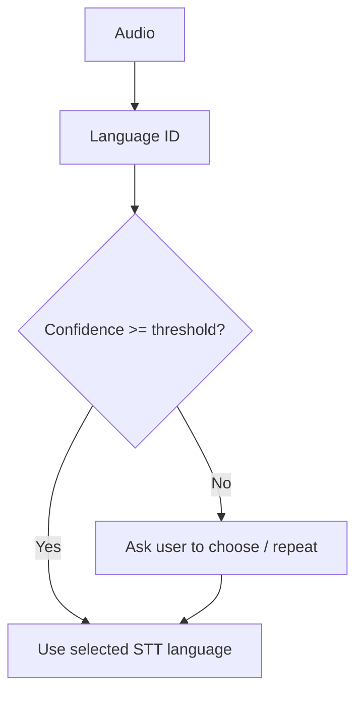

## 9.4 STT Output

STT should preserve enough evidence for correction.

```json
{
  "language": "hi-IN",
  "text": "is saree ka daam do sau rupaye kam kar do",
  "segments": [],
  "confidence": 0.95,
  "duration_ms": 4200
}
```

## 9.5 Intent Taxonomy

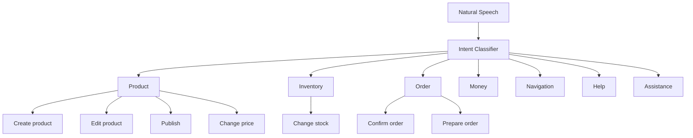

## 9.6 Entity Extraction

Canonical entity examples:

| Entity | Example |
|---|---|
| product | “yeh saree” |
| price | ₹1,650 |
| quantity | 5 |
| length | 6 metre |
| material | Tussar silk |
| craft | handwoven |
| color | maroon |
| order id | KS1024 |
| delivery deadline | 30 days |
| location | Ahmedabad |

## 9.7 Intent + Entity Contract

```json
{
  "intent": "UPDATE_VARIANT_PRICE",
  "entities": {
    "product_reference": "current_product",
    "new_price": 1650.0,
    "currency": "INR"
  },
  "confidence": 0.94,
  "ambiguities": [],
  "requires_confirmation": true
}
```

---

# 10. Natural-Language Action Planner

The action planner translates an interpreted command into a **typed command proposal**.

## 10.1 Planner Boundary

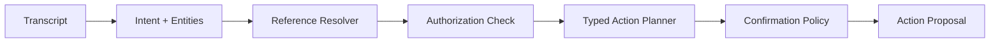

## 10.2 Action Proposal Schema

```json
{
  "action": "UPDATE_VARIANT_PRICE",
  "target": {
    "entity_type": "PRODUCT_VARIANT",
    "entity_id": "uuid"
  },
  "payload": {
    "unit_price": 1650.0
  },
  "expected_revision": 12,
  "risk_class": "HIGH",
  "requires_confirmation": true,
  "expires_at": "timestamp",
  "evidence": ["voice_interaction:uuid"]
}
```

## 10.3 Reference Resolution

Natural references such as “yeh saree”, “pichla order” or “jo dusra product hai” must be resolved against authorized current context.

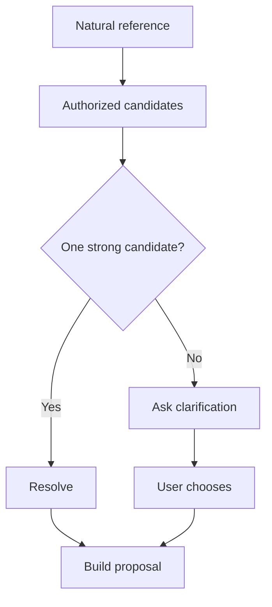

The model never gets to “guess” across unrelated seller data.

---

# 11. Risk and Confirmation Engine

## 11.1 Risk Classes

| Risk | Examples | Confirmation |
|---|---|---|
| LOW | open help, read product description | lightweight |
| MEDIUM | edit description, select translation, update non-critical metadata | usually explicit |
| HIGH | price, stock, publication, order confirmation, cancellation | multimodal |
| CRITICAL | payout account, ownership, destructive deletion, privileged access | strong confirmation + auth / recovery controls |

## 11.2 Confirmation Policy

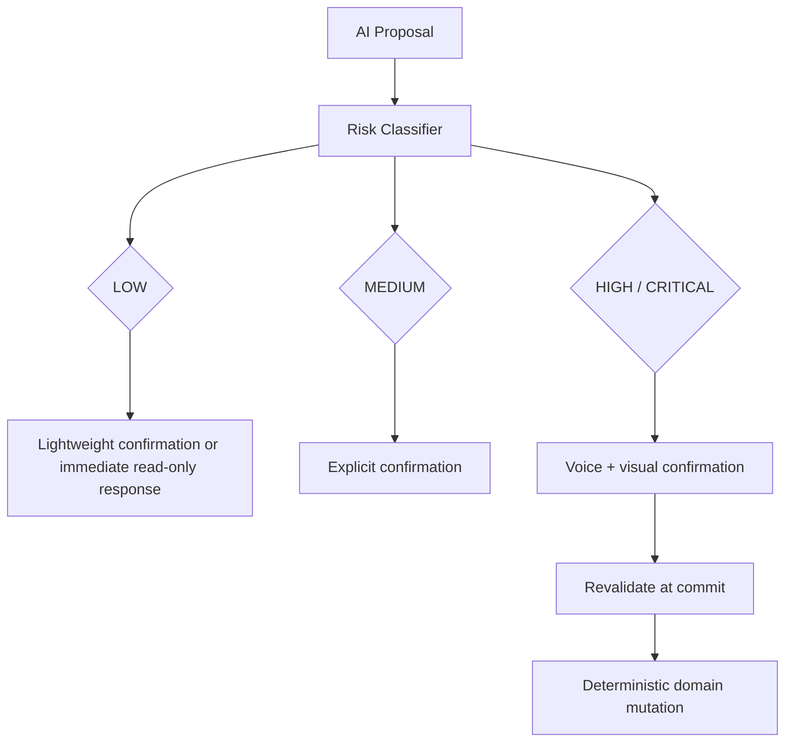

## 11.3 Confirmation Contract

```json
{
  "decision_id": "uuid",
  "confirmation": "ACCEPT",
  "confirmed_by": "uuid",
  "confirmation_channel": "VOICE_AND_VISUAL",
  "client_revision": 12,
  "confirmed_at": "timestamp"
}
```

---

# 12. Multimodal Confirmation

Kala Setu is voice-first, not voice-only.

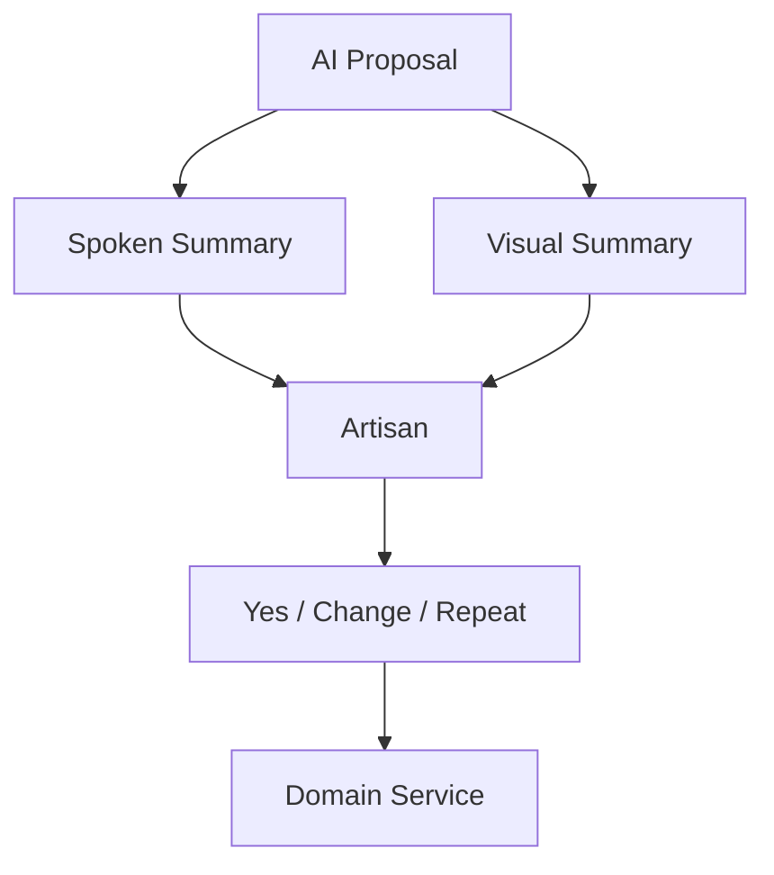

### Minimum confirmation display for consequential values

```text
Product: Tussar Silk Saree
Price: ₹1,650
Stock: 1
Material: Tussar Silk

[ Haan ]   [ Badlein ]
```

The actual application wireframe defines the visual treatment; this document defines the intelligence contract behind it.

---

# 13. Conversational Memory

AI must use **task memory**, not uncontrolled permanent memory.

## 13.1 Memory Classes

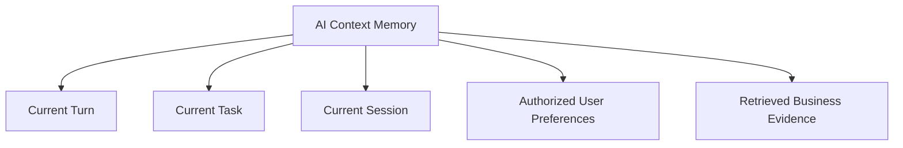

### Current turn

Transient transcript and model inputs.

### Current task

The fields relevant to the active operation, such as current product creation.

### Session

Conversation context required to complete the current workflow.

### User preferences

Only explicit, durable preferences useful to future interactions and permitted by privacy rules.

### Evidence

Retrieved authoritative data; this should be distinguished from model-generated assumptions.

## 13.2 Memory Must Never Become Authority

If memory says:

> “User usually sells at ₹1,800.”

that is context, not price truth.

The current authoritative value must come from the product/variant record.

---

# 14. Image / Vision Intelligence

## 14.1 Vision Pipeline

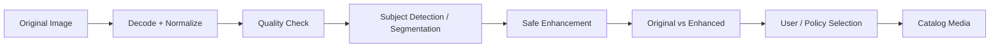

## 14.2 Image Quality Signals

- blur;
- exposure;
- subject presence;
- crop adequacy;
- orientation;
- background clutter;
- resolution;
- visual consistency.

## 14.3 Safe Transformation Policy

Allowed:

- crop;
- resize;
- background removal;
- exposure correction;
- white balance;
- mild denoise;
- perspective correction.

Prohibited or flagged:

- inventing embroidery;
- changing product structure;
- changing material;
- materially changing color without calibrated correction;
- removing culturally significant craftsmanship;
- generating nonexistent accessories/details.

## 14.4 Media Provenance

```mermaid
flowchart LR
    Original["Original Media"] --> Quality["Quality Check"]
    Quality --> Processing["Media Processing Job"]
    Processing --> Derivative["Media Derivative"]
    Original --> Provenance["Provenance Anchor"]
    Derivative --> Provenance
    Provenance --> Catalog["Selected Published Media"]
```

The database explicitly separates media processing jobs, derivatives and quality checks, while preserving the original media as the provenance anchor. 

---

# 15. Catalog Intelligence

## 15.1 Catalog Pipeline

```mermaid
flowchart TB
    Input["Voice + Image + Existing Product Data"] --> Extract["Attribute Extraction"]
    Extract --> Normalize["Canonical Product Schema"]
    Normalize --> Validate["Required Field Validation"]
    Validate --> Generate["Catalog Text Generation"]
    Generate --> Translate["Localization / Translation"]
    Translate --> Safety["Claims / Provenance Safety"]
    Safety --> Confirm["Artisan Confirmation"]
    Confirm --> Catalog["Catalog Entry / Version"]
```

## 15.2 Canonical Product Attribute Groups

```mermaid
erDiagram
    PRODUCT ||--o{ PRODUCT_ATTRIBUTE : contains
    PRODUCT ||--o{ PRODUCT_MEDIA : has
    PRODUCT ||--o{ PRODUCTION_STORY : has
    PRODUCT ||--o{ CATALOG_ENTRY : localizes
    PRODUCT ||--o{ FIELD_SOURCE : evidences

    PRODUCT {
        uuid id
        text craft_type
        text material
        text title
        text description
    }
    PRODUCT_ATTRIBUTE {
        text name
        text value
        text unit
        float confidence
    }
    PRODUCT_MEDIA {
        uuid id
        text role
        boolean original
    }
    PRODUCTION_STORY {
        uuid id
        text language
        text text
    }
    CATALOG_ENTRY {
        uuid id
        text language
        text channel
    }
    FIELD_SOURCE {
        uuid id
        text source_type
        float confidence
    }
```

## 15.3 Source Precedence

When multiple sources disagree:

```mermaid
flowchart TB
    User["Explicit user-provided value"] --> Highest["Highest trust"]
    Verified["Externally verified value"] --> High["High trust"]
    Extracted["AI extracted from media/speech"] --> Medium["Medium trust"]
    Generated["AI generated text"] --> Lower["Lowest factual authority"]
```

This does not mean generated text is “bad”; it means generated prose cannot silently override an explicit factual source.

## 15.4 Forbidden Claims

Unless supported by an explicit source, AI must not invent:

- certifications;
- government recognition;
- geographic origin;
- heritage lineage;
- “100% natural” claims;
- “eco-friendly” claims;
- material composition;
- guarantees;
- export eligibility.

---

# 16. Translation Intelligence

## 16.1 Translation Pipeline

```mermaid
flowchart LR
    Source["Source Language"] --> Detect["Detect Language"]
    Detect --> Normalize["Normalize Terms"]
    Normalize --> Translate["Translate"]
    Translate --> Glossary["Craft / Commerce Glossary"]
    Glossary --> Quality["Quality / Safety Check"]
    Quality --> Output["Localized Catalog"]
```

## 16.2 Translation Rules

- preserve product measurements;
- preserve currency values;
- preserve product/craft names when transliteration is preferable;
- do not translate a proper craft name into an unrelated generic term;
- never invent missing fields;
- keep culturally important terms intact when no faithful translation exists.

## 16.3 Human Correction

A translated field can be edited by the artisan or authorized Didi.

```mermaid
flowchart TD
    Translation["AI Translation"] --> Review["User Review"]
    Review --> Accept["Accept"]
    Review --> Correct["Correct"]
    Correct --> Saved["Corrected Catalog Version"]
    Accept --> Saved
    Saved --> Audit["AI Correction Audit"]
```

---

# 17. Price Advisor Intelligence

The AI price advisor is explicitly an **advisor**, not an optimizer with guaranteed correctness.

## 17.1 Inputs

```mermaid
flowchart LR
    Costs["Material + Labor + Packaging"] --> Model["Price Advisor"]
    Market["Comparable Market Data"] --> Model
    Product["Product Attributes"] --> Model
    Location["Relevant Location / Market Context"] --> Model
    Model --> Result["Cost Floor + Market Band + Suggested Range"]
```

## 17.2 Deterministic Cost Floor

```text
Cost Floor
= Material Cost
+ Labour Hours × Configured Labour Rate
+ Packaging Cost
+ Other Configured Direct Costs
```

The AI must not be allowed to recommend below a hard business minimum unless an explicit policy says that a lower promotional price is permissible.

## 17.3 Recommendation Structure

```json
{
  "cost_floor": 1100.0,
  "market_band": {
    "min": 1500.0,
    "max": 1900.0
  },
  "suggested_range": {
    "min": 1600.0,
    "max": 1750.0
  },
  "suggested_price": 1650.0,
  "confidence": "MEDIUM",
  "factors": [
    "material_cost",
    "labour_cost",
    "comparable_market_prices"
  ],
  "comparable_count": 8
}
```

## 17.4 Pricing Pipeline

```mermaid
flowchart TB
    Product["Product Facts"] --> Cost["Deterministic Cost Model"]
    Market["Market Comparables"] --> Clean["Comparable Cleaning"]
    Clean --> Stats["Market Band"]
    Cost --> Advisor["Price Advisor"]
    Stats --> Advisor
    Advisor --> Confidence["Confidence + Evidence"]
    Confidence --> User["Artisan"]
    User --> Choice["Choose / Override"]
    Choice --> Domain["Variant Price Mutation"]
```

## 17.5 Pricing Failure Modes

| Failure | Behavior |
|---|---|
| no comparables | cost-based recommendation with low confidence |
| stale market data | show staleness and lower confidence |
| contradictory costs | ask for correction |
| missing labour rate | use configured benchmark or ask user |
| AI unavailable | deterministic cost-based advisory |
| implausible recommendation | clamp/flag using policy boundaries |

---

# 18. Demand Matching Intelligence

Demand matching is the primary AI subsystem for market linkage.

## 18.1 B2B Matching

```mermaid
flowchart LR
    Requirement["Buyer Requirement"] --> Normalize["Requirement Normalization"]
    Normalize --> Filters["Hard Constraints"]
    Filters --> Candidates["Eligible Artisan / Cluster Candidates"]
    Candidates --> Features["Feature Extraction"]
    Features --> Rank["Semantic + Deterministic Ranking"]
    Rank --> Explain["Match Factors"]
    Explain --> Results["Ranked Opportunities"]
```

## 18.2 Matching Inputs

- craft/category;
- material;
- quantity;
- budget;
- deadline;
- delivery region;
- capacity;
- current inventory;
- production lead time;
- minimum order quantity;
- readiness stage;
- quality/consistency requirements.

## 18.3 Hard vs Soft Constraints

```mermaid
flowchart TB
    Requirement["Buyer Requirement"] --> Hard["Hard Constraints"]
    Requirement --> Soft["Soft Preferences"]
    Hard --> Filter["Candidate Filter"]
    Soft --> Rank["Candidate Ranking"]
    Filter --> Rank
    Rank --> Explanation["Match Explanation"]
```

Hard constraints may include impossible quantity or deadline requirements. Soft factors influence ranking but should not eliminate a candidate unnecessarily.

## 18.4 Match Score Composition

A possible normalized scoring structure:

```text
MatchScore
= w1 × CraftSimilarity
+ w2 × MaterialSimilarity
+ w3 × CapacityFit
+ w4 × BudgetFit
+ w5 × LeadTimeFit
+ w6 × LocationFit
+ w7 × ReadinessFit
```

The weights must be configuration, not model magic hidden in prompts.

## 18.5 Match Evidence

```json
{
  "score": 0.87,
  "factors": [
    {"name": "craft_fit", "score": 0.96},
    {"name": "capacity_fit", "score": 0.88},
    {"name": "budget_fit", "score": 0.81},
    {"name": "deadline_fit", "score": 0.92}
  ],
  "warnings": ["Capacity depends on cluster confirmation"]
}
```

AI ranking produces an opportunity; the market domain determines what is actually offerable.

---

# 19. B2C Discovery Intelligence

The MVP does not require a complex recommender system to provide a useful B2C path.

## 19.1 Discovery Pipeline

```mermaid
flowchart LR
    Query["Buyer Query / Browse"] --> Normalize["Query Normalization"]
    Normalize --> Filter["Deterministic Filters"]
    Filter --> Candidate["Catalog Candidates"]
    Candidate --> Semantic["Semantic Relevance"]
    Semantic --> Business["Availability + Trust + Readiness"]
    Business --> Rank["Ranked Results"]
```

Signals should be explainable and bounded. Do not allow an opaque model to override availability, publication status or seller safety constraints.

---

# 20. AI-Assisted Seller Onboarding

```mermaid
sequenceDiagram
    participant D as "Didi"
    participant App as "Seller App"
    participant AI as "AI Gateway"
    participant Domain as "Onboarding Domain"
    participant DB as "PostgreSQL"

    D->>App: Start scoped assistance
    App->>Domain: Create assistance session
    Domain->>DB: Persist session
    App->>AI: Process artisan voice / profile input
    AI-->>App: Suggested profile fields
    App-->>D: Review suggestions
    D->>App: Confirm / correct
    App->>Domain: Apply confirmed data
    Domain->>DB: Persist profile + onboarding progress
    Domain->>DB: Write audit evidence
```

AI can accelerate onboarding but cannot silently expand the CRP's authority.

---

# 21. AI + Didi Boundary

```mermaid
flowchart LR
    Didi["Didi / CRP"] --> Session["Active Assistance Session"]
    Session --> Scope["Scoped Permissions"]
    Scope --> AI["AI Assistance"]
    AI --> Proposal["Proposal / Correction"]
    Proposal --> Artisan["Artisan Confirmation where required"]
    Artisan --> Domain["Deterministic Domain"]
    Domain --> Audit["Audit Event"]
```

AI must receive the active assistance session context when the operation is performed in Didi mode.

---

# 22. AI + Offline Architecture

Advanced cloud/local inference is not assumed to be available offline on a low-end device.

## 22.1 Offline Intelligence Boundary

```mermaid
flowchart TB
    Offline["Offline"] --> LocalUI["Local UI + Drafts"]
    Offline --> Camera["Camera + Basic Media Ops"]
    Offline --> Queue["Local Action Queue"]
    Offline --> Cached["Cached Language / Help Content"]

    Online["Online"] --> STT["Server/Inference STT"]
    Online --> LLM["Catalog / Intent LLM"]
    Online --> Vision["Heavy Vision"]
    Online --> Pricing["Market-aware Pricing"]
    Online --> Matching["Demand Matching"]

    Queue --> Sync["Sync"]
    Sync --> Domain["Authoritative Domain"]
```

## 22.2 Offline Rule

> **Offline draft creation is supported. Offline authoritative commerce is not assumed.**

## 22.3 Offline AI Queue

For captured audio/image work:

```json
{
  "queue_type": "AI_PROCESSING",
  "local_id": "uuid",
  "capability": "CATALOG_GENERATION",
  "input_refs": ["local://audio/123", "local://image/456"],
  "priority": "P1",
  "created_at": "timestamp"
}
```

When connected, the client uploads the inputs and converts the local task into a server-side `ai_job`.

---

# 23. AI Data Model

The database already defines separate intelligence entities. The AI layer must use them according to responsibility.

```mermaid
flowchart LR
    Voice["voice_interactions"] --> Jobs["ai_jobs"]
    Jobs --> Decisions["ai_decisions"]
    Decisions --> Corrections["ai_corrections"]
    Decisions --> Reports["ai_issue_reports"]
    Product["products"] --> Pricing["price_recommendations"]
    Pricing --> Factors["pricing_factors"]
    Pricing --> Comparables["market_comparables"]
    Media["product_media"] --> MediaJobs["media_processing_jobs"]
    MediaJobs --> Derivatives["media_derivatives"]
    MediaJobs --> Quality["media_quality_checks"]
```

## 23.1 `voice_interactions`

Stores the interaction boundary: actor, language, transcript and intent context.

## 23.2 `ai_jobs`

Stores asynchronous capability execution state.

## 23.3 `ai_decisions`

Stores the result/evidence boundary: capability, model/provider, confidence, confirmation state and relevant references.

## 23.4 `ai_corrections`

Stores user/human corrections to AI outputs.

## 23.5 `ai_issue_reports`

Stores reported AI quality/safety problems for triage and evaluation.

---

# 24. AI Decision Evidence

AI decisions must be explainable through **factors and evidence**, not internal hidden reasoning.

## 24.1 Decision Record

```json
{
  "decision_id": "uuid",
  "capability": "PRICE_RECOMMENDATION",
  "model": "qwen3-8b-local",
  "provider": "ollama-local",
  "confidence": 0.78,
  "factors": [
    {
      "name": "cost_floor",
      "value": 1100.0,
      "source": "product_costs"
    },
    {
      "name": "market_band",
      "value": "1500-1900",
      "source": "market_comparables"
    }
  ],
  "confirmation_status": "PENDING",
  "created_at": "timestamp"
}
```

## 24.2 Evidence Classes

```mermaid
flowchart TB
    Evidence["AI Evidence"] --> User["User-provided"]
    Evidence --> Verified["Externally verified"]
    Evidence --> Extracted["AI-extracted"]
    Evidence --> Generated["AI-generated"]
    Evidence --> Derived["Deterministically derived"]
```

Deterministically derived facts should remain distinguishable from probabilistic model outputs.

---

# 25. Confidence Architecture

Confidence is not one universal number.

## 25.1 Confidence Dimensions

| Dimension | Meaning |
|---|---|
| model confidence | model-level uncertainty estimate |
| extraction confidence | confidence in a field/entity |
| source quality | quality of input evidence |
| business certainty | deterministic validity of derived result |
| match confidence | confidence in relevance/ranking |
| freshness | age of retrieved market evidence |

## 25.2 Composite Confidence

```mermaid
flowchart LR
    Model["Model Confidence"] --> Composite["Confidence Policy"]
    Source["Source Quality"] --> Composite
    Freshness["Freshness"] --> Composite
    Business["Deterministic Validity"] --> Composite
    Composite --> User["User-facing Confidence Band"]
```

Use bands such as:

- HIGH;
- MEDIUM;
- LOW;
- INSUFFICIENT.

Avoid showing spurious precision such as “91.347% correct.”

---

# 26. Hallucination Controls

## 26.1 General Pattern

```mermaid
flowchart TD
    Generate["Model Generates"] --> Ground["Ground Against Retrieved / User Facts"]
    Ground --> Validate["Schema + Claim Validation"]
    Validate --> Safe{Safe to show?}
    Safe -->|"Yes"| Confirm["Show / Confirm"]
    Safe -->|"No"| Rewrite["Constrain / Remove unsupported claim"]
    Rewrite --> Validate
```

## 26.2 Claim Policy

High-risk factual claims must require evidence.

| Claim type | Default rule |
|---|---|
| product dimensions | user/derived evidence |
| material | user/verified evidence |
| craft category | user/verified/evidence-backed extraction |
| certification | explicit verified evidence |
| geographic origin | explicit provenance evidence |
| sustainability | evidence required |
| heritage claim | evidence required |
| price explanation | factors required |
| demand match | factor evidence required |

---

# 27. Prompt and Template Architecture

Prompt text is implementation configuration, not scattered application code.

## 27.1 Prompt Registry

```mermaid
flowchart TB
    PromptRequest["Capability Request"] --> Registry["Prompt / Template Registry"]
    Registry --> Version["Prompt Version"]
    Version --> Provider["Provider Adapter"]
    Provider --> Output["Structured Output"]
    Output --> Eval["Evaluation Metadata"]
```

Each prompt/template version should have:

- capability;
- schema version;
- prompt version;
- language scope;
- model compatibility;
- safety policy version;
- active/inactive status;
- test fixture references.

## 27.2 Structured Output Only

Whenever possible, the model returns a typed object rather than free-form text.

Example catalog schema:

```json
{
  "title": "",
  "short_description": "",
  "long_description": "",
  "material": "",
  "craft_type": "",
  "dimensions": {},
  "tags": [],
  "language": "hi-IN",
  "field_sources": {}
}
```

---

# 28. AI Evaluation Framework

AI quality must be measurable independently of UI quality.

## 28.1 Evaluation Layers

```mermaid
flowchart TB
    Data["Evaluation Dataset"] --> Unit["Component Tests"]
    Data --> Pipeline["Pipeline Tests"]
    Data --> Scenario["End-to-End Scenarios"]
    Unit --> Metrics["AI Quality Metrics"]
    Pipeline --> Metrics
    Scenario --> Metrics
    Metrics --> Release["Release Gate"]
```

## 28.2 STT Metrics

- word error rate;
- semantic error rate;
- number recognition accuracy;
- language identification accuracy;
- product-name preservation.

## 28.3 Intent/Entity Metrics

- intent accuracy;
- entity precision/recall;
- ambiguous-reference resolution accuracy;
- false mutation rate;
- confirmation-required classification accuracy.

## 28.4 Catalog Metrics

- factual field accuracy;
- unsupported-claim rate;
- translation quality;
- completeness;
- human correction rate.

## 28.5 Vision Metrics

- subject detection rate;
- background-removal quality;
- image-quality classification;
- transformation safety violations.

## 28.6 Pricing Metrics

- floor violation rate;
- recommendation acceptance rate;
- override rate;
- evidence completeness;
- market-data freshness.

## 28.7 Matching Metrics

- top-k relevance;
- false positive rate;
- hard-constraint violation rate;
- quotation conversion rate;
- human override rate.

---

# 29. Golden Evaluation Dataset

Create a versioned dataset with representative cases across supported languages and user behaviors.

```mermaid
flowchart TB
    Dataset["Golden Dataset"] --> Voice["Voice Cases"]
    Dataset --> Product["Product / Catalog Cases"]
    Dataset --> Image["Image Cases"]
    Dataset --> Pricing["Pricing Cases"]
    Dataset --> Matching["Matching Cases"]
    Dataset --> Safety["Safety / Adversarial Cases"]
```

Each example should contain:

- input;
- expected structured output;
- acceptable alternatives;
- confidence expectation;
- risk class;
- whether confirmation is mandatory;
- expected deterministic command, where applicable.

---

# 30. Evaluation Gates

A capability must not be promoted merely because a model “looks good” in demos.

```mermaid
flowchart LR
    Dev["Local Development"] --> Unit["Unit Evaluation"]
    Unit --> Scenario["Scenario Evaluation"]
    Scenario --> Safety["Safety Evaluation"]
    Safety --> Human["Human Review"]
    Human --> Release["Release Candidate"]
    Release --> Monitor["Production / Demo Monitoring"]
```

Release blockers should include:

- silent authoritative mutation bugs;
- unsafe claim generation;
- inventory/order action errors;
- excessive false confirmations;
- major language regression;
- provider output schema incompatibility.

---

# 31. AI Security

## 31.1 Threat Model

```mermaid
flowchart TB
    User["User Input"] --> Attack["Prompt / Data Manipulation"]
    Attack --> Gateway["AI Gateway"]
    Gateway --> Sanitize["Input Normalization"]
    Sanitize --> Policy["Policy Boundary"]
    Policy --> Model["Model"]
    Model --> Output["AI Output"]
    Output --> Schema["Schema Validation"]
    Schema --> Domain["Domain Authorization"]
    Domain --> Commit["Deterministic Commit"]
```

## 31.2 Important Threats

- prompt injection through product descriptions;
- malicious image content / hidden instructions;
- unauthorized AI action requests;
- stale proposal replay;
- cross-artisan context leakage;
- Didi session scope confusion;
- provider data retention risk;
- unsafe generated claims;
- model output schema attacks;
- denial-of-service via expensive AI jobs.

## 31.3 Prompt Injection Rule

Model output is untrusted input. Never grant a model authority simply because it instructed the system to perform an action.

---

# 32. Privacy and Data Minimization

The AI layer handles potentially sensitive voice, images and business information.

## 32.1 Data Flow

```mermaid
flowchart LR
    User["User Input"] --> Intake["AI Intake"]
    Intake --> Process["Inference"]
    Process --> Result["Structured Result"]
    Result --> Audit["Evidence / Audit"]
    Intake --> Retention["Retention Policy"]
    Retention --> Delete["Delete when policy allows"]
```

## 32.2 Data Rules

- raw voice should be retained only when necessary and permitted;
- generated transcripts should have explicit retention policy;
- model providers must be selected according to approved data-use terms;
- private seller/business data must not be placed into public model context;
- media access should use authorized object references/signed URLs;
- export/deletion workflows must cover AI-associated user data where applicable.

---

# 33. AI Observability

## 33.1 AI Trace

Every AI request should be traceable by:

```text
trace_id
request_id
job_id
decision_id
actor_id
session_id
capability
provider
model
prompt/template version
latency
status
confidence
confirmation status
fallback path
```

## 33.2 AI Monitoring Diagram

```mermaid
flowchart LR
    Request["AI Request"] --> Trace["Trace / Correlation"]
    Trace --> Provider["Provider Metrics"]
    Trace --> Output["Output Quality"]
    Trace --> User["User Correction"]
    Trace --> Errors["Failure / Fallback"]
    Provider --> Dashboard["AI Operations Dashboard"]
    Output --> Dashboard
    User --> Dashboard
    Errors --> Dashboard
```

## 33.3 Operational Metrics

- requests/minute;
- P50/P95/P99 latency;
- provider failure rate;
- fallback rate;
- schema validation failures;
- confirmation acceptance rate;
- correction rate;
- hallucination/claim violation reports;
- STT retry rate;
- queue depth;
- active inference concurrency.

---

# 34. Performance Targets

These are engineering targets, not problem-statement facts.

| Capability | Target |
|---|---:|
| language detection | < 1 s |
| UI action proposal after transcript | < 5 s target |
| short STT | < 8 s target |
| catalog generation | < 10 s target |
| image processing | < 15 s target |
| price recommendation | < 5 s target when data is available |
| interactive job queue pickup | < 2 s target |
| fallback decision | bounded by request timeout budget |

Targets must be measured on the actual hardware used for the MVP.

---

# 35. Concurrency and Capacity

The architecture baseline uses an engineering target envelope of:

- 1,000 registered users;
- 100 concurrent sessions;
- 10 concurrent AI jobs;
- 100,000 API requests/day.

The AI layer must therefore support explicit concurrency control.

```mermaid
flowchart TB
    Requests["AI Requests"] --> Queue["Priority Queue"]
    Queue --> Limit["Concurrency Limiter"]
    Limit --> Workers["Inference Workers"]
    Workers --> Model["Local Models"]
    Model --> Result["Results"]
    Result --> QueueDone["Complete / Retry / Fallback"]
```

Do not allow every API request to spawn unconstrained model processes.

---

# 36. Failure and Recovery Matrix

| Failure | Immediate behavior | User behavior | Backend behavior |
|---|---|---|---|
| STT timeout | retry | “Dobara koshish karein” | retry + alternate provider |
| LLM timeout | retry | wait / template output | retry budget |
| malformed model JSON | repair once / reject | ask correction | record schema failure |
| unsupported claim | strip/flag | request confirmation | evidence audit |
| vision failure | retain original | allow continue | mark enhancement unavailable |
| pricing data missing | cost model | low-confidence advisory | market-data warning |
| matching unavailable | delayed results | show retry | queue job |
| provider unavailable | fallback | limited capability message | circuit breaker |
| inference node offline | queue where safe | explicit offline state | hold AI job |
| stale proposal | reject | “Data changed, review again” | re-read authoritative state |

---

# 37. Stale Proposal Protection

AI proposals are temporal objects.

```mermaid
sequenceDiagram
    participant User as "User"
    participant App as "App"
    participant API as "API"
    participant AI as "AI"
    participant DB as "PostgreSQL"

    User->>App: Request change
    App->>API: Read entity version 12
    API->>AI: Generate proposal from version 12
    AI-->>API: Proposal + expected_version=12
    API-->>App: Show proposal
    User->>App: Confirm
    App->>API: Confirm proposal version 12
    API->>DB: Check current version
    alt version still 12
        DB-->>API: Valid
        API->>DB: Commit version 13
        API-->>App: Success
    else version changed
        DB-->>API: Revision mismatch
        API-->>App: Re-review required
    end
```

This is essential for offline sync and concurrent Didi/user activity.

---

# 38. AI Correction Loop

Corrections are product data **and** evaluation data.

```mermaid
flowchart LR
    AIOutput["AI Output"] --> User["User / Didi"]
    User --> Accept["Accept"]
    User --> Correct["Correct"]
    Correct --> Decision["AI Decision"]
    Decision --> Correction["AI Correction"]
    Correction --> Eval["Evaluation Dataset Candidate"]
    Eval --> Improvement["Prompt / Model Improvement"]
```

## 38.1 Correction Categories

- wrong transcription;
- wrong language;
- wrong product fact;
- wrong translation;
- wrong price advisory;
- unsafe image transformation;
- wrong match;
- missing context;
- unnecessary confirmation;
- failed action planning.

---

# 39. AI Provider Health

```mermaid
stateDiagram-v2
    [*] --> HEALTHY
    HEALTHY --> DEGRADED: "latency/errors rise"
    DEGRADED --> HEALTHY: "recover"
    DEGRADED --> OPEN: "failure threshold exceeded"
    OPEN --> HALF_OPEN: "cooldown elapsed"
    HALF_OPEN --> HEALTHY: "probe succeeds"
    HALF_OPEN --> OPEN: "probe fails"
```

A failed provider must not take down the entire commerce application.

---

# 40. AI + API Contract

The API layer is the only public application boundary for AI.

## 40.1 Relevant API Capabilities

```text
POST /v1/voice/interactions
GET  /v1/voice/interactions/{interaction_id}
POST /v1/voice/interactions/{interaction_id}/confirm
POST /v1/voice/interactions/{interaction_id}/reject

GET  /v1/ai/jobs/{job_id}
POST /v1/ai/jobs/{job_id}/retry

GET  /v1/ai/decisions/{decision_id}
POST /v1/ai/decisions/{decision_id}/corrections
POST /v1/ai/decisions/{decision_id}/report
GET  /v1/ai/decisions/{decision_id}/explanation

POST /v1/products/{product_id}/pricing/recommend
GET  /v1/products/{product_id}/pricing/recommendations/{recommendation_id}
POST /v1/products/{product_id}/pricing/overrides
```

The API contract keeps AI as proposal/recommendation infrastructure rather than allowing direct AI mutation of commerce state.

## 40.2 AI Route → Domain Mapping

| AI capability | API boundary | Domain commit |
|---|---|---|
| voice command | `/voice/interactions` | relevant domain service |
| AI confirmation | `/voice/interactions/{id}/confirm` | relevant deterministic command |
| catalog generation | product/catalog routes | product/catalog domain |
| pricing | pricing routes | variant pricing mutation only after human choice |
| AI correction | decision correction route | audit/intelligence state |
| matching | market routes | market opportunity/match state |

---

# 41. AI → Database Mapping

```mermaid
flowchart TB
    Voice["Voice Intelligence"] --> VoiceTable[("voice_interactions")]
    Voice --> Jobs[("ai_jobs")]
    Jobs --> Decisions[("ai_decisions")]
    Decisions --> Corrections[("ai_corrections")]
    Decisions --> Reports[("ai_issue_reports")]

    Vision["Vision Intelligence"] --> MediaJobs[("media_processing_jobs")]
    Vision --> Derivatives[("media_derivatives")]
    Vision --> Quality[("media_quality_checks")]
    Vision --> Media[("product_media")]

    Catalog["Catalog Intelligence"] --> Fields[("product_field_sources")]
    Catalog --> Entries[("catalog_entries")]
    Catalog --> Versions[("catalog_entry_versions")]
    Catalog --> Stories[("production_stories")]

    Pricing["Price Advisor"] --> Runs[("pricing_runs")]
    Pricing --> Factors[("pricing_factors")]
    Pricing --> Recs[("price_recommendations")]
    Pricing --> Comparables[("market_comparables")]
    Pricing --> Overrides[("pricing_overrides")]

    Matching["Demand Matching"] --> Opportunities[("market_opportunities")]
    Matching --> Matches[("market_matches")]
    Matching --> MatchFactors[("market_match_factors")]
```

---

# 42. AI → Wireframe Traceability

The AI layer must visibly explain why the wireframe contains each AI interaction.

```mermaid
flowchart LR
    S20["Voice Proposal"] --> Voice["Voice + Intent AI"]
    S34["Extracted Facts"] --> Extract["Entity Extraction"]
    S35["Image Studio"] --> Vision["Vision + Media AI"]
    S36["Catalog Draft"] --> Catalog["Catalog Generator + Translation"]
    S37["Price Advisor"] --> Pricing["Price Advisor"]
    S38["Final Confirmation"] --> Policy["Risk + Confirmation Engine"]
    B20["B2C Search"] --> Search["Semantic Discovery"]
    BB30["B2B Match Results"] --> Matching["Demand Matching"]
```

---

# 43. Complete Seller AI Journey

```mermaid
sequenceDiagram
    participant A as "Artisan"
    participant App as "Seller App"
    participant API as "FastAPI"
    participant Voice as "Voice AI"
    participant Vision as "Vision AI"
    participant Catalog as "Catalog AI"
    participant Price as "Price Advisor"
    participant Domain as "Domain Services"
    participant DB as "PostgreSQL"

    A->>App: Start product
    A->>App: Capture photo
    App->>Vision: Image processing request
    Vision-->>App: Quality + enhancement proposal
    A->>App: Speak description
    App->>API: Voice interaction
    API->>Voice: STT + intent + entities
    Voice-->>API: Structured facts
    API->>DB: Save AI evidence
    API->>Catalog: Generate catalog
    Catalog-->>API: Hindi + English draft
    API->>Price: Generate price advisory
    Price->>DB: Read cost/comparable evidence
    Price-->>API: Recommendation + factors
    API-->>App: Full proposal package
    A->>App: Confirm / correct
    App->>API: Confirmation
    API->>Domain: Validate + commit
    Domain->>DB: Product + variant + catalog state
    DB-->>Domain: Authoritative state
    Domain-->>App: Published result
```

---

# 44. Complete B2B AI Journey

```mermaid
sequenceDiagram
    participant Buyer as "B2B Buyer"
    participant Web as "Buyer Web"
    participant API as "FastAPI"
    participant NLP as "Requirement Intelligence"
    participant Match as "Matching Engine"
    participant DB as "PostgreSQL"

    Buyer->>Web: Enter craft / quantity / budget / deadline
    Web->>API: Create requirement
    API->>NLP: Normalize requirement
    NLP-->>API: Structured requirement
    API->>DB: Store requirement
    API->>Match: Candidate retrieval + ranking
    Match->>DB: Read products / capacity / readiness
    Match-->>API: Ranked matches + factors
    API-->>Web: Match results
    Buyer->>Web: Request quote
    Web->>API: Quote request
    API->>DB: Store market opportunity
    API-->>Web: Quote workflow state
```

---

# 45. AI and Commerce Safety Invariants

The following invariants are non-negotiable:

1. An AI result cannot bypass authorization.
2. An AI result cannot bypass deterministic validation.
3. An AI result cannot mutate authoritative inventory directly.
4. An AI result cannot silently mutate order state.
5. A stale proposal must be rejected and regenerated.
6. High-impact actions require explicit confirmation.
7. AI-generated factual claims must carry source/provenance expectations.
8. AI provider failure must degrade gracefully.
9. User corrections must be auditable.
10. AI context must be scoped to the authorized actor/entity.
11. Raw user media must follow retention policy.
12. AI output is untrusted input until validated.

---

# 46. What the AI Layer Must Never Become

Kala Setu must not evolve into an architecture where:

```mermaid
flowchart TB
    Bad["LLM"] --> DB[("Database")]
    Bad --> Inventory["Inventory Truth"]
    Bad --> Orders["Order Truth"]
    Bad --> Money["Payment Truth"]
    Bad --> Roles["Authorization"]
```

The correct architecture is:

```mermaid
flowchart TB
    User["Human / Client"] --> AI["AI Proposal Layer"]
    AI --> Policy["Policy + Authorization + Validation"]
    Policy --> Domain["Deterministic Domain"]
    Domain --> DB[("PostgreSQL")]
```

---

# 47. MVP AI Scope

## 47.1 Must Implement

- in-app voice capture;
- language identification;
- STT;
- intent/entity extraction;
- natural-language action proposals;
- multimodal confirmation;
- safe image enhancement;
- structured catalog generation;
- multilingual catalog output;
- AI price advisory;
- AI evidence/audit;
- corrections/reporting;
- local-first inference node;
- provider abstraction;
- queue/worker execution;
- deterministic fallbacks.

## 47.2 Strong MVP / Demo Support

- basic B2C semantic discovery;
- B2B requirement normalization;
- B2B matching demonstration;
- craft-aware retrieval;
- match explanation.

## 47.3 Explicitly Deferred

- production phone-call Zero-UI agent;
- production-scale managed GPU infrastructure;
- advanced recommendation personalization;
- heritage visual search;
- large-scale ranking infrastructure;
- autonomous order negotiation;
- autonomous price changes;
- autonomous seller communication without confirmation.

---

# 48. AI Package / Codebase Structure

Recommended modular structure inside the FastAPI monolith:

```text
backend/
  ai/
    gateway/
      interfaces.py
      router.py
      policy.py
      health.py
      fallback.py
    voice/
      audio.py
      language_id.py
      stt.py
      intent.py
      entities.py
      planner.py
      confirmation.py
    vision/
      quality.py
      segmentation.py
      enhancement.py
      provenance.py
    catalog/
      extractor.py
      generator.py
      translation.py
      claims.py
      schemas.py
    pricing/
      costs.py
      comparables.py
      advisor.py
      confidence.py
    matching/
      normalization.py
      filters.py
      embeddings.py
      ranking.py
      explanations.py
    jobs/
      models.py
      dispatcher.py
      worker.py
      retry.py
    evidence/
      decisions.py
      corrections.py
      reports.py
    evaluation/
      datasets.py
      runners.py
      metrics.py
      gates.py
    safety/
      policy.py
      claim_validation.py
      risk.py
      prompt_injection.py
```

The exact package layout may change during implementation, but these capability boundaries should remain explicit.

---

# 49. Implementation Order

```mermaid
flowchart TB
    Contract["1. AI contracts + schemas"] --> Gateway["2. AI Gateway"]
    Gateway --> Providers["3. Local provider adapters"]
    Providers --> Voice["4. Voice pipeline"]
    Providers --> Vision["5. Vision pipeline"]
    Voice --> Catalog["6. Catalog intelligence"]
    Vision --> Catalog
    Catalog --> Pricing["7. Price Advisor"]
    Catalog --> Matching["8. Matching"]
    Pricing --> Governance["9. Evidence + corrections"]
    Matching --> Governance
    Governance --> Eval["10. Evaluation + release gates"]
    Eval --> Production["11. Hardening + monitoring"]
```

## 49.1 Build Order Detail

### Stage 1 — Contracts

Define schemas and interfaces before model integration.

### Stage 2 — Gateway

Implement routing, timeouts, retries, provider health and output validation.

### Stage 3 — Local Providers

Integrate local inference behind adapters.

### Stage 4 — Voice

Make one complete voice command work end-to-end.

### Stage 5 — Vision

Make one safe image transformation work with provenance.

### Stage 6 — Catalog

Combine voice + image + structured product schema.

### Stage 7 — Pricing

Integrate deterministic cost floor + comparable retrieval + transparent explanation.

### Stage 8 — Matching

Build deterministic filters first, embeddings/ranking second.

### Stage 9 — Governance

Add audit, corrections, reports and risk policies.

### Stage 10 — Evaluation

Create golden datasets, regression tests and quality gates.

---

# 50. AI Definition of Done

The AI backbone is not complete until:

## Architecture

- [ ] every provider is behind an adapter;
- [ ] AI cannot directly mutate authoritative commerce tables;
- [ ] deterministic domain services own mutations;
- [ ] provider fallback exists;
- [ ] provider health exists;
- [ ] job priorities exist.

## Voice

- [ ] language identification works;
- [ ] STT works for target language set;
- [ ] intent extraction is structured;
- [ ] entity extraction is structured;
- [ ] ambiguous references are handled;
- [ ] high-impact commands require confirmation;
- [ ] stale proposal protection exists.

## Vision

- [ ] quality checks exist;
- [ ] original media is preserved;
- [ ] safe transformation policy exists;
- [ ] enhanced/original relationship is auditable.

## Catalog

- [ ] product fields have source/provenance where needed;
- [ ] generated claims are bounded;
- [ ] multilingual generation works;
- [ ] human correction is recorded.

## Pricing

- [ ] deterministic cost floor exists;
- [ ] comparables are evidence-backed;
- [ ] confidence is visible;
- [ ] override is audited;
- [ ] deterministic fallback exists.

## Matching

- [ ] hard constraints are deterministic;
- [ ] ranking factors are explainable;
- [ ] match evidence is stored;
- [ ] false positive safety is tested.

## Governance

- [ ] every AI job is traceable;
- [ ] every consequential decision is traceable;
- [ ] corrections are stored;
- [ ] issue reporting exists;
- [ ] privacy/retention rules exist;
- [ ] evaluation gates block regressions.

## Operations

- [ ] latency metrics exist;
- [ ] failure/fallback metrics exist;
- [ ] queue depth is observable;
- [ ] inference concurrency is bounded;
- [ ] model/provider versions are recorded.

---

# 51. Cross-Document Traceability

The AI document connects directly to the rest of the Kala Setu specification set.

```mermaid
flowchart TB
    Solution["SOLUTION_26090"] --> AI["AI_26090"]
    Architecture["ARCHITECTURE_26090"] --> AI
    Database["DATABASE_26090"] --> AI
    API["API_26090"] --> AI
    Auth["AUTH_26090"] --> AI
    Wireframe["WIREFRAME_26090"] --> AI

    AI --> Voice["Voice / Multimodal UX"]
    AI --> Catalog["Catalog"]
    AI --> Pricing["Pricing"]
    AI --> Matching["Market Linkage"]
    AI --> Safety["Trust / Governance"]
```

## 51.1 Source-to-AI Responsibility

| Source document | AI depends on |
|---|---|
| Solution | product capabilities and user promise |
| Architecture | AI Gateway, provider strategy, offline boundary |
| Database | `ai_*`, voice, pricing, provenance, market tables |
| API | AI request/response and confirmation contracts |
| Auth | actor/session/permission boundaries |
| Wireframe | where AI is visible to the user |

---

# 52. Final AI Principle

> **Kala Setu is not an AI chatbot with commerce features. It is a deterministic commerce platform with an intelligence layer capable of understanding voice, images, language, demand and business context.**

The intelligence layer should make difficult commerce actions feel simple, while the underlying system remains auditable, replaceable, safe and deterministic.

```mermaid
flowchart LR
    Human["Natural Human Intent"] --> Understand["AI Understands"]
    Understand --> Propose["AI Proposes"]
    Propose --> Confirm["Human / Policy Confirms"]
    Confirm --> Deterministic["Domain Executes"]
    Deterministic --> Truth[("PostgreSQL Truth")]
    Truth --> Feedback["Outcome + Correction Evidence"]
    Feedback --> Improve["Evaluate / Improve AI"]
    Improve --> Understand
```

> **One intelligence backbone. Multiple interfaces. Replaceable models. Deterministic commerce. Human-confirmed consequential actions.**
