# API_26090.md

## Kala Setu — API, Backend Contract & Interaction Protocol

> **Version:** v2 implementation baseline
>
> This document is the executable API contract between the Flutter Seller App, Buyer Web Application, FastAPI backend, AI Gateway, asynchronous workers, integration adapters and PostgreSQL. It expands the first API baseline with endpoint-level request/response contracts, domain state diagrams, interaction sequences, authorization matrices, event contracts, database traceability, frontend traceability, and failure-path behavior.

**System rule:** One platform, one commerce domain, one authoritative PostgreSQL state, multiple experience surfaces.

---

# 0. API Visual Architecture Atlas

## 0.1 Complete API Context

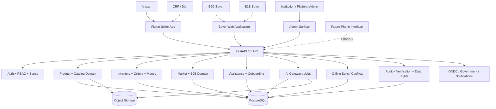

## 0.2 Channel-to-Domain Boundary

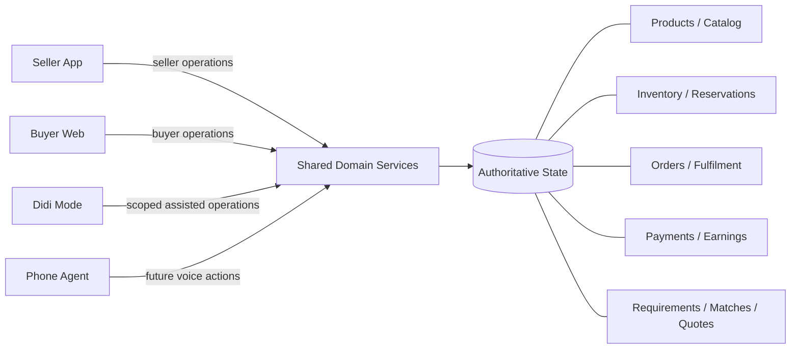

## 0.3 Request Decision Pipeline

Every API mutation follows this conceptual pipeline.

```mermaid
flowchart LR
    Request[HTTP Request] --> Parse[Schema Validation]
    Parse --> AuthN[Authenticate]
    AuthN --> AuthZ[Authorize]
    AuthZ --> Scope[Resolve Owner / Org / Cluster / Assistance Scope]
    Scope --> Revision[Validate Revision / Idempotency]
    Revision --> Domain[Deterministic Domain Service]
    Domain --> Txn[(PostgreSQL Transaction)]
    Txn --> Audit[Audit Event]
    Audit --> Event[Domain Event / Job]
    Event --> Response[API Response]
```

## 0.4 Mutation vs AI Boundary

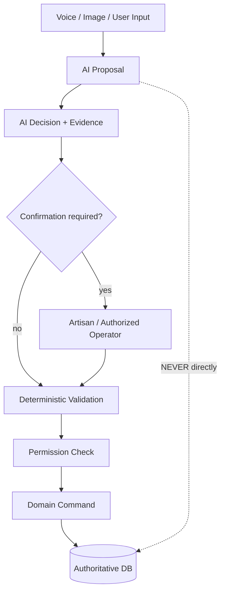

## 0.5 API Module Map

```mermaid
flowchart TB
    API[/v1 API/]
    API --> auth[auth / users / devices]
    API --> artisan[artisans / assistance]
    API --> product[products / variants / media / catalog / stories]
    API --> ai[voice / ai-jobs / ai-decisions]
    API --> pricing[pricing / costs / comparables]
    API --> commerce[inventory / carts / checkout / orders / fulfilment / money]
    API --> market[discovery / storefront / B2B / readiness]
    API --> integration[ONDC / Government / notifications]
    API --> sync[sync / conflicts]
    API --> governance[verification / audit / export / deletion]
    API --> admin[organizations / clusters / configuration]
    API --> ops[health / metrics / jobs]
```

---

## Kala Setu — API & Backend Contract

> **Purpose:** Define the implementation contract between the Flutter Seller App, Buyer Web Application, FastAPI backend, AI gateway, integrations and PostgreSQL for Kala Setu / SIH 26090.
>
> **Status:** Implementation baseline
>
> **Backend:** FastAPI / Python modular monolith + asynchronous workers
>
> **Primary clients:** Flutter Seller App + Buyer Web Application
>
> **Core principle:** One API, one commerce domain, one authoritative database, multiple interfaces.

---

# 1. API Scope

The API is the enforcement boundary between user interfaces and authoritative business state.

It must:

1. authenticate users and establish sessions;
2. enforce RBAC, ownership, organization/cluster and assistance-session scopes;
3. validate requests before domain execution;
4. expose products, catalogs, inventory, orders, fulfilment, earnings and market workflows;
5. support B2C and B2B buyer journeys through the same backend;
6. expose AI as proposal/recommendation infrastructure rather than the system of record;
7. support asynchronous AI/media/matching work;
8. support offline sync, revision checks and conflict resolution;
9. enforce transactional inventory/order correctness;
10. preserve auditability and data-rights behavior;
11. keep ONDC/Government/AI providers behind replaceable adapters.

The API must never allow a frontend or AI provider to bypass deterministic domain services for authoritative commerce mutations.

# 2. Architecture Alignment

```text
Flutter Seller App ───────┐
                          │
Buyer Web Application ────┼──> FastAPI API
                          │          │
Future Phone Agent ───────┘          ├── Auth / Authorization
                                     ├── Application Services
                                     ├── Domain Services
                                     ├── AI Gateway
                                     ├── Integration Adapters
                                     └── Async Workers
                                                │
                                      ┌─────────┴─────────┐
                                      │                   │
                                 PostgreSQL         Object Storage
                                 authoritative       binary media
```

The architecture explicitly keeps AI separate from authoritative state and uses a modular monolith rather than separate backend stacks.

# 3. Non-Negotiable API Principles

## 3.1 AI Is Not the System of Record

AI may produce extracted fields, drafts, recommendations, translations, matches and action proposals. AI may not directly own or mutate authoritative:

- inventory quantity;
- reservations;
- order state;
- payment state;
- ownership;
- publication state;
- payout details.

## 3.2 AI Proposes; Artisan Confirms

Critical user-visible fields should be confirmed before publication/execution:

- material;
- dimensions;
- price;
- stock;
- craft/origin claims;
- certifications;
- marketplace-facing claims.

## 3.3 Voice-First, Not Voice-Only

Voice responses must have structured output so the client can render visual confirmation for consequential values.

## 3.4 Shared Domain

Seller App and Buyer Web use the same product, inventory, order and pricing domain services. Buyer Web never owns a second commerce database.

## 3.5 Offline Is Not Authoritative

Offline clients can create drafts, capture media and queue mutations. PostgreSQL remains authoritative for server-side commerce state.

## 3.6 Deterministic Commerce

Inventory reservations, order transitions, checkout and critical conflict resolution are transactional domain operations.

# 4. API Lifecycle Labels

| Label | Meaning |
|---|---|
| `MVP` | Required for the SIH MVP |
| `MVP-SUPPORTING` | Required to make an MVP path safe/auditable |
| `MVP-READINESS` | Boundary is needed, implementation may be limited/sandboxed |
| `PHASE-2` | Post-MVP market/integration expansion |
| `PHASE-3` | Phone-call / Zero-UI interface |
| `PHASE-4` | Expanded B2B / visual / government operations |
| `INTERNAL` | Worker/admin/internal contract |

Where this document specifies an exact route, field, header or status that is not explicitly fixed in the source architecture/database, it is an **implementation contract decision** rather than a pre-existing product fact.

# 5. Versioning

All external routes are versioned:

```text
/v1/...
```

Breaking changes require a new major namespace. Additive response fields should remain backward compatible where practical.

FastAPI-generated OpenAPI should be the machine-readable canonical contract:

```text
/openapi.json
```

# 6. Transport and Headers

## 6.1 JSON

```http
Content-Type: application/json
Accept: application/json
Authorization: Bearer <access-token>
X-Request-ID: <uuid>
```

## 6.2 Mutations

Where applicable:

```http
Idempotency-Key: <unique-key>
If-Match: <entity-version>
```

## 6.3 Mobile Context

```http
X-Device-ID: <device-id>
```

The server resolves the device against the authenticated user; arbitrary client ownership claims are not trusted.

## 6.4 Didi / CRP Context

```http
X-Assistance-Session-ID: <session-id>
```

The server validates the session, artisan assignment, organization/cluster scope and permitted action for every mutation.

# 7. Standard Responses

## 7.1 Single Resource

```json
{
  "data": {},
  "meta": {"request_id": "uuid"}
}
```

## 7.2 List

```json
{
  "data": [],
  "meta": {
    "request_id": "uuid",
    "page": 1,
    "page_size": 20,
    "total": 100,
    "has_next": true
  }
}
```

## 7.3 Accepted Async Job

```json
{
  "data": {"job_id": "uuid", "status": "QUEUED"},
  "meta": {"request_id": "uuid"}
}
```

## 7.4 Error

```json
{
  "error": {
    "code": "INVENTORY_REVISION_CONFLICT",
    "message": "Stock changed on the server.",
    "details": {"expected_revision": 7, "current_revision": 8},
    "retryable": false
  },
  "meta": {"request_id": "uuid"}
}
```

Stable client behavior must use `error.code`, not string-matching human messages.

# 8. HTTP Status Semantics

| Status | Meaning |
|---|---|
| `200` | Successful read/mutation |
| `201` | Resource created |
| `202` | Async work accepted |
| `204` | Success with no body |
| `400` | Malformed request |
| `401` | Authentication failure |
| `403` | Authorization failure |
| `404` | Not found / intentionally undisclosed |
| `409` | State, revision or business conflict |
| `422` | Request validation failure |
| `429` | Rate/concurrency limit |
| `500` | Unexpected failure |
| `502` | Upstream provider failure |
| `503` | Temporarily unavailable dependency |

# 9. Error Code Taxonomy

```text
AUTH_INVALID_CREDENTIALS
AUTH_SESSION_EXPIRED
AUTH_DEVICE_NOT_ALLOWED
AUTH_DEVICE_REBIND_REQUIRED
AUTH_FORBIDDEN
RESOURCE_NOT_FOUND
VALIDATION_ERROR
RESOURCE_REVISION_CONFLICT
IDEMPOTENCY_REPLAY
ASSISTANCE_SESSION_REQUIRED
ASSISTANCE_SESSION_SCOPE_VIOLATION
ARTISAN_CONFIRMATION_REQUIRED
AI_RESULT_NOT_CONFIRMED
PRODUCT_NOT_PUBLISHABLE
CATALOG_NOT_READY
INVENTORY_INSUFFICIENT
INVENTORY_RESERVATION_CONFLICT
ORDER_INVALID_STATE
ORDER_CANNOT_BE_CANCELLED
CHECKOUT_REVALIDATION_FAILED
PAYMENT_STATE_CONFLICT
FULFILLMENT_INVALID_STATE
B2B_REQUIREMENT_INVALID
QUOTATION_INVALID_STATE
MARKET_CHANNEL_UNAVAILABLE
INTEGRATION_NOT_READY
SYNC_CONFLICT
SYNC_REPLAY
AI_JOB_UNAVAILABLE
AI_PROVIDER_TIMEOUT
AI_PROVIDER_UNAVAILABLE
MEDIA_PROCESSING_FAILED
RATE_LIMITED
INTERNAL_ERROR
```

# 10. Authentication & Authorization

The ₹0 MVP baseline uses phone + PIN + device binding rather than mandatory paid SMS OTP.

## 10.1 Authentication Routes

| Method | Route | Status |
|---|---|---|
| `POST` | `/v1/auth/register` | MVP |
| `POST` | `/v1/auth/login` | MVP |
| `POST` | `/v1/auth/refresh` | MVP |
| `POST` | `/v1/auth/logout` | MVP |
| `GET` | `/v1/auth/session` | MVP-SUPPORTING |
| `POST` | `/v1/auth/rebind-device` | MVP-SUPPORTING |

## 10.2 Register

```http
POST /v1/auth/register
```

```json
{
  "phone_number": "+919876543210",
  "pin": "<pin>",
  "role": "ARTISAN",
  "display_name": "Sita Devi",
  "preferred_language": "hi"
}
```

The client-supplied role is **not** a privilege grant. Public/self-registration may create only roles explicitly allowed by the deployment policy (for example `ARTISAN` or a buyer role). `INSTITUTION_ADMIN` and `PLATFORM_ADMIN` must be provisioned through an authorized administrative flow.

PINs are hashed; plaintext PINs are never stored or logged.

## 10.3 Login

```http
POST /v1/auth/login
```

```json
{
  "phone_number": "+919876543210",
  "pin": "<pin>",
  "device": {
    "device_id": "uuid",
    "platform": "ANDROID",
    "app_version": "0.1.0"
  }
}
```

## 10.4 Session

```http
GET /v1/auth/session
```

Returns user, roles, device, scope and session expiry.

## 10.5 Current User

```http
GET /v1/users/me
PATCH /v1/users/me
```

The patch is limited to user-editable preferences; roles, ownership and organization membership are not arbitrary self-service fields.

## 10.6 Devices

```http
GET  /v1/devices
POST /v1/devices
POST /v1/devices/{device_id}/revoke
```

Device rebinding/revocation is security-sensitive and must be audited.

## 10.7 Roles

```text
ARTISAN
CRP_DIDI
B2C_BUYER
B2B_BUYER
INSTITUTION_ADMIN
PLATFORM_ADMIN
```

Authorization is evaluated as:

```text
identity → role → resource ownership → organization/cluster → assistance session → action permission
```

# 11. Artisan & Assistance API

## 11.1 Artisan

```http
GET   /v1/artisans/me
PATCH /v1/artisans/me
GET   /v1/artisans/me/onboarding
PATCH /v1/artisans/me/onboarding
GET   /v1/artisans/me/crafts
POST  /v1/artisans/me/crafts
DELETE /v1/artisans/me/crafts/{craft_skill_id}
```

Verification/provenance claims must not be accepted as unrestricted profile updates.

## 11.2 Assistance Sessions

```http
POST /v1/assistance-sessions
GET  /v1/assistance-sessions
GET  /v1/assistance-sessions/{session_id}
POST /v1/assistance-sessions/{session_id}/actions
POST /v1/assistance-sessions/{session_id}/close
```

Start request:

```json
{
  "artisan_id": "uuid",
  "requested_scope": ["ONBOARDING", "PRODUCT_CREATION", "AI_REVIEW"]
}
```

Each assisted action records actor + artisan owner + session and is audited.

# 12. Product API

## 12.1 Product Routes

```http
POST   /v1/products
GET    /v1/products/{product_id}
PATCH  /v1/products/{product_id}
GET    /v1/products
POST   /v1/products/{product_id}/archive
```

Create request may begin as a sparse draft because voice/AI can populate fields afterward.

## 12.2 Variant Routes

```http
POST   /v1/products/{product_id}/variants
GET    /v1/products/{product_id}/variants/{variant_id}
PATCH  /v1/products/{product_id}/variants/{variant_id}
POST   /v1/products/{product_id}/variants/{variant_id}/deactivate
```

Example:

```json
{
  "sku": "KS-SAREE-001",
  "color": "Red",
  "unit_label": "piece",
  "unit_price": 1800.00,
  "is_one_of_one": false,
  "is_made_to_order": false,
  "is_available": true
}
```

Inventory quantity is authoritative in `inventory`, not the variant row.

# 13. Media / Image Studio API

## 13.1 Upload

```http
POST /v1/products/{product_id}/media/upload-init
POST /v1/products/{product_id}/media/{media_id}/finalize
GET  /v1/products/{product_id}/media
```

The recommended upload pattern is signed object-storage upload so large binaries need not pass through the FastAPI process.

## 13.2 Safe Enhancement

```http
POST /v1/products/{product_id}/media/{media_id}/enhance
```

```json
{
  "operations": [
    "BACKGROUND_REMOVAL",
    "EXPOSURE_CORRECTION",
    "WHITE_BALANCE",
    "AUTO_CROP"
  ],
  "require_confirmation": true
}
```

Returns `202` with a job ID.

Allowed normal transformations:

- crop;
- background removal;
- exposure correction;
- white balance;
- mild denoise;
- perspective correction.

Normal enhancement must not fabricate structure/craftsmanship or materially alter patterns/colors.

# 14. Catalog & Story API

## 14.1 Catalog

```http
POST  /v1/products/{product_id}/catalog/generate
GET   /v1/products/{product_id}/catalog
PATCH /v1/products/{product_id}/catalog/{catalog_entry_id}
POST  /v1/products/{product_id}/catalog/{catalog_entry_id}/confirm
POST  /v1/products/{product_id}/catalog/publish
```

Generate request:

```json
{
  "source_language": "hi",
  "target_languages": ["hi", "en"],
  "channel": "INTERNAL"
}
```

Publishing validates product, variants, confirmed catalog fields, media and channel requirements.

## 14.2 Production Stories

```http
POST  /v1/products/{product_id}/stories
PATCH /v1/products/{product_id}/stories/{story_id}
POST  /v1/products/{product_id}/stories/{story_id}/publish
GET   /v1/products/{product_id}/stories
```

# 15. Voice / AI API

## 15.1 Voice Interaction

```http
POST /v1/voice/interactions
GET  /v1/voice/interactions/{interaction_id}
POST /v1/voice/interactions/{interaction_id}/confirm
POST /v1/voice/interactions/{interaction_id}/reject
```

Conceptual upload:

```text
POST /v1/voice/interactions
multipart/form-data
  audio=<file>
  language_hint=hi
  context_type=PRODUCT
  context_id=<uuid>
```

The returned structured proposal can look like:

```json
{
  "intent": "UPDATE_VARIANT_PRICE",
  "target_id": "uuid",
  "arguments": {"new_price": 1650.00},
  "confidence": 0.94,
  "requires_confirmation": true
}
```

The proposal still passes authorization + domain validation before mutation.

## 15.2 AI Jobs

```http
GET  /v1/ai/jobs/{job_id}
POST /v1/ai/jobs/{job_id}/retry
```

Job states:

```text
QUEUED → RUNNING → SUCCEEDED
             ├──→ FAILED
             └──→ CANCELLED
```

## 15.3 AI Decisions / Corrections

```http
GET  /v1/ai/decisions/{decision_id}
POST /v1/ai/decisions/{decision_id}/corrections
POST /v1/ai/decisions/{decision_id}/report
GET  /v1/ai/decisions/{decision_id}/explanation
```

The explanation contract exposes concise factors/evidence, never hidden chain-of-thought.

# 16. Pricing API

```http
POST /v1/products/{product_id}/pricing/recommend
GET  /v1/products/{product_id}/pricing/recommendations/{recommendation_id}
POST /v1/products/{product_id}/pricing/overrides
```

Example recommendation:

```json
{
  "cost_floor": 1100.00,
  "market_band": {"min": 1500.00, "max": 1900.00},
  "suggested_price": 1650.00,
  "suggested_range": {"min": 1600.00, "max": 1750.00},
  "confidence": "MEDIUM"
}
```

A price override is a human decision over an advisory result and must be audited.

# 17. Inventory API

```http
GET  /v1/inventory/variants/{variant_id}
POST /v1/inventory/variants/{variant_id}/adjust
GET  /v1/inventory/variants/{variant_id}/movements
POST /v1/inventory/reservations
POST /v1/inventory/reservations/{reservation_id}/release
```

Adjustment example:

```json
{
  "quantity_delta": 5,
  "reason": "Finished batch",
  "expected_version": 13
}
```

Inventory updates must create immutable movement evidence and use optimistic locking/transactional checks.

# 18. Storefront / Public Catalog API

```http
GET   /v1/storefronts/me
PATCH /v1/storefronts/me
GET   /v1/storefronts/me/sections
PATCH /v1/storefronts/me/sections/{section_id}
POST  /v1/share-links
POST  /v1/share-links/{share_link_id}/revoke
GET   /v1/public/storefronts/{slug}
```

Public routes return only explicitly public content.

# 19. Buyer Identity / B2C Discovery API

Buyer Web is a first-class frontend but not a second backend.

```http
POST /v1/buyer/session
GET  /v1/buyer/session
POST /v1/buyer/session/logout

GET /v1/discovery/products
GET /v1/public/products/{product_id}
GET /v1/public/artisans/{artisan_id}
GET /v1/public/products/{product_id}/related
```

Discovery filters may include:

```text
q
category
craft_type
material
language
min_price
max_price
available
artisan_id
cluster_id
page
page_size
sort
```

# 20. B2C Cart API

```http
GET    /v1/carts/current
POST   /v1/carts
POST   /v1/carts/{cart_id}/items
PATCH  /v1/carts/{cart_id}/items/{cart_item_id}
DELETE /v1/carts/{cart_id}/items/{cart_item_id}
POST   /v1/carts/{cart_id}/clear
```

Important rule:

> Adding an item to a cart does **not** by itself reserve inventory.

Cart availability is revalidated during checkout against authoritative inventory.

# 21. B2C Checkout API

## 21.1 Validate

```http
POST /v1/checkout/validate
```

Validation checks current:

- catalog publication state;
- variant availability;
- inventory;
- price/currentness rules;
- address requirements;
- fulfilment restrictions.

## 21.2 Create Order

```http
POST /v1/checkout/orders
```

Required:

```http
Idempotency-Key: <unique-key>
```

Example:

```json
{
  "cart_id": "uuid",
  "shipping_address": {
    "name": "Asha",
    "phone": "+919876543210",
    "line1": "...",
    "city": "Vadodara",
    "state": "Gujarat",
    "postal_code": "390001",
    "country": "IN"
  },
  "payment_method": "COD"
}
```

The server transaction is:

```text
load cart
→ validate buyer
→ revalidate catalog/product state
→ lock/check inventory
→ create order
→ snapshot order items
→ reserve/transition inventory
→ create fulfillment state
→ create payment state
→ write audit/event
→ commit
```

Any critical failure rolls back the complete transaction and returns `409` where it is a state conflict.

# 22. Order API

```http
GET  /v1/orders?mine=true
GET  /v1/orders?owner=me
GET  /v1/orders/{order_id}
POST /v1/orders/{order_id}/confirm
POST /v1/orders/{order_id}/prepare
POST /v1/orders/{order_id}/ship
POST /v1/orders/{order_id}/delivered
POST /v1/orders/{order_id}/cancel
POST /v1/orders/{order_id}/return-requests
POST /v1/orders/{order_id}/refunds
```

Clients must request domain transitions rather than directly PATCHing `status`.

Order states:

```text
NEW → CONFIRMED → PREPARING → SHIPPED → DELIVERED → COMPLETED
```

Exception paths may include cancellation, return and refund states.

# 23. Fulfilment and Payment-State API

```http
GET  /v1/orders/{order_id}/fulfillment
GET  /v1/orders/{order_id}/fulfillment/events
POST /v1/orders/{order_id}/fulfillment/events
GET  /v1/orders/{order_id}/payment
POST /v1/orders/{order_id}/payment-events
```

The MVP database stores payment/earnings **state** and keeps the actual payment provider behind a future adapter.

# 24. Earnings API

```http
GET  /v1/earnings/summary
GET  /v1/earnings/ledger
GET  /v1/payout-accounts
POST /v1/payout-accounts
PATCH /v1/payout-accounts/{payout_account_id}
GET  /v1/payouts
GET  /v1/payouts/{payout_id}
```

Payout-detail mutations are sensitive and require strong authorization and audit logging.

# 25. B2B Requirement API

B2B uses the same buyer/customer model and authoritative seller capacity/inventory. It does not create a separate inventory system.

```http
POST  /v1/b2b/requirements
GET   /v1/b2b/requirements/{requirement_id}
GET   /v1/b2b/requirements?mine=true
PATCH /v1/b2b/requirements/{requirement_id}
POST  /v1/b2b/requirements/{requirement_id}/publish
```

Example:

```json
{
  "title": "Jute gift bags",
  "quantity_required": 500,
  "budget_min": 700.00,
  "budget_max": 900.00,
  "required_by": "2026-10-15T00:00:00Z",
  "delivery_location": {"city": "Ahmedabad", "state": "Gujarat", "country": "IN"},
  "items": [
    {"attribute_name": "material", "attribute_value": "jute"},
    {"attribute_name": "colour", "attribute_value": "natural"}
  ]
}
```

# 26. B2B Matching API

```http
POST /v1/b2b/requirements/{requirement_id}/match
GET  /v1/b2b/requirements/{requirement_id}/matches
GET  /v1/b2b/matches/{match_id}
```

Logical sequence:

```text
Requirement
→ hard constraints
→ capacity/availability
→ craft/material compatibility
→ budget fit
→ deadline fit
→ semantic ranking
→ match factors + score
```

A match is an opportunity, not an inventory reservation or fulfillment guarantee.

# 27. B2B Quotation API

```http
POST /v1/b2b/matches/{match_id}/quotation-requests
POST /v1/b2b/quotations
GET  /v1/b2b/quotations/{quotation_id}
GET  /v1/b2b/requirements/{requirement_id}/quotations
POST /v1/b2b/quotations/{quotation_id}/accept
POST /v1/b2b/quotations/{quotation_id}/reject
```

Quotation example:

```json
{
  "buyer_requirement_id": "uuid",
  "cluster_id": "uuid",
  "items": [
    {"variant_id": "uuid", "quantity": 500, "unit_price": 820.00}
  ],
  "estimated_delivery_at": "2026-10-10T00:00:00Z",
  "notes": "Bulk handmade production"
}
```

Acceptance is a high-impact mutation. The server must revalidate quotation state, authorization, prices, availability/capacity and order-conversion rules before committing.

# 28. Market Readiness API

The readiness model is a structured assessment, not a generic KYC boolean.

```http
GET  /v1/market-readiness/me
POST /v1/market-readiness/evaluate
GET  /v1/market-readiness/{channel}
```

Example:

```json
{
  "channel": "ONDC",
  "stage": 2,
  "status": "READY_WITH_REQUIREMENTS",
  "items": [
    {"requirement_code": "CATALOG_COMPLIANCE", "status": "COMPLETE"},
    {"requirement_code": "LOGISTICS_PROFILE", "status": "PENDING"}
  ]
}
```

Possible channels:

```text
STOREFRONT
ONDC
B2B
GOVERNMENT
```

# 29. External Integration API

External marketplaces and government channels are adapters, not core domain implementations.

```http
GET  /v1/integrations/{channel}/status
POST /v1/integrations/{channel}/products/{product_id}/prepare
POST /v1/integrations/{channel}/products/{product_id}/publish
POST /v1/integrations/{channel}/products/{product_id}/sync
POST /v1/integrations/{channel}/events
```

External payloads are validated and translated into internal models inside the adapter.

The MVP must not claim production ONDC/SNP participation unless the actual network relationship, credentials, protocol version and eligibility have been established. The intended MVP boundary is sandbox/readiness.

# 30. Notifications API

```http
GET  /v1/notifications
POST /v1/notifications/{notification_id}/read
```

Notifications are not authoritative state. A clicked notification must re-read the underlying resource before performing an action.

# 31. Offline Sync API

Offline mutations carry actor/device/revision/idempotency context.

## 31.1 Push

```http
POST /v1/sync/push
```

```json
{
  "device_id": "uuid",
  "mutations": [
    {
      "mutation_id": "uuid",
      "idempotency_key": "uuid",
      "entity_type": "PRODUCT",
      "entity_id": "uuid",
      "operation_type": "UPDATE",
      "base_revision": 4,
      "payload": {"material": "Tussar silk"},
      "client_created_at": "2026-09-12T12:55:00Z"
    }
  ]
}
```

Result:

```json
{
  "data": {
    "results": [
      {"mutation_id": "uuid", "status": "APPLIED", "server_revision": 5}
    ]
  }
}
```

Conflict result:

```json
{
  "mutation_id": "uuid",
  "status": "CONFLICT",
  "conflict_id": "uuid",
  "server_revision": 6,
  "client_revision": 4
}
```

## 31.2 Pull

```http
GET /v1/sync/pull?cursor=<cursor>
```

## 31.3 Sync Status

```http
GET /v1/sync/status
```

# 32. Conflict Resolution API

```http
GET  /v1/conflicts/{conflict_id}
GET  /v1/conflicts/{conflict_id}/comparison
POST /v1/conflicts/{conflict_id}/resolve
POST /v1/conflicts/{conflict_id}/keep-server
POST /v1/conflicts/{conflict_id}/retry-local
```

The comparison representation must support the architecture's UI model:

```text
Current Server
Your Offline Change
Merged Result
```

Resolution request:

```json
{
  "resolution_type": "MERGED_RESULT",
  "resolved_payload": {"material": "Tussar silk"},
  "reason": "Artisan confirmed the new material"
}
```

Commerce-critical conflicts are revalidated at resolution time.

# 33. Data Rights API

```http
POST /v1/data-rights/export
GET  /v1/data-rights/export/{request_id}
GET  /v1/data-rights/export/{request_id}/download
POST /v1/data-rights/deletion
GET  /v1/data-rights/deletion/{request_id}
```

Exports should cover user/business data, relationships and eligible media. Deletion follows the database retention policy and must preserve records required for transactional/audit purposes.

# 34. Verification API

```http
GET  /v1/verifications
POST /v1/verifications
POST /v1/verifications/{verification_id}/complete
```

Clients cannot self-assert verification state through an arbitrary profile patch.

# 35. Admin / Organization API

Institution/platform administration uses separate privileged routes:

```http
GET   /v1/admin/organizations
POST  /v1/admin/organizations
GET   /v1/admin/organizations/{organization_id}
PATCH /v1/admin/organizations/{organization_id}

GET   /v1/admin/organizations/{organization_id}/clusters
POST  /v1/admin/organizations/{organization_id}/clusters
GET   /v1/admin/clusters/{cluster_id}
PATCH /v1/admin/clusters/{cluster_id}
GET   /v1/admin/clusters/{cluster_id}/artisans

POST   /v1/admin/clusters/{cluster_id}/assistance-assignments
DELETE /v1/admin/assistance-assignments/{assignment_id}
```

All admin mutations are audited.

# 36. Audit API

Primarily admin/internal:

```http
GET /v1/admin/audit-events
```

Filters should include actor, entity, action, channel, request ID and date range.

Every consequential mutation should be traceable through:

```text
request_id
actor_user_id
device_id
assistance_session_id
entity_type
entity_id
action
channel
timestamp
```

# 37. Health API

```http
GET /v1/health/live
GET /v1/health/ready
GET /v1/admin/health/dependencies
```

The dependency endpoint is restricted and must not reveal secrets.

# 38. Idempotency Contract

Retryable external mutations should accept:

```http
Idempotency-Key: <unique-key>
```

Required areas:

- product creation;
- publication;
- inventory mutation;
- reservation/release;
- checkout/order creation;
- order transitions;
- quotation creation/acceptance;
- AI correction submission;
- sync mutations.

Same authenticated principal + same key + same logical request must return the original result. Same key + materially different request should return `409 IDEMPOTENCY_REPLAY`.

# 39. Revision / Optimistic Concurrency Contract

Mutable resources use their database `version`/`revision` field.

Example:

```http
If-Match: 7
```

If the server is at version 8:

```http
409 Conflict
```

```json
{
  "error": {
    "code": "RESOURCE_REVISION_CONFLICT",
    "message": "The resource changed on the server.",
    "details": {"client_version": 7, "server_version": 8},
    "retryable": true
  }
}
```

Inventory and order correctness must never use last-write-wins as the only conflict policy.

# 40. Pagination / Filtering

Initial API convention:

```text
?page=1&page_size=20
```

Maximum page size should be allowlisted. High-volume future feeds may move to cursor pagination.

Sorting uses allowlisted fields only:

```text
?sort=created_at&order=desc
```

# 41. Async Job Contract

Long-running work uses jobs rather than blocking request threads.

## 41.1 Typical Job Capabilities

```text
STT
LANGUAGE_DETECTION
CATALOG_GENERATION
TRANSLATION
IMAGE_ENHANCEMENT
IMAGE_QUALITY
PRICE_ADVISORY
DEMAND_MATCHING
TTS
DATA_EXPORT
```

## 41.2 Job Resource

```json
{
  "id": "uuid",
  "type": "CATALOG_GENERATION",
  "status": "RUNNING",
  "progress": 0.65,
  "attempt": 1,
  "created_at": "2026-09-12T13:00:00Z",
  "started_at": "2026-09-12T13:00:01Z",
  "completed_at": null,
  "error_code": null
}
```

Automatic retry is only for known transient failure classes.

# 42. Domain Event Contract

Internal events should use an envelope such as:

```json
{
  "event_id": "uuid",
  "event_type": "ORDER_CONFIRMED",
  "occurred_at": "2026-09-12T13:00:00Z",
  "actor_user_id": "uuid",
  "entity_type": "ORDER",
  "entity_id": "uuid",
  "correlation_id": "uuid",
  "payload": {}
}
```

Important events:

```text
PRODUCT_CREATED
PRODUCT_UPDATED
PRODUCT_PUBLISHED
MEDIA_UPLOADED
MEDIA_ENHANCEMENT_COMPLETED
CATALOG_GENERATED
CATALOG_CONFIRMED
PRICE_RECOMMENDATION_CREATED
PRICE_OVERRIDE_CREATED
INVENTORY_ADJUSTED
INVENTORY_RESERVED
INVENTORY_RELEASED
ORDER_CREATED
ORDER_CONFIRMED
ORDER_PREPARING
ORDER_SHIPPED
ORDER_DELIVERED
ORDER_CANCELLED
PAYMENT_STATE_CHANGED
B2B_REQUIREMENT_CREATED
B2B_MATCHING_COMPLETED
QUOTATION_CREATED
QUOTATION_ACCEPTED
AI_DECISION_CREATED
AI_DECISION_CORRECTED
SYNC_CONFLICT_CREATED
SYNC_CONFLICT_RESOLVED
```

Events are processing/integration signals; relational tables remain authoritative.

# 43. Transaction Boundaries

## 43.1 Inventory Reservation

```text
BEGIN
  lock inventory
  validate available quantity
  create reservation
  update authoritative inventory counters/state
  create movement evidence where required
COMMIT
```

## 43.2 B2C Checkout

```text
BEGIN
  load cart
  authorize buyer
  validate current product/catalog
  revalidate price
  lock/check inventory
  create order
  snapshot order items
  reserve/transition inventory
  create fulfilment state
  create payment state
  audit/event
COMMIT
```

## 43.3 Publish Product

```text
BEGIN
  authorize owner
  validate product/variants
  validate media
  validate confirmed catalog
  create publication
  create publication event
COMMIT
```

## 43.4 Resolve Sync Conflict

```text
BEGIN
  load latest entity
  verify conflict is open
  validate proposed resolution against current state
  increment revision
  record resolution
  close conflict
COMMIT
```

# 44. Order Transition Enforcement

The API must never expose a generic status replacement such as:

```http
PATCH /v1/orders/{id}
{"status":"DELIVERED"}
```

Instead use domain transitions:

```http
POST /v1/orders/{id}/confirm
POST /v1/orders/{id}/prepare
POST /v1/orders/{id}/ship
POST /v1/orders/{id}/delivered
POST /v1/orders/{id}/cancel
```

The order domain service owns the legal transition matrix.

# 45. Inventory Safety Rules

The API must enforce:

1. a reservation cannot exceed available stock;
2. reservation/stock mutations are transactional;
3. stale revisions produce conflicts;
4. every movement has actor/context evidence;
5. buyer caches never become authoritative stock values;
6. checkout revalidates inventory even when the cart showed availability;
7. repeated requests do not double-create reservations/orders.

# 46. AI Action Safety

Unsafe:

```text
LLM → SQL → database
```

Required:

```text
Voice
→ STT
→ Intent / Entity Extraction
→ Structured Action Proposal
→ Authorization
→ Confirmation when required
→ Domain Service
→ PostgreSQL
```

Example:

```json
{
  "intent": "UPDATE_VARIANT_PRICE",
  "target_id": "uuid",
  "arguments": {"new_price": 1650.00},
  "confidence": 0.94,
  "requires_confirmation": true
}
```

The domain service independently validates price constraints, ownership and permissions.

# 47. Buyer Web Rules

The Buyer Web Application is a presentation/interaction surface. It must never directly mutate:

- inventory quantity;
- reservation state;
- order state;
- payment state;
- product ownership;
- quotation acceptance state.

These operations go through the same authorized domain services used by the seller experience.

Suitable cache/read-model candidates include product cards, public catalog content and public artisan stories. Checkout/order/quotation mutations always re-read authoritative server state.

# 48. B2B Matching Rules

Recommended logical order:

```text
Buyer Requirement
→ hard constraint filtering
→ capacity / availability
→ craft/material compatibility
→ budget fit
→ deadline fit
→ semantic ranking
→ explainable match factors
```

AI/embedding ranking is advisory. The API stores explicit match factors so operators can understand why an opportunity ranked as it did.

# 49. External Connector Rules

Conceptual adapter boundary:

```python
class MarketConnector(Protocol):
    async def validate_catalog(...): ...
    async def publish_product(...): ...
    async def refresh_product(...): ...
    async def handle_event(...): ...
```

Application/domain code depends on `MarketConnector`, not a provider SDK.

Same principle applies to:

```text
SpeechProvider
LLMProvider
TranslationProvider
VisionProvider
TTSProvider
NotificationProvider
```

# 50. FastAPI Module Layout

```text
app/
├── main.py
├── core/
│   ├── config.py
│   ├── security.py
│   ├── errors.py
│   ├── logging.py
│   └── idempotency.py
├── api/v1/
│   ├── router.py
│   ├── auth.py
│   ├── users.py
│   ├── artisans.py
│   ├── assistance.py
│   ├── products.py
│   ├── catalog.py
│   ├── media.py
│   ├── voice.py
│   ├── ai.py
│   ├── pricing.py
│   ├── inventory.py
│   ├── buyer.py
│   ├── carts.py
│   ├── checkout.py
│   ├── orders.py
│   ├── fulfillment.py
│   ├── payments.py
│   ├── earnings.py
│   ├── storefronts.py
│   ├── b2b.py
│   ├── readiness.py
│   ├── integrations.py
│   ├── sync.py
│   ├── conflicts.py
│   ├── verifications.py
│   ├── notifications.py
│   ├── data_rights.py
│   └── admin.py
├── domain/
│   ├── identity/
│   ├── artisans/
│   ├── assistance/
│   ├── products/
│   ├── catalog/
│   ├── inventory/
│   ├── orders/
│   ├── fulfillment/
│   ├── payments/
│   ├── earnings/
│   ├── pricing/
│   ├── market/
│   ├── b2b/
│   ├── sync/
│   ├── verification/
│   └── data_rights/
├── ai/
│   ├── gateway.py
│   ├── interfaces.py
│   ├── stt/
│   ├── tts/
│   ├── llm/
│   ├── translation/
│   ├── vision/
│   ├── pricing/
│   └── matching/
├── integrations/
│   ├── ondc/
│   ├── government/
│   ├── notifications/
│   └── market_data/
├── workers/
│   ├── ai_jobs.py
│   ├── media_jobs.py
│   ├── matching_jobs.py
│   └── notifications.py
└── db/
    ├── schema/
    ├── repositories/
    ├── migrations/
    └── transactions/
```

The exact folder layout may change, but route handlers should not own domain rules.

# 51. API Layer Responsibility

A route handler should generally do:

```text
parse request
→ resolve actor
→ resolve device/session context
→ authorize
→ call application service
→ serialize response
```

It should not contain large business algorithms, inventory race handling, raw provider-specific AI logic or ad-hoc multi-table transactions.

# 52. API → Database Traceability

| API area | Primary database tables |
|---|---|
| Auth | `users`, `roles`, `user_roles`, `devices` |
| Artisan | `artisan_profiles`, languages, craft/onboarding tables |
| Assistance | `assistance_sessions`, `assistance_session_actions` |
| Product | `products`, `product_variants`, `product_field_sources` |
| Media | `product_media`, media processing/derivatives/quality tables |
| Catalog | `catalog_entries`, versions, publications, publication events |
| Stories | `production_stories` |
| Inventory | `inventory`, reservations, movements |
| B2C buyer | `customers`, `buyer_sessions`, `carts`, `cart_items` |
| Orders | `orders`, `order_items`, `order_addresses`, `fulfillments`, fulfilment events |
| Money | `payment_records`, `earnings_ledger`, payout tables |
| Voice | `voice_interactions`, `voice_intents`, `voice_confirmations` |
| AI | `ai_jobs`, `ai_decisions`, corrections, issue reports |
| Pricing | costs, labour profiles, pricing runs/factors, recommendations, overrides, comparables |
| B2B | requirements, requirement items, opportunities, matches/factors, quotations/items |
| Readiness | `market_readiness`, readiness items, channels |
| Integrations | external references, integration events |
| Storefront | storefronts, sections, share links |
| Sync | queue items, conflicts, resolutions |
| Governance | verifications, audit, data rights |
| Notifications | notifications, deliveries |

# 53. API → Frontend Traceability

| Journey | Seller App | Buyer Web | Main API groups |
|---|---:|---:|---|
| Auth | Yes | Yes | Auth / Buyer Session |
| Product creation | Yes | No | Product / Voice / Media |
| AI catalog | Yes | No | Catalog / AI / Jobs |
| Pricing | Yes | No | Pricing |
| Storefront | Yes | Read-only | Storefront / Share Links |
| B2C discovery | No | Yes | Discovery / Public Product |
| Cart | No | Yes | Cart |
| Checkout | No | Yes | Checkout / Orders |
| Seller order management | Yes | No | Orders / Fulfilment |
| Earnings | Yes | No | Earnings |
| B2B requirement | No | Yes | B2B Requirements |
| B2B matching | No | Yes | B2B Matching |
| Quotation response | Yes / Assisted | Yes | B2B Quotations |
| Didi mode | Yes | No | Assistance |
| Offline sync | Yes | No | Sync / Conflicts |

# 54. Critical Flow — Product Creation

```text
POST /v1/products
        ↓
POST /media/upload-init
        ↓
POST /media/{id}/finalize
        ↓
POST /media/{id}/enhance  → async vision job
        ↓
POST /voice/interactions   → STT / extraction
        ↓
POST /voice/{id}/confirm
        ↓
POST /catalog/generate     → async catalog job
        ↓
POST /catalog/{id}/confirm
        ↓
POST /pricing/recommend
        ↓
POST /pricing/overrides     (only if artisan changes advice)
        ↓
POST /catalog/publish
```

# 55. Critical Flow — B2C Purchase

```text
GET  /v1/discovery/products
        ↓
GET  /v1/public/products/{id}
        ↓
POST /v1/carts/{id}/items
        ↓
POST /v1/checkout/validate
        ↓
POST /v1/checkout/orders
        ↓
transaction:
  inventory revalidation
  reservation/stock transition
  order + item snapshots
  fulfillment state
  payment state
  audit/event
        ↓
GET /v1/orders/{id}
```

# 56. Critical Flow — B2B

```text
POST /v1/b2b/requirements
        ↓
POST /v1/b2b/requirements/{id}/match
        ↓
GET  /v1/b2b/requirements/{id}/matches
        ↓
POST /v1/b2b/matches/{id}/quotation-requests
        ↓
POST /v1/b2b/quotations
        ↓
GET  /v1/b2b/requirements/{id}/quotations
        ↓
POST /v1/b2b/quotations/{id}/accept
        ↓
deterministic quotation/order conversion when enabled
```

# 57. Critical Flow — Offline Sync

```text
Local SQLite/Drift
    ↓
sync_queue_items
    ↓
POST /v1/sync/push
    ↓
idempotency check
    ↓
authorization
    ↓
revision check
   / \
  /   \
apply  conflict
  |      |
  v      v
server  sync_conflicts
state      ↓
        comparison UI
            ↓
     resolve / keep server / retry local
```

# 58. Security Requirements

- PINs are never stored/logged in plaintext.
- Access/refresh credentials are never written to normal application logs.
- Ownership is derived from authenticated server context.
- Every sensitive mutation has a server-side permission check.
- Didi/CRP access requires active scoped assistance sessions.
- Database row-level authorization should protect the same boundaries where practical.
- Media is private by default; public access is deliberate.
- AI input/output retention follows the data-rights/retention policy.
- Raw voice should be deleted after processing unless explicitly retained.
- Audit records capture consequential actions without storing secrets.

# 59. Rate Limits / Concurrency

Starting policy should distinguish workload classes rather than use one global limit.

| Area | Control |
|---|---|
| Auth | Account + device rate limit |
| Voice | Concurrent AI-job limit |
| Media | Queue-based concurrency |
| Discovery | Higher read capacity |
| Cart | Moderate mutation rate |
| Checkout | Strict idempotency + concurrency controls |
| Sync | Batch/mutation size limit |
| Admin | Lower rate + stronger audit |

Exact numerical limits should be load-tested instead of treated as product requirements.

# 60. Observability Contract

Each request is correlated using `X-Request-ID` or a server-generated equivalent.

Structured logs should include:

```text
request_id
route
method
status_code
latency_ms
actor_user_id (where permitted)
device_id (where permitted)
assistance_session_id
entity_type
entity_id
error_code
```

Never log:

- PINs;
- access/refresh tokens;
- provider secrets;
- raw sensitive payment data;
- raw voice unless explicitly retained for an approved purpose.

# 61. API Testing Strategy

## 61.1 Unit

Test:

- state transitions;
- validators;
- permission checks;
- revision handling;
- idempotency;
- pricing fallback;
- match hard constraints.

## 61.2 Contract

Every route needs request/response schema tests, authorization tests and stable error-code tests.

## 61.3 Integration

Test PostgreSQL, object storage, job queue, AI gateway and mocked/sandbox integrations.

## 61.4 End-to-End

The minimum end-to-end suite covers:

1. register/login;
2. artisan product creation;
3. voice extraction + confirmation;
4. safe image processing;
5. multilingual catalog generation;
6. pricing advisory;
7. publication;
8. Buyer Web discovery;
9. cart;
10. checkout/order;
11. seller order handling;
12. overselling prevention;
13. offline sync;
14. conflict resolution;
15. Didi authorization;
16. B2B requirement/matching/quotation.

# 62. Negative / Abuse Tests

Explicitly test attempts to:

- mutate another artisan's product;
- read another buyer's order;
- reuse an idempotency key with a different request;
- reserve more stock than exists;
- apply a stale revision;
- act through a closed assistance session;
- access an out-of-scope cluster;
- accept the same quotation twice;
- replay an integration event;
- self-assert verification;
- publish incomplete catalog data;
- sync the same mutation twice;
- execute an AI proposal without required confirmation.

# 63. MVP Endpoint Priority

## P0 — SIH Demo Critical

```text
POST /v1/auth/register
POST /v1/auth/login
GET  /v1/users/me

POST /v1/products
GET  /v1/products/{id}
PATCH /v1/products/{id}
POST /v1/products/{id}/media/upload-init
POST /v1/products/{id}/media/{id}/finalize
POST /v1/products/{id}/media/{id}/enhance
POST /v1/voice/interactions
GET  /v1/voice/interactions/{id}
POST /v1/voice/interactions/{id}/confirm
POST /v1/products/{id}/catalog/generate
GET  /v1/products/{id}/catalog
POST /v1/products/{id}/catalog/{id}/confirm
POST /v1/products/{id}/catalog/publish
POST /v1/products/{id}/pricing/recommend
POST /v1/products/{id}/pricing/overrides
GET  /v1/inventory/variants/{id}
POST /v1/inventory/variants/{id}/adjust
GET  /v1/storefronts/me
POST /v1/share-links
GET  /v1/public/storefronts/{slug}
GET  /v1/discovery/products
GET  /v1/public/products/{id}
POST /v1/buyer/session
GET  /v1/carts/current
POST /v1/carts/{id}/items
POST /v1/checkout/validate
POST /v1/checkout/orders
GET  /v1/orders/{id}
GET  /v1/earnings/summary
POST /v1/assistance-sessions
POST /v1/sync/push
GET  /v1/sync/pull
GET  /v1/conflicts/{id}
POST /v1/conflicts/{id}/resolve
GET  /v1/health/live
GET  /v1/health/ready
```

## P1 — Supporting

```text
AI decision review
Notifications
Verification
Data export
Audit querying
Organization/cluster administration
Fulfilment details
Payment-state details
B2B workflow demonstration
```

## P2 — Later

```text
Production ONDC connector
Government procurement operations
Expanded B2B fulfilment coordination
Visual discovery
Phone-call / Zero-UI channel
```

# 64. Implementation Order

```text
Phase 0  API foundation
   ↓
Phase 1  Auth + users + devices
   ↓
Phase 2  Artisan + Didi assistance
   ↓
Phase 3  Products + variants + media
   ↓
Phase 4  Voice + AI jobs + catalog
   ↓
Phase 5  Pricing + inventory
   ↓
Phase 6  Storefront + Buyer Web discovery
   ↓
Phase 7  Cart + checkout + orders
   ↓
Phase 8  Fulfilment + earnings
   ↓
Phase 9  Offline sync + conflicts
   ↓
Phase 10 B2B requirements + matching + quotations
   ↓
Phase 11 Readiness + external adapters
   ↓
Phase 12 Security + observability + load testing
```

# 65. API Route Inventory

```text
AUTH
  /v1/auth/register
  /v1/auth/login
  /v1/auth/refresh
  /v1/auth/logout
  /v1/auth/session
  /v1/auth/rebind-device

IDENTITY
  /v1/users/me
  /v1/devices

ARTISAN / ASSISTANCE
  /v1/artisans/me
  /v1/artisans/me/onboarding
  /v1/artisans/me/crafts
  /v1/assistance-sessions

PRODUCT / CATALOG / MEDIA
  /v1/products
  /v1/products/{id}/variants
  /v1/products/{id}/media
  /v1/products/{id}/catalog
  /v1/products/{id}/stories

AI / VOICE / PRICING
  /v1/voice/interactions
  /v1/ai/jobs
  /v1/ai/decisions
  /v1/products/{id}/pricing

COMMERCE
  /v1/inventory
  /v1/carts
  /v1/checkout
  /v1/orders
  /v1/fulfillment
  /v1/payments
  /v1/earnings

BUYER WEB
  /v1/buyer/session
  /v1/discovery
  /v1/public

MARKET / B2B
  /v1/b2b/requirements
  /v1/b2b/matches
  /v1/b2b/quotations
  /v1/market-readiness
  /v1/integrations
  /v1/storefronts
  /v1/share-links

RELIABILITY / GOVERNANCE
  /v1/sync
  /v1/conflicts
  /v1/verifications
  /v1/data-rights
  /v1/notifications
  /v1/admin
  /v1/health
```

# 66. API → Database Definition of Done

The API baseline is implementation-ready when:

- every P0 route maps to known database entities/domain services;
- every state-changing route has an explicit transaction boundary where required;
- revision semantics are defined for mutable commerce entities;
- retryable mutations have idempotency semantics;
- B2C uses `customers`, `buyer_sessions`, `carts`, `cart_items`, `orders` and related commerce state;
- B2B uses requirement/matching/quotation structures without a second inventory system;
- AI outputs remain non-authoritative until confirmed/applied;
- offline mutations map to sync queue/conflict records;
- assistance sessions are auditable;
- no endpoint requires an undefined authoritative table;
- Buyer Web cannot directly mutate seller-owned commerce state;
- OpenAPI schemas and examples exist for every P0 endpoint;
- contract, integration and negative tests exist for critical flows.

# 67. Final API Architecture

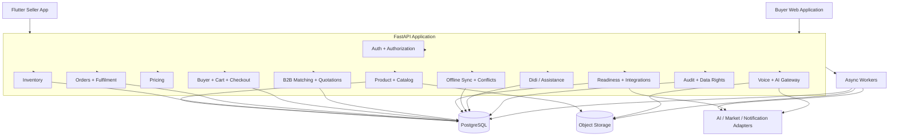

# 68. Final API Principle

Kala Setu's API is the contract that makes the product philosophy executable:

```text
Natural Input
    ↓
AI Interpretation
    ↓
Structured Proposal
    ↓
Authorization
    ↓
Confirmation where required
    ↓
Deterministic Domain Service
    ↓
Transactional PostgreSQL State
    ↓
Audit / Event / Sync
```

The resulting platform remains:

> **One API, one commerce domain, one authoritative database, multiple interfaces, replaceable intelligence providers and deterministic state transitions.**

# 69. Source Alignment

This document is derived from the current Kala Setu source baselines:

- `SOLUTION_26090.md`
- `ARCHITECTURE_26090_B2B_B2C.md`
- `DATABASE_26090_B2B_B2C.md`

Where an exact route name, field shape, header or implementation convention was not explicitly fixed by those baselines, this document records a proposed implementation contract. Such decisions should be reviewed during backend kickoff, then treated as frozen once implementation begins.

The intended dependency chain is:

```text
Problem Statement
    ↓
Solution
    ↓
Architecture
    ↓
Database
    ↓
API Contract
    ↓
Backend Domain Services
    ↓
Flutter Seller App + Buyer Web
    ↓
Tests
```
---

# 70. Detailed Endpoint Contract Standard

Every externally callable endpoint should be documented and implemented using the following record.

```text
Route
  ↓
Actor / Role
  ↓
Purpose
  ↓
Request schema
  ↓
Validation rules
  ↓
Authorization scope
  ↓
Idempotency / concurrency
  ↓
Domain command
  ↓
Database transaction
  ↓
Domain events / jobs
  ↓
Response schema
  ↓
Error taxonomy
```

For mutation endpoints, the backend implementation should be traceable to a deterministic domain command and one or more database transaction boundaries.

## 70.1 Canonical Command Naming

Internal application commands should use imperative names rather than HTTP terminology.

| API | Domain command | Example |
|---|---|---|
| `POST /products` | `CreateProduct` | create draft product |
| `PATCH /products/{id}` | `UpdateProduct` | update seller-editable fields |
| `POST /catalog/generate` | `GenerateCatalogDraft` | create AI proposal |
| `POST /catalog/{id}/confirm` | `ConfirmCatalogDraft` | accept proposal |
| `POST /inventory/adjust` | `AdjustInventory` | create movement |
| `POST /checkout/validate` | `ValidateCheckout` | verify availability/price |
| `POST /checkout/orders` | `CreateOrderFromCheckout` | reserve + create order |
| `POST /orders/{id}/transition` | `TransitionOrder` | deterministic state change |
| `POST /requirements` | `CreateBuyerRequirement` | create B2B demand |
| `POST /quotations/{id}/accept` | `AcceptQuotation` | buyer acceptance |
| `POST /sync/push` | `ApplySyncBatch` | apply offline changes |
| `POST /conflicts/{id}/resolve` | `ResolveSyncConflict` | explicit conflict choice |

## 70.2 Canonical Query Naming

Read operations should remain side-effect free.

```text
GetProduct
ListProducts
GetInventory
ListInventoryMovements
GetOrder
ListOrders
SearchProducts
GetBuyerRequirement
ListMarketMatches
GetQuotation
GetAIJob
GetAuditEvent
```

---

# 71. Complete Endpoint Surface

## 71.1 Identity & Session

| Method | Route | Role | Operation | DB areas |
|---|---|---|---|---|
| POST | `/v1/auth/register` | public/allowed self-registration | RegisterUser | users, user_roles, devices |
| POST | `/v1/auth/login` | public | Login | users, devices |
| POST | `/v1/auth/refresh` | authenticated session | RefreshSession | session store |
| POST | `/v1/auth/logout` | authenticated | Logout | sessions/audit |
| GET | `/v1/auth/session` | authenticated | GetSession | users, devices |
| POST | `/v1/auth/rebind-device` | authenticated/recovery | RebindDevice | users, devices, audit |
| GET | `/v1/users/me` | all | GetMe | users |
| PATCH | `/v1/users/me` | all | UpdateOwnPreferences | users |
| GET | `/v1/devices` | all | ListDevices | devices |
| POST | `/v1/devices` | all | RegisterDevice | devices |
| POST | `/v1/devices/{id}/revoke` | owner/admin | RevokeDevice | devices, audit |

## 71.2 Artisan & Assistance

| Method | Route | Role | Operation |
|---|---|---|---|
| GET | `/v1/artisans/me` | ARTISAN | GetArtisanProfile |
| PATCH | `/v1/artisans/me` | ARTISAN | UpdateArtisanProfile |
| GET | `/v1/artisans/me/onboarding` | ARTISAN | GetOnboardingProgress |
| PATCH | `/v1/artisans/me/onboarding` | ARTISAN/CRP | UpdateOnboardingProgress |
| GET | `/v1/artisans/me/languages` | ARTISAN | ListLanguages |
| PUT | `/v1/artisans/me/languages` | ARTISAN | ReplaceLanguagePreferences |
| GET | `/v1/artisans/me/crafts` | ARTISAN | ListCraftSkills |
| POST | `/v1/artisans/me/crafts` | ARTISAN/CRP | AddCraftSkill |
| DELETE | `/v1/artisans/me/crafts/{skill_id}` | ARTISAN/CRP | RemoveCraftSkill |
| GET | `/v1/crp/artisans` | CRP_DIDI | ListAssignedArtisans |
| GET | `/v1/crp/artisans/{id}` | CRP_DIDI | GetAssignedArtisan |
| POST | `/v1/assistance-sessions` | CRP_DIDI | StartAssistanceSession |
| GET | `/v1/assistance-sessions` | CRP_DIDI/ARTISAN/ADMIN | ListSessions |
| GET | `/v1/assistance-sessions/{id}` | scoped | GetSession |
| POST | `/v1/assistance-sessions/{id}/actions` | scoped | RecordAssistanceAction |
| POST | `/v1/assistance-sessions/{id}/close` | CRP_DIDI/ARTISAN | CloseAssistanceSession |

## 71.3 Product / Variant / Media / Catalog

| Method | Route | Operation |
|---|---|---|
| POST | `/v1/products` | CreateProduct |
| GET | `/v1/products` | ListOwnedProducts |
| GET | `/v1/products/{id}` | GetProduct |
| PATCH | `/v1/products/{id}` | UpdateProduct |
| POST | `/v1/products/{id}/archive` | ArchiveProduct |
| POST | `/v1/products/{id}/variants` | CreateVariant |
| GET | `/v1/products/{id}/variants` | ListVariants |
| GET | `/v1/products/{id}/variants/{variant_id}` | GetVariant |
| PATCH | `/v1/products/{id}/variants/{variant_id}` | UpdateVariant |
| POST | `/v1/products/{id}/variants/{variant_id}/deactivate` | DeactivateVariant |
| POST | `/v1/products/{id}/media/upload-init` | InitMediaUpload |
| POST | `/v1/products/{id}/media/{media_id}/finalize` | FinalizeMediaUpload |
| GET | `/v1/products/{id}/media` | ListProductMedia |
| POST | `/v1/products/{id}/media/{media_id}/enhance` | CreateMediaEnhancementJob |
| POST | `/v1/products/{id}/catalog/generate` | GenerateCatalogDraft |
| GET | `/v1/products/{id}/catalog` | ListCatalogEntries |
| GET | `/v1/products/{id}/catalog/{entry_id}` | GetCatalogEntry |
| PATCH | `/v1/products/{id}/catalog/{entry_id}` | EditCatalogEntry |
| POST | `/v1/products/{id}/catalog/{entry_id}/confirm` | ConfirmCatalogEntry |
| POST | `/v1/products/{id}/catalog/publish` | PublishCatalog |
| POST | `/v1/products/{id}/stories` | CreateProductionStory |
| GET | `/v1/products/{id}/stories` | ListProductionStories |
| PATCH | `/v1/products/{id}/stories/{story_id}` | UpdateProductionStory |
| POST | `/v1/products/{id}/stories/{story_id}/publish` | PublishProductionStory |

## 71.4 AI / Voice / Pricing

| Method | Route | Operation |
|---|---|---|
| POST | `/v1/voice/interactions` | CreateVoiceInteraction |
| GET | `/v1/voice/interactions/{id}` | GetVoiceInteraction |
| POST | `/v1/voice/interactions/{id}/confirm` | ConfirmVoiceProposal |
| POST | `/v1/voice/interactions/{id}/reject` | RejectVoiceProposal |
| GET | `/v1/ai/jobs/{id}` | GetAIJob |
| POST | `/v1/ai/jobs/{id}/retry` | RetryAIJob |
| POST | `/v1/ai/jobs/{id}/cancel` | CancelAIJob |
| GET | `/v1/ai/decisions/{id}` | GetAIDecision |
| POST | `/v1/ai/decisions/{id}/corrections` | CorrectAIDecision |
| POST | `/v1/ai/decisions/{id}/report` | ReportAIIssue |
| GET | `/v1/ai/decisions/{id}/explanation` | GetDecisionExplanation |
| POST | `/v1/products/{id}/pricing/runs` | RunPricing |
| GET | `/v1/products/{id}/pricing/runs/{run_id}` | GetPricingRun |
| GET | `/v1/products/{id}/pricing/recommendations/{id}` | GetRecommendation |
| POST | `/v1/products/{id}/pricing/overrides` | CreatePricingOverride |

## 71.5 Commerce

| Method | Route | Operation |
|---|---|---|
| GET | `/v1/inventory/variants/{variant_id}` | GetInventory |
| POST | `/v1/inventory/variants/{variant_id}/adjust` | AdjustInventory |
| GET | `/v1/inventory/variants/{variant_id}/movements` | ListInventoryMovements |
| POST | `/v1/inventory/reservations` | ReserveInventory |
| GET | `/v1/inventory/reservations/{id}` | GetReservation |
| POST | `/v1/inventory/reservations/{id}/release` | ReleaseReservation |
| GET | `/v1/orders` | ListOrders |
| POST | `/v1/orders` | CreateDirectOrder |
| GET | `/v1/orders/{id}` | GetOrder |
| POST | `/v1/orders/{id}/transition` | TransitionOrder |
| POST | `/v1/orders/{id}/cancel` | CancelOrder |
| GET | `/v1/orders/{id}/items` | ListOrderItems |
| GET | `/v1/orders/{id}/fulfillment` | GetFulfillment |
| POST | `/v1/orders/{id}/fulfillment/events` | AddFulfilmentEvent |
| GET | `/v1/orders/{id}/payments` | ListPaymentRecords |
| GET | `/v1/earnings/summary` | GetEarningsSummary |
| GET | `/v1/earnings/ledger` | ListEarningsLedger |
| GET | `/v1/payout-accounts` | ListPayoutAccounts |
| POST | `/v1/payout-accounts` | AddPayoutAccount |
| PATCH | `/v1/payout-accounts/{id}` | UpdatePayoutAccount |

## 71.6 B2C Buyer Web

| Method | Route | Operation |
|---|---|---|
| POST | `/v1/buyer/session` | CreateBuyerSession |
| GET | `/v1/buyer/session` | GetBuyerSession |
| DELETE | `/v1/buyer/session` | EndBuyerSession |
| GET | `/v1/discovery/products` | SearchProducts |
| GET | `/v1/public/products/{id}` | GetPublicProduct |
| GET | `/v1/public/artisans/{id}` | GetPublicArtisan |
| GET | `/v1/public/products/{id}/related` | GetRelatedProducts |
| GET | `/v1/storefronts/{slug}` | GetPublicStorefront |
| GET | `/v1/carts/current` | GetCurrentCart |
| POST | `/v1/carts` | CreateCart |
| POST | `/v1/carts/{id}/items` | AddCartItem |
| PATCH | `/v1/carts/{id}/items/{item_id}` | UpdateCartItem |
| DELETE | `/v1/carts/{id}/items/{item_id}` | RemoveCartItem |
| POST | `/v1/carts/{id}/clear` | ClearCart |
| POST | `/v1/checkout/validate` | ValidateCheckout |
| POST | `/v1/checkout/orders` | CreateOrderFromCheckout |
| GET | `/v1/buyer/orders` | ListBuyerOrders |
| GET | `/v1/buyer/orders/{id}` | GetBuyerOrder |

## 71.7 B2B Buyer Web

| Method | Route | Operation |
|---|---|---|
| POST | `/v1/b2b/requirements` | CreateBuyerRequirement |
| GET | `/v1/b2b/requirements` | ListBuyerRequirements |
| GET | `/v1/b2b/requirements/{id}` | GetBuyerRequirement |
| PATCH | `/v1/b2b/requirements/{id}` | UpdateBuyerRequirement |
| POST | `/v1/b2b/requirements/{id}/submit` | SubmitRequirement |
| POST | `/v1/b2b/requirements/{id}/cancel` | CancelRequirement |
| GET | `/v1/b2b/requirements/{id}/matches` | ListRequirementMatches |
| GET | `/v1/b2b/matches/{id}` | GetMarketMatch |
| POST | `/v1/b2b/requirements/{id}/refresh-matches` | RefreshMatches |
| GET | `/v1/b2b/requirements/{id}/quotations` | ListQuotations |
| GET | `/v1/b2b/quotations/{id}` | GetQuotation |
| POST | `/v1/b2b/quotations/{id}/accept` | AcceptQuotation |
| POST | `/v1/b2b/quotations/{id}/reject` | RejectQuotation |
| POST | `/v1/b2b/quotations/{id}/revision-request` | RequestQuotationRevision |
| GET | `/v1/cluster/opportunities` | ListClusterOpportunities |
| POST | `/v1/cluster/opportunities/{id}/respond` | RespondToOpportunity |
| POST | `/v1/cluster/quotations` | CreateClusterQuotation |
| PATCH | `/v1/cluster/quotations/{id}` | UpdateClusterQuotation |
| POST | `/v1/cluster/quotations/{id}/submit` | SubmitQuotation |

## 71.8 Market Access, Readiness and Integrations

| Method | Route | Operation |
|---|---|---|
| GET | `/v1/market/channels` | ListMarketChannels |
| GET | `/v1/market/readiness` | GetReadiness |
| GET | `/v1/market/readiness/{id}` | GetReadinessRecord |
| POST | `/v1/market/readiness/{id}/recalculate` | RecalculateReadiness |
| GET | `/v1/market/opportunities` | ListOpportunities |
| GET | `/v1/integrations/events` | ListIntegrationEvents |
| POST | `/v1/integrations/ondc/catalog/refresh` | QueueONDCCatalogRefresh |
| POST | `/v1/integrations/ondc/events` | ReceiveONDCEvent |
| POST | `/v1/integrations/government/readiness-check` | RunGovernmentReadinessCheck |

## 71.9 Sync, Governance, Notifications and Admin

| Method | Route | Operation |
|---|---|---|
| POST | `/v1/sync/push` | ApplySyncBatch |
| GET | `/v1/sync/pull` | PullChanges |
| GET | `/v1/sync/status` | GetSyncStatus |
| GET | `/v1/conflicts` | ListConflicts |
| GET | `/v1/conflicts/{id}` | GetConflict |
| POST | `/v1/conflicts/{id}/resolve` | ResolveConflict |
| POST | `/v1/data-exports` | RequestDataExport |
| GET | `/v1/data-exports/{id}` | GetExportStatus |
| POST | `/v1/data-deletions` | RequestDeletion |
| GET | `/v1/data-deletions/{id}` | GetDeletionStatus |
| GET | `/v1/verifications/{subject_type}/{subject_id}` | GetVerification |
| POST | `/v1/verifications` | CreateVerification |
| GET | `/v1/notifications` | ListNotifications |
| POST | `/v1/notifications/{id}/read` | MarkNotificationRead |
| GET | `/v1/organizations` | ListOrganizations |
| GET | `/v1/organizations/{id}` | GetOrganization |
| GET | `/v1/organizations/{id}/clusters` | ListClusters |
| POST | `/v1/organizations/{id}/clusters` | CreateCluster |
| GET | `/v1/audit/events` | SearchAuditEvents |
| GET | `/v1/audit/events/{id}` | GetAuditEvent |
| GET | `/health/live` | Liveness |
| GET | `/health/ready` | Readiness |

---

# 72. Authentication State Machine

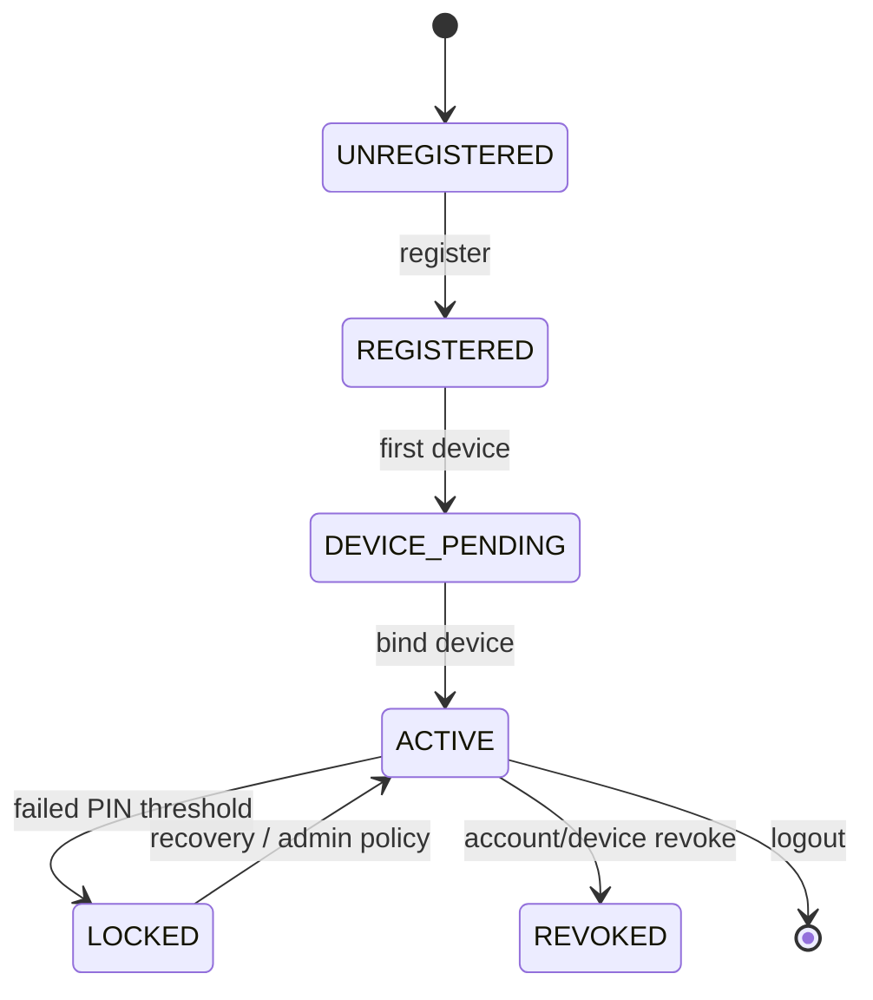

## 72.1 Register Contract

### Request

```json
{
  "phone_number": "+919876543210",
  "pin": "1234",
  "requested_role": "ARTISAN",
  "display_name": "Sita Devi",
  "preferred_language": "hi",
  "device": {
    "device_id": "uuid",
    "platform": "ANDROID",
    "app_version": "1.0.0"
  }
}
```

### Validation

- phone number normalized to a canonical representation;
- PIN policy enforced;
- role limited by deployment policy;
- duplicate identity rejected or routed to recovery;
- device registration attached to authenticated user after account creation;
- raw PIN never logged;
- audit event created.

### Response

```json
{
  "data": {
    "user": {"id": "uuid", "role": "ARTISAN"},
    "access_token": "...",
    "refresh_token": "...",
    "expires_in": 900
  },
  "meta": {"request_id": "uuid"}
}
```

# 73. Seller Product Creation Protocol

The seller's flagship flow is deliberately represented as a multi-request workflow rather than pretending one endpoint does everything.

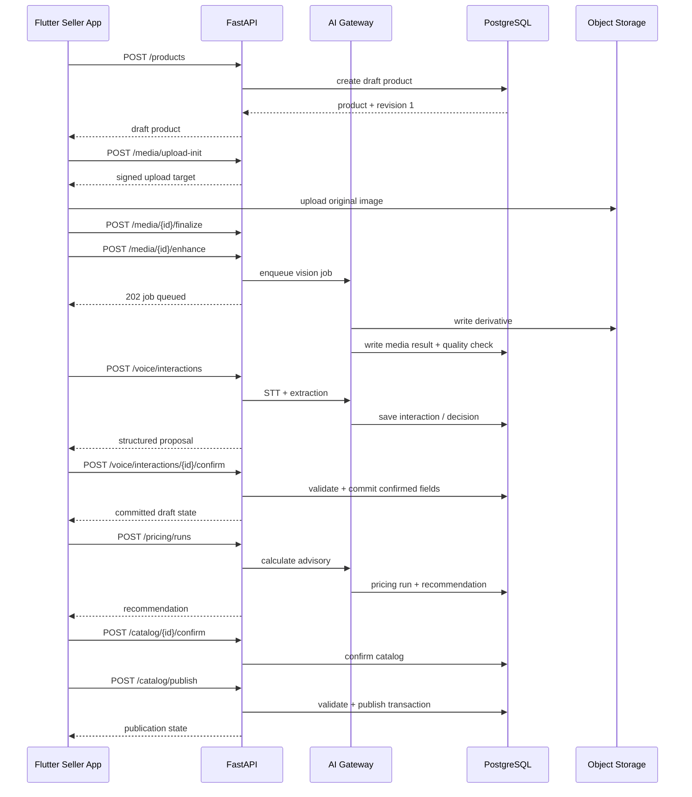

## 73.1 Product Create Request

```json
{
  "title": null,
  "craft_type": null,
  "material": null,
  "status": "DRAFT",
  "creation_mode": "VOICE_ASSISTED",
  "client_revision": null,
  "idempotency_key": "product-create-uuid"
}
```

The API may accept an intentionally sparse draft because later AI interactions populate candidate fields.

## 73.2 Product Patch Contract

```json
{
  "title": "Bhagalpuri Silk Saree",
  "material": "Tussar Silk",
  "craft_type": "Handwoven",
  "version": 4
}
```

The backend checks `version == current_version`. A stale write returns `409 RESOURCE_VERSION_CONFLICT` and includes enough metadata for the client to re-fetch.

---

# 74. Voice-to-Action Protocol

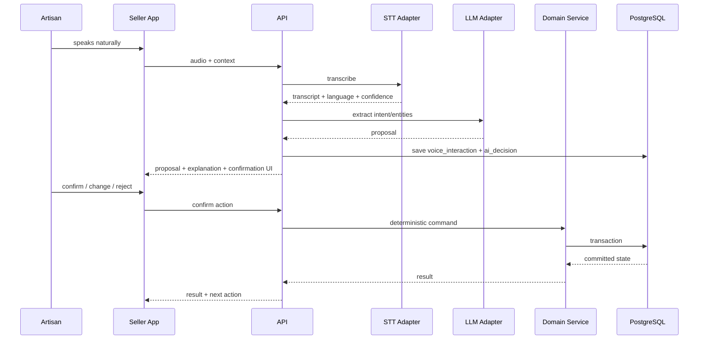

## 74.1 Intent Contract

```json
{
  "intent": "UPDATE_VARIANT_PRICE",
  "target": {"type": "PRODUCT_VARIANT", "id": "uuid"},
  "arguments": {"new_price": 1650.0},
  "confidence": 0.94,
  "requires_confirmation": true,
  "evidence": [
    {"field": "new_price", "source": "voice", "confidence": 0.99}
  ]
}
```

## 74.2 Confirmation Contract

```json
{
  "confirmation": "CONFIRM",
  "expected_proposal_hash": "sha256:...",
  "client_revision": 8
}
```

The proposal hash prevents confirmation of a silently changed proposal.

---

# 75. Image Processing Protocol

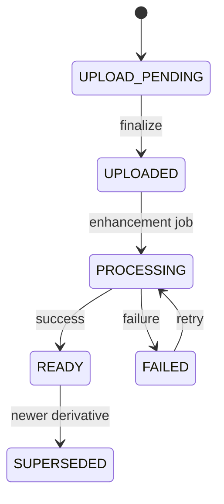

## 75.1 Media Upload Init

```json
{
  "media_type": "IMAGE",
  "content_type": "image/jpeg",
  "file_size": 3245120,
  "sha256": "...",
  "is_original": true
}
```

Response contains a temporary signed destination and media ID. Binary content should not be sent through the database.

## 75.2 Enhancement Result

```json
{
  "job_id": "uuid",
  "media_id": "uuid",
  "operations": ["BACKGROUND_REMOVAL", "EXPOSURE_CORRECTION", "AUTO_CROP"],
  "status": "QUEUED",
  "original_media_id": "uuid"
}
```

The UI must retain access to both original and enhanced representations.

---

# 76. Catalog Generation and Publication Protocol


## 76.1 Generated Catalog Draft

```json
{
  "language": "hi",
  "title": "भागलपुरी रेशम साड़ी",
  "description": "...",
  "attributes": {
    "material": "Tussar Silk",
    "craft": "Handwoven",
    "length_m": 6
  },
  "seo_tags": ["silk saree", "handwoven", "Bhagalpur"],
  "source_map": {
    "material": {"source": "VOICE", "decision_id": "uuid"}
  },
  "confirmation_required": true
}
```

## 76.2 Publish Preconditions

A publish command must verify, according to channel: product ownership, active variant, valid price, stock policy, confirmed critical fields, approved media, public visibility policy, and channel-specific requirements.

---

# 77. Pricing Protocol

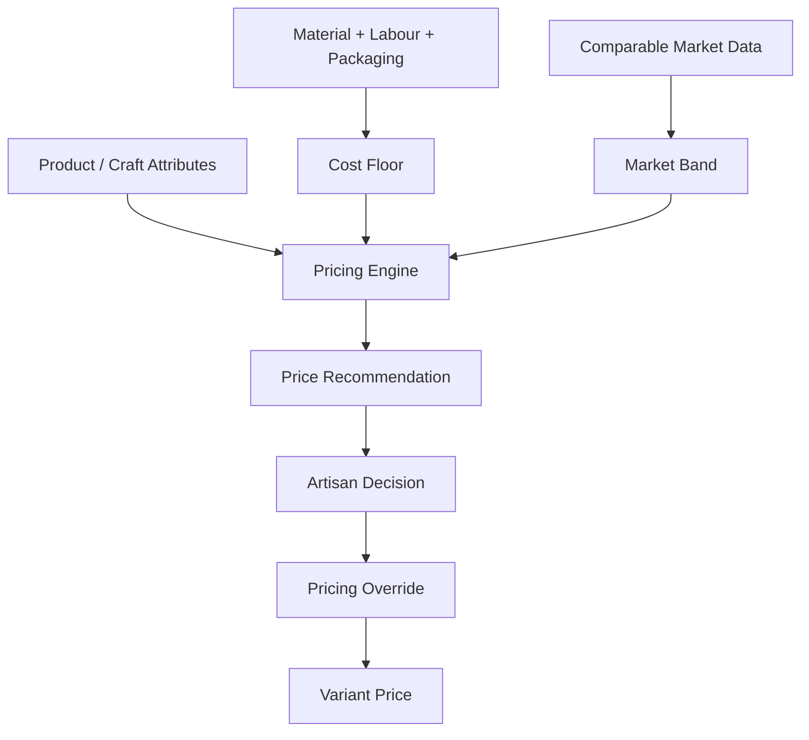

## 77.1 Pricing Request

```json
{
  "variant_id": "uuid",
  "market_scope": {"country": "IN", "region": "Gujarat"},
  "include_market_comparables": true
}
```

## 77.2 Pricing Response

```json
{
  "run_id": "uuid",
  "recommendation_id": "uuid",
  "cost_floor": 1100.0,
  "market_band": {"min": 1500.0, "max": 1900.0},
  "suggested_price": 1650.0,
  "suggested_range": {"min": 1600.0, "max": 1750.0},
  "confidence": "MEDIUM",
  "factor_count": 8,
  "explanation": "The suggested price keeps an estimated margin above the configured production floor while remaining inside the observed comparable range."
}
```

Pricing remains advisory. The selected commerce price is written only through a deterministic authorized mutation.

---

# 78. Inventory and Reservation Protocol

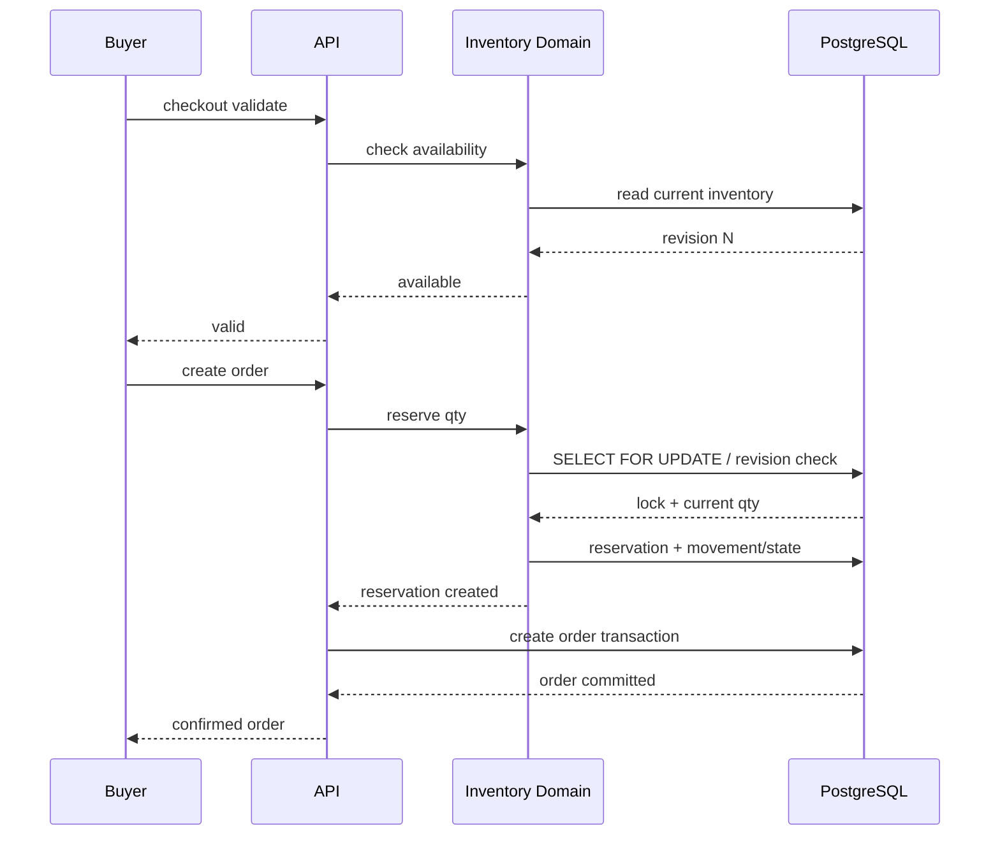

## 78.1 Reservation Invariants

1. `available + reserved` must remain consistent with movement history.
2. Reservations cannot exceed available quantity.
3. Expired reservations release through a deterministic job.
4. The order and reservation relationship must be auditable.
5. Inventory movement rows are immutable.
6. A stale client cannot overwrite a newer inventory revision.

## 78.2 Adjustment Request

```json
{
  "quantity_delta": 5,
  "reason_code": "BATCH_COMPLETED",
  "reason_text": "Finished batch",
  "expected_version": 13,
  "client_operation_id": "uuid"
}
```

Response: updated inventory plus movement ID and resulting revision.

---

# 79. B2C Cart → Checkout → Order Protocol

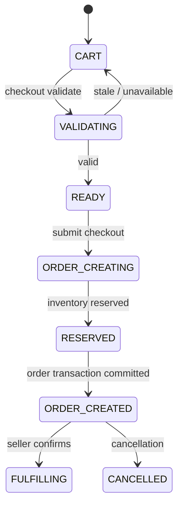

## 79.1 Checkout Architecture

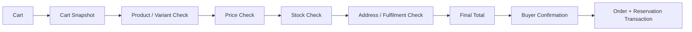

## 79.2 Checkout Validation Request

```json
{
  "cart_id": "uuid",
  "shipping_address_id": "uuid",
  "expected_cart_version": 7
}
```

## 79.3 Checkout Validation Response

```json
{
  "valid": true,
  "cart_version": 7,
  "items": [
    {
      "cart_item_id": "uuid",
      "variant_id": "uuid",
      "quantity": 2,
      "unit_price": 1800.0,
      "available": true
    }
  ],
  "subtotal": 3600.0,
  "shipping": 80.0,
  "total": 3680.0,
  "expires_at": "2026-09-12T13:30:00Z"
}
```

## 79.4 Order Creation Must Be Idempotent

```http
POST /v1/checkout/orders
Idempotency-Key: checkout-submit-uuid
```

The same idempotency key must return the original order result rather than creating a duplicate order.

---

# 80. Order Lifecycle Protocol

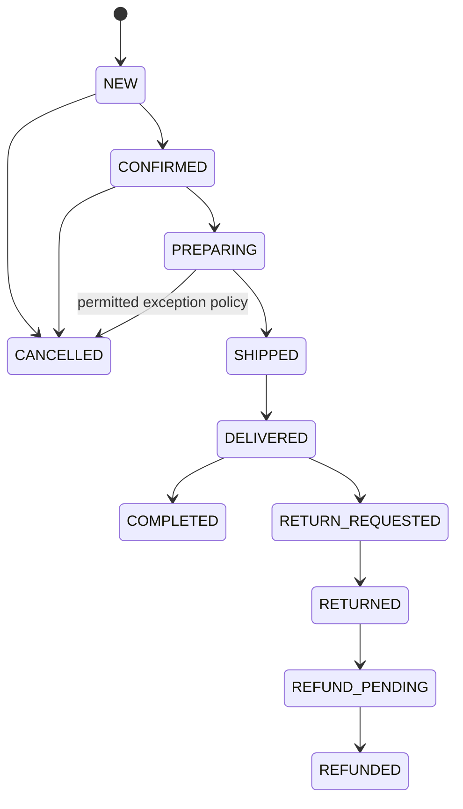

## 80.1 Transition Request

```json
{
  "target_status": "PREPARING",
  "reason_code": null,
  "expected_version": 4,
  "idempotency_key": "uuid"
}
```

## 80.2 Transition Matrix

| Current | Allowed | Actor |
|---|---|---|
| NEW | CONFIRMED, CANCELLED | seller / authorized operator / system policy |
| CONFIRMED | PREPARING, CANCELLED | seller / authorized operator |
| PREPARING | SHIPPED | seller / fulfilment operator |
| SHIPPED | DELIVERED | fulfilment/system callback |
| DELIVERED | COMPLETED, RETURN_REQUESTED | system/buyer policy |
| RETURN_REQUESTED | RETURNED | fulfilment/support |
| RETURNED | REFUND_PENDING | commerce service |
| REFUND_PENDING | REFUNDED | payment/commerce service |

Unknown or invalid transitions return `409 ORDER_INVALID_TRANSITION`.

---

# 81. Fulfilment and Payment-State Protocol

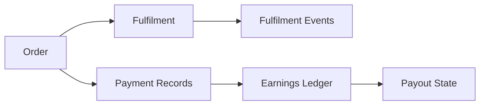

Payment state is separated from order state. An order can be `CONFIRMED` while payment may remain `PENDING`, depending on the supported channel.

## 81.1 Fulfilment Event

```json
{
  "event_type": "SHIPPED",
  "occurred_at": "2026-09-12T13:10:00Z",
  "carrier": "SELF_DISPATCH",
  "tracking_reference": "KS123",
  "metadata": {}
}
```

The API does not allow a client to arbitrarily write a delivered state without checking the order transition rules.

---

# 82. B2B Requirement → Matching → Quotation Protocol

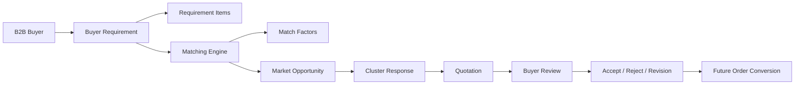

## 82.1 Requirement Request

```json
{
  "title": "Jute Gift Bags",
  "description": "Bulk branded gift bags",
  "deadline": "2026-10-15",
  "delivery_region": "Delhi NCR",
  "budget_min": 700.0,
  "budget_max": 900.0,
  "items": [
    {
      "attribute_name": "quantity",
      "attribute_value": "500"
    },
    {
      "attribute_name": "material",
      "attribute_value": "jute"
    }
  ]
}
```

## 82.2 Match Result

```json
{
  "match_id": "uuid",
  "artisan_id": "uuid",
  "cluster_id": "uuid",
  "score": 0.87,
  "factors": [
    {"type": "MATERIAL_MATCH", "score": 1.0},
    {"type": "CAPACITY_MATCH", "score": 0.8},
    {"type": "DEADLINE_MATCH", "score": 0.9}
  ],
  "capacity_snapshot_id": "uuid",
  "status": "OPPORTUNITY"
}
```

Match scores are decision support. A quotation is a separate commercial commitment and must not be created automatically from a score alone.

## 82.3 Quotation State

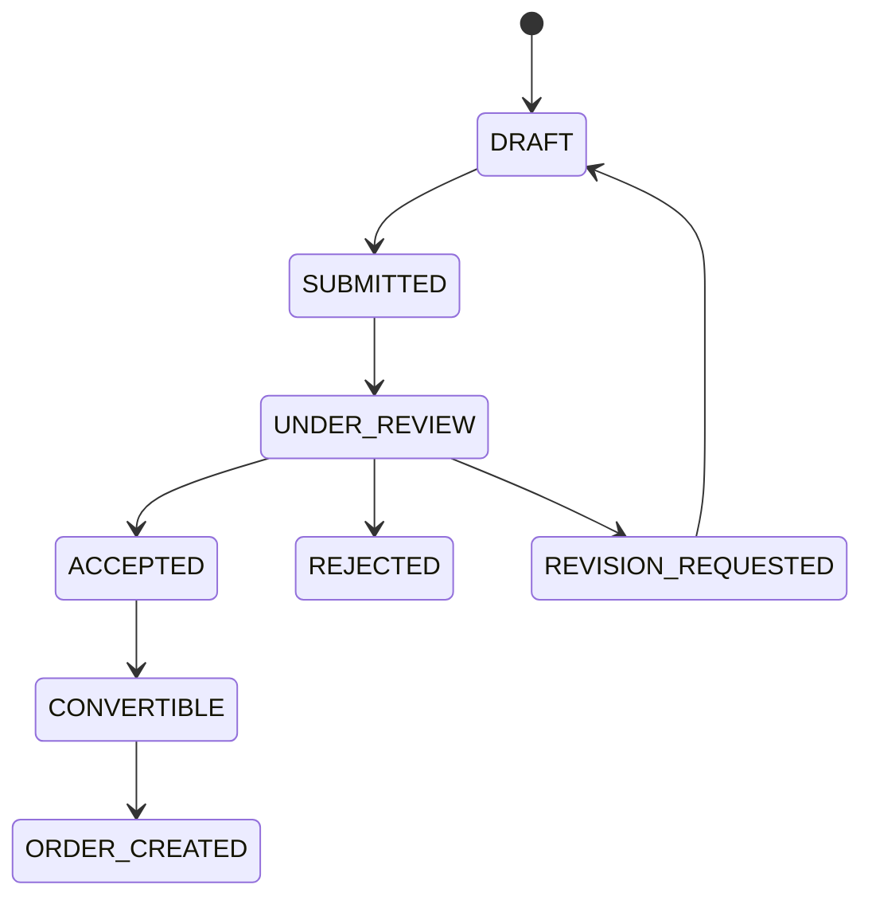

---

# 83. Market Readiness Protocol

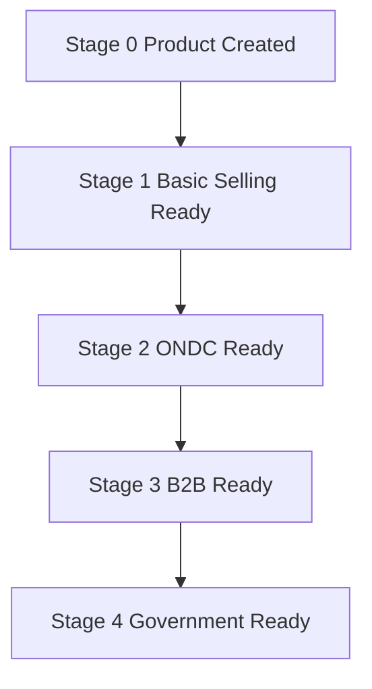

Each readiness calculation evaluates explicit `market_readiness_items` rather than a single opaque status.

Example response:

```json
{
  "channel": "ONDC",
  "stage": 2,
  "status": "READY",
  "items": [
    {"code": "CATALOG_FIELDS", "status": "PASS"},
    {"code": "MEDIA", "status": "PASS"},
    {"code": "PRICE", "status": "PASS"},
    {"code": "LOGISTICS", "status": "MISSING"}
  ]
}
```

---

# 84. Storefront and Public Access Protocol

```mermaid
flowchart LR
    Artisan[Artisan] --> Storefront[Storefront Configuration]
    Storefront --> Section[Storefront Sections]
    Storefront --> Share[Share Link]
    Share --> Public[Public Storefront]
    Public --> Product[Public Product]
    Product --> Catalog[Published Catalog]
    Public --> Related[Related Discovery]
```

Public APIs must apply a dedicated visibility projection. Internal notes, raw AI evidence, private contact data and unpublished inventory must never leak through public serializers.

---

# 85. Offline Sync Protocol

```mermaid
sequenceDiagram
    participant Device as Local SQLite / Drift
    participant API as Sync API
    participant Domain as Domain Services
    participant DB as PostgreSQL

    Device->>Device: queue mutation
    Device->>API: POST /sync/push
    API->>Domain: validate operation
    Domain->>DB: check base revision
    alt revision matches
        Domain->>DB: commit mutation
        DB-->>Domain: new revision
        Domain-->>API: applied
    else revision differs
        Domain-->>API: conflict
    end
    API-->>Device: per-item result
    Device->>API: GET /sync/pull
    API-->>Device: changes since cursor
```

## 85.1 Sync Item

```json
{
  "operation_id": "uuid",
  "entity_type": "PRODUCT",
  "entity_id": "uuid",
  "operation": "UPDATE",
  "base_revision": 7,
  "payload": {
    "title": "Updated title"
  },
  "device_id": "uuid",
  "created_at": "2026-09-12T13:00:00Z"
}
```

## 85.2 Per-Item Result

```json
{
  "operation_id": "uuid",
  "status": "CONFLICT",
  "server_revision": 8,
  "conflict_id": "uuid",
  "retryable": false
}
```

---

# 86. Conflict Resolution Protocol

```mermaid
flowchart TB
    Conflict[Detected Conflict] --> Classify[Classify Fields]
    Classify --> Safe[Safe Merge?]
    Safe -- yes --> Merge[Server + Client Merge]
    Safe -- no --> Review[Manual Review UI]
    Review --> Local[Keep Local]
    Review --> Server[Keep Server]
    Review --> Custom[Choose Merged Result]
    Merge --> Revalidate[Re-run Domain Validation]
    Local --> Revalidate
    Server --> Revalidate
    Custom --> Revalidate
    Revalidate --> Commit[Commit + Resolution Audit]
```

The client is never permitted to bypass server-side revalidation. Inventory/order conflicts require domain-specific re-evaluation rather than generic field merging.

## 86.1 Conflict Response

```json
{
  "conflict_id": "uuid",
  "entity": {"type": "PRODUCT", "id": "uuid"},
  "server_revision": 8,
  "client_revision": 7,
  "server_state": {},
  "client_state": {},
  "suggested_merge": {},
  "resolution_options": ["KEEP_SERVER", "KEEP_LOCAL", "MERGE"]
}
```

---

# 87. Authorization Matrix

```mermaid
flowchart TB
    Request --> Identity
    Identity --> Role
    Role --> Ownership
    Ownership --> Scope[Org / Cluster Scope]
    Scope --> Assistance[Assistance Session if applicable]
    Assistance --> Action
    Action --> Decision{Allowed?}
    Decision -- yes --> Domain
    Decision -- no --> Forbidden[403 / typed error]
```

## 87.1 Core Matrix

| Capability | Artisan | CRP/Didi | B2C | B2B | Institution Admin | Platform Admin |
|---|---:|---:|---:|---:|---:|---:|
| Own profile | RW | assist | R own | R own | scoped | RW |
| Assigned artisan profile | - | RW scoped | - | - | R scoped | RW |
| Create product | RW | RW scoped | - | - | - | support |
| Publish product | RW + confirm | scoped + confirm | - | - | - | support |
| Inventory adjust | RW own | scoped | - | - | - | privileged |
| Place B2C order | - | - | RW own | - | - | support |
| Create B2B requirement | - | - | - | RW own | - | support |
| Create quotation | RW cluster | scoped | - | - | - | support |
| Accept quotation | - | - | - | RW own | - | support |
| View audit | own relevant | assigned | own relevant | own relevant | scoped | full |
| Data export | own | delegated where authorized | own | own | organization scoped | privileged |

`support` means operational support access and does not imply silent authority to impersonate an owner.

---

# 88. Complete Database-to-API Coverage

The API must account for every authoritative database family.

| Database family | Tables / entities | Primary API surface |
|---|---|---|
| Identity | users, roles, user_roles, devices | `/auth`, `/users`, `/devices` |
| Organization | organizations, clusters | `/organizations`, `/clusters`, `/cluster` |
| Artisan | artisan_profiles, artisan_languages, craft_profiles, craft_skills | `/artisans`, `/artisans/me/crafts` |
| Onboarding | artisan_onboarding_progress | `/artisans/me/onboarding` |
| Assistance | assistance_sessions, assistance_session_actions | `/assistance-sessions` |
| Product | products, product_variants | `/products` |
| Media | product_media, media_processing_jobs, media_derivatives, media_quality_checks | `/media`, `/ai/jobs` |
| Catalog | catalog_entries, catalog_entry_versions, catalog_publications, catalog_publication_events | `/catalog` |
| Story | production_stories | `/stories` |
| Evidence | product_field_sources, craft_provenance_records | `/catalog`, `/verification`, `/ai/decisions` |
| Commerce | inventory, inventory_reservations, inventory_movements | `/inventory` |
| Buyers | customers, buyer_sessions | `/buyer`, `/b2b` |
| Orders | orders, order_items, order_addresses | `/orders`, `/checkout` |
| Fulfilment | fulfillments, fulfilment_events | `/orders/{id}/fulfillment` |
| Money | payment_records, earnings_ledger, payout_accounts, payout_records | `/payments`, `/earnings`, `/payout-accounts` |
| Voice | voice_interactions, voice_intents, voice_confirmations | `/voice` |
| AI | ai_jobs, ai_decisions, ai_corrections, ai_issue_reports | `/ai` |
| Pricing | product_costs, labour_rate_profiles, pricing_runs, pricing_factors, price_recommendations, pricing_overrides, market_comparables | `/pricing` |
| B2B | buyer_requirements, buyer_requirement_items | `/b2b/requirements` |
| Matching | market_opportunities, market_matches, market_match_factors, cluster_capacity_snapshots | `/b2b/matches`, `/market/opportunities` |
| Quotations | quotations, quotation_items | `/b2b/quotations`, `/cluster/quotations` |
| Readiness | market_readiness, market_readiness_items | `/market/readiness` |
| Channels | market_channels, external_entity_references, integration_events | `/market/channels`, `/integrations` |
| Storefront | storefronts, storefront_sections, share_links | `/storefronts`, `/share-links`, `/public` |
| Offline | sync_queue_items, sync_conflicts, sync_conflict_resolutions | `/sync`, `/conflicts` |
| Governance | verifications, audit_events | `/verifications`, `/audit` |
| Data rights | data_export_requests, data_deletion_requests | `/data-exports`, `/data-deletions` |
| Notification | notifications, notification_deliveries | `/notifications` |

## 88.1 Buyer-Specific Persistence Coverage

```mermaid
flowchart LR
    BuyerSession[buyer_sessions] --> Cart[carts]
    Cart --> CartItem[cart_items]
    CartItem --> Variant[product_variants]
    Variant --> Inventory[inventory]
    Cart --> Checkout[checkout service]
    Checkout --> Reservation[inventory_reservations]
    Checkout --> Order[orders]
    Order --> OrderItem[order_items]
    Order --> Fulfilment[fulfillments]
    Order --> Payment[payment_records]

    BuyerRequirement[buyer_requirements] --> RequirementItem[buyer_requirement_items]
    BuyerRequirement --> Opportunity[market_opportunities]
    Opportunity --> Match[market_matches]
    Match --> Factors[market_match_factors]
    Opportunity --> Quote[quotations]
    Quote --> QuoteItem[quotation_items]
```

---

# 89. API to Frontend Contract Coverage

## 89.1 Seller App

```mermaid
flowchart TB
    Sell[Sell] --> Create[Create Product]
    Create --> ProductAPI[Products + Media + Voice + Catalog + Pricing]
    Orders[My Orders] --> OrderAPI[Orders + Fulfilment + Notifications]
    Money[My Money] --> MoneyAPI[Earnings + Payment State + Payout]
    Assist[Didi Mode] --> AssistAPI[Artisans + Assistance + Sync + Conflict]
```

## 89.2 B2C Buyer Web

```mermaid
flowchart TB
    Discover[Discover] --> DiscoveryAPI[/discovery/products/]
    ProductPage[Product Detail] --> PublicAPI[/public/products/{id}/]
    Story[Craft Story] --> PublicAPI
    CartUI[Cart] --> CartAPI[/carts/]
    CheckoutUI[Checkout] --> CheckoutAPI[/checkout/]
    OrdersUI[Orders] --> BuyerOrderAPI[/buyer/orders/]
```

## 89.3 B2B Buyer Web

```mermaid
flowchart TB
    Requirement[Requirement Form] --> RequirementAPI[/b2b/requirements/]
    Matches[Matched Opportunities] --> MatchAPI[/b2b/requirements/{id}/matches/]
    Quotations[Quotation Review] --> QuoteAPI[/b2b/quotations/{id}/]
    Decision[Accept / Reject / Revision] --> QuoteMutation[/b2b/quotations/{id}/*/]
```

---

# 90. Error-to-UI Contract

Every typed error must specify whether the UI should retry, refresh, request confirmation, or ask for human assistance.

| Error | HTTP | UI behavior | Retry |
|---|---:|---|---|
| `AUTH_INVALID_CREDENTIALS` | 401 | show credential error | no |
| `FORBIDDEN_SCOPE` | 403 | remove action / explain | no |
| `RESOURCE_NOT_FOUND` | 404 | refresh/navigation fallback | no |
| `RESOURCE_VERSION_CONFLICT` | 409 | fetch latest + compare | after refresh |
| `INVENTORY_UNAVAILABLE` | 409 | update cart/checkout | after refresh |
| `INVENTORY_REVISION_CONFLICT` | 409 | conflict/revalidation UI | after refresh |
| `ORDER_INVALID_TRANSITION` | 409 | show current status | no |
| `AI_JOB_FAILED` | 422/503 | offer retry/manual path | yes |
| `AI_CONFIRMATION_REQUIRED` | 409 | show confirmation UI | after confirm |
| `CHANNEL_NOT_READY` | 422 | show readiness requirements | no |
| `INTEGRATION_TIMEOUT` | 504 | pending/retry state | yes |
| `RATE_LIMITED` | 429 | wait/retry using server hint | yes |
| `SERVICE_UNAVAILABLE` | 503 | offline/retry state | yes |

---

# 91. Observability and Correlation

```mermaid
flowchart LR
    Client[Client] --> RequestID[X-Request-ID]
    RequestID --> API[FastAPI]
    API --> Trace[Correlation / Trace]
    Trace --> Audit[Audit Event]
    Trace --> DB[(DB)]
    Trace --> Job[Async Job]
    Job --> AI[AI Provider]
    Job --> Integration[External Adapter]
```

Every request should carry or receive a correlation ID. Mutation logs should capture actor, resource, route, request ID, device, assistance session where applicable, outcome and latency.

AI logs should record provider/model metadata and concise evidence but never raw secrets or hidden model chain-of-thought.

---

# 92. Rate Limits and Concurrency Profiles

Recommended initial engineering limits: these are implementation targets, not problem-statement facts.

| Surface | Suggested limit | Reason |
|---|---:|---|
| Login attempts | 5 / 15 min / identity+device | credential abuse |
| Voice submissions | 20 / min / user | compute protection |
| AI jobs | 5 concurrent / user | prevent local inference starvation |
| Product mutations | 30 / min / user | normal interaction |
| Checkout submit | 10 / min / buyer | duplicate/abuse protection |
| Discovery | 120 / min / anonymous session | browsing |
| Sync push | 60 / min / device | batched mutations |
| Admin audit search | 30 / min / admin | expensive queries |

The actual limits should be configured centrally and returned via `429` plus `Retry-After` when exceeded.

---

# 93. Transaction Map

```mermaid
flowchart TB
    ProductCreate[Create Product] --> T1[(Product Tx)]
    InventoryAdjust[Adjust Inventory] --> T2[(Inventory + Movement Tx)]
    Checkout[Checkout Order] --> T3[(Reservation + Order + Items Tx)]
    OrderTransition[Order Transition] --> T4[(Order + Fulfilment Event Tx)]
    CatalogPublish[Publish Catalog] --> T5[(Publication + Event Tx)]
    QuotationAccept[Accept Quotation] --> T6[(Quotation + Conversion Intent Tx)]
    Sync[Sync Operation] --> T7[(Entity Mutation + Conflict Tx)]
    Conflict[Resolve Conflict] --> T8[(Resolution + Revalidated Mutation Tx)]
```

## 93.1 Strong Consistency Boundaries

The following should be committed atomically where represented as one business operation: inventory reservation with order creation; inventory adjustment with movement; order transition with required fulfilment state change; catalog publication with publication event; conflict resolution with final authoritative mutation; quotation acceptance where it creates an immediate commercial commitment.

---

# 94. Async Job Architecture

```mermaid
flowchart LR
    API[FastAPI] --> Queue[(PostgreSQL Job Queue)]
    Queue --> Worker1[AI Worker]
    Queue --> Worker2[Media Worker]
    Queue --> Worker3[Market Worker]
    Queue --> Worker4[Notification Worker]
    Worker1 --> AI[AI Gateway]
    Worker2 --> Storage[Object Storage]
    Worker3 --> External[External Channels]
    Worker4 --> Notify[Notification Adapter]
    Worker1 --> DB[(PostgreSQL)]
    Worker2 --> DB
    Worker3 --> DB
    Worker4 --> DB
```

## 94.1 Job Envelope

```json
{
  "job_id": "uuid",
  "job_type": "CATALOG_GENERATION",
  "entity_type": "PRODUCT",
  "entity_id": "uuid",
  "priority": "NORMAL",
  "attempt": 1,
  "max_attempts": 3,
  "status": "QUEUED",
  "created_at": "2026-09-12T13:00:00Z"
}
```

Workers must be idempotent. Retrying a job must not create duplicate catalog publications, duplicate notifications, duplicate inventory movements or duplicate orders.

---

# 95. Integration Adapter Protocol

## 95.1 External Boundary

```mermaid
flowchart TB
    Domain[Market Domain] --> Adapter[MarketConnector Interface]
    Adapter --> ONDC[ONDC Connector]
    Adapter --> Gov[Government Connector]
    Adapter --> Social[Share / Storefront Connector]
    Adapter --> Notify[Notification Provider]

    Connector[External Event] --> Inbound[Inbound Adapter Handler]
    Inbound --> Validate[Signature / Schema / Replay Checks]
    Validate --> DomainEvent[Internal Domain Event]
    DomainEvent --> Domain
```

External payloads must never be allowed to write directly to arbitrary tables. They are translated into internal commands/events first.

## 95.2 Integration Event Contract

```json
{
  "provider": "ONDC",
  "external_event_id": "ext-123",
  "event_type": "ORDER_STATUS",
  "occurred_at": "2026-09-12T13:00:00Z",
  "payload": {},
  "signature": "..."
}
```

The integration layer must enforce replay protection using an external event identifier and/or idempotency key.

---

# 96. Security Contract

## 96.1 Sensitive Fields

Never log: PIN, access tokens, refresh tokens, private payment credentials, private signed URLs, raw secrets.

## 96.2 Object Storage Access

```mermaid
flowchart LR
    Client --> API[Authorized API]
    API --> Check[Ownership / Visibility Check]
    Check --> Signed[Short-lived Signed URL]
    Signed --> Storage[Object Storage]
```

Clients never receive permanent unrestricted object-storage credentials for protected media.

## 96.3 Public Serialization

Public serializers are explicit allow-lists. A database column is not public merely because it exists.

---

# 97. OpenAPI / Schema Governance

FastAPI's generated OpenAPI document should be treated as the machine-readable contract. CI should fail when: required request schemas are missing, response models drift unexpectedly, undocumented routes are added, or examples become invalid.

Recommended repository layout:

```text
backend/
├── app/
│   ├── api/
│   │   ├── v1/
│   │   │   ├── auth.py
│   │   │   ├── artisans.py
│   │   │   ├── products.py
│   │   │   ├── media.py
│   │   │   ├── catalog.py
│   │   │   ├── voice.py
│   │   │   ├── pricing.py
│   │   │   ├── inventory.py
│   │   │   ├── carts.py
│   │   │   ├── checkout.py
│   │   │   ├── orders.py
│   │   │   ├── market.py
│   │   │   ├── b2b.py
│   │   │   ├── sync.py
│   │   │   ├── conflicts.py
│   │   │   ├── governance.py
│   │   │   └── admin.py
│   │   ├── dependencies.py
│   │   ├── errors.py
│   │   └── response_models.py
│   ├── domain/
│   ├── application/
│   ├── infrastructure/
│   └── workers/
└── tests/
    ├── contract/
    ├── integration/
    └── e2e/
```

---

# 98. Contract Test Matrix

| Contract | Minimum tests |
|---|---:|
| Auth | 20 |
| RBAC / scope | 30 |
| Product / variant | 25 |
| Media | 15 |
| Catalog | 25 |
| Voice / AI | 30 |
| Pricing | 15 |
| Inventory | 35 |
| Cart / checkout | 35 |
| Orders / fulfilment | 40 |
| B2B | 35 |
| Sync / conflicts | 40 |
| Governance | 20 |
| Integrations | 25 |

These numbers are planning targets, not externally mandated requirements.

---

# 99. Critical End-to-End API Scenarios

## Scenario A — Artisan creates and publishes a product

```mermaid
flowchart LR
    A[Login] --> B[Create Draft]
    B --> C[Upload Image]
    C --> D[Enhance Image]
    D --> E[Voice Description]
    E --> F[AI Proposal]
    F --> G[Confirm]
    G --> H[Pricing Advisory]
    H --> I[Confirm Price]
    I --> J[Catalog Generate]
    J --> K[Catalog Confirm]
    K --> L[Publish]
```

## Scenario B — B2C buyer completes purchase

```mermaid
flowchart LR
    A[Discover] --> B[Product Detail]
    B --> C[Add to Cart]
    C --> D[Validate Checkout]
    D --> E[Confirm Order]
    E --> F[Reserve Stock]
    F --> G[Create Order]
    G --> H[Fulfilment]
    H --> I[Delivery]
```

## Scenario C — B2B buyer gets quotation

```mermaid
flowchart LR
    A[Create Requirement] --> B[Submit]
    B --> C[Match Artisan / Cluster]
    C --> D[Opportunity]
    D --> E[Quotation]
    E --> F[Buyer Review]
    F --> G[Accept / Reject / Revision]
```

## Scenario D — Offline update conflicts

```mermaid
flowchart LR
    A[Offline Edit] --> B[Queue Locally]
    B --> C[Sync Push]
    C --> D{Revision Match?}
    D -- yes --> E[Commit]
    D -- no --> F[Conflict]
    F --> G[Compare States]
    G --> H[Resolve]
    H --> I[Revalidate]
    I --> E
```

---

# 100. Final API Definition of Done

The API contract is implementation-ready when:

1. every route in the priority matrix has a FastAPI route and response model;
2. every mutation maps to a named domain command;
3. every command declares authorization rules;
4. every consequential mutation declares idempotency/concurrency behavior;
5. every authoritative entity mutation maps to a database transaction boundary;
6. every async capability maps to an `ai_jobs` or equivalent worker contract;
7. every public endpoint has an explicit serializer allow-list;
8. every offline mutation has a sync operation and conflict behavior;
9. B2C checkout cannot oversell inventory under concurrency;
10. B2B quotation acceptance cannot bypass the quotation state machine;
11. CRP/Didi mutations require valid assistance scope;
12. AI output cannot directly mutate authoritative commerce state;
13. external integration events are replay-safe and translated through adapters;
14. OpenAPI generation, contract tests and migration tests pass in CI;
15. the Seller App and Buyer Web can be developed independently against the same API contract.

# 101. Final API Principle

> **The Kala Setu API is not a collection of CRUD endpoints. It is the controlled command/query boundary through which every interface turns human intent into validated, authorized, auditable and deterministic commerce state.**

