# ARCHITECTURE_26090.md

## PS 26090 — AI Business Manager for Marginalized Artisans

> **Purpose:** Define the technical architecture for the solution described in `SOLUTION_26090.md`.
>
> **Status:** Architecture baseline / v1
>
> **Architecture principle:** Keep the artisan experience extremely simple while keeping the internal system modular, auditable, replaceable and scalable.

---

# 1. Architecture Goals

The architecture must support the product defined in the Solution document without exposing its internal complexity to the artisan.

The system therefore needs to:

1. Provide a **voice-first, visually guided mobile experience** for low-digital-literacy artisans.
2. Convert natural artisan input into structured commerce data.
3. Keep **AI separate from the system of record**: AI may propose or interpret, but deterministic services own product, inventory, order and payment state.
4. Support image enhancement, multilingual cataloging and price advisory as first-class AI capabilities.
5. Support market-access channels without tightly coupling the core platform to any one external marketplace.
6. Support offline-first product creation and reliable synchronization.
7. Support assisted onboarding through Didi/CRP users.
8. Allow future interfaces — especially the phone-call Zero-UI channel — to reuse the same business logic.
9. Allow AI providers to be switched without rewriting product logic.
10. Scale from the SIH MVP toward larger institutional deployments without requiring a complete redesign.

---

# 2. Architecture Principles

## 2.1 AI is not the system of record

LLMs and other AI components interpret input, extract attributes, generate drafts and recommend actions. They do **not** own authoritative product, inventory, order or payment state.

Example:

```text
Artisan says: "Is saree ka daam 200 rupaye kam kar do"
        |
        v
Voice / Intent Layer
        |
        v
Action Proposal
        |
        v
Confirmation
        |
        v
Deterministic Product Service
        |
        v
Database
```

## 2.2 AI proposes; the artisan confirms

Critical user-visible data such as material, dimensions, price, stock and marketplace-facing claims should be confirmed before publication or execution.

## 2.3 Voice-first, not voice-only

Voice is the primary low-friction interaction mechanism, but visual confirmation remains important for ambiguous or consequential actions.

## 2.4 Offline-first for safe operations

Draft creation, local media capture and queued work should continue without connectivity. Real-time commerce state is not treated as fully offline-capable.

## 2.5 Core business logic is channel-independent

The mobile app, Didi mode, future phone-call agent and external marketplace connectors should call the same core application/domain services.

## 2.6 Provider abstraction

External AI providers, speech services and market integrations are accessed through adapters/gateways rather than being embedded throughout the codebase.

## 2.7 Modular monolith first

The SIH implementation should start as a **modular monolith with asynchronous workers**, not seven independently deployed microservices. Boundaries are kept explicit so heavy workloads can be split later if scale requires it.

## 2.8 Security and authorization are architectural concerns

Identity, roles, tenant/cluster boundaries, auditability and AI-data handling are designed from the start rather than added after the MVP.

---

# 3. Product Architecture vs Technical Architecture

The Solution document defines the product as five layers:

```text
CREATE → PREPARE → SELL → OPERATE
                 ↘
                  ASSIST across all layers
```

These are **product capabilities**, not technical deployment boundaries.

The technical architecture is organized separately:

```text
Experience / Channel Layer
        ↓
Application / API Layer
        ↓
Domain Services
        ↓
AI & Intelligence Layer
        ↓
Integration Layer
        ↓
Data & Infrastructure Layer
```

This separation prevents a product concept such as "Market Access Engine" from being mistaken for a microservice or cloud resource.

---

# 4. System Context

## 4.1 Actors

| Actor                       | Role                                               |
| --------------------------- | -------------------------------------------------- |
| Artisan                     | Primary seller and product owner                   |
| CRP / Didi                  | Assisted onboarding and support                    |
| B2C Buyer                   | Discovers and purchases products                   |
| B2B Buyer                   | Submits bulk requirements and receives quotations  |
| Institution / Program Admin | Manages deployment, clusters and reporting         |
| Platform Admin              | Operations, support, configuration and auditing    |
| External Commerce Network   | ONDC / other market-access channels                |
| Government Marketplace      | GeM or later government procurement pathways       |
| AI / Speech Providers       | STT, TTS, translation, LLM and vision capabilities |
| Notification Providers      | Push/SMS/other communications                      |

## 4.2 System Context Diagram

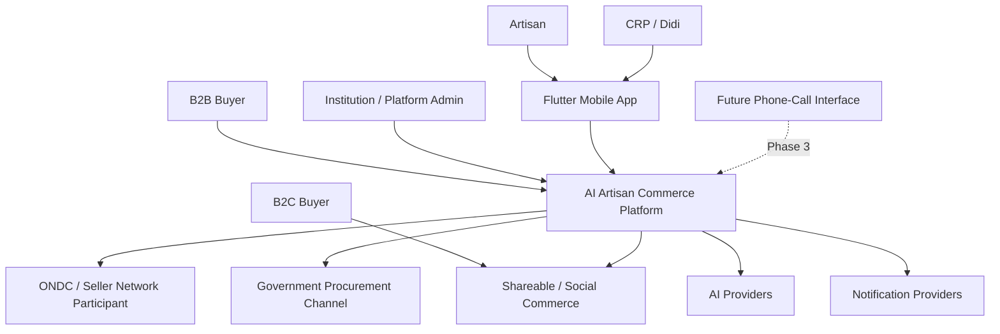

The phone-call interface is intentionally shown as a **future channel into the same platform**, not as a separate product.

---

# 5. High-Level Logical Architecture

```mermaid
flowchart TB
    subgraph Channels[Experience / Channel Layer]
        Mobile["Flutter Mobile App"]
        DidiUI["Didi / CRP Mode"]
        Phone["Phone Call Interface\nFuture"]
    end

    subgraph API[Application Layer]
        Gateway["API / Application Gateway"]
        Auth["Authentication + Authorization"]
    end

    subgraph Domain[Domain Services]
        Product["Product & Catalog"]
        Inventory["Inventory"]
        Orders["Orders & Fulfilment"]
        Payments["Payment State / Earnings"]
        Market["Market Access"]
        Assist["Assistance & Onboarding"]
        Verification["Verification & Readiness"]
    end

    subgraph AI[Intelligence Layer]
        Voice["Voice Orchestrator"]
        Vision["Image / Vision Pipeline"]
        CatalogAI["Catalog Generation"]
        Pricing["Price Advisor"]
        Matching["Demand Matching"]
        AIGateway["AI Gateway"]
    end

    subgraph Integrations[Integration Layer]
        ONDC["ONDC Adapter"]
        Gov["Government / GeM Adapter"]
        Social["Shareable Storefront / Social Adapter"]
        SMS["SMS / Notification Adapter"]
        MarketData["Market Data Providers"]
    end

    subgraph Data[Data + Storage]
        DB[("PostgreSQL")]
        Files[("Object Storage")]
        Local["Device Local DB / Sync Queue"]
        Queue["Async Job Queue"]
        Audit["Audit Logs"]
    end

    Mobile --> Gateway
    DidiUI --> Gateway
    Phone -. "Future" .-> Gateway

    Gateway --> Auth
    Gateway --> Product
    Gateway --> Inventory
    Gateway --> Orders
    Gateway --> Payments
    Gateway --> Market
    Gateway --> Assist
    Gateway --> Verification

    Product --> CatalogAI
    Product --> Vision
    CatalogAI --> Voice
    Pricing --> MarketData
    Matching --> MarketData

    Voice --> AIGateway
    Vision --> AIGateway
    CatalogAI --> AIGateway
    Pricing --> AIGateway
    Matching --> AIGateway

    Market --> ONDC
    Market --> Gov
    Market --> Social
    Orders --> SMS
    Market --> MarketData

    Product --> DB
    Inventory --> DB
    Orders --> DB
    Payments --> DB
    Assist --> DB
    Verification --> DB
    Product --> Files
    Orders --> Queue
    Vision --> Queue
    CatalogAI --> Queue
    Audit --> DB

    Mobile <--> Local
    Local <--> DB
```

---

# 6. Channel / Experience Architecture

## 6.1 Mobile App — MVP

The mobile app is the primary interface for the SIH MVP.

Responsibilities:

- Language selection
- Voice capture
- Camera capture
- Product draft creation
- AI result presentation
- Multimodal confirmation
- Product publishing
- Order status
- Earnings view
- Didi/CRP assisted mode
- Offline local state and synchronization

Flutter is the primary choice because it provides a single cross-platform codebase for Android and iOS and supports platform integration where native capabilities are required. Flutter's official documentation currently lists supported Android and iOS deployment targets and provides architectural guidance for maintainable Flutter applications. [1][2]

### Primary

- **Flutter / Dart**
- Feature-based application structure
- MVVM / presentation-domain-data separation
- Riverpod or equivalent dependency/state management
- GoRouter or equivalent navigation
- SQLite-based local persistence through Drift or equivalent

### Alternatives

- React Native / TypeScript
- Kotlin Multiplatform
- Fully native Android + iOS

### Selection rationale

Flutter offers a strong fit for a cross-platform mobile MVP, rapid UI iteration and a common codebase while still allowing platform-specific integration when required. [1][2]

## 6.2 Phone-Call Interface — Phase 3

The phone-call interface is **not part of the SIH MVP**.

When implemented, it should be another channel into the same backend/domain services:

```text
Phone call
   ↓
Telephony / Voice Gateway
   ↓
Voice Orchestrator
   ↓
Intent + Confirmation
   ↓
Core Domain Services
```

It must not create a second business logic stack.

## 6.3 Didi / CRP Mode

Didi mode is an elevated role within the same application ecosystem.

Capabilities include:

- artisan onboarding
- first-listing assistance
- correcting or escalating AI-generated information
- viewing assigned artisans
- tracking onboarding progress
- helping recover failed/sync-blocked work

---

# 7. Backend Architecture

## 7.1 Recommended Runtime Model

Use a **modular monolith + asynchronous worker architecture** for the initial implementation.

```text
                   API / FastAPI
                        |
        +---------------+----------------+
        |               |                |
   Product Domain   Order Domain    Market Domain
        |               |                |
        +---------------+----------------+
                        |
                    PostgreSQL
                        |
                Async Job Queue
                 /      |       \
          AI Worker  Image Worker  Notifications
```

### Why not microservices now?

A full microservice topology would add operational overhead that is not justified by the SIH MVP. The domain boundaries are still explicit, however, so future extraction remains possible.

## 7.2 Primary Backend Choice

### Application API

**FastAPI / Python**

Reasons:

- Strong fit for AI and data-processing workflows.
- Natural interoperability with Python vision/ML libraries.
- Type-safe API contracts through Pydantic.
- Easy separation of synchronous request handling and background workers.

### Alternatives

- Node.js / NestJS
- Go / Fiber or Gin
- Java / Spring Boot

### Primary rationale

The platform combines ordinary commerce operations with AI-heavy workloads. Python reduces friction around the AI integration layer while FastAPI provides a clear HTTP API boundary.

---

# 8. Data Architecture

## 8.1 Primary Database

### Recommended

**PostgreSQL**

Supabase is the preferred managed platform around PostgreSQL for the MVP/development environment because it combines a full Postgres database with Auth, Storage, Realtime and Edge Functions. [3][4]

### Alternatives

- Managed PostgreSQL on AWS / GCP / Azure
- Neon PostgreSQL
- Cloud SQL / Amazon RDS / Azure Database for PostgreSQL

### Principle

The logical data model must remain PostgreSQL-compatible even if the managed platform changes.

## 8.2 Core Entities

```text
User
Role
Organization
Cluster
ArtisanProfile
AssistanceSession
Verification
Product
ProductVariant
ProductMedia
CatalogEntry
Inventory
InventoryReservation
Customer
Order
OrderItem
Fulfillment
PaymentRecord
PriceRecommendation
MarketComparable
BuyerRequirement
Quotation
MarketReadiness
VoiceInteraction
AIJob
SyncQueueItem
AuditEvent
```

## 8.3 Core Relationships

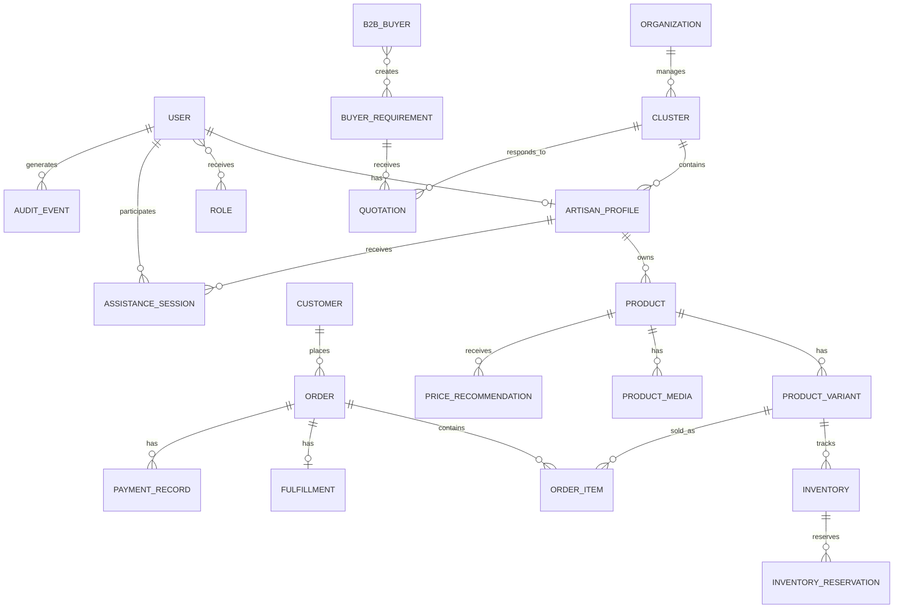

---

# 9. Authentication, Authorization & Roles

## 9.1 Roles

| Role              | Primary Permissions                                           |
| ----------------- | ------------------------------------------------------------- |
| Artisan           | Own products, inventory, orders, earnings                     |
| CRP / Didi        | Assigned artisans, onboarding assistance, limited edits       |
| B2C Buyer         | Browse products, place/manage own orders                      |
| B2B Buyer         | Create requirements, receive quotations, manage opportunities |
| Institution Admin | Manage clusters, deployment, reporting                        |
| Platform Admin    | Platform operations, support, configuration, audit            |

## 9.2 Authentication

### Preferred MVP

Supabase Auth or another managed identity provider with phone-compatible authentication.

Supabase Auth supports phone authentication and integrates authorization with Postgres Row Level Security (RLS). [4]

### Alternatives

- Firebase Authentication
- Auth0
- AWS Cognito
- Custom identity service only if a later regulatory or scale requirement demands it

## 9.3 Authorization

Use **RBAC + resource ownership + organization/cluster scope**.

Example:

```text
Artisan A
  → can read/write Product owned by Artisan A

Didi X
  → can assist Artisans assigned to Didi X

Institution Y
  → can see clusters belonging to Institution Y

Platform Admin
  → privileged operational access with audit logging
```

RLS should protect data at the database boundary where practical, while server-side domain authorization remains authoritative for privileged actions. Supabase documents RLS integration with Auth tokens and row-level authorization. [4][5]

---

# 10. AI Architecture

## 10.1 AI Gateway

All model/provider calls should pass through a logical AI Gateway.

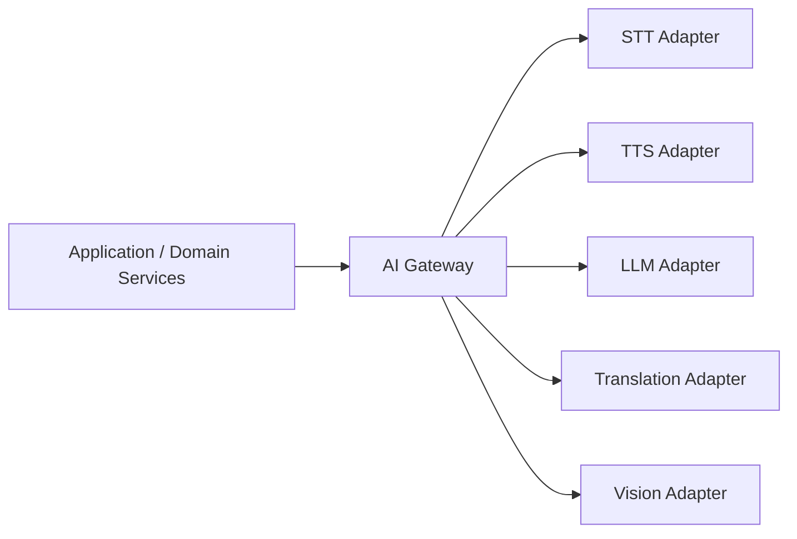

## 10.2 Provider Matrix

| Capability  | Primary Direction                             | Alternatives                                      | Selection Criteria                                |
| ----------- | --------------------------------------------- | ------------------------------------------------- | ------------------------------------------------- |
| STT         | Bhashini where language/service fit is strong | Whisper-family, Google Cloud Speech, Azure Speech | Indian language coverage, latency, cost, accuracy |
| Translation | Bhashini                                      | Azure, Google, open models                        | Indian language coverage, terminology fidelity    |
| LLM         | Structured-output capable managed LLM         | Anthropic, open-weight model on managed inference | structured extraction, latency, cost, reliability |
| Vision      | OpenCV + segmentation model / SAM-family      | cloud vision API, alternative segmentation models | product fidelity, speed, compute cost             |
| TTS         | Bhashini / Indian-language TTS provider       | Azure, Google, other Indian-language provider     | language coverage, naturalness, latency           |

**Important:** exact provider/model versions are an implementation decision and must be validated against current APIs, licensing, latency, pricing and language coverage before production use.

## 10.3 Voice Pipeline


### Rules

- AI extraction produces structured candidate data.
- Critical fields are validated before committing.
- Commands that mutate commerce state require authorization.
- Confirmation can be voice-only for low-risk actions and multimodal for consequential actions.

## 10.4 Image Pipeline

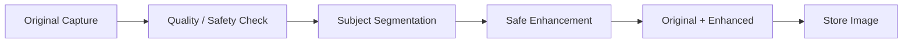

### Safe transformations

- crop
- background removal
- exposure correction
- white balance
- denoise
- perspective correction

### Not allowed as normal enhancement

- changing product structure
- inventing embroidery/details
- removing craftsmanship
- arbitrary color changes

Original media remains available for provenance/trust.

## 10.5 Catalog Pipeline

```text
Voice / Image
    ↓
STT + Vision
    ↓
Structured product attributes
    ↓
Validation
    ↓
Catalog generation
    ↓
Hindi + English / selected regional output
    ↓
Artisan confirmation
    ↓
Catalog entry
```

The LLM should not be allowed to invent unsupported certifications, materials, heritage claims or provenance.

## 10.6 Pricing Pipeline

```text
Material Cost
Labour Hours
Labour Benchmark / Artisan Rate
Packaging / Other Costs
        |
        +-------> Cost Floor
        |
Product Attributes
        |
Market Comparables -----> Comparable Market Band
        |
        +-------------------> Pricing Model
                                  |
                                  v
                     Suggested Price + Range + Confidence
```

Pricing remains an **advisor**, not an oracle.

If market data is unavailable or weak, the system must lower confidence rather than fabricate certainty.

## 10.7 Demand Matching

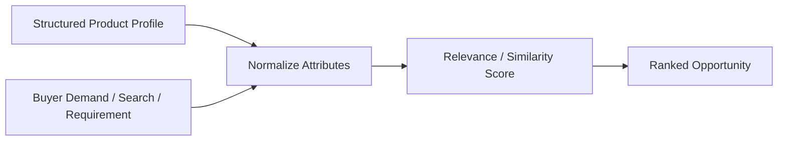

For the SIH MVP, matching can be implemented first with deterministic/weighted rules before evolving toward learned ranking.

---

# 11. Product & Commerce Domain Architecture

## 11.1 Product

A `Product` represents the sellable concept.

A `ProductVariant` represents a specific option such as:

- size
- color
- design
- unit or pack

This supports:

- one-of-one items
- batches
- made-to-order products
- configurable variants

## 11.2 Inventory

Inventory must support reservation to avoid double-selling.

```text
Available
   ↓ reserve
Reserved
   ↓ confirm
Committed
   ↓ fulfil
Consumed
```

A product published to more than one channel must still have one authoritative inventory state inside the platform.

## 11.3 Orders

Primary state machine:

```text
NEW
 ↓
CONFIRMED
 ↓
PREPARING
 ↓
SHIPPED
 ↓
DELIVERED
 ↓
COMPLETED
```

Exception transitions:

```text
NEW / CONFIRMED → CANCELLED
CONFIRMED / PREPARING / DELIVERED → RETURN_REQUESTED (where policy permits)
RETURN_REQUESTED → REFUNDED / REJECTED
```

The platform should represent commerce state cleanly even when the actual payment/settlement is performed by an external network/provider.

---

# 12. Market Access Architecture

## 12.1 Principle

The core platform owns the artisan's structured product/business state. External market networks are adapters/channels.

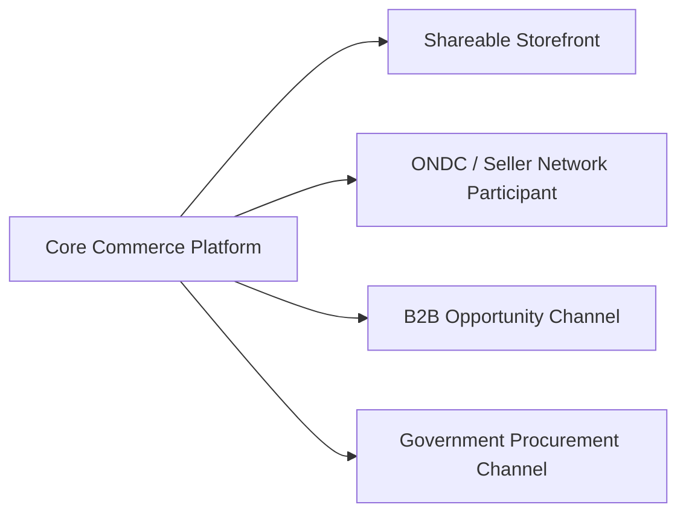

## 12.2 ONDC

The architecture should treat ONDC as a network integration boundary rather than a direct "marketplace API".

ONDC describes Seller Network Participants as responsible for connecting sellers through seller applications, digitizing catalogues, handling payment disbursement and seller enablement/training. [6]

### Our boundary

```text
Our Platform
   |
   +-- prepare/validate seller data
   +-- manage artisan-side product state
   +-- maintain inventory/domain state
   |
   v
Seller Network Participant / appropriate ONDC integration boundary
   |
   v
ONDC Network
```

For the SIH implementation, the integration may be demonstrated using a sandbox/testing boundary rather than claiming production network access.

## 12.3 Government Procurement

Government-market functionality should begin as **readiness and guided onboarding**.

The core platform should not assume that a product becomes government-procurement-ready solely because the artisan completed one identity step.

## 12.4 B2B

The MVP boundary is:

```text
Buyer Requirement
      ↓
Normalize
      ↓
Match to Artisan / Cluster Capacity
      ↓
Structured Quotation
```

Full cluster fulfilment coordination, quality control and payment distribution remain future operational layers.

---

# 13. Offline-First & Synchronization Architecture

## 13.1 Principle

**Offline product creation is supported; offline real-time commerce is not guaranteed.**

## 13.2 Local State

The mobile device stores:

- drafts
- captured photos
- voice recordings
- pending actions
- sync metadata
- cached non-sensitive reference data where appropriate

## 13.3 Synchronization

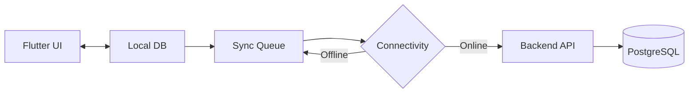

## 13.4 Sync Rules

Every mutation should carry:

- local operation ID
- entity ID
- client timestamp
- server version / revision where required
- idempotency key

The backend must reject unsafe stale or conflicting mutations rather than silently overwriting authoritative commerce state.

## 13.5 SMS

SMS is a **notification/fallback channel**, not the primary commerce synchronization protocol.

---

# 14. Async Processing Architecture

Long-running operations should not block the main API request path.

Examples:

- image processing
- catalog generation
- speech processing
- market-data refresh
- notification delivery
- analytics aggregation

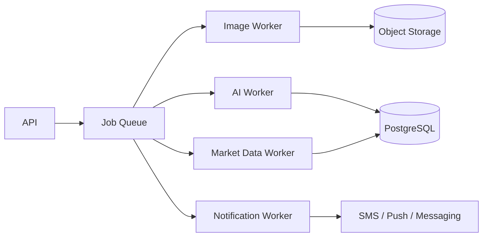

### MVP approach

One queue and a small number of worker processes are sufficient. The worker boundaries can later be independently scaled.

---

# 15. Storage Architecture

## 15.1 Relational Data

PostgreSQL stores:

- users
- roles
- product metadata
- inventory
- orders
- pricing recommendations
- market requirements
- verification data
- audit events

## 15.2 Object Storage

Object storage holds:

- original product images
- enhanced product images
- voice recordings where retention is required
- generated media
- evidence/verification files where appropriate

### Requirements

- signed URLs
- access-controlled buckets
- lifecycle/retention policies
- encryption
- metadata linking files to domain entities

### Preferred MVP option

Supabase Storage if Supabase remains the selected managed platform. Supabase documents Storage as integrated with Postgres and protected by access policies. [3][4]

Alternative:

- Amazon S3
- Google Cloud Storage
- Cloudflare R2

---

# 16. Security Architecture

## 16.1 Data Security

- TLS for data in transit
- encryption at rest through managed infrastructure
- secrets stored outside source code
- least-privilege service credentials
- signed media URLs

## 16.2 Authorization

Every mutation checks:

```text
Who is the caller?
      ↓
What role do they have?
      ↓
What organization / cluster do they belong to?
      ↓
Does the requested resource belong to their allowed scope?
      ↓
Is this action allowed in the current workflow state?
```

## 16.3 Audit Logging

Audit sensitive actions such as:

- price changes
- inventory changes
- verification changes
- order state changes
- role changes
- AI-generated field overrides
- administrator actions

## 16.4 AI Data Handling

The architecture must explicitly document for each provider:

- what data is transmitted
- whether data is retained
- whether data is used for provider training
- regional/data-residency implications
- deletion/retention behavior

These are provider-selection criteria, not assumptions.

---

# 17. Reliability & Failure Handling

The system must degrade gracefully when AI or network dependencies fail.

| Failure                          | Fallback                                                   |
| -------------------------------- | ---------------------------------------------------------- |
| STT failure                      | Retry → alternate provider → visual/manual field entry     |
| Translation failure              | Keep source language → retry → template/manual path        |
| LLM failure                      | Deterministic template generation where possible           |
| Vision failure                   | Preserve original image and allow manual publish           |
| Market data unavailable          | Cost-based advisory with low confidence                    |
| Network unavailable              | Save draft locally and queue                               |
| External marketplace unavailable | Keep internal listing state and retry outbound sync        |
| SMS failure                      | App notification / retry / Didi escalation where available |
| AI output invalid                | Reject output and request correction                       |

## 17.1 Critical Rule

AI failure should **reduce automation**, not destroy the user's underlying product/business data.

---

# 18. Observability

The platform should capture:

### Application metrics

- API latency
- error rate
- queue depth
- sync failures
- database latency

### AI metrics

- STT latency
- STT confidence where available
- LLM latency
- token/cost usage
- correction rate
- provider failure rate

### Product metrics

- time to first listing
- task completion rate
- Didi assistance rate
- first-sale time
- listing-to-order conversion

### Operational logs

- structured application logs
- correlation/request IDs
- audit logs
- job IDs

---

# 19. Deployment Architecture

## 19.1 Recommended MVP Deployment

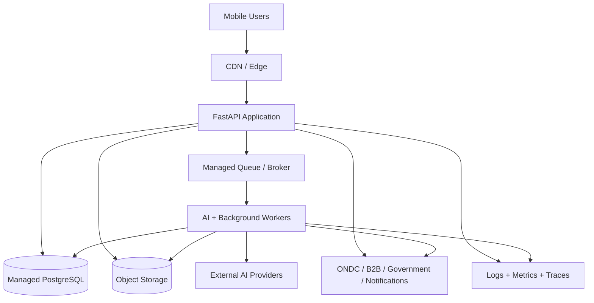

## 19.2 Primary Platform Direction

A practical MVP can use:

- Flutter for the client
- FastAPI for the application service
- PostgreSQL/Supabase for relational data/auth/storage integration
- Object storage for media
- a managed queue or task system for background processing
- a managed container/runtime such as Cloud Run, ECS/Fargate or equivalent
- external AI providers through the AI Gateway

The exact cloud vendor is intentionally not treated as a product requirement; portability is preferred.

---

# 20. Technology Stack — Primary & Alternatives

| Layer             | Primary Choice                                     | Alternatives                                        | Why Primary                                              |
| ----------------- | -------------------------------------------------- | --------------------------------------------------- | -------------------------------------------------------- |
| Mobile            | Flutter                                            | React Native, KMP, native                           | Cross-platform and fast iteration                        |
| Language          | Dart                                               | TypeScript/Kotlin/Swift                             | Native Flutter ecosystem                                 |
| App architecture  | Feature modules + MVVM-style separation            | BLoC-heavy architecture                             | Clear growth path                                        |
| State             | Riverpod                                           | Bloc, Provider                                      | Explicit dependency/state model                          |
| Local DB          | SQLite via Drift                                   | Isar, Hive                                          | Relational offline data and SQL compatibility            |
| Backend API       | FastAPI / Python                                   | NestJS, Go, Spring                                  | Strong AI/ML interoperability                            |
| DB                | PostgreSQL                                         | MySQL, managed document DB for specific subproblems | Relational commerce model                                |
| Managed backend   | Supabase                                           | Firebase, direct cloud services                     | Postgres + Auth + Storage + Realtime in one stack [3][4] |
| Object storage    | Supabase Storage                                   | S3, GCS, R2                                         | Simple MVP integration; portable object model            |
| Auth              | Supabase Auth                                      | Firebase Auth, Auth0, Cognito                       | Phone-capable auth + Postgres/RLS integration [4]        |
| AI gateway        | Internal adapter layer                             | Provider-specific SDKs                              | Prevents vendor lock-in                                  |
| STT               | Bhashini where suitable                            | Whisper-family, Google, Azure                       | Indian-language focus                                    |
| LLM               | Managed structured-output LLM                      | Anthropic, open-weight inference                    | Extraction + reasoning + controlled generation           |
| Translation       | Bhashini where suitable                            | Azure, Google, open models                          | Regional language coverage                               |
| Vision            | OpenCV + segmentation model                        | Cloud vision APIs                                   | Deterministic preprocessing + controllable pipeline      |
| TTS               | Indian-language provider / Bhashini where suitable | Azure, Google                                       | Regional language UX                                     |
| Queue             | Managed cloud queue / Pub/Sub / Cloud Tasks        | Redis + Celery, SQS                                 | Async processing without blocking API                    |
| Notifications     | FCM/APNs + SMS provider                            | OneSignal, provider alternatives                    | Native mobile delivery + fallback                        |
| Container runtime | Managed container platform                         | VM/Kubernetes/serverless containers                 | Low operational overhead for MVP                         |
| Observability     | OpenTelemetry-compatible stack                     | Cloud-native observability                          | Provider-neutral instrumentation                         |

---

# 21. Technology Selection Rules

The team should not select a technology because it is fashionable. Each decision should be checked against:

1. **Indian language support**
2. **Low-end Android performance**
3. **API stability**
4. **Latency**
5. **Cost at MVP scale**
6. **Data/privacy posture**
7. **Offline compatibility**
8. **Licensing**
9. **Vendor lock-in**
10. **Ease of replacement**

Exact versions and final provider contracts should be locked only after a focused implementation-phase validation.

---

# 22. MVP Technical Scope

## 22.1 Must Be Implemented

### Mobile

- Flutter application
- language selection
- voice capture
- camera capture
- product creation flow
- confirmation UI
- Sell / My Orders / My Money
- local draft storage

### AI

- in-app STT
- structured product extraction
- multilingual catalog generation
- safe image enhancement
- price advisory
- voice/visual response

### Commerce

- product + variant model
- inventory
- order state machine
- basic fulfilment state
- earnings/payment state display

### Market

- shareable storefront
- basic B2C product discovery path
- architecture boundary for future ONDC integration

### Assisted operations

- Didi/CRP role
- artisan assignment
- onboarding assistance

## 22.2 Sandbox / Demonstration Only

- ONDC boundary / sandbox
- government readiness assessment
- B2B requirement matching mock/sandbox where necessary

## 22.3 Explicitly Out of MVP

- production phone-call Zero-UI agent
- production ONDC network deployment unless externally enabled
- full GeM operational workflow
- full B2B fulfilment coordination
- heritage visual search
- advanced marketplace ranking infrastructure

---

# 23. Critical End-to-End MVP Flow

This is the primary implementation and demonstration path.

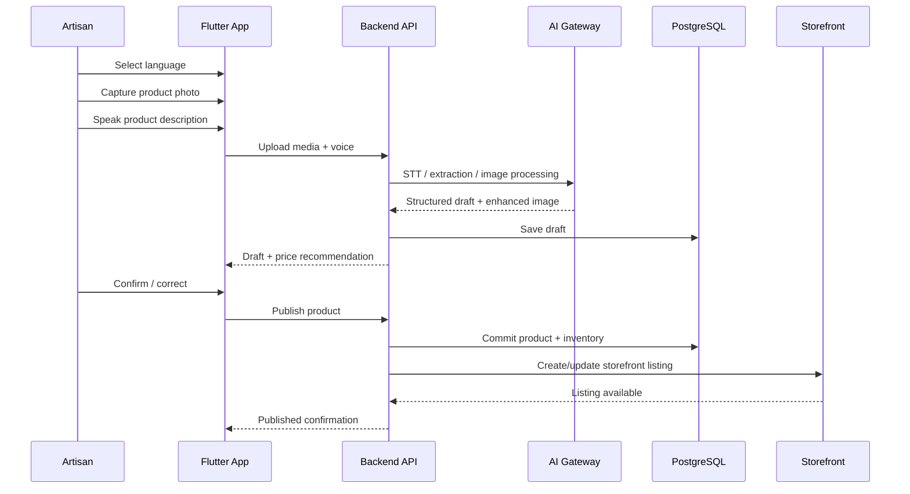

---

# 24. Future Phone-Call Architecture

The phone-call interface must reuse the same domain services.

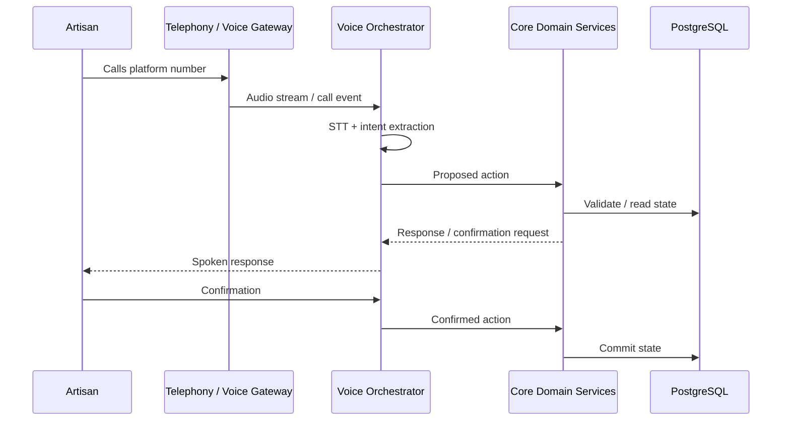

There is intentionally **no duplicate order/product business logic** in the phone layer.

---

# 25. Architecture Decision Records (Initial)

| ADR     | Decision                                    | Reason                                                          |
| ------- | ------------------------------------------- | --------------------------------------------------------------- |
| ADR-001 | Flutter mobile client                       | Cross-platform MVP                                              |
| ADR-002 | Modular monolith backend                    | Lower operational complexity while preserving domain boundaries |
| ADR-003 | PostgreSQL relational core                  | Commerce requires strong relationships and transactions         |
| ADR-004 | Local-first drafts                          | Target users may have intermittent connectivity                 |
| ADR-005 | AI Gateway                                  | Replaceable AI providers                                        |
| ADR-006 | AI proposes; deterministic services commit  | Prevent silent AI corruption                                    |
| ADR-007 | Phone interface reuses core domain services | Avoid duplicate business logic                                  |
| ADR-008 | External marketplaces treated as adapters   | Protect core product from ecosystem-specific coupling           |
| ADR-009 | Async workers for heavy AI/media jobs       | Prevent API blocking                                            |
| ADR-010 | Didi/CRP as first-class role                | Adoption requires assisted onboarding                           |

These ADRs are starting decisions. They should be revised rather than silently overridden during implementation.

---

# 26. Known Architecture Risks

| Risk                                     | Impact      | Mitigation                                                          |
| ---------------------------------------- | ----------- | ------------------------------------------------------------------- |
| Regional-language STT accuracy           | High        | provider abstraction + confidence + confirmation                    |
| AI hallucinated product claims           | High        | structured extraction + source attribution + confirmation           |
| Poor market-data quality                 | High        | confidence score + deterministic cost floor + pluggable data source |
| External marketplace integration changes | High        | adapters + readiness boundary                                       |
| Offline sync conflict                    | High        | idempotency + revisions + authoritative server state                |
| Low-end device performance               | Medium/High | lightweight client, deferred heavy processing                       |
| AI inference cost                        | Medium/High | provider routing, caching, asynchronous processing                  |
| Didi operational scalability             | Medium      | role-based workflows and onboarding metrics                         |
| Privacy of voice/media                   | High        | explicit retention policies and controlled provider access          |
| Overengineering MVP                      | High        | modular monolith + strict MVP boundary                              |

---

# 27. What Architecture Must Prove Before Implementation Is Locked

Before writing production code, the team should validate:

- selected STT language coverage for target languages
- speech accuracy in realistic noisy environments
- image enhancement quality on low-end captures
- price-advisor data availability and comparability
- exact ONDC integration boundary available to the team
- government-market integration assumptions
- offline local storage/sync behavior
- low-end Android performance
- AI provider latency and cost
- phone authentication and role/permission behavior
- provider privacy/retention terms

These validations should produce implementation decisions, not architectural assumptions hidden as facts.

---

# 28. Final Architecture Summary

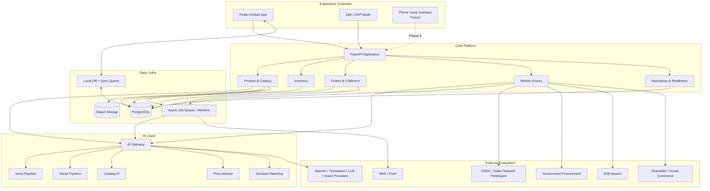

## Final architectural principle

> **One business manager, multiple interfaces, replaceable intelligence providers, deterministic commerce state.**

The artisan should experience one simple system. The architecture underneath it should be modular enough to support voice, visual interaction, assisted onboarding, offline operation and future market channels without rebuilding the business core.

---

# 29. Authoritative References

1. Flutter — Supported deployment platforms: https://docs.flutter.dev/reference/supported-platforms
2. Flutter — Architectural overview / app architecture: https://docs.flutter.dev/resources/architectural-overview and https://docs.flutter.dev/app-architecture
3. Supabase — Database overview: https://supabase.com/docs/guides/database/overview
4. Supabase — Documentation / Auth / Storage / Realtime: https://supabase.com/docs
5. Supabase — Securing Edge Functions / authorization: https://supabase.com/docs/guides/functions/auth
6. ONDC — Seller Network Participants: https://www.ondc.org/pages/seller-network-participants.html
7. ONDC — Ecosystem Participants: https://www.ondc.org/pages/ecosystem-participants.html
8. ONDC — Publications / operational guides: https://www.ondc.org/pages/resources-publications.html

> **Note:** External provider capabilities, current API versions, pricing, availability, participation requirements and production eligibility must be re-checked immediately before implementation. This architecture intentionally treats those as replaceable integration details rather than immutable assumptions.
