# ARCHITECTURE_26090.md

## PS 26090 — AI Business Manager for Marginalized Artisans

> **Purpose:** Define the technical architecture for the solution described in `SOLUTION_26090.md`.
>
> **Status:** Architecture baseline / v2 — **₹0 cash-cost SIH MVP**
>
> **Architecture principle:** Keep the artisan experience extremely simple while keeping the internal system modular, auditable, replaceable and scalable.

---

# 1. Architecture Goals

The architecture must support the product defined in the Solution document without exposing its internal complexity to the artisan.

The system must:

1. Provide a **voice-first, visually guided mobile experience** for low-digital-literacy artisans.
2. Convert natural artisan input into structured commerce data.
3. Keep **AI separate from the system of record**: AI may propose or interpret, while deterministic domain services own product, inventory, order and payment state.
4. Support image enhancement, multilingual cataloging and price advisory as first-class capabilities.
5. Support market-access channels without tightly coupling the core platform to one external marketplace.
6. Support offline-first product creation and reliable synchronization.
7. Support assisted onboarding through Didi/CRP users.
8. Allow future interfaces, especially the Phase-3 phone-call interface, to reuse the same business logic.
9. Allow AI providers to be replaced without rewriting business logic.
10. Scale from the SIH MVP toward larger institutional deployments without requiring a complete redesign.
11. Keep the **required MVP cash spend at ₹0** by prioritizing local/open-source software and free service tiers.
12. Avoid making paid APIs, paid telephony, paid SMS, paid GPU hosting or a commercial ONDC participant a mandatory MVP dependency.

---

# 2. ₹0 MVP Cost Policy

## 2.1 Hard Requirement

The SIH MVP is designed for **₹0 required cash expenditure**.

This means the complete demonstration and development path must be possible using:

- the team's existing development laptops/devices;
- open-source/local AI models;
- free software tooling;
- free cloud/service tiers where appropriate;
- GitHub/free CI tooling;
- Supabase Free for managed Postgres/Auth/Storage where appropriate;
- optional Cloudflare Free services;
- sandbox/reference integrations instead of paid production marketplace participation.

This does **not** claim that production deployment at scale is permanently free.

It means:

> **No component is allowed to become a mandatory paid dependency for the SIH MVP.**

Supabase currently provides a $0 Free plan with 500 MB database size, 1 GB file storage and 50,000 monthly active users; free projects may pause after one week of inactivity. urlSupabase pricinghttps://supabase.com/pricing

Cloudflare Workers Free currently provides 100,000 requests/day with 10 ms CPU time per invocation; CPU-heavy AI inference should therefore not be placed inside the Worker runtime. urlCloudflare Workers limitshttps://developers.cloudflare.com/workers/platform/limits/

## 2.2 What ₹0 Does Not Mean

The following are still real-world resources:

- developer time;
- existing laptops;
- electricity;
- Internet connectivity;
- physical test devices.

Production-scale usage can later introduce costs for:

- AI inference;
- cloud compute;
- storage and bandwidth;
- telephony;
- SMS;
- payment services;
- marketplace participation;
- logistics.

Those are **post-MVP deployment concerns**, not required MVP spend.

---

# 3. Architecture Principles

## 3.1 AI is not the system of record

LLMs, speech models and vision models interpret input, extract attributes, generate drafts and recommend actions.

They do **not** own authoritative state.

```text
Artisan says:
"Is saree ka daam 200 rupaye kam kar do"
        |
        v
Voice / Intent Layer
        |
        v
Action Proposal
        |
        v
Permission Check
        |
        v
Confirmation
        |
        v
Deterministic Domain Service
        |
        v
PostgreSQL
```

---

## 3.2 AI proposes; the artisan confirms

Critical user-visible data should be confirmed before publication or execution.

Examples:

- material;
- dimensions;
- price;
- stock;
- craft claims;
- origin;
- certifications;
- marketplace-facing claims.

Low-risk operations can use lightweight confirmation.

Consequential operations use multimodal confirmation.

---

## 3.3 Voice-first, not voice-only

Voice is the primary low-friction interaction method.

Visual confirmation remains available because:

- speech can be misunderstood;
- numbers are consequential;
- users can validate information more easily when they see it;
- low-literacy users may still rely strongly on visual cues.

---

## 3.4 Offline-first for safe operations

Offline operation supports:

- drafts;
- local media capture;
- voice recordings;
- queued actions;
- local editing.

Offline operation does **not** imply that live inventory or order state can be authoritative without synchronization.

> **Offline product creation ≠ offline real-time commerce.**

---

## 3.5 Core business logic is channel-independent

The following all use the same domain services:

```text
Mobile App
Didi / CRP Mode
Future Phone Agent
External Market Connectors
```

No second business-logic implementation is created for the phone interface.

---

## 3.6 Provider abstraction

AI, speech, translation and marketplace integrations use adapter interfaces.

Application code should depend on:

```text
SpeechProvider
LLMProvider
TranslationProvider
VisionProvider
TTSProvider
MarketConnector
NotificationProvider
```

not directly on one vendor SDK.

---

## 3.7 Modular monolith first

The SIH implementation starts as:

> **Modular monolith + asynchronous workers**

rather than a fleet of microservices.

The internal modules remain explicitly separated so future extraction is possible when scale actually requires it.

---

## 3.8 Security and authorization are architectural concerns

Identity, role boundaries, cluster ownership, auditability, media access and AI-provider data handling are designed from the beginning.

---

## 3.9 ₹0-first technology selection

The preferred implementation is:

```text
Local / Open Source
        ↓
Free Managed Service
        ↓
Free-Tier Cloud Provider
        ↓
Paid Provider
```

A paid provider may exist as an optional adapter, but the MVP cannot depend on it.

---

# 4. Product Architecture vs Technical Architecture

The Solution document defines the product as five layers:

```text
CREATE → PREPARE → SELL → OPERATE

                ↘

             ASSIST
        across all layers
```

These are **product capabilities**, not deployment boundaries.

The technical architecture is separate:

```text
Experience / Channel Layer
          ↓
Application / API Layer
          ↓
Domain Services
          ↓
AI & Intelligence Layer
          ↓
Integration Layer
          ↓
Data & Infrastructure Layer
```

This separation prevents a product concept such as `Market Access Engine` from being mistaken for a microservice or cloud resource.

---

# 5. System Context

## 5.1 Actors

| Actor | Role |
|---|---|
| Artisan | Primary seller and product owner |
| CRP / Didi | Assisted onboarding and support |
| B2C Buyer | Discovers and purchases products |
| B2B Buyer | Submits bulk requirements and receives quotations |
| Institution / Program Admin | Manages deployment, clusters and reporting |
| Platform Admin | Operations, support, configuration and auditing |
| External Commerce Network | ONDC / other market-access channels |
| Government Marketplace | Government procurement pathways |
| AI / Speech Providers | STT, TTS, translation, LLM and vision capabilities |
| Notification Providers | Push/SMS/other future communications |

## 5.2 System Context Diagram

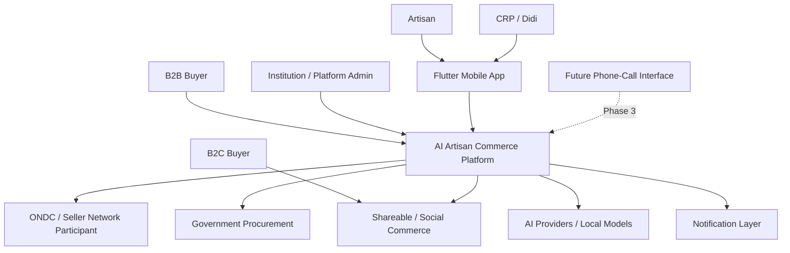

The phone-call interface is intentionally shown as a **future channel into the same platform**, not as a separate product.

---

# 6. High-Level Logical Architecture

```mermaid
flowchart TB
    subgraph Channels["Experience / Channel Layer"]
        Mobile["Flutter Mobile App"]
        DidiUI["Didi / CRP Mode"]
        Phone["Phone Call Interface - Future"]
    end

    subgraph API["Application Layer"]
        Gateway["API / Application Gateway"]
        Auth["Authentication + Authorization"]
    end

    subgraph Domain["Domain Services"]
        Product["Product & Catalog"]
        Inventory["Inventory"]
        Orders["Orders & Fulfilment"]
        Payments["Payment State / Earnings"]
        Market["Market Access"]
        Assist["Assistance & Onboarding"]
        Verification["Verification & Readiness"]
    end

    subgraph AI["Intelligence Layer"]
        Voice["Voice Orchestrator"]
        Vision["Image / Vision Pipeline"]
        CatalogAI["Catalog Generation"]
        Pricing["Price Advisor"]
        Matching["Demand Matching"]
        AIGateway["AI Gateway"]
    end

    subgraph Integrations["Integration Layer"]
        ONDC["ONDC Adapter"]
        Gov["Government / GeM Adapter"]
        Social["Shareable Storefront"]
        Notify["Notification Adapter"]
        MarketData["Market Data Provider"]
    end

    subgraph Data["Data + Storage"]
        DB[("PostgreSQL")]
        Files[("Object Storage")]
        Local["Device Local DB / Sync Queue"]
        Queue["Async Job Queue"]
        Audit["Audit Logs"]
    end

    Mobile --> Gateway
    DidiUI --> Gateway
    Phone -. "Future" .-> Gateway

    Gateway --> Auth
    Gateway --> Product
    Gateway --> Inventory
    Gateway --> Orders
    Gateway --> Payments
    Gateway --> Market
    Gateway --> Assist
    Gateway --> Verification

    Product --> CatalogAI
    Product --> Vision
    CatalogAI --> Voice

    Voice --> AIGateway
    Vision --> AIGateway
    CatalogAI --> AIGateway
    Pricing --> AIGateway
    Matching --> AIGateway

    Pricing --> MarketData
    Matching --> MarketData
    Market --> ONDC
    Market --> Gov
    Market --> Social
    Orders --> Notify

    Product --> DB
    Inventory --> DB
    Orders --> DB
    Payments --> DB
    Assist --> DB
    Verification --> DB
    Audit --> DB

    Product --> Files
    Vision --> Queue
    CatalogAI --> Queue
    Orders --> Queue

    Mobile <--> Local
    Local <--> DB
```

---

# 7. Channel / Experience Architecture

## 7.1 Mobile App — MVP

Responsibilities:

- language selection;
- voice capture;
- camera capture;
- product draft creation;
- AI result presentation;
- multimodal confirmation;
- product publishing;
- order status;
- earnings view;
- Didi/CRP assisted mode;
- offline local state;
- synchronization.

### Primary technology

**Flutter / Dart**

Alternatives:

- React Native / TypeScript;
- Kotlin Multiplatform;
- native Android + iOS.

Selection rationale:

Flutter provides a single Android/iOS codebase and is well suited to rapid UI iteration.

---

## 7.2 Phone-Call Interface — Phase 3

The phone-call interface is **not part of the SIH MVP**.

Future architecture:

```text
Phone Call
    ↓
Telephony / Voice Gateway
    ↓
Voice Orchestrator
    ↓
Intent + Confirmation
    ↓
Core Domain Services
    ↓
PostgreSQL
```

It must never create a second product/order business-logic stack.

---

## 7.3 Didi / CRP Mode

Didi mode is a role within the same application ecosystem.

Capabilities:

- artisan onboarding;
- first-listing assistance;
- correcting/escalating AI-generated information;
- viewing assigned artisans;
- tracking onboarding progress;
- helping recover failed/sync-blocked work.

---

# 8. Backend Architecture

## 8.1 Runtime Model

Use:

> **FastAPI + Python modular monolith + asynchronous workers**

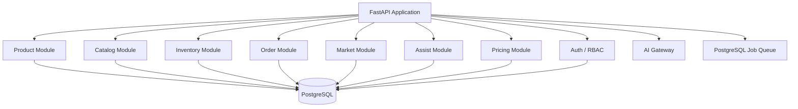

### Why not microservices?

A microservice architecture would add:

- multiple deployment units;
- service discovery;
- more observability;
- more networking;
- more CI/CD;
- more failure modes;

without providing meaningful benefit for the MVP.

The domain boundaries remain explicit so modules can later be extracted.

---

## 8.2 Backend Alternatives

| Primary | Alternatives | Reason |
|---|---|---|
| FastAPI/Python | NestJS, Go, Spring | Best fit for combined commerce + AI workloads |
| Modular monolith | Microservices | Lower operational complexity |
| PostgreSQL queue | Redis/Celery, RabbitMQ, Kafka | No additional service for MVP |

---

# 9. Data Architecture

## 9.1 PostgreSQL

### Recommended

**PostgreSQL through Supabase Free**

Supabase is the managed platform around PostgreSQL for the MVP/development environment.

Current Free-plan characteristics include:

- $0/month;
- 500 MB database size;
- 1 GB file storage;
- 50,000 monthly active users;
- two active free projects;
- projects may pause after inactivity. urlSupabase pricinghttps://supabase.com/pricing

The application remains PostgreSQL-compatible if Supabase is replaced later.

### Alternatives

- local/self-hosted PostgreSQL;
- Neon free tier;
- paid managed PostgreSQL after production scale.

---

## 9.2 Core Entities

```text
User
Role
Organization
Cluster
ArtisanProfile
AssistanceSession
Verification

Product
ProductVariant
ProductMedia
ProductionStory
CatalogEntry

Inventory
InventoryReservation
InventoryMovement

Customer
Order
OrderItem
Fulfillment
PaymentRecord

PriceRecommendation
MarketComparable
BuyerRequirement
Quotation
MarketReadiness

VoiceInteraction
AIJob
SyncQueueItem
AuditEvent
```

---

## 9.3 Core Relationships

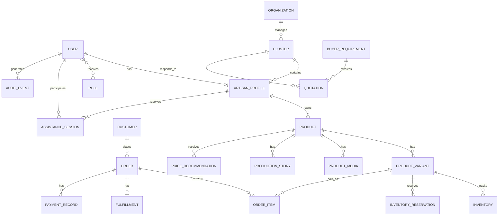

---

## 9.4 Product / Variant / Inventory Model

A `Product` represents the sellable concept.

A `ProductVariant` represents:

- size;
- colour;
- design;
- unit/pack;
- one-of-one identity.

This supports:

- one-of-one products;
- batches;
- made-to-order products;
- configurable variants.

Example relational schema:

```sql
CREATE TABLE products (
    id UUID PRIMARY KEY,
    artisan_id UUID NOT NULL,
    title TEXT NOT NULL,
    description TEXT,
    craft_type TEXT,
    material TEXT,
    status TEXT NOT NULL,
    version BIGINT NOT NULL DEFAULT 1,
    created_at TIMESTAMPTZ NOT NULL DEFAULT now(),
    updated_at TIMESTAMPTZ NOT NULL DEFAULT now()
);

CREATE TABLE product_variants (
    id UUID PRIMARY KEY,
    product_id UUID NOT NULL REFERENCES products(id),
    sku TEXT UNIQUE,
    size TEXT,
    color TEXT,
    design TEXT,
    unit_price NUMERIC(12,2),
    quantity_available INTEGER NOT NULL DEFAULT 0,
    is_available BOOLEAN NOT NULL DEFAULT true,
    version BIGINT NOT NULL DEFAULT 1
);

CREATE TABLE inventory_reservations (
    id UUID PRIMARY KEY,
    variant_id UUID NOT NULL REFERENCES product_variants(id),
    order_id UUID,
    quantity INTEGER NOT NULL,
    status TEXT NOT NULL,
    expires_at TIMESTAMPTZ
);
```

---

## 9.5 Production Stories

Production stories are separate from the product row.

```sql
CREATE TABLE production_stories (
    id UUID PRIMARY KEY,
    artisan_id UUID NOT NULL,
    product_id UUID NOT NULL REFERENCES products(id),
    language_code TEXT NOT NULL,
    text TEXT,
    audio_object_key TEXT,
    duration_seconds INTEGER,
    is_public BOOLEAN NOT NULL DEFAULT false,
    created_at TIMESTAMPTZ NOT NULL DEFAULT now()
);
```

Storage policy:

- text → PostgreSQL;
- voice recording → object storage;
- relationship → `product_id` + `artisan_id`.

Retention of original audio must be governed by privacy/retention rules.

---

# 10. Authentication, Authorization & Roles

## 10.1 Roles

| Role | Primary permissions |
|---|---|
| Artisan | Own products, inventory, orders, earnings |
| CRP / Didi | Assigned artisans, onboarding assistance, limited edits |
| B2C Buyer | Browse products, manage own orders |
| B2B Buyer | Create requirements, receive quotations |
| Institution Admin | Manage clusters, deployment, reporting |
| Platform Admin | Operations, support, configuration, audit |

---

## 10.2 ₹0 MVP Authentication

### Primary

**Phone number + PIN + device binding**

Flow:

```text
Invite / Sign-up
      ↓
Phone number
      ↓
Set PIN
      ↓
Device binding
      ↓
Authenticated session
```

Device biometrics may be used as a local unlock convenience where supported.

### Why not mandatory SMS OTP?

A fully operational SMS-OTP system introduces a messaging-provider dependency and recurring cost.

The ₹0 MVP therefore keeps identity usable without mandatory paid SMS.

### Production upgrade

Supabase Auth phone authentication, Firebase Auth or another OTP provider can be added later once a communications budget exists.

---

## 10.3 CRP / Didi Authorization

Use:

> **RBAC + resource ownership + organization/cluster scope + server-side authorization**

Example:

```text
Artisan A
    ↓
Can read/write products owned by Artisan A

Didi X
    ↓
Can assist only artisans assigned to Didi X

Institution Y
    ↓
Can see only clusters belonging to Institution Y

Platform Admin
    ↓
Privileged operational access + mandatory audit log
```

Sensitive actions require artisan confirmation.

RLS should protect data at the database boundary where practical.

---

# 11. AI Architecture

## 11.1 AI Gateway

All model/provider calls use one logical gateway.

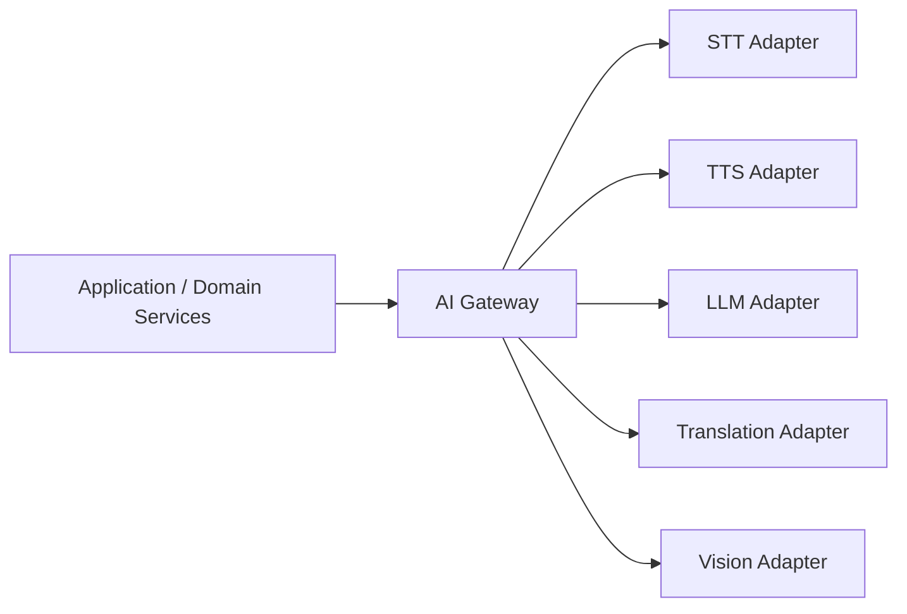

The application never directly embeds provider-specific business logic.

---

## 11.2 ₹0 Provider Matrix

| Capability | ₹0 MVP Primary | Optional / Free-Tier Alternative | Selection Criteria |
|---|---|---|---|
| STT | **AI4Bharat IndicConformer 600M locally** | faster-whisper / Whisper-family | Indian-language accuracy, local inference |
| Translation | **IndicTrans2/IndicTrans3 locally** | Bhashini/open endpoint where available | Indian-language coverage and fidelity |
| LLM | **Ollama + Qwen3 4B/8B locally** | Gemini free tier for limited fallback/testing | structured output, latency, hardware load |
| Vision | **OpenCV + lightweight local segmentation** | SAM/SAM2 local | fidelity and compute requirements |
| TTS | **Piper / compatible open Indian-language model** | optional Bhashini/free path | language coverage, latency |
| Embeddings | **sentence-transformers locally** | none required | semantic matching/retrieval |

### Provider philosophy

The architecture is:

```text
Local/Open Source
       ↓
Free-Tier Cloud
       ↓
Paid Provider
```

not the reverse.

### Bhashini

Bhashini remains strategically important for Indian-language interoperability, but **Bhashini.ai's current API is usage-priced**, so the paid API is not the zero-cost foundation of the MVP. urlBhashini.ai pricinghttps://www.bhashini.ai/pricing

The adapter remains available so Bhashini can be tested or adopted where it provides clear language-quality advantages.

---

## 11.3 Rate Limits, Outages & Provider Fallback

The AI Gateway handles:

- request timeout;
- retry with exponential backoff;
- concurrency limits;
- provider health state;
- circuit breaker;
- fallback provider;
- deterministic fallback;
- audit logging.

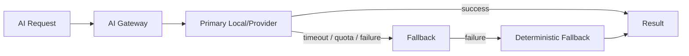

### Deterministic fallback examples

| Failure | Fallback |
|---|---|
| STT | retry → alternate local STT → repeat / manual correction |
| LLM | template-based catalog generation |
| Pricing | material + labour + packaging + configured margin |
| Vision | retain original image |
| Translation | keep source language |
| Market data | cost-based advisory with low confidence |

---

# 12. Voice Architecture

## 12.1 Voice Pipeline


Rules:

1. Speech produces candidate structured data.
2. Critical fields are validated before commit.
3. Mutating commands require authorization.
4. High-impact actions use multimodal confirmation.
5. Domain services, not the LLM, perform final state changes.

---

# 13. Image Architecture

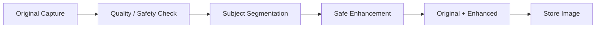

## 13.1 Allowed

- crop;
- resize;
- background removal;
- exposure correction;
- white balance;
- mild denoise;
- perspective correction.

## 13.2 Prohibited as normal enhancement

- changing product structure;
- inventing embroidery/details;
- removing craftsmanship;
- arbitrary pattern modification;
- material color manipulation that materially changes the product.

Original media remains available for provenance.

---

# 14. Catalog Architecture

```text
Voice / Image
     ↓
STT + Vision
     ↓
Structured Product Attributes
     ↓
Validation
     ↓
Catalog Generation
     ↓
Hindi + English / selected regional output
     ↓
Artisan Confirmation
     ↓
Catalog Entry
```

The LLM must not invent:

- certifications;
- materials;
- provenance;
- geographic claims;
- heritage claims;
- sustainability claims.

Where possible, generated fields should record their source:

```text
USER_PROVIDED
AI_EXTRACTED
AI_GENERATED
EXTERNALLY_VERIFIED
```

---

# 15. Pricing Architecture

```text
Material Cost
Labour Hours
Labour Benchmark / Artisan Rate
Packaging / Other Costs
        |
        +-------> Cost Floor

Product Attributes
        |
Market Comparables
        |
        +-------> Comparable Market Band
                    |
                    v
              Pricing Model
                    |
                    v
        Suggested Price + Range + Confidence
```

The Price Advisor is an **advisor**, not an oracle.

If market data is unavailable or weak:

> reduce confidence rather than fabricate precision.

## 15.1 Deterministic fallback

```text
Material cost
+ Labour hours × configured labour rate
+ Packaging
+ Configured margin
= Base recommendation
```

The artisan remains able to override the recommendation.

---

# 16. Demand Matching Architecture

The first implementation should be deterministic/weighted rather than a sophisticated learned marketplace model.

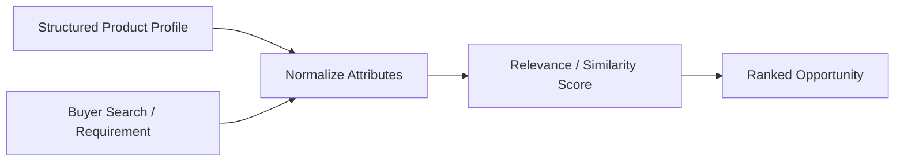

Possible matching attributes:

- craft type;
- material;
- category;
- region;
- price range;
- quantity;
- location;
- delivery deadline;
- availability.

---

# 17. Product & Commerce Domain

## 17.1 Inventory

Inventory must support reservation to avoid double-selling.

```text
AVAILABLE
   ↓ reserve
RESERVED
   ↓ confirm
COMMITTED
   ↓ fulfil
CONSUMED
```

There must be one authoritative inventory state inside our platform even when products appear through multiple external channels.

---

## 17.2 Orders

Primary state machine:

```text
NEW
 ↓
CONFIRMED
 ↓
PREPARING
 ↓
SHIPPED
 ↓
DELIVERED
 ↓
COMPLETED
```

Exception transitions:

```text
NEW / CONFIRMED → CANCELLED

CONFIRMED / PREPARING / DELIVERED
        ↓
RETURN_REQUESTED
        ↓
REFUNDED / REJECTED
```

The platform represents the order state even when payment settlement is performed externally.

---

# 18. Market Access Architecture

## 18.1 Principle

The core platform owns:

- artisan profile;
- product;
- inventory;
- order;
- readiness;
- business state.

External networks are **adapters/channels**.

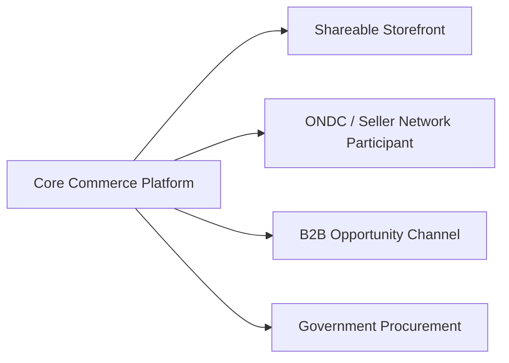

---

## 18.2 ONDC Boundary

ONDC describes Seller Network Participants as responsible for connecting sellers through seller applications, digitizing catalogues, dispersing payments and supporting seller enablement. urlONDC Seller Network Participantshttps://www.ondc.org/pages/seller-network-participants.html

### ₹0 MVP

Do **not** lock a commercial SNP.

Build:

```text
Our Platform
    ↓
Seller/ONDC Adapter
    ↓
Sandbox / reference integration where available
    ↓
ONDC Network
```

The production SNP is a **Phase-2 external-deployment decision**.

ONDC maintains a participant registry and published technical/operational resources that can later be used to select a compatible participant. urlONDC ecosystem participantshttps://www.ondc.org/pages/ecosystem-participants.html

---

## 18.3 Government Procurement / GeM Readiness

The system should not overwhelm the artisan with a long compliance form.

Instead:

```text
Market Readiness

✓ Product catalog
✓ Product media
✗ PAN
✗ Required certification
✓ Basic details

"Government selling ke liye 2 cheezein aur chahiye."
```

Each requirement should expose:

- what is missing;
- why it is needed;
- next step;
- whether Didi/CRP assistance is recommended.

The MVP implements **readiness guidance**, not full production GeM registration.

---

## 18.4 B2B Boundary

```text
Buyer Requirement
        ↓
Normalize
        ↓
Match to Artisan / Cluster Capacity
        ↓
Structured Quotation
```

MVP scope:

- opportunity matching;
- quotation workflow;
- quantity;
- price;
- delivery estimate;
- basic quality fields.

Future:

- cluster fulfilment;
- quality control;
- payment distribution;
- operational coordination.

---

# 19. Offline-First & Synchronization

## 19.1 Local State

The mobile device can store:

- drafts;
- captured photos;
- voice recordings;
- pending actions;
- sync metadata;
- selected non-sensitive reference data.

---

## 19.2 Synchronization

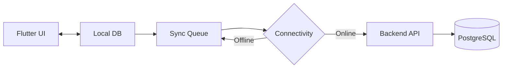

---

## 19.3 Conflict Resolution

Every mutation carries:

- local operation ID;
- entity ID;
- client timestamp;
- base/server revision;
- idempotency key;
- actor/device identity.

### Rule

**Do not use blind last-write-wins for commerce-critical state.**

If an artisan edits product version `12` offline while Didi has already changed the server to version `13`:

```text
Offline edit v12
     ↓
Server v13
     ↓
Conflict detected
     ↓
+---------------------------+
| Safe field? → auto-merge  |
| Critical field? → review  |
+---------------------------+
```

Critical fields:

- price;
- stock;
- material;
- availability;
- order state.

---

## 19.4 Sync Targets

| Operation | Target |
|---|---|
| Draft/media | sync when connectivity returns |
| Ordinary metadata | target ≤60 seconds after connectivity returns |
| Live inventory | authoritative only after server confirmation |
| Order state | real-time when online |
| Offline state | clearly shown as pending |

The application must never display:

> “Live / available”

for an offline change that has not reached the server.

---

## 19.5 SMS

SMS is **not** the synchronization protocol.

For the ₹0 MVP:

- no paid SMS dependency;
- use app notifications / local state;
- optional SMS adapter later.

---

# 20. Async Processing

Long-running work must not block API requests.

Examples:

- image processing;
- catalog generation;
- speech processing;
- market-data refresh;
- notifications;
- analytics.

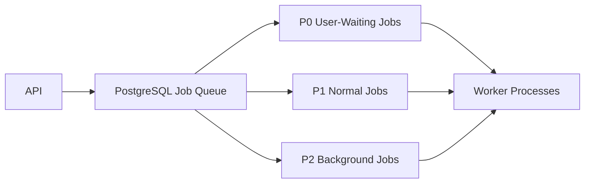

### Priority

**P0**

Current artisan operation.

**P1**

Normal catalog/inventory work.

**P2**

Bulk processing / analytics / data refresh.

### ₹0 choice

Use a **PostgreSQL-backed queue** first.

Do not introduce RabbitMQ, Kafka or Redis for the MVP unless a real workload proves they are necessary.

---

# 21. Storage Architecture

## 21.1 Relational Data

PostgreSQL stores:

- users;
- roles;
- product metadata;
- inventory;
- orders;
- pricing recommendations;
- market requirements;
- verification data;
- audit events.

## 21.2 Object Storage

Stores:

- original product images;
- enhanced product images;
- retained voice recordings;
- generated media;
- verification evidence where appropriate.

### Requirements

- access-controlled objects;
- signed URLs;
- encryption;
- retention/lifecycle policies;
- domain-entity references.

### ₹0 MVP

**Supabase Storage Free**

Alternative later:

- S3;
- Google Cloud Storage;
- Cloudflare R2.

---

# 22. Security Architecture

## 22.1 Data Security

- TLS in transit;
- encryption at rest through managed infrastructure;
- secrets outside source code;
- least-privilege credentials;
- signed media URLs;
- access-controlled object storage.

---

## 22.2 Authorization

Every mutation checks:

```text
Who is the caller?
       ↓
What role do they have?
       ↓
What organization / cluster do they belong to?
       ↓
Does the resource belong to the permitted scope?
       ↓
Is the action allowed in the current workflow state?
```

---

## 22.3 Audit Logging

Audit:

- price changes;
- inventory changes;
- verification changes;
- order-state changes;
- role changes;
- AI-generated field overrides;
- administrator actions;
- readiness changes;
- provider/model used for significant AI actions.

---

## 22.4 AI Data Handling

For every external provider, document:

- data transmitted;
- retention;
- training/data-use terms;
- regional/data-residency implications;
- deletion behavior.

Local inference is preferred where privacy and ₹0 constraints make it practical.

---

# 23. Reliability & Failure Handling

| Failure | Fallback |
|---|---|
| STT failure | retry → alternate local STT → repeat/manual correction |
| Translation failure | retain source language → retry → template/manual path |
| LLM failure | deterministic template |
| Vision failure | preserve original image |
| Market data unavailable | cost-based pricing with low confidence |
| Network unavailable | local draft + queue |
| Marketplace unavailable | keep internal state + retry |
| Push unavailable | app-visible status |
| AI output invalid | reject + request correction |
| Sync conflict | revision check + resolution |
| Auth service issue | retain local session state until safe expiry; require re-auth when needed |

### Critical rule

> **AI failure must reduce automation, not destroy business data.**

---

# 24. Observability

## 24.1 Application Metrics

- API latency;
- error rate;
- queue depth;
- sync failures;
- database latency.

## 24.2 AI Metrics

- STT latency;
- STT confidence where available;
- LLM latency;
- local inference time;
- provider failure rate;
- correction rate;
- fallback rate.

## 24.3 Product Metrics

- time to first listing;
- task completion rate;
- Didi assistance rate;
- first-sale time;
- listing-to-order conversion.

## 24.4 Operational Logs

- structured logs;
- correlation/request IDs;
- job IDs;
- audit events.

---

# 25. Deployment & DevOps

## 25.1 ₹0 MVP Deployment

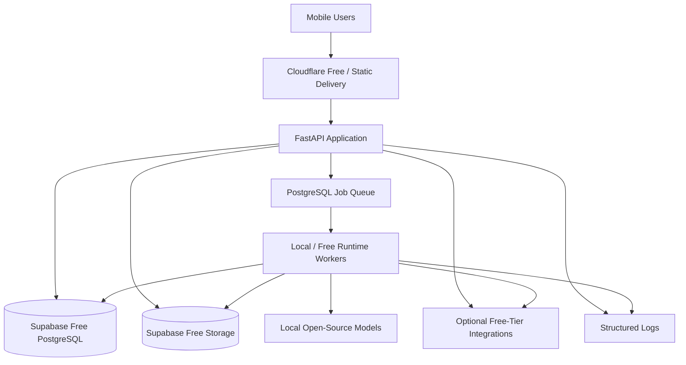

### Important runtime rule

Cloudflare Workers can act as edge/API infrastructure, but **large AI models should not run there** because the Free plan has limited CPU time per invocation. urlCloudflare Workers limitshttps://developers.cloudflare.com/workers/platform/limits/

Local model inference runs on the development workstation or an explicitly free runtime suitable for the test workload.

---

## 25.2 Environment Parity

Use:

```text
.env.example

development
staging
production
```

The same provider interfaces exist in every environment.

Only configuration changes:

```env
AI_STT_PROVIDER=indicconformer
AI_LLM_PROVIDER=ollama
AI_TRANSLATION_PROVIDER=indictrans
AI_TTS_PROVIDER=piper
AI_VISION_PROVIDER=opencv
```

Switching provider must not require application-code changes.

---

## 25.3 CI/CD

Preferred:

- GitHub;
- GitHub Actions;
- automated tests;
- linting;
- build checks;
- migrations;
- deployment only after checks pass.

No paid CI service is required for MVP.

---

# 26. Technology Stack — ₹0 MVP

| Layer | ₹0 MVP Primary | Alternatives | Why Primary |
|---|---|---|---|
| Mobile | Flutter | React Native, KMP, native | Cross-platform |
| Language | Dart | TypeScript/Kotlin | Flutter ecosystem |
| State | Riverpod | Bloc, Provider | Explicit dependency/state |
| Local DB | SQLite + Drift | Isar, Hive | Relational offline model |
| Backend | FastAPI/Python | NestJS, Go, Spring | AI/ML interoperability |
| DB | PostgreSQL | MySQL | Commerce relationships |
| Managed platform | Supabase Free | local Postgres, Neon | $0 Postgres/Auth/Storage platform |
| Object storage | Supabase Storage Free | local dev, R2, S3 | Lowest-friction MVP |
| Auth | Phone + PIN + device binding | Supabase Auth, Firebase Auth | Avoid mandatory paid OTP |
| AI gateway | Internal adapter layer | provider SDKs | Vendor independence |
| STT | IndicConformer local | faster-whisper | Indian-language/local-first |
| LLM | Ollama + Qwen3 4B/8B | Gemini free tier | No mandatory inference bill |
| Translation | IndicTrans2/3 local | Bhashini/open options | Regional language focus |
| Vision | OpenCV + local segmentation | SAM/SAM2 | No paid vision API |
| TTS | Piper/open Indian-language model | Bhashini/open option | Local-first |
| Embeddings | sentence-transformers | none | Local semantic matching |
| Queue | PostgreSQL-backed | Redis/Celery later | No extra infra |
| Edge | Cloudflare Free where useful | direct host | Free edge capability |
| CI/CD | GitHub Actions | GitLab CI | Free |
| Observability | structured logs + OpenTelemetry-compatible instrumentation | managed APM later | No mandatory SaaS spend |

---

# 27. Technology Selection Rules

Every technology must be evaluated against:

1. **₹0 MVP cost**
2. Indian language support
3. low-end Android performance
4. API stability
5. latency
6. privacy/data-use terms
7. offline compatibility
8. licensing
9. vendor lock-in
10. ease of replacement
11. implementation complexity
12. maintainability by the team.

A paid service can be added only after an explicit budget decision.

---

# 28. MVP Technical Scope

## 28.1 Must Be Implemented

### Mobile

- Flutter application;
- language selection;
- voice capture;
- camera capture;
- product creation flow;
- confirmation UI;
- Sell / My Orders / My Money;
- local draft storage;
- offline queue.

### AI

- in-app STT;
- structured product extraction;
- multilingual catalog generation;
- safe image enhancement;
- price advisory;
- voice/visual response.

### Commerce

- product + variant model;
- inventory;
- inventory reservation;
- order state machine;
- fulfilment state;
- earnings/payment state display.

### Market

- shareable storefront;
- basic B2C discovery path;
- ONDC adapter boundary.

### Assisted Operations

- Didi/CRP role;
- artisan assignment;
- onboarding assistance.

---

## 28.2 Sandbox / Demonstration Only

- ONDC boundary / sandbox;
- government readiness assessment;
- B2B matching demonstration;
- optional external free-tier AI fallback.

---

## 28.3 Explicitly Out of MVP

- production phone-call Zero-UI agent;
- paid telephony;
- paid SMS;
- mandatory commercial ONDC SNP;
- full production GeM workflow;
- full B2B fulfilment coordination;
- heritage visual search;
- advanced marketplace ranking infrastructure;
- production-scale managed AI inference.

---

# 29. Critical End-to-End MVP Flow

This is the primary implementation and demonstration path.

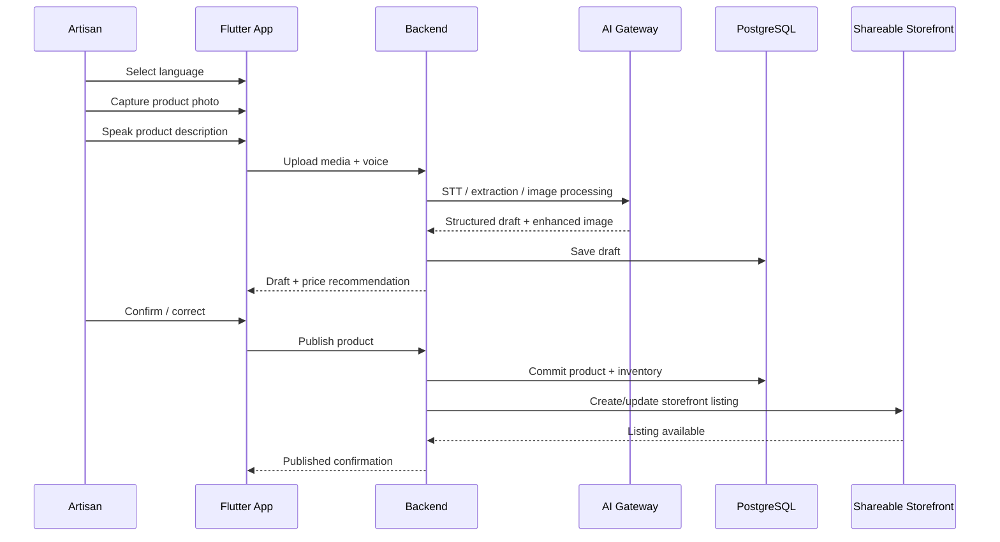

---

# 30. Future Phone-Call Architecture

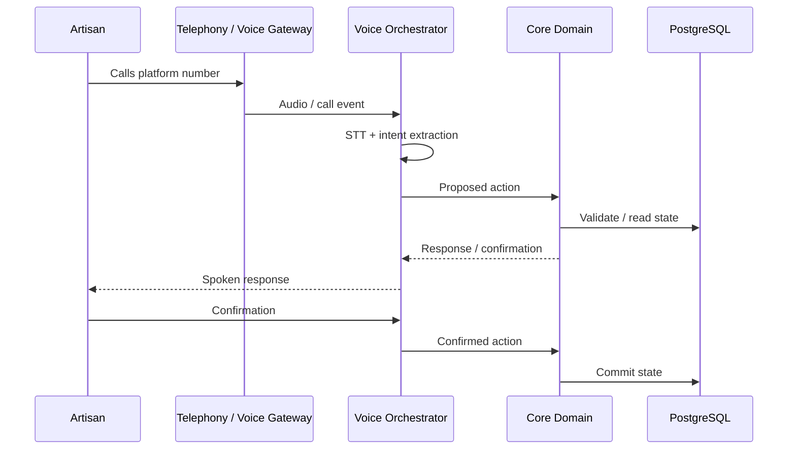

There is intentionally **no duplicate product/order business logic** in the phone layer.

---

# 31. Resolved Architecture Questions — v2

| ID | Decision |
|---|---|
| Q1 | Local/open-source AI is primary: IndicConformer STT, Ollama + Qwen3 LLM, IndicTrans translation, local/open TTS, OpenCV + local segmentation. Free-tier cloud models are optional fallbacks. |
| Q2 | AI Gateway provides retry, timeout, concurrency limits, circuit breaking, provider fallback and deterministic fallback. |
| Q3 | No commercial ONDC SNP is locked for the ₹0 MVP. Build the adapter boundary and use sandbox/reference integration where available; choose an SNP only for Phase 2 production work. |
| Q4 | GeM is represented as a plain-language readiness engine that reveals only missing requirements and routes complex cases to Didi/CRP. |
| Q5 | Offline conflicts use revisions + optimistic concurrency. Safe metadata may merge; commerce-critical fields require resolution. |
| Q6 | Target ≤60 seconds for ordinary changes after connectivity returns. Live inventory/order state is authoritative only after server confirmation. |
| Q7 | Product → ProductVariant → Inventory → Reservation → OrderItem is the core commerce model. |
| Q8 | Production stories are dedicated records linked to Product and Artisan; text is stored in Postgres, audio in object storage. |
| Q9 | ₹0 MVP authentication is phone + PIN + device binding. OTP is optional production enhancement. |
| Q10 | CRP/Didi uses RBAC + organization/cluster scope + server-side authorization + RLS where applicable. |
| Q11 | Initial prototype capacity target: 1,000 registered users, ~100 concurrent sessions and ~10 concurrent AI jobs. These are engineering targets, not PS facts. |
| Q12 | Queue priorities: P0 user-waiting, P1 normal, P2 background/bulk. |
| Q13 | PostgreSQL via Supabase Free is the primary managed MVP database platform. |
| Q14 | PostgreSQL-backed queue is used initially; no RabbitMQ/Kafka/Redis requirement. |
| Q15 | STT fallback: local alternate model → repeat → visual/manual correction. |
| Q16 | Critical failures surface in-app; push can supplement. Paid SMS is not a core dependency. |
| Q17 | Unified modular monolith + workers, not microservices. |
| Q18 | Provider configuration is environment-driven; dev/staging/prod use the same interfaces. |
| Q19 | Image processing allows safe enhancement only and preserves the original. |
| Q20 | Audit logs capture sensitive mutations and significant AI proposals/overrides with provider/model/action metadata where appropriate. |

---

# 32. Architecture Decision Records

| ADR | Decision | Reason |
|---|---|---|
| ADR-001 | Flutter mobile client | Cross-platform MVP |
| ADR-002 | Modular monolith backend | Lower operational complexity |
| ADR-003 | PostgreSQL relational core | Strong commerce relationships/transactions |
| ADR-004 | Supabase Free for managed MVP database platform | ₹0 Postgres/Auth/Storage baseline |
| ADR-005 | Local-first drafts | Intermittent connectivity |
| ADR-006 | AI Gateway | Replaceable intelligence providers |
| ADR-007 | AI proposes; deterministic services commit | Prevent silent AI corruption |
| ADR-008 | Provider/local-first AI | Maintain ₹0 MVP |
| ADR-009 | PostgreSQL-backed async queue | Avoid extra queue infrastructure |
| ADR-010 | External marketplaces treated as adapters | Reduce ecosystem-specific coupling |
| ADR-011 | Phone interface reuses core domain services | No duplicate business logic |
| ADR-012 | Didi/CRP as first-class role | Adoption requires assisted onboarding |
| ADR-013 | No commercial ONDC SNP in MVP | Preserve ₹0 scope |
| ADR-014 | Phone + PIN authentication for MVP | Avoid mandatory paid OTP |
| ADR-015 | Product/inventory revisions | Safe offline conflict handling |

These ADRs are starting decisions and should be revised explicitly rather than silently overridden.

---

# 33. Known Architecture Risks

| Risk | Impact | Mitigation |
|---|---|---|
| Regional-language STT accuracy | High | local model benchmark + fallback + confirmation |
| Local LLM latency on available laptops | High | benchmark 4B/8B models; allow optional free-tier fallback |
| AI hallucinated product claims | High | structured extraction + source attribution + confirmation |
| Poor market-data quality | High | confidence + deterministic cost floor |
| External marketplace changes | High | adapters + readiness boundary |
| Offline conflict | High | revisions + idempotency + authoritative server state |
| Low-end device performance | Medium/High | lightweight client + deferred processing |
| AI inference hardware limits | Medium/High | small local models + optional free tier |
| Didi operational scalability | Medium | role-based workflows + onboarding metrics |
| Voice/media privacy | High | retention controls + provider policy |
| Supabase inactivity pause on Free plan | Medium | active project use / local fallback |
| Cloudflare Free limits | Medium | keep heavy compute off Workers |
| Overengineering MVP | High | modular monolith + strict exclusions |
| Zero-cost assumption expires at scale | High | provider adapters + explicit Phase-2 budget decision |

---

# 34. What Architecture Must Prove Before Implementation Is Locked

The team must validate:

### AI

- target-language STT accuracy;
- speech accuracy in realistic noise;
- local STT latency;
- local LLM latency;
- structured-output reliability;
- TTS quality;
- image enhancement quality on low-end captures.

### Commerce

- product/variant/inventory consistency;
- atomic reservation behavior;
- order state transitions;
- offline conflict handling.

### Market

- exact ONDC integration boundary available to the team;
- sandbox/reference access;
- GeM readiness assumptions;
- market-data availability and comparability.

### Hardware / Offline

- low-end Android performance;
- local storage limits;
- synchronization behavior;
- camera/image-processing latency.

### ₹0 Constraint

- MVP works with no paid API calls;
- Supabase Free capacity is adequate for the prototype;
- Cloudflare Free is not being used for CPU-heavy model inference;
- no paid SMS/telephony dependency exists;
- local AI models run acceptably on available team hardware.

### Security

- authentication flow;
- RBAC;
- CRP/Didi isolation;
- provider privacy/retention terms;
- media access controls;
- audit events.

These validations should produce implementation decisions rather than remain hidden assumptions.

---

# 35. Final Architecture Summary

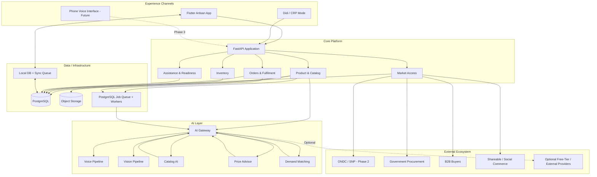

## Final Architectural Principle

> **One business manager, multiple interfaces, replaceable intelligence providers, deterministic commerce state, and no mandatory paid dependency for the SIH MVP.**

The artisan should experience one simple system.

The architecture underneath it should be modular enough to support:

- voice;
- visual interaction;
- assisted onboarding;
- offline operation;
- market channels;
- future phone access;

without rebuilding the commerce core.

---

# 36. Authoritative References

1. Flutter — Supported platforms:  
   https://docs.flutter.dev/reference/supported-platforms

2. Flutter — Architecture:  
   https://docs.flutter.dev/app-architecture

3. Supabase — Pricing / Free plan:  
   https://supabase.com/pricing

4. Supabase — Documentation:  
   https://supabase.com/docs

5. Supabase — Row Level Security / authorization:  
   https://supabase.com/docs/guides/database/postgres/row-level-security

6. Bhashini.ai — API pricing:  
   https://www.bhashini.ai/pricing

7. AI4Bharat IndicConformer:  
   https://huggingface.co/ai4bharat/indic-conformer-600m-multilingual

8. ONDC — Seller Network Participants:  
   https://www.ondc.org/pages/seller-network-participants.html

9. ONDC — Ecosystem Participants:  
   https://www.ondc.org/pages/ecosystem-participants.html

10. Cloudflare Workers — Limits:  
    https://developers.cloudflare.com/workers/platform/limits/

11. Cloudflare Workers — Pricing:  
    https://developers.cloudflare.com/workers/platform/pricing/

12. Ollama:  
    https://ollama.com/

13. Qwen:  
    https://huggingface.co/Qwen

> **External provider capabilities, current API versions, quotas, pricing, licensing, availability, participation requirements and production eligibility must be re-checked immediately before implementation. This architecture intentionally treats those as replaceable integration details rather than immutable assumptions.**
