# AUTH_26090.md

## Kala Setu — Authentication, Authorization & Identity Contract

> **Version:** v1 implementation baseline  
> **Scope:** Identity, authentication, sessions, devices, RBAC, resource scope, Didi/CRP assistance, buyer access, privileged operations, recovery, audit and database authorization.  
> **Primary clients:** Flutter Seller App, Buyer Web Application, future administrative surface.  
> **Backend:** FastAPI / Python modular monolith.  
> **Source of truth:** PostgreSQL identity and authorization records.

> **Core principle:** Authentication establishes **who is acting**; authorization establishes **what they may do, to which resources, in which scope, and under which session/context**.

---

# 0. Authentication Visual Atlas

## 0.1 Identity Architecture

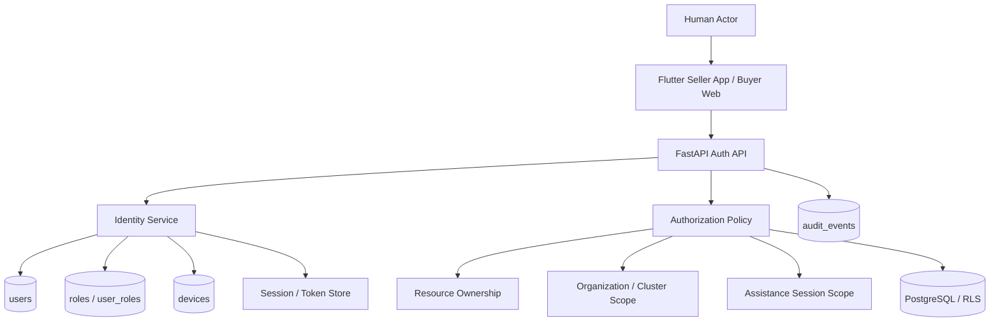

## 0.2 Authentication vs Authorization

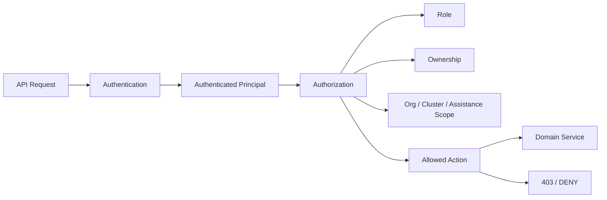

## 0.3 Seller Authentication Flow

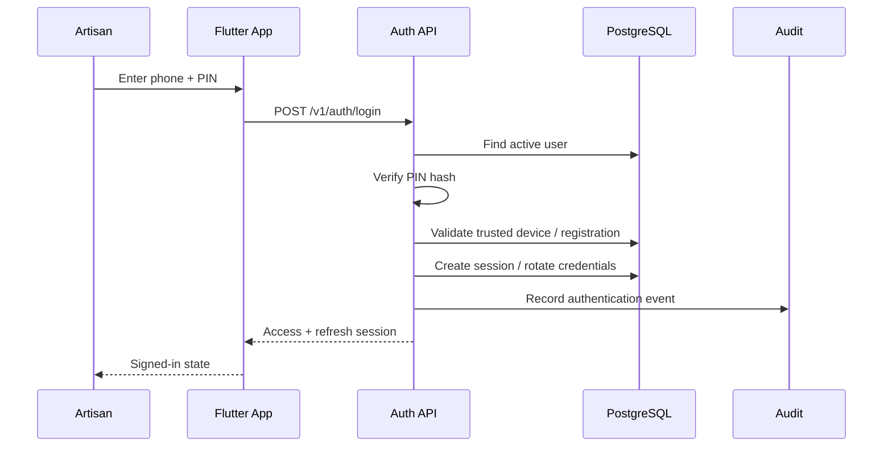

## 0.4 Buyer Web Authentication Flow

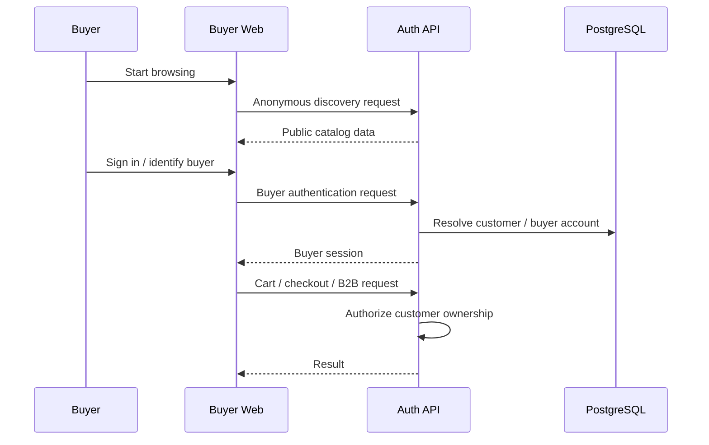

## 0.5 Didi / CRP Authorization Flow

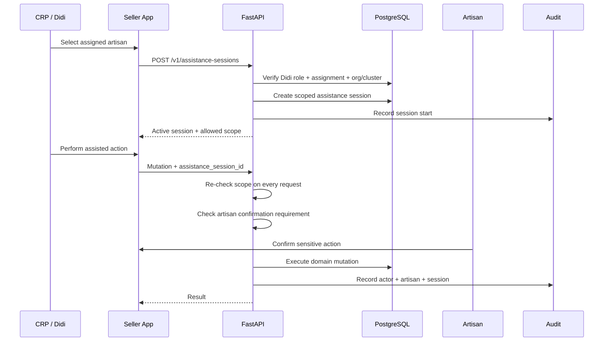

## 0.6 Authorization Decision

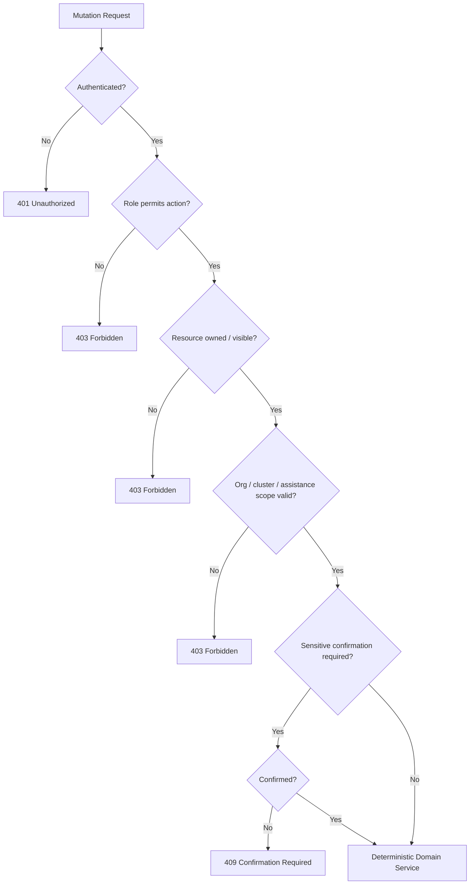

---

# 1. Authentication Scope

Authentication covers:

1. user identity creation and activation;
2. sign-in using phone number + PIN for the ₹0 MVP;
3. buyer identity/session management;
4. device registration and trust state;
5. access-token/session lifecycle;
6. refresh and logout/revocation;
7. device replacement and recovery;
8. local biometric unlock as an optional convenience layer;
9. authentication event audit;
10. future upgrade path to OTP/passwordless providers.

Authentication does **not** determine business ownership by itself. A valid login is necessary but insufficient for access to a particular artisan, organization, cluster, order or assistance session.

---

# 2. Identity Model

## 2.1 Principal Types

| Principal         | Identity Source              | Commerce Role       | Primary Surface |
| ----------------- | ---------------------------- | ------------------- | --------------- |
| Artisan           | `users` + `artisan_profiles` | Seller / owner      | Flutter         |
| CRP / Didi        | `users` + role + assignments | Assisted operator   | Flutter         |
| B2C Buyer         | buyer identity + `customers` | Consumer            | Buyer Web       |
| B2B Buyer         | buyer identity + `customers` | Institutional buyer | Buyer Web       |
| Institution Admin | `users` + organization scope | Deployment/admin    | Admin surface   |
| Platform Admin    | `users` + privileged role    | Platform operations | Admin surface   |

A customer may participate as **B2C, B2B, or BOTH** without creating duplicate commerce identities.

## 2.2 Identity Boundary

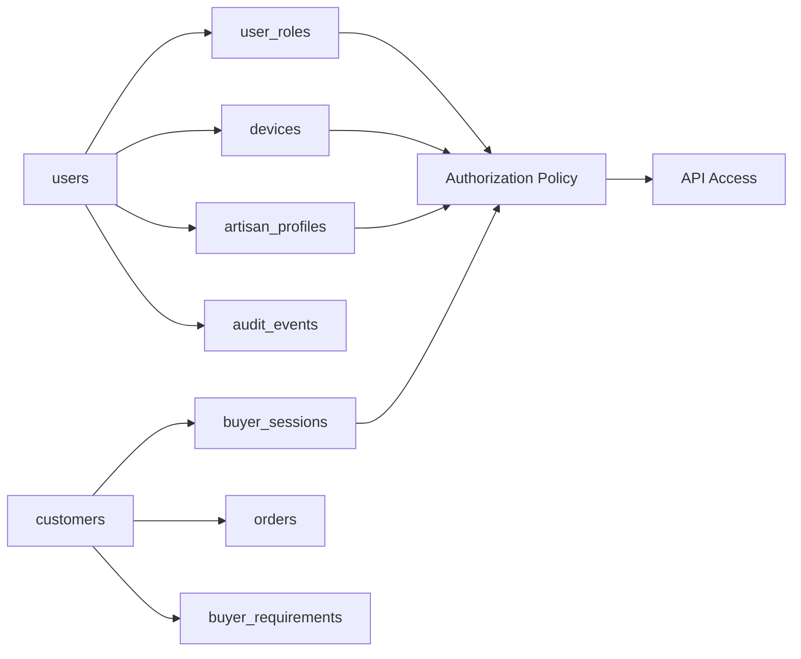

## 2.3 What Is Not Stored

The system must never store:

- raw PINs;
- plaintext access tokens after their intended token-storage location;
- unnecessary raw hardware identifiers;
- client-provided role claims as authoritative authorization data;
- biometric templates controlled by the platform.

---

# 3. Authentication Mechanism — ₹0 MVP

## 3.1 Primary Method

The MVP uses:

```text
Phone Number
     ↓
PIN Verification
     ↓
Trusted Device Check
     ↓
Session Issuance
```

Database representation:

- `users.phone_number` — unique identity handle;
- `users.pin_hash` — one-way PIN hash;
- `users.status` — account lifecycle;
- `devices` — trusted/revoked device records.

The database definition explicitly requires that the raw PIN is never stored. Device fingerprints are represented by non-reversible identifiers appropriate to the implementation.

## 3.2 Login Request Contract

```json
{
  "phone_number": "+91XXXXXXXXXX",
  "pin": "1234",
  "device": {
    "device_id": "client-generated-uuid",
    "platform": "android",
    "app_version": "1.0.0"
  }
}
```

The server must resolve the canonical user from the authenticated identity source and must not accept a caller-supplied `user_id` as proof of identity.

## 3.3 Login Success

```json
{
  "user": {
    "id": "uuid",
    "roles": ["ARTISAN"],
    "status": "ACTIVE"
  },
  "session": {
    "access_token": "opaque-or-signed-token",
    "refresh_token": "opaque-refresh-token",
    "expires_at": "timestamp"
  },
  "device": {
    "id": "uuid",
    "trusted": true
  }
}
```

Exact token format is an implementation choice, but clients must treat tokens as opaque and servers must remain the final authorization authority.

---

# 4. User Lifecycle

## 4.1 State Machine

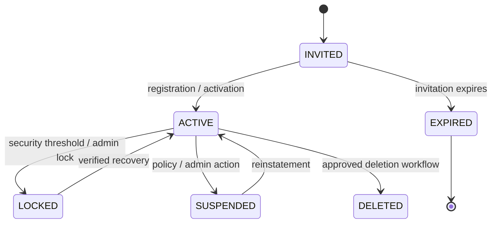

## 4.2 State Rules

| State       |   Login | Refresh | Business Mutations |     Recovery |
| ----------- | ------: | ------: | -----------------: | -----------: |
| `INVITED`   | Limited |      No |                 No |          Yes |
| `ACTIVE`    |     Yes |     Yes |                Yes |          Yes |
| `LOCKED`    |      No |      No |                 No |          Yes |
| `SUSPENDED` |      No |      No |                 No | Admin-driven |
| `DELETED`   |      No |      No |                 No |           No |

Account state is authoritative in PostgreSQL.

---

# 5. Device Binding & Trust

## 5.1 Purpose

Device binding reduces silent credential reuse on another device and supports a practical low-cost security model for the MVP.

It is **not** a cryptographic guarantee against account sharing and is not a substitute for server-side authorization.

## 5.2 Device Lifecycle

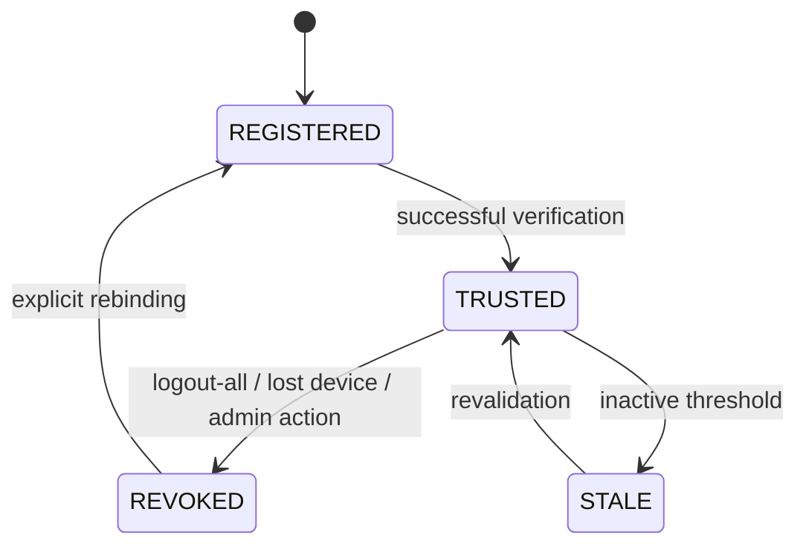

## 5.3 Required Device Data

`devices` contains, at minimum:

- `id`;
- `user_id`;
- `device_fingerprint_hash`;
- `platform`;
- `app_version`;
- `is_trusted`;
- `last_seen_at`;
- `revoked_at`.

## 5.4 Rebinding Rule

A lost/replaced device must not silently become trusted merely because the caller knows the phone number and old PIN. Rebinding requires a dedicated recovery procedure and must be audit logged.

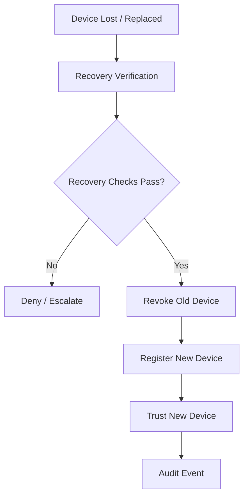

---

# 6. Session Model

## 6.1 Requirements

A session must be:

- tied to a principal;
- tied to a client/device where applicable;
- time-limited;
- revocable server-side;
- invalidated when account security state requires it;
- auditable for sensitive actions.

## 6.2 Session Lifecycle

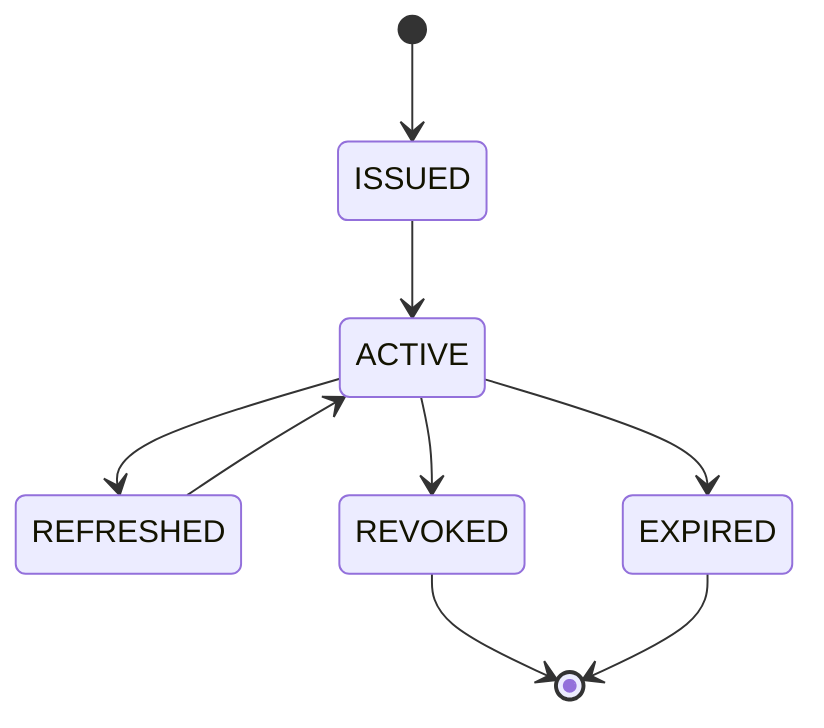

## 6.3 Logout

Logout should revoke the current refresh session and clear local credentials.

`logout-all` or equivalent security actions may revoke all active sessions and devices after appropriate verification.

---

# 7. Roles & RBAC

## 7.1 Canonical Roles

```text
ARTISAN
CRP_DIDI
B2C_BUYER
B2B_BUYER
INSTITUTION_ADMIN
PLATFORM_ADMIN
```

Roles are represented by `roles` + `user_roles`.

## 7.2 Role Matrix

| Capability                 |     Artisan |      CRP/Didi | B2C |      B2B | Institution Admin | Platform Admin |
| -------------------------- | ----------: | ------------: | --: | -------: | ----------------: | -------------: |
| Own profile                |           ✓ |             ✓ |   ✓ |        ✓ |                 ✓ |              ✓ |
| Create product             |           ✓ |        Scoped |   — |        — |                 — |   Support only |
| Edit product               |           ✓ |        Scoped |   — |        — |                 — |   Support only |
| View assigned artisans     |           — |             ✓ |   — |        — |            Scoped |              ✓ |
| Manage own cart            |           — |             — |   ✓ | Optional |                 — |   Support only |
| Checkout                   |           — |             — |   ✓ |        — |                 — |   Support only |
| Create B2B requirement     |           — |        Assist |   — |        ✓ |          Optional |              ✓ |
| Respond to quotation       | ✓ / cluster |        Scoped |   — |        — |            Scoped |              ✓ |
| View own orders            |           ✓ | Scoped assist |   ✓ |        ✓ |  Scoped reporting |              ✓ |
| View own earnings          |           ✓ |            No |   — |        — |         Reporting |              ✓ |
| Organization management    |           — |             — |   — |        — |                 ✓ |              ✓ |
| Global platform operations |           — |             — |   — |        — |                 — |              ✓ |

**Important:** Role membership never grants unrestricted resource access. Resource ownership and organization/cluster scope remain mandatory.

---

# 8. Authorization Model

Authorization uses four stacked controls:

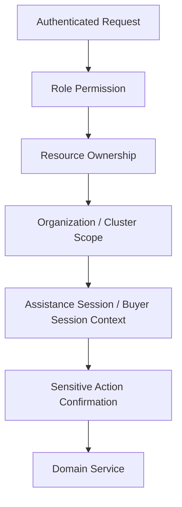

## 8.1 RBAC

Answers:

> “Is this class of user allowed to attempt this action?”

## 8.2 Ownership

Answers:

> “Does this resource belong to, or legitimately reference, this principal?”

Examples:

- artisan → own products;
- buyer → own cart;
- customer → own B2B requirement;
- user → own devices.

## 8.3 Organization / Cluster Scope

Answers:

> “Does this actor operate inside the organization and cluster they are allowed to access?”

This is especially important for CRP/Didi and institution administrators.

## 8.4 Assistance Session Scope

Answers:

> “Is this assisted action currently permitted through an active scoped Didi/CRP session?”

The server must check the active assistance session on **every privileged assisted mutation**. A stale client-side session indicator is never trusted.

---

# 9. Didi / CRP Authorization

## 9.1 Core Principle

The artisan remains the **business/data owner**.

The CRP/Didi is an **authorized assisted operator** with bounded access.

```text
Artisan Owner
      ↓
Active AssistanceSession
      ↓
Scoped CRP/Didi Principal
      ↓
Allowed Actions Only
      ↓
Audit + Confirmation
```

## 9.2 Assistance Session Record

The database stores:

- artisan ID;
- CRP/Didi user ID;
- organization ID;
- cluster ID;
- status;
- scoped permissions in `scope` JSONB;
- consent/confirmation status;
- start/end times.

## 9.3 Session Scope Example

```json
{
  "permissions": [
    "VIEW_PROFILE",
    "CREATE_PRODUCT_DRAFT",
    "EDIT_CATALOG_DRAFT",
    "REVIEW_AI_PROPOSAL"
  ],
  "expires_at": "timestamp"
}
```

The API must intersect requested action with server-side policy. Client-provided scope is evidence of intent, not authority.

## 9.4 Sensitive Didi Actions

The following should normally require explicit artisan confirmation:

- publishing a product;
- changing a consequential price;
- changing payout details;
- creating/cancelling an order on behalf of an artisan;
- resolving a critical inventory conflict;
- accepting a quotation where the artisan is the seller;
- changing sensitive identity/verification information.

---

# 10. Buyer Authentication & Buyer Sessions

## 10.1 Public vs Authenticated Buyer Data

Public B2C endpoints may expose approved catalog/discovery data without a buyer account.

Authenticated buyer state is required for operations such as:

- persistent cart ownership;
- checkout;
- order history;
- address management;
- B2B requirement submission;
- quotation review/acceptance where applicable.

## 10.2 Buyer Session

The database includes `buyer_sessions` associated with `customers`.

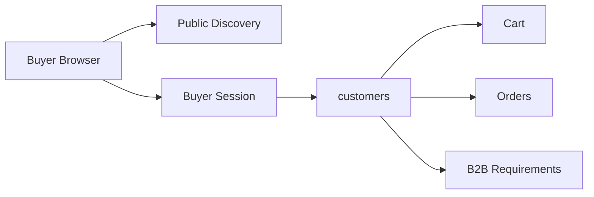

## 10.3 Customer Ownership Rule

The Buyer Web Application may request operations on a customer-owned object only when the authenticated buyer/session resolves to the owning `customer_id`.

A frontend-supplied `customer_id` is not sufficient authority.

---

# 11. Sensitive Actions & Step-Up Confirmation

Authentication proves identity. Certain operations additionally require **action confirmation**.

## 11.1 Step-Up Model

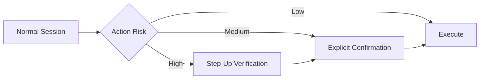

## 11.2 High-Impact Operations

Recommended step-up or explicit confirmation for:

- payout-account changes;
- device rebinding;
- account recovery;
- destructive deletion;
- critical inventory conflict resolution;
- high-impact price change;
- order cancellation/refund where it materially affects the seller;
- quotation acceptance/rejection on behalf of an artisan;
- privileged platform administration.

## 11.3 API Representation

The API may respond with:

```json
{
  "code": "CONFIRMATION_REQUIRED",
  "action_id": "uuid",
  "confirmation_methods": ["VOICE", "VISUAL", "PIN"]
}
```

The confirmation must be bound to the exact proposed action/context and must not become a reusable generic “yes” token.

---

# 12. Recovery & Account Security

## 12.1 Recovery Goals

Recovery must support:

- forgotten PIN;
- lost device;
- replaced phone/device;
- locked account;
- compromised session.

## 12.2 Recovery Flow

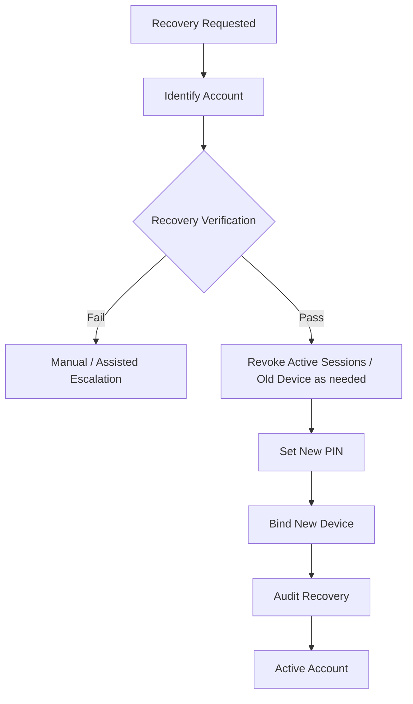

The MVP may use controlled assisted recovery where no paid OTP provider exists, but recovery must not allow a CRP/Didi to silently take ownership of an artisan account.

## 12.3 Brute-Force Protection

The server should enforce:

- login attempt throttling;
- progressive lockout/backoff;
- per-account and per-device controls;
- audit events for repeated failures;
- session revocation after confirmed compromise.

Exact thresholds are deployment configuration, not identity semantics.

---

# 13. Local Biometrics

Biometric authentication is **optional** and device-local.

```text
Platform Identity
      ↓
PIN / Session
      ↓
Local Biometric Unlock (optional)
      ↓
Sensitive Screen / Action
```

The platform should not receive or store biometric templates.

Biometrics should be treated as a local convenience layer, not the primary identity authority.

---

# 14. Token & Session Security

## 14.1 Requirements

- HTTPS/TLS in production;
- secure token storage in mobile platform secure storage;
- no tokens in ordinary logs;
- short-lived access credentials;
- refresh/revocation mechanism;
- server-side session invalidation;
- rotation where supported by the chosen token design;
- strict origin/CORS policy for Buyer Web;
- secure cookie handling if cookie-based buyer sessions are used.

## 14.2 Browser Session Rule

For Buyer Web, prefer an HTTP-only, secure, same-site session mechanism where practical rather than exposing long-lived authentication secrets to browser JavaScript.

## 14.3 Mobile Storage Rule

Flutter should store authentication material only in platform-provided secure storage mechanisms. The local SQLite/Drift database must not be treated as a secure token vault.

---

# 15. API Error Semantics

Authentication and authorization errors must be stable and machine-readable.

| HTTP | Code                         | Meaning                                  |
| ---: | ---------------------------- | ---------------------------------------- |
|  400 | `VALIDATION_ERROR`           | Malformed request                        |
|  401 | `AUTHENTICATION_REQUIRED`    | Missing/invalid authentication           |
|  401 | `SESSION_EXPIRED`            | Session no longer valid                  |
|  403 | `FORBIDDEN`                  | Authenticated but not permitted          |
|  403 | `RESOURCE_SCOPE_FORBIDDEN`   | Outside owner/org/cluster scope          |
|  403 | `ASSISTANCE_SCOPE_FORBIDDEN` | Invalid Didi/CRP scope                   |
|  409 | `CONFIRMATION_REQUIRED`      | Sensitive action requires confirmation   |
|  409 | `DEVICE_REBIND_REQUIRED`     | Existing device trust prevents operation |
|  429 | `AUTH_RATE_LIMITED`          | Authentication attempts throttled        |

Do not reveal whether a phone number exists during unauthenticated recovery/login errors where that would enable account enumeration.

---

# 16. Audit Requirements

Every security-significant authentication/authorization event must be auditable.

## 16.1 Events

At minimum:

```text
LOGIN_SUCCESS
LOGIN_FAILURE
LOGOUT
SESSION_REFRESH
SESSION_REVOKED
DEVICE_REGISTERED
DEVICE_REVOKED
DEVICE_REBOUND
ACCOUNT_LOCKED
ACCOUNT_UNLOCKED
PIN_CHANGED
RECOVERY_STARTED
RECOVERY_COMPLETED
ROLE_GRANTED
ROLE_REVOKED
ASSISTANCE_SESSION_STARTED
ASSISTANCE_SESSION_ENDED
SENSITIVE_ACTION_CONFIRMED
SENSITIVE_ACTION_DENIED
ADMIN_ACCESS
```

## 16.2 Audit Model

`audit_events` supports:

- `actor_user_id`;
- `device_id`;
- `assistance_session_id`;
- action;
- entity type/id;
- source channel;
- previous/resulting version;
- metadata;
- timestamp.

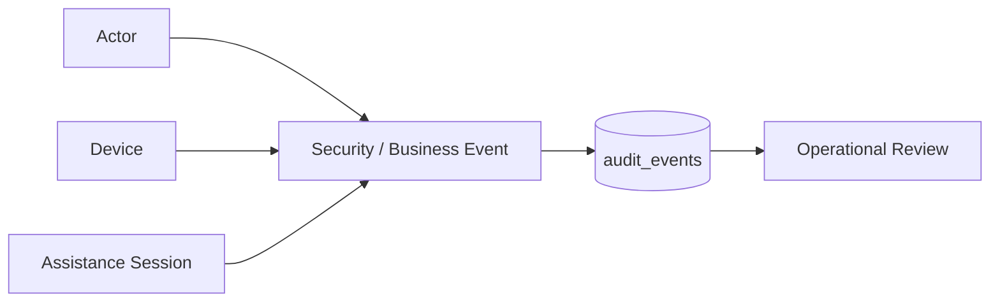

Audit records are append-only from the application perspective.

---

# 17. Database Authorization & RLS

RLS reinforces application authorization; it does not replace domain checks.

## 17.1 Defense in Depth

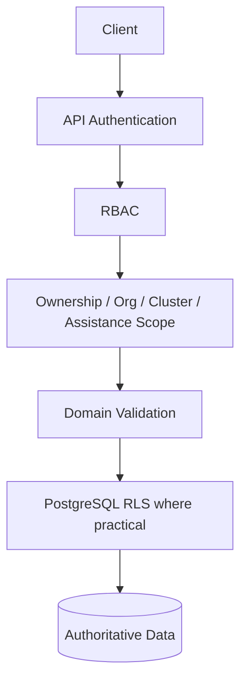

## 17.2 Artisan RLS Intent

```text
ARTISAN
  → own artisan profile
  → own products
  → own catalog
  → own inventory
  → own stories
  → own relevant orders / earnings
```

## 17.3 CRP/Didi RLS Intent

CRP/Didi access should be constrained to assigned/authorized artisan resources and must still be validated by the application-level active assistance session.

## 17.4 Institution Admin

Institution Admin is constrained to its organization and child clusters.

## 17.5 Platform Admin

Platform Admin is privileged and therefore requires strong auditing, explicit role assignment and operational monitoring.

---

# 18. Privilege Separation

The following responsibilities must not collapse into one unchecked role:

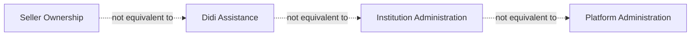

Examples:

- a Didi cannot automatically become platform admin;
- an institution admin cannot automatically edit every artisan's payout details;
- a buyer cannot access seller operations;
- a seller cannot access another seller's inventory merely by guessing an ID.

---

# 19. Authorization Matrix by Resource

| Resource           | Artisan         | Didi                     | B2C Buyer               | B2B Buyer             | Institution Admin        | Platform Admin     |
| ------------------ | --------------- | ------------------------ | ----------------------- | --------------------- | ------------------------ | ------------------ |
| User profile       | own             | assigned support context | own                     | own                   | scoped                   | global             |
| Device             | own             | own                      | own                     | own                   | scoped ops               | global ops         |
| Product            | own             | assigned + scoped        | public/read             | read where matched    | scoped read              | privileged support |
| Inventory          | own             | scoped assist            | availability/read       | availability/capacity | scoped read              | privileged         |
| Cart               | —               | assist only              | own                     | optional/future       | —                        | support            |
| Order              | seller-side own | assigned assist          | own buyer orders        | own B2B orders        | scoped reporting         | global             |
| Earnings           | own             | no direct ownership      | —                       | —                     | scoped reporting         | global reporting   |
| Requirement        | —               | assist                   | —                       | own                   | scoped                   | global             |
| Match              | —               | assigned support         | discovery               | own submissions       | scoped                   | global             |
| Quotation          | own response    | assist with confirmation | review where applicable | own review            | scoped                   | global             |
| Assistance Session | participate     | operate within scope     | —                       | —                     | manage assignment        | global             |
| Audit              | own visible     | session/assigned         | own security            | own security          | org scope                | global             |
| Data Export        | own             | own                      | own                     | own                   | scoped subject to policy | operational        |
| Data Deletion      | own             | own                      | own                     | own                   | scoped                   | operational        |

---

# 20. Authorization Context Object

Every authenticated request should resolve an internal authorization context approximately equivalent to:

```json
{
  "principal_id": "uuid",
  "principal_type": "USER",
  "roles": ["CRP_DIDI"],
  "device_id": "uuid",
  "organization_ids": ["uuid"],
  "cluster_ids": ["uuid"],
  "assistance_session_id": "uuid",
  "customer_id": null,
  "auth_strength": "SESSION",
  "session_id": "uuid"
}
```

This object is internal authorization state; it must not be blindly accepted from the client.

---

# 21. Endpoint Families

Authentication endpoints should remain isolated from domain mutation endpoints.

```text
/v1/auth
  /login
  /refresh
  /logout
  /logout-all
  /recovery/start
  /recovery/verify
  /recovery/complete
  /pin/change
  /devices
  /devices/{device_id}/revoke

/v1/me
  /profile
  /sessions
  /devices

/v1/assistance-sessions
  /start
  /{id}
  /{id}/actions
  /{id}/end
  /{id}/confirm
```

Exact endpoint schemas belong in `API_26090.md`; this document defines their identity and authorization semantics.

---

# 22. Relationship to API Contract

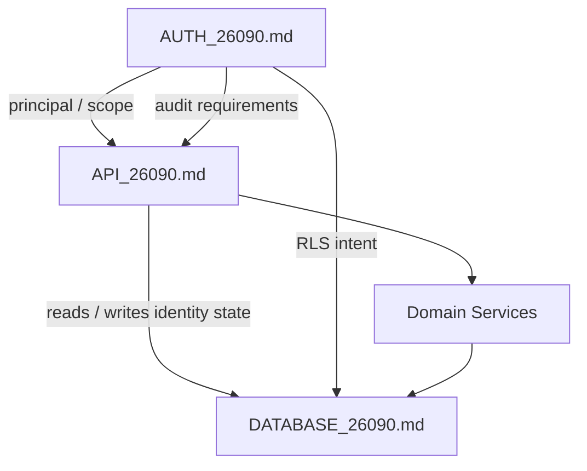

### Division of responsibility

| Concern                  | AUTH |                                      API |                DATABASE |
| ------------------------ | ---: | ---------------------------------------: | ----------------------: |
| Identity semantics       |    ✓ |                                        — |       supporting schema |
| Token/session behavior   |    ✓ |                        endpoint exposure |         supporting data |
| Role model               |    ✓ |                                  enforce |   `roles`, `user_roles` |
| Ownership rules          |    ✓ |                                  enforce |            FK structure |
| Assistance authorization |    ✓ |                                  enforce |   `assistance_sessions` |
| RLS policy intent        |    ✓ | bypass only through trusted backend path | enforce where practical |
| Audit requirements       |    ✓ |                                     emit |          `audit_events` |
| Commerce transactions    |    — |                          domain boundary |     authoritative state |

---

# 23. Security Threat Model

## 23.1 Threats

| Threat                       | Primary Control                                         |
| ---------------------------- | ------------------------------------------------------- |
| Stolen PIN                   | Rate limiting, device binding, recovery/revocation      |
| Token theft                  | Secure storage, short lifetime, revocation              |
| Device theft                 | Device revocation + session invalidation                |
| Account enumeration          | Generic unauthenticated errors                          |
| IDOR / guessed IDs           | Ownership + scope checks + RLS                          |
| Privilege escalation         | Server-side RBAC + role administration controls         |
| Didi overreach               | Assistance session scope + artisan confirmation         |
| Replay of sensitive action   | Action-bound confirmation + idempotency                 |
| Client role tampering        | Never trust client role flags                           |
| Audit tampering              | Append-only application behavior + restricted DB access |
| Cross-organization access    | Organization/cluster scope checks                       |
| Buyer access to seller state | Resource ownership/domain policy                        |

## 23.2 Security Boundary

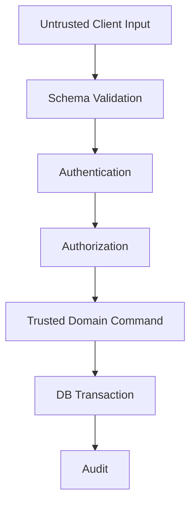

No client is trusted merely because it is the official Flutter or web application.

---

# 24. Operational Security Rules

1. Never log PINs, access tokens or refresh tokens.
2. Never log full sensitive authentication headers.
3. Never accept role, organization or artisan ownership solely from request JSON.
4. Re-check authorization on every mutation.
5. Re-check assistance scope on every assisted mutation.
6. Re-check device/session status on sensitive actions.
7. Keep admin credentials separate from normal user credentials.
8. Treat support tools as privileged surfaces.
9. Rotate/revoke sessions after credential recovery where appropriate.
10. Audit privileged role changes.
11. Audit device rebinding.
12. Audit access to sensitive seller/customer data by privileged operators.

---

# 25. Testing Strategy

## 25.1 Authentication Tests

```text
✓ valid login
✓ invalid PIN
✓ inactive account
✓ locked account
✓ revoked device
✓ trusted device
✓ expired session
✓ revoked session
✓ refresh rotation/rejection behavior
✓ logout
✓ logout-all
✓ recovery success
✓ recovery failure
✓ brute-force throttling
✓ account enumeration resistance
```

## 25.2 Authorization Tests

```text
✓ artisan can access own product
✓ artisan cannot access another artisan product
✓ buyer can access own cart
✓ buyer cannot access another buyer cart
✓ B2B buyer can access own requirement
✓ Didi can access assigned artisan only
✓ Didi cannot access unassigned artisan
✓ Didi session expiry blocks mutation
✓ cross-cluster access rejected
✓ cross-organization access rejected
✓ institution admin limited to own organization
✓ platform admin privileges audited
```

## 25.3 Sensitive Action Tests

```text
✓ publish requires required confirmation
✓ payout change requires step-up
✓ device rebind revokes old device
✓ critical conflict requires explicit resolution
✓ confirmation cannot be reused for another action
✓ confirmation is bound to correct entity/version
```

---

# 26. Definition of Done

Authentication and authorization are implementation-ready when:

### Identity

- [ ] `users`, `roles`, `user_roles` exist and are migrated.
- [ ] PINs are securely hashed.
- [ ] Account lifecycle states are implemented.

### Sessions

- [ ] Access/refresh session model is implemented.
- [ ] Session expiry and revocation work.
- [ ] Logout and logout-all work.

### Devices

- [ ] Device registration exists.
- [ ] Trust/revocation exists.
- [ ] Recovery/rebinding is audited.

### Authorization

- [ ] RBAC is enforced server-side.
- [ ] Ownership checks are enforced server-side.
- [ ] Organization/cluster checks are enforced server-side.
- [ ] Assistance-session scope is enforced server-side.

### Buyers

- [ ] B2C buyer identity/session behavior is implemented.
- [ ] B2B buyer identity uses the shared customer model.
- [ ] Buyer ownership prevents cross-account access.

### Sensitive Actions

- [ ] Step-up/confirmation mechanism exists.
- [ ] Sensitive operations are action-bound.

### Audit

- [ ] Authentication security events are recorded.
- [ ] Privileged access is auditable.
- [ ] Didi actions record actor + artisan + assistance session.

### Database

- [ ] RLS is enabled where practical.
- [ ] Backend authorization remains mandatory even where RLS exists.
- [ ] Audit rows are append-only from application paths.

---

# 27. Implementation Order

```mermaid
flowchart TB
    Schema[1. Identity Schema] --> Hash[2. PIN Hashing]
    Hash --> Device[3. Device Registration]
    Device --> Session[4. Sessions]
    Session --> RBAC[5. RBAC]
    RBAC --> Ownership[6. Ownership / Scope]
    Ownership --> Assist[7. Didi Assistance Authorization]
    Assist --> Buyer[8. Buyer Sessions]
    Buyer --> StepUp[9. Sensitive Actions]
    StepUp --> Audit[10. Security Audit]
    Audit --> RLS[11. RLS Hardening]
    RLS --> Tests[12. Security Test Suite]
```

Recommended implementation sequence:

1. users / roles / user_roles;
2. PIN hashing and account lifecycle;
3. device registration and trust;
4. access/refresh sessions;
5. server-side RBAC;
6. ownership + organization/cluster policy;
7. assistance sessions;
8. buyer sessions;
9. recovery/rebinding;
10. sensitive-action confirmation;
11. audit events;
12. RLS and adversarial authorization tests.

---

# 28. Final Authentication Principle

```text
AUTHENTICATION
    = Who are you?

AUTHORIZATION
    = What may you do?

RESOURCE SCOPE
    = To whose data?

ASSISTANCE SCOPE
    = Under whose delegated session?

CONFIRMATION
    = Did the owner explicitly approve this consequential action?

AUDIT
    = Who did what, on which resource, through which device/session?
```

> **Kala Setu identity principle:** **A valid login never means unlimited access.** Every consequential operation must pass identity, role, resource scope, contextual scope and—where required—explicit owner confirmation before deterministic domain state is changed.
