# 1. Database Goals

The database must support the complete MVP without becoming tightly coupled to a single UI, AI provider or marketplace.

The database must:

1. Treat PostgreSQL as the authoritative system of record for server-side business state.
2. Support Artisan, CRP/Didi, buyer, organization and administrative roles.
3. Model `Product → ProductVariant → Inventory → Reservation → OrderItem` correctly.
4. Prevent silent inventory overwrite and overselling through revisions and transactional reservations.
5. Support offline-first synchronization and explicit conflict resolution.
6. Record who performed each consequential action and through which session/device/channel.
7. Separate user-provided, AI-extracted, AI-generated and externally verified information.
8. Support AI jobs without making AI tables the authoritative commerce state.
9. Support B2C, B2B, government-readiness and future ONDC adapters without marketplace-specific coupling.
10. Support data export, deletion and retention controls.
11. Support row-level authorization boundaries where practical.
12. Remain portable PostgreSQL so Supabase can be replaced later.
13. Remain implementable with ₹0 required cash expenditure for the SIH MVP.

---

---

# 2. Database Architecture

## 2.1 Logical Database Architecture

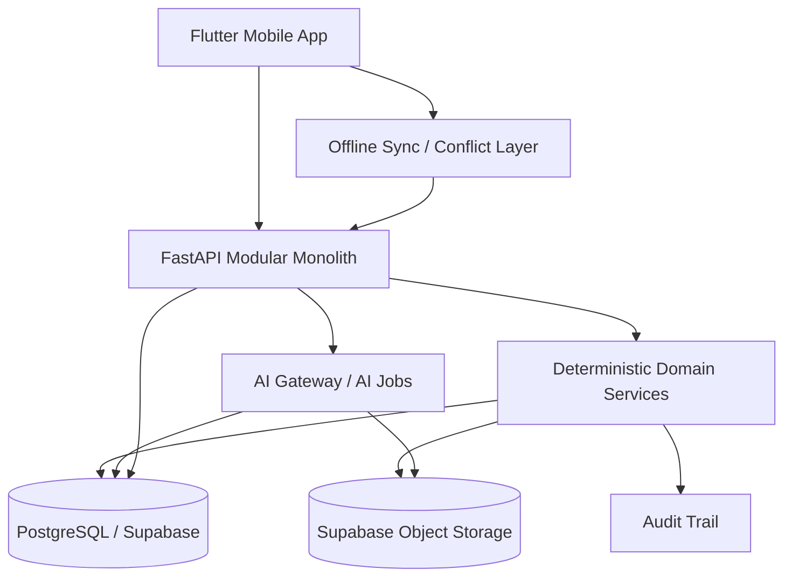

## 2.2 Database Responsibility Boundary

```text
AI
  → proposes / extracts / recommends

Application Services
  → validate / authorize / orchestrate

Domain Services
  → perform deterministic state transitions

PostgreSQL
  → stores authoritative business state

Object Storage
  → stores binary media

Audit Trail
  → records consequential actions and decisions
```

The LLM, STT model, vision model or pricing model must never directly mutate authoritative commerce tables.

---

---

# 3. PostgreSQL Design Principles

## 3.1 Primary Conventions

| Concern | Decision |
|---|---|
| Database | PostgreSQL |
| Managed MVP | Supabase Free |
| ORM/query layer | Drizzle ORM |
| Primary key | UUID |
| Time | `TIMESTAMPTZ` in UTC |
| Money | `NUMERIC(12,2)` |
| Counts | `INTEGER` |
| Long-form text | `TEXT` |
| Flexible model metadata | `JSONB` only where justified |
| Entity revision | `BIGINT` |
| Audit timestamps | `TIMESTAMPTZ` |
| Soft deletion | Explicit status/deletion timestamp only where needed |
| Binary media | Object storage, not PostgreSQL blobs |
| Server authoritative state | PostgreSQL |

## 3.2 Naming

- Tables use `snake_case` plural nouns.
- Columns use `snake_case`.
- Primary keys are `id`.
- Foreign keys use `<entity>_id`.
- Revision columns use `version` or `revision` consistently by domain.
- Timestamps use `<event>_at`.
- Boolean columns use `is_` / `has_` prefixes where appropriate.

## 3.3 General Row Pattern

Core mutable business entities should normally contain:

```text
id
created_at
updated_at
version / revision
```

Ownership-sensitive entities should additionally contain an explicit owner or parent reference.

---

### 3.4 JSONB Policy

## JSONB is appropriate for

```text
AI decision evidence
AI model metadata
media transformation metadata
channel-specific configuration
external integration metadata
market match factor details
optional requirement metadata
```

## JSONB is not appropriate as the sole source of truth for

```text
Product ownership
Variant identity
Inventory quantity
Order state
Reservation state
User role
Artisan/cluster assignment
Payment amount
```

The rule is:

> **Use relational columns for facts that affect authorization, commerce correctness, reporting or invariants. Use JSONB for extensible metadata.**

---

---

# 4. Entity Inventory

The database contains the following major entities.

The database is organized around these business domains and implementation tiers.

| Tier | Meaning |
|---|---|
| **MVP Core** | Required for the SIH demonstrable product and core business correctness |
| **MVP Supporting** | Strongly recommended because it makes the core flows robust, explainable and auditable |
| **Phase 2/3 Ready** | Boundary structures designed now so future capabilities do not force a schema redesign |

```text
Identity / Access
├── users
├── roles
├── user_roles
├── devices
├── organizations
├── clusters
├── artisan_profiles
├── craft_profiles
├── craft_skills
├── artisan_languages
└── artisan_onboarding_progress

Assisted Commerce
├── assistance_sessions
└── assistance_session_actions

Product / Craft / Catalog
├── products
├── product_variants
├── product_media
├── media_processing_jobs
├── media_derivatives
├── media_quality_checks
├── catalog_entries
├── catalog_entry_versions
├── catalog_publications
├── catalog_publication_events
├── production_stories
├── product_field_sources
├── craft_provenance_records
├── languages
├── craft_categories
└── craft_profiles / craft_skills

Commerce
├── inventory
├── inventory_reservations
├── inventory_movements
├── customers
├── orders
├── order_items
├── order_addresses
├── fulfillments
├── fulfilment_events
├── payment_records
├── earnings_ledger
├── payout_accounts
└── payout_records

Intelligence
├── voice_interactions
├── voice_intents
├── voice_confirmations
├── ai_jobs
├── ai_decisions
├── ai_corrections
├── ai_issue_reports
├── product_costs
├── labour_rate_profiles
├── pricing_runs
├── pricing_factors
├── price_recommendations
├── pricing_overrides
└── market_comparables

Market Access
├── buyer_requirements
├── buyer_requirement_items
├── market_opportunities
├── market_matches
├── market_match_factors
├── cluster_capacity_snapshots
├── quotations
├── quotation_items
├── market_readiness
├── market_readiness_items
├── market_channels
├── external_entity_references
└── integration_events

Direct Digital Commerce
├── storefronts
├── storefront_sections
└── share_links

Reliability / Offline
├── sync_queue_items
├── sync_conflicts
└── sync_conflict_resolutions

Governance / Data Rights / Communication
├── verifications
├── audit_events
├── notifications
├── notification_deliveries
├── data_export_requests
└── data_deletion_requests
```

---

### 4.1 Product Capability → Database Coverage

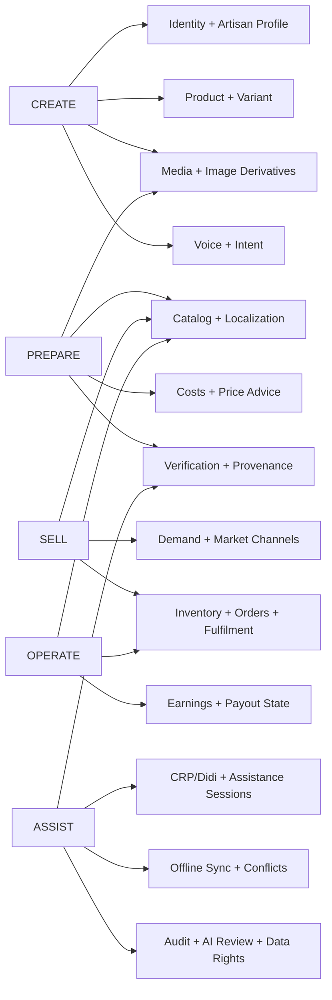

### 4.2 Full Business Memory

Full Business Memory

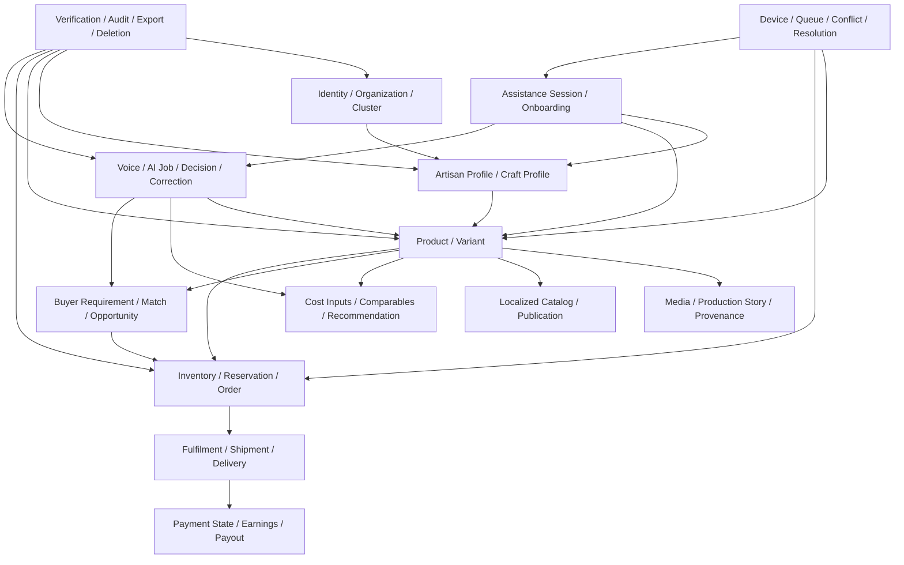

---

---

# 5. Entity Relationship Diagram

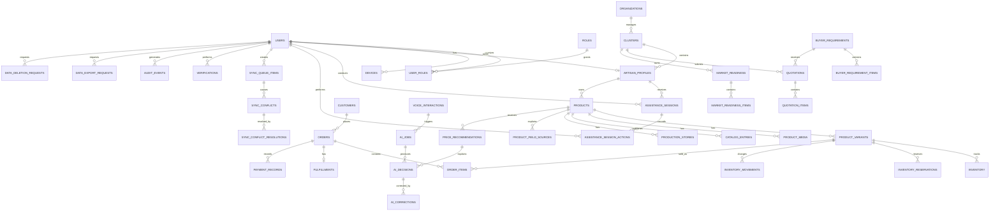

---

---

# 6. PostgreSQL Physical Table & Relationship Views

## 6.1 Physical Table Group Map

The physical PostgreSQL design can now be viewed as these bounded table groups:

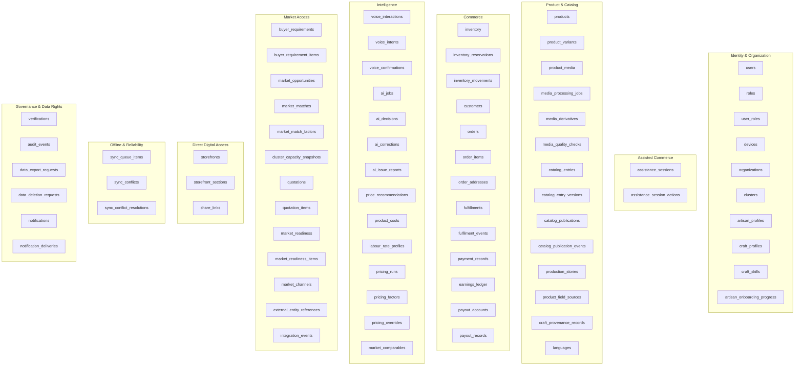

This diagram is intentionally grouped by **business responsibility**, not by deployment process.

---

## 6.2 Expanded Physical Relationship View

The following Mermaid diagram gives the most complete high-level physical relationship view without repeating every column from the SQL sections.

```mermaid
flowchart TB
    users --> user_roles
    roles --> user_roles
    users --> devices
    organizations --> clusters
    clusters --> artisan_profiles
    users --> artisan_profiles
    artisan_profiles --> craft_profiles
    craft_profiles --> craft_skills
    artisan_profiles --> artisan_onboarding_progress

    artisan_profiles --> assistance_sessions
    users --> assistance_sessions
    assistance_sessions --> assistance_session_actions

    artisan_profiles --> products
    products --> product_variants
    products --> product_media
    product_media --> media_processing_jobs
    product_media --> media_derivatives
    product_media --> media_quality_checks
    products --> catalog_entries
    catalog_entries --> catalog_entry_versions
    catalog_entries --> catalog_publications
    catalog_publications --> catalog_publication_events
    products --> production_stories
    products --> product_field_sources
    artisan_profiles --> craft_provenance_records
    products --> craft_provenance_records
    languages --> catalog_entries

    product_variants --> inventory
    product_variants --> inventory_reservations
    product_variants --> inventory_movements
    orders --> inventory_reservations

    customers --> orders
    orders --> order_items
    product_variants --> order_items
    orders --> order_addresses
    orders --> fulfillments
    fulfillments --> fulfilment_events
    orders --> payment_records
    artisan_profiles --> earnings_ledger
    orders --> earnings_ledger
    artisan_profiles --> payout_accounts
    payout_accounts --> payout_records

    users --> voice_interactions
    voice_interactions --> voice_intents
    voice_interactions --> voice_confirmations
    voice_interactions --> ai_jobs
    ai_jobs --> ai_decisions
    ai_decisions --> ai_corrections
    ai_decisions --> ai_issue_reports
    products --> price_recommendations
    price_recommendations --> pricing_runs
    pricing_runs --> pricing_factors
    products --> product_costs
    price_recommendations --> pricing_overrides
    price_recommendations --> market_comparables

    customers --> buyer_requirements
    buyer_requirements --> buyer_requirement_items
    buyer_requirements --> market_opportunities
    market_opportunities --> market_matches
    artisan_profiles --> market_matches
    clusters --> market_matches
    market_matches --> market_match_factors
    clusters --> cluster_capacity_snapshots
    buyer_requirements --> quotations
    clusters --> quotations
    quotations --> quotation_items
    product_variants --> quotation_items
    clusters --> market_readiness
    artisan_profiles --> market_readiness
    market_readiness --> market_readiness_items

    artisan_profiles --> storefronts
    storefronts --> storefront_sections
    storefronts --> share_links

    users --> sync_queue_items
    devices --> sync_queue_items
    sync_queue_items --> sync_conflicts
    sync_conflicts --> sync_conflict_resolutions

    users --> verifications
    users --> audit_events
    assistance_sessions --> audit_events
    users --> data_export_requests
    users --> data_deletion_requests
    users --> notifications
    notifications --> notification_deliveries

    market_channels --> catalog_publications
    market_channels --> external_entity_references
    market_channels --> integration_events
```

This is intentionally complementary to the ER diagram and physical table class diagram:

- **ER diagram** → conceptual cardinality
- **Physical table diagram** → PostgreSQL tables + key fields
- **Expanded relationship view** → the complete feature/domain graph
- **Class diagram** → application/domain concepts

---

## 6.3 Key-Column Physical Table Diagram

This diagram is the **physical database view** of the schema. Unlike the domain class diagram below, it uses the actual PostgreSQL table names and highlights primary keys (`PK`) and foreign keys (`FK`). It is intentionally kept at the key-column level so the complete column definitions remain in the SQL table sections later in this document.

```mermaid
classDiagram
    direction TB

    class users {
        <<table>>
        PK UUID id
        string phone_number
        enum status
        timestamptz created_at
    }
    class roles {
        <<table>>
        PK role_code code
        string description
    }
    class user_roles {
        <<table>>
        PK FK UUID user_id
        PK FK role_code role_code
        timestamptz created_at
    }
    class devices {
        <<table>>
        PK UUID id
        FK UUID user_id
        string platform
        string status
    }
    class organizations {
        <<table>>
        PK UUID id
        string name
        string status
    }
    class clusters {
        <<table>>
        PK UUID id
        FK UUID organization_id
        string name
        string region
    }
    class artisan_profiles {
        <<table>>
        PK UUID id
        FK UUID user_id
        FK UUID cluster_id
        string display_name
        string preferred_language
        string status
    }
    class assistance_sessions {
        <<table>>
        PK UUID id
        FK UUID artisan_id
        FK UUID crp_user_id
        FK UUID organization_id
        FK UUID cluster_id
        enum status
        timestamptz started_at
        timestamptz ended_at
    }
    class assistance_session_actions {
        <<table>>
        PK UUID id
        FK UUID session_id
        FK UUID actor_user_id
        string action
        string entity_type
        UUID entity_id
    }

    class products {
        <<table>>
        PK UUID id
        FK UUID artisan_id
        string title
        string craft_type
        string material
        string status
        BIGINT version
    }
    class product_variants {
        <<table>>
        PK UUID id
        FK UUID product_id
        string sku
        numeric unit_price
        int quantity_available
        BIGINT version
    }
    class product_media {
        <<table>>
        PK UUID id
        FK UUID product_id
        string media_type
        string object_key
        boolean is_original
    }
    class catalog_entries {
        <<table>>
        PK UUID id
        FK UUID product_id
        string channel
        string status
        BIGINT version
    }
    class production_stories {
        <<table>>
        PK UUID id
        FK UUID artisan_id
        FK UUID product_id
        string language_code
        boolean is_public
    }
    class product_field_sources {
        <<table>>
        PK UUID id
        FK UUID product_id
        string field_name
        string source_type
        decimal confidence
    }

    class inventory {
        <<table>>
        PK UUID id
        FK UUID variant_id
        int available_quantity
        int reserved_quantity
        BIGINT version
    }
    class inventory_reservations {
        <<table>>
        PK UUID id
        FK UUID variant_id
        FK UUID order_id
        int quantity
        string status
        timestamptz expires_at
    }
    class inventory_movements {
        <<table>>
        PK UUID id
        FK UUID variant_id
        FK UUID actor_user_id
        int quantity_delta
        BIGINT previous_revision
        BIGINT resulting_revision
    }
    class customers {
        <<table>>
        PK UUID id
        string customer_type
        string display_name
        string status
    }
    class orders {
        <<table>>
        PK UUID id
        FK UUID customer_id
        string status
        numeric total_amount
        BIGINT version
    }
    class order_items {
        <<table>>
        PK UUID id
        FK UUID order_id
        FK UUID variant_id
        int quantity
        numeric unit_price
    }
    class fulfillments {
        <<table>>
        PK UUID id
        FK UUID order_id
        string status
        string delivery_reference
    }
    class payment_records {
        <<table>>
        PK UUID id
        FK UUID order_id
        string status
        numeric amount
    }

    class voice_interactions {
        <<table>>
        PK UUID id
        FK UUID actor_user_id
        string language_code
        string transcript
        string intent
    }
    class ai_jobs {
        <<table>>
        PK UUID id
        FK UUID voice_interaction_id
        string capability
        string status
        string provider
        string model
    }
    class ai_decisions {
        <<table>>
        PK UUID id
        FK UUID ai_job_id
        string source_type
        decimal confidence
        string confirmation_status
    }
    class price_recommendations {
        <<table>>
        PK UUID id
        FK UUID product_id
        numeric suggested_price
        numeric confidence
    }
    class market_comparables {
        <<table>>
        PK UUID id
        FK UUID price_recommendation_id
        string source
        numeric price
    }
    class ai_corrections {
        <<table>>
        PK UUID id
        FK UUID ai_decision_id
        FK UUID corrected_by
        string field_name
        string reason
    }

    class buyer_requirements {
        <<table>>
        PK UUID id
        FK UUID buyer_id
        string status
        numeric budget_max
        int quantity_required
    }
    class buyer_requirement_items {
        <<table>>
        PK UUID id
        FK UUID buyer_requirement_id
        string attribute_name
        string attribute_value
    }
    class quotations {
        <<table>>
        PK UUID id
        FK UUID buyer_requirement_id
        FK UUID cluster_id
        string status
        numeric total_amount
    }
    class quotation_items {
        <<table>>
        PK UUID id
        FK UUID quotation_id
        FK UUID variant_id
        int quantity
        numeric unit_price
    }
    class market_readiness {
        <<table>>
        PK UUID id
        FK UUID cluster_id
        string channel
        string status
    }
    class market_readiness_items {
        <<table>>
        PK UUID id
        FK UUID market_readiness_id
        string requirement_code
        string status
    }

    class sync_queue_items {
        <<table>>
        PK UUID id
        FK UUID actor_user_id
        UUID entity_id
        string entity_type
        string operation_type
        BIGINT base_revision
        string idempotency_key
        string status
    }
    class sync_conflicts {
        <<table>>
        PK UUID id
        FK UUID sync_queue_item_id
        BIGINT server_revision
        BIGINT client_revision
        string status
    }
    class sync_conflict_resolutions {
        <<table>>
        PK UUID id
        FK UUID sync_conflict_id
        FK UUID resolved_by
        string resolution_type
        string reason
    }

    class verifications {
        <<table>>
        PK UUID id
        FK UUID subject_user_id
        FK UUID performed_by
        string verification_type
        string status
    }
    class audit_events {
        <<table>>
        PK UUID id
        FK UUID actor_user_id
        string action
        string entity_type
        UUID entity_id
        string channel
    }
    class data_export_requests {
        <<table>>
        PK UUID id
        FK UUID requested_by
        string status
        timestamptz requested_at
    }
    class data_deletion_requests {
        <<table>>
        PK UUID id
        FK UUID requested_by
        string status
        timestamptz requested_at
    }

    users "1" --> "many" user_roles : user_id
    roles "1" --> "many" user_roles : role_code
    users "1" --> "many" devices : user_id
    organizations "1" --> "many" clusters : organization_id
    clusters "1" --> "many" artisan_profiles : cluster_id
    users "1" --> "0..1" artisan_profiles : user_id
    artisan_profiles "1" --> "many" assistance_sessions : artisan_id
    users "1" --> "many" assistance_sessions : crp_user_id
    assistance_sessions "1" --> "many" assistance_session_actions : session_id
    users "1" --> "many" assistance_session_actions : actor_user_id

    artisan_profiles "1" --> "many" products : artisan_id
    products "1" --> "many" product_variants : product_id
    products "1" --> "many" product_media : product_id
    products "1" --> "many" catalog_entries : product_id
    products "1" --> "many" production_stories : product_id
    products "1" --> "many" product_field_sources : product_id

    product_variants "1" --> "many" inventory : variant_id
    product_variants "1" --> "many" inventory_reservations : variant_id
    product_variants "1" --> "many" inventory_movements : variant_id
    customers "1" --> "many" orders : customer_id
    orders "1" --> "many" order_items : order_id
    product_variants "1" --> "many" order_items : variant_id
    orders "1" --> "0..1" fulfillments : order_id
    orders "1" --> "many" payment_records : order_id
    orders "1" --> "many" inventory_reservations : order_id

    voice_interactions "1" --> "many" ai_jobs : voice_interaction_id
    ai_jobs "1" --> "many" ai_decisions : ai_job_id
    products "1" --> "many" price_recommendations : product_id
    price_recommendations "1" --> "many" market_comparables : price_recommendation_id
    ai_decisions "1" --> "many" ai_corrections : ai_decision_id

    buyer_requirements "1" --> "many" buyer_requirement_items : buyer_requirement_id
    buyer_requirements "1" --> "many" quotations : buyer_requirement_id
    clusters "1" --> "many" quotations : cluster_id
    quotations "1" --> "many" quotation_items : quotation_id
    product_variants "1" --> "many" quotation_items : variant_id
    clusters "1" --> "many" market_readiness : cluster_id
    market_readiness "1" --> "many" market_readiness_items : market_readiness_id

    users "1" --> "many" sync_queue_items : actor_user_id
    sync_queue_items "1" --> "many" sync_conflicts : sync_queue_item_id
    sync_conflicts "1" --> "many" sync_conflict_resolutions : sync_conflict_id
    users "1" --> "many" sync_conflict_resolutions : resolved_by

    users "1" --> "many" verifications : performed_by
    users "1" --> "many" audit_events : actor_user_id
    users "1" --> "many" data_export_requests : requested_by
    users "1" --> "many" data_deletion_requests : requested_by
```

**Diagram key:** `PK` = primary key, `FK` = foreign key. Relationship labels use the actual FK column where it improves traceability.

---

---

# 7. PostgreSQL Enums

Enums should be used for stable finite state machines. Highly configurable values should remain text/reference data instead of becoming enums.

## 7.1 Identity / Access Enums

```sql
CREATE TYPE user_status AS ENUM (
    'ACTIVE',
    'INVITED',
    'SUSPENDED',
    'DELETED'
);

CREATE TYPE role_code AS ENUM (
    'ARTISAN',
    'CRP_DIDI',
    'B2C_BUYER',
    'B2B_BUYER',
    'INSTITUTION_ADMIN',
    'PLATFORM_ADMIN'
);

CREATE TYPE assistance_session_status AS ENUM (
    'ACTIVE',
    'ENDED',
    'EXPIRED',
    'REVOKED'
);

CREATE TYPE consent_status AS ENUM (
    'NOT_REQUIRED',
    'PENDING',
    'CONFIRMED',
    'DECLINED'
);
```

## 7.2 Product / Commerce Enums

```sql
CREATE TYPE product_status AS ENUM (
    'DRAFT',
    'READY_FOR_REVIEW',
    'PUBLISHED',
    'PAUSED',
    'ARCHIVED'
);

CREATE TYPE inventory_reservation_status AS ENUM (
    'ACTIVE',
    'CONFIRMED',
    'RELEASED',
    'EXPIRED',
    'CANCELLED'
);

CREATE TYPE inventory_movement_reason AS ENUM (
    'INITIAL_STOCK',
    'MANUAL_ADJUSTMENT',
    'RESERVATION',
    'RESERVATION_RELEASE',
    'ORDER_COMMIT',
    'ORDER_CANCEL',
    'FULFILMENT',
    'RETURN',
    'DAMAGE',
    'CORRECTION'
);

CREATE TYPE order_status AS ENUM (
    'NEW',
    'CONFIRMED',
    'PREPARING',
    'SHIPPED',
    'DELIVERED',
    'COMPLETED',
    'CANCELLED',
    'RETURN_REQUESTED',
    'REFUNDED',
    'REJECTED'
);
```

## 7.3 AI / Sync Enums

```sql
CREATE TYPE ai_source_type AS ENUM (
    'USER_PROVIDED',
    'AI_EXTRACTED',
    'AI_GENERATED',
    'EXTERNALLY_VERIFIED'
);

CREATE TYPE ai_job_status AS ENUM (
    'QUEUED',
    'RUNNING',
    'SUCCEEDED',
    'FAILED',
    'CANCELLED'
);

CREATE TYPE sync_item_status AS ENUM (
    'PENDING',
    'SYNCING',
    'SYNCED',
    'CONFLICT',
    'FAILED',
    'CANCELLED'
);

CREATE TYPE conflict_status AS ENUM (
    'OPEN',
    'RESOLVED',
    'ESCALATED',
    'DISMISSED'
);
```

---

---

# 8. Identity & Organization Tables

## 8.1 `users`

Authoritative application identity record.

```sql
CREATE TABLE users (
    id UUID PRIMARY KEY DEFAULT gen_random_uuid(),
    phone_number TEXT NOT NULL UNIQUE,
    pin_hash TEXT NOT NULL,
    status user_status NOT NULL DEFAULT 'INVITED',
    created_at TIMESTAMPTZ NOT NULL DEFAULT now(),
    updated_at TIMESTAMPTZ NOT NULL DEFAULT now()
);
```

> The database must never store the raw PIN.

## 8.2 `roles`

```sql
CREATE TABLE roles (
    code role_code PRIMARY KEY,
    description TEXT NOT NULL
);
```

## 8.3 `user_roles`

```sql
CREATE TABLE user_roles (
    user_id UUID NOT NULL REFERENCES users(id) ON DELETE CASCADE,
    role_code role_code NOT NULL REFERENCES roles(code),
    created_at TIMESTAMPTZ NOT NULL DEFAULT now(),
    PRIMARY KEY (user_id, role_code)
);
```

## 8.4 `devices`

```sql
CREATE TABLE devices (
    id UUID PRIMARY KEY DEFAULT gen_random_uuid(),
    user_id UUID NOT NULL REFERENCES users(id) ON DELETE CASCADE,
    device_fingerprint_hash TEXT NOT NULL,
    platform TEXT NOT NULL,
    app_version TEXT,
    is_trusted BOOLEAN NOT NULL DEFAULT true,
    last_seen_at TIMESTAMPTZ,
    created_at TIMESTAMPTZ NOT NULL DEFAULT now(),
    revoked_at TIMESTAMPTZ
);

CREATE INDEX idx_devices_user_id ON devices(user_id);
```

The fingerprint must be represented by a non-reversible identifier appropriate to the implementation; do not store unnecessary hardware identifiers.

## 8.5 `organizations`

```sql
CREATE TABLE organizations (
    id UUID PRIMARY KEY DEFAULT gen_random_uuid(),
    name TEXT NOT NULL,
    status TEXT NOT NULL DEFAULT 'ACTIVE',
    created_at TIMESTAMPTZ NOT NULL DEFAULT now(),
    updated_at TIMESTAMPTZ NOT NULL DEFAULT now()
);
```

## 8.6 `clusters`

```sql
CREATE TABLE clusters (
    id UUID PRIMARY KEY DEFAULT gen_random_uuid(),
    organization_id UUID NOT NULL REFERENCES organizations(id),
    name TEXT NOT NULL,
    region TEXT,
    created_at TIMESTAMPTZ NOT NULL DEFAULT now(),
    updated_at TIMESTAMPTZ NOT NULL DEFAULT now()
);

CREATE INDEX idx_clusters_org_id ON clusters(organization_id);
```

---

---

# 9. Artisan & Assisted-Commerce Tables

## 9.1 `artisan_profiles`

```sql
CREATE TABLE artisan_profiles (
    id UUID PRIMARY KEY DEFAULT gen_random_uuid(),
    user_id UUID NOT NULL UNIQUE REFERENCES users(id),
    cluster_id UUID REFERENCES clusters(id),
    display_name TEXT NOT NULL,
    preferred_language TEXT NOT NULL,
    phone_display TEXT,
    craft_region TEXT,
    verification_status TEXT NOT NULL DEFAULT 'UNVERIFIED',
    created_at TIMESTAMPTZ NOT NULL DEFAULT now(),
    updated_at TIMESTAMPTZ NOT NULL DEFAULT now()
);

CREATE INDEX idx_artisan_profiles_cluster_id ON artisan_profiles(cluster_id);
```

## 9.2 `assistance_sessions`

This is the database representation of Didi/CRP assisted-commerce mode.

```sql
CREATE TABLE assistance_sessions (
    id UUID PRIMARY KEY DEFAULT gen_random_uuid(),
    artisan_id UUID NOT NULL REFERENCES artisan_profiles(id),
    crp_user_id UUID NOT NULL REFERENCES users(id),
    organization_id UUID REFERENCES organizations(id),
    cluster_id UUID REFERENCES clusters(id),
    status assistance_session_status NOT NULL DEFAULT 'ACTIVE',
    scope JSONB NOT NULL DEFAULT '{}'::jsonb,
    consent_status consent_status NOT NULL DEFAULT 'NOT_REQUIRED',
    started_at TIMESTAMPTZ NOT NULL DEFAULT now(),
    ended_at TIMESTAMPTZ,
    created_at TIMESTAMPTZ NOT NULL DEFAULT now()
);

CREATE INDEX idx_assistance_sessions_artisan ON assistance_sessions(artisan_id);
CREATE INDEX idx_assistance_sessions_crp ON assistance_sessions(crp_user_id);
CREATE INDEX idx_assistance_sessions_active ON assistance_sessions(status) WHERE status = 'ACTIVE';
```

## 9.3 `assistance_session_actions`

```sql
CREATE TABLE assistance_session_actions (
    id UUID PRIMARY KEY DEFAULT gen_random_uuid(),
    session_id UUID NOT NULL REFERENCES assistance_sessions(id) ON DELETE CASCADE,
    actor_user_id UUID NOT NULL REFERENCES users(id),
    action TEXT NOT NULL,
    entity_type TEXT,
    entity_id UUID,
    requires_artisan_confirmation BOOLEAN NOT NULL DEFAULT false,
    confirmation_status consent_status NOT NULL DEFAULT 'NOT_REQUIRED',
    metadata JSONB NOT NULL DEFAULT '{}'::jsonb,
    created_at TIMESTAMPTZ NOT NULL DEFAULT now()
);

CREATE INDEX idx_assistance_session_actions_session ON assistance_session_actions(session_id);
```

---

### Craft, Provenance & Trust Model

The problem statement is not only about selling products. It is about helping marginalized artisans present their identity, craft and provenance in a trustworthy way.

#### Recommended Supporting Entities

```text
craft_profiles
craft_categories
craft_skills
artisan_languages
artisan_verification_profiles
craft_provenance_records
```

#### `craft_profiles`

A normalized profile for what the artisan actually makes and knows.

```sql
CREATE TABLE craft_profiles (
    id UUID PRIMARY KEY DEFAULT gen_random_uuid(),
    artisan_id UUID NOT NULL REFERENCES artisan_profiles(id) ON DELETE CASCADE,
    primary_craft_type TEXT NOT NULL,
    skill_level TEXT,
    years_of_experience INTEGER CHECK (years_of_experience >= 0),
    description TEXT,
    created_at TIMESTAMPTZ NOT NULL DEFAULT now(),
    updated_at TIMESTAMPTZ NOT NULL DEFAULT now()
);

CREATE INDEX idx_craft_profiles_artisan ON craft_profiles(artisan_id);
```

#### `craft_skills`

```sql
CREATE TABLE craft_skills (
    id UUID PRIMARY KEY DEFAULT gen_random_uuid(),
    craft_profile_id UUID NOT NULL REFERENCES craft_profiles(id) ON DELETE CASCADE,
    skill_name TEXT NOT NULL,
    source_type ai_source_type NOT NULL DEFAULT 'USER_PROVIDED',
    confidence NUMERIC(5,4) CHECK (confidence BETWEEN 0 AND 1),
    created_at TIMESTAMPTZ NOT NULL DEFAULT now()
);
```

#### `craft_provenance_records`

```sql
CREATE TABLE craft_provenance_records (
    id UUID PRIMARY KEY DEFAULT gen_random_uuid(),
    artisan_id UUID NOT NULL REFERENCES artisan_profiles(id) ON DELETE CASCADE,
    product_id UUID REFERENCES products(id) ON DELETE CASCADE,
    provenance_type TEXT NOT NULL,
    region TEXT,
    organization_name TEXT,
    statement TEXT,
    source_type ai_source_type NOT NULL DEFAULT 'USER_PROVIDED',
    verified_by UUID REFERENCES users(id),
    verified_at TIMESTAMPTZ,
    status TEXT NOT NULL DEFAULT 'UNVERIFIED',
    created_at TIMESTAMPTZ NOT NULL DEFAULT now()
);
```

#### Provenance rule

AI may format or translate a provenance statement, but it must not manufacture a provenance claim. A database source marker and optional verification record should distinguish:

```text
USER_PROVIDED
AI_EXTRACTED
AI_GENERATED
EXTERNALLY_VERIFIED
```

---

### Onboarding Progress & Artisan Independence

Didi/CRP is intended as a deployment and accessibility layer. The database should measure whether assistance is reducing over time.

#### Onboarding Flow


#### Supporting Tables

```text
onboarding_programs
artisan_onboarding_progress
onboarding_milestones
```

#### `artisan_onboarding_progress`

```sql
CREATE TABLE artisan_onboarding_progress (
    id UUID PRIMARY KEY DEFAULT gen_random_uuid(),
    artisan_id UUID NOT NULL UNIQUE REFERENCES artisan_profiles(id) ON DELETE CASCADE,
    current_stage TEXT NOT NULL DEFAULT 'REGISTERED',
    assistance_level TEXT NOT NULL DEFAULT 'CRP_LED',
    last_assisted_at TIMESTAMPTZ,
    independent_since TIMESTAMPTZ,
    updated_at TIMESTAMPTZ NOT NULL DEFAULT now()
);
```

The database can now support metrics such as:

```text
CRP-led → CRP + Artisan → Artisan-led → Independent
```

without treating Didi access as a permanent dependency.

---

---

# 10. Product & Catalog Tables

## 10.1 `products`

```sql
CREATE TABLE products (
    id UUID PRIMARY KEY DEFAULT gen_random_uuid(),
    artisan_id UUID NOT NULL REFERENCES artisan_profiles(id),
    title TEXT NOT NULL,
    description TEXT,
    craft_type TEXT,
    category TEXT,
    material TEXT,
    origin_text TEXT,
    status product_status NOT NULL DEFAULT 'DRAFT',
    version BIGINT NOT NULL DEFAULT 1,
    created_at TIMESTAMPTZ NOT NULL DEFAULT now(),
    updated_at TIMESTAMPTZ NOT NULL DEFAULT now()
);

CREATE INDEX idx_products_artisan_id ON products(artisan_id);
CREATE INDEX idx_products_status ON products(status);
CREATE INDEX idx_products_craft_type ON products(craft_type);
```

## 10.2 `product_variants`

```sql
CREATE TABLE product_variants (
    id UUID PRIMARY KEY DEFAULT gen_random_uuid(),
    product_id UUID NOT NULL REFERENCES products(id) ON DELETE CASCADE,
    sku TEXT UNIQUE,
    size TEXT,
    color TEXT,
    design TEXT,
    unit_label TEXT,
    unit_price NUMERIC(12,2) CHECK (unit_price >= 0),
    is_one_of_one BOOLEAN NOT NULL DEFAULT false,
    is_made_to_order BOOLEAN NOT NULL DEFAULT false,
    is_available BOOLEAN NOT NULL DEFAULT true,
    version BIGINT NOT NULL DEFAULT 1,
    created_at TIMESTAMPTZ NOT NULL DEFAULT now(),
    updated_at TIMESTAMPTZ NOT NULL DEFAULT now()
);

CREATE INDEX idx_product_variants_product_id ON product_variants(product_id);
```

Quantity should be authoritative in `inventory`, not duplicated as a mutable source of truth here.

## 10.3 `product_media`

```sql
CREATE TABLE product_media (
    id UUID PRIMARY KEY DEFAULT gen_random_uuid(),
    product_id UUID NOT NULL REFERENCES products(id) ON DELETE CASCADE,
    variant_id UUID REFERENCES product_variants(id) ON DELETE SET NULL,
    object_key TEXT NOT NULL,
    media_type TEXT NOT NULL,
    media_role TEXT NOT NULL,
    source_type ai_source_type NOT NULL DEFAULT 'USER_PROVIDED',
    is_original BOOLEAN NOT NULL DEFAULT true,
    is_public BOOLEAN NOT NULL DEFAULT false,
    metadata JSONB NOT NULL DEFAULT '{}'::jsonb,
    created_at TIMESTAMPTZ NOT NULL DEFAULT now()
);

CREATE INDEX idx_product_media_product_id ON product_media(product_id);
```

## 10.4 `catalog_entries`

```sql
CREATE TABLE catalog_entries (
    id UUID PRIMARY KEY DEFAULT gen_random_uuid(),
    product_id UUID NOT NULL REFERENCES products(id) ON DELETE CASCADE,
    language_code TEXT NOT NULL,
    title TEXT NOT NULL,
    description TEXT,
    channel TEXT NOT NULL DEFAULT 'INTERNAL',
    publication_status TEXT NOT NULL DEFAULT 'DRAFT',
    version BIGINT NOT NULL DEFAULT 1,
    created_at TIMESTAMPTZ NOT NULL DEFAULT now(),
    updated_at TIMESTAMPTZ NOT NULL DEFAULT now(),
    UNIQUE (product_id, language_code, channel)
);
```

## 10.5 `production_stories`

```sql
CREATE TABLE production_stories (
    id UUID PRIMARY KEY DEFAULT gen_random_uuid(),
    artisan_id UUID NOT NULL REFERENCES artisan_profiles(id),
    product_id UUID NOT NULL REFERENCES products(id) ON DELETE CASCADE,
    language_code TEXT NOT NULL,
    text TEXT,
    audio_object_key TEXT,
    duration_seconds INTEGER CHECK (duration_seconds >= 0),
    is_public BOOLEAN NOT NULL DEFAULT false,
    created_at TIMESTAMPTZ NOT NULL DEFAULT now()
);
```

## 10.6 `product_field_sources`

This table makes AI/data provenance explicit at field level.

```sql
CREATE TABLE product_field_sources (
    id UUID PRIMARY KEY DEFAULT gen_random_uuid(),
    product_id UUID NOT NULL REFERENCES products(id) ON DELETE CASCADE,
    field_name TEXT NOT NULL,
    source_type ai_source_type NOT NULL,
    source_reference TEXT,
    confidence NUMERIC(5,4) CHECK (confidence >= 0 AND confidence <= 1),
    verified_by UUID REFERENCES users(id),
    verified_at TIMESTAMPTZ,
    created_at TIMESTAMPTZ NOT NULL DEFAULT now()
);

CREATE INDEX idx_product_field_sources_product ON product_field_sources(product_id);
CREATE INDEX idx_product_field_sources_field ON product_field_sources(product_id, field_name);
```

---

### Media & Image-Enhancement Data Model

The architecture explicitly separates original product media from safe enhancement. The database should therefore preserve the complete transformation chain rather than replacing the original file.

#### Media Transformation Diagram


#### Supporting Tables

```text
media_processing_jobs
media_derivatives
media_quality_checks
```

#### `media_processing_jobs`

```sql
CREATE TABLE media_processing_jobs (
    id UUID PRIMARY KEY DEFAULT gen_random_uuid(),
    product_media_id UUID NOT NULL REFERENCES product_media(id) ON DELETE CASCADE,
    ai_job_id UUID REFERENCES ai_jobs(id),
    operation_type TEXT NOT NULL,
    status TEXT NOT NULL DEFAULT 'QUEUED',
    requested_by UUID REFERENCES users(id),
    created_at TIMESTAMPTZ NOT NULL DEFAULT now(),
    completed_at TIMESTAMPTZ
);
```

#### `media_derivatives`

```sql
CREATE TABLE media_derivatives (
    id UUID PRIMARY KEY DEFAULT gen_random_uuid(),
    source_media_id UUID NOT NULL REFERENCES product_media(id) ON DELETE CASCADE,
    object_key TEXT NOT NULL,
    derivative_type TEXT NOT NULL,
    transformation_metadata JSONB NOT NULL DEFAULT '{}'::jsonb,
    is_selected_for_catalog BOOLEAN NOT NULL DEFAULT false,
    created_at TIMESTAMPTZ NOT NULL DEFAULT now()
);

CREATE INDEX idx_media_derivatives_source ON media_derivatives(source_media_id);
```

#### `media_quality_checks`

```sql
CREATE TABLE media_quality_checks (
    id UUID PRIMARY KEY DEFAULT gen_random_uuid(),
    product_media_id UUID NOT NULL REFERENCES product_media(id) ON DELETE CASCADE,
    quality_score NUMERIC(5,4) CHECK (quality_score BETWEEN 0 AND 1),
    blur_score NUMERIC(8,4),
    exposure_score NUMERIC(8,4),
    subject_detected BOOLEAN,
    issues JSONB NOT NULL DEFAULT '[]'::jsonb,
    created_at TIMESTAMPTZ NOT NULL DEFAULT now()
);
```

The original capture remains the provenance anchor. An enhanced derivative can be selected for storefront/catalog publication without deleting the original.

---

### Catalog, Localization & Publication Model

The application must support multilingual cataloging without duplicating the core product identity.

#### Catalog Model

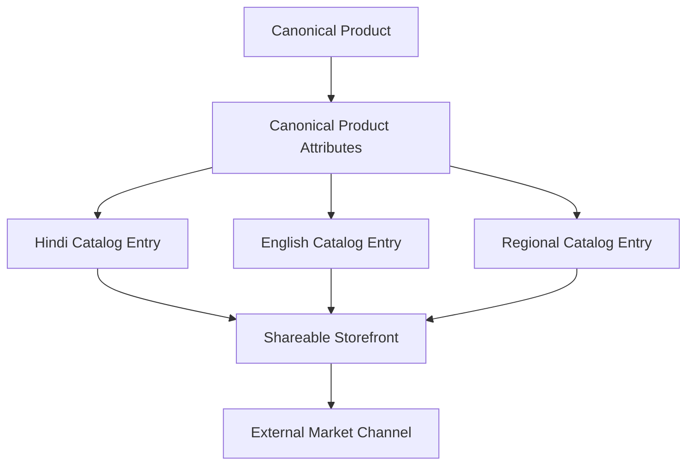

#### Supporting Tables

```text
languages
catalog_entry_versions
catalog_publications
catalog_publication_events
```

#### `languages`

```sql
CREATE TABLE languages (
    code TEXT PRIMARY KEY,
    display_name TEXT NOT NULL,
    native_name TEXT,
    is_enabled BOOLEAN NOT NULL DEFAULT true
);
```

#### `catalog_entry_versions`

```sql
CREATE TABLE catalog_entry_versions (
    id UUID PRIMARY KEY DEFAULT gen_random_uuid(),
    catalog_entry_id UUID NOT NULL REFERENCES catalog_entries(id) ON DELETE CASCADE,
    version BIGINT NOT NULL,
    title TEXT NOT NULL,
    description TEXT,
    source_type ai_source_type NOT NULL,
    created_by UUID REFERENCES users(id),
    created_at TIMESTAMPTZ NOT NULL DEFAULT now(),
    UNIQUE (catalog_entry_id, version)
);
```

#### `catalog_publications`

A publication represents a channel-specific representation of a canonical product.

```sql
CREATE TABLE catalog_publications (
    id UUID PRIMARY KEY DEFAULT gen_random_uuid(),
    catalog_entry_id UUID NOT NULL REFERENCES catalog_entries(id) ON DELETE CASCADE,
    channel_code TEXT NOT NULL,
    external_reference TEXT,
    status TEXT NOT NULL DEFAULT 'PENDING',
    published_version BIGINT,
    last_synced_at TIMESTAMPTZ,
    last_error_code TEXT,
    last_error_message TEXT,
    created_at TIMESTAMPTZ NOT NULL DEFAULT now(),
    updated_at TIMESTAMPTZ NOT NULL DEFAULT now(),
    UNIQUE (catalog_entry_id, channel_code)
);
```

#### Publication Event History

```sql
CREATE TABLE catalog_publication_events (
    id UUID PRIMARY KEY DEFAULT gen_random_uuid(),
    catalog_publication_id UUID NOT NULL REFERENCES catalog_publications(id) ON DELETE CASCADE,
    event_type TEXT NOT NULL,
    request_reference TEXT,
    response_reference TEXT,
    payload_metadata JSONB NOT NULL DEFAULT '{}'::jsonb,
    created_at TIMESTAMPTZ NOT NULL DEFAULT now()
);
```

This creates a clean boundary between:

```text
Canonical Product
        ↓
Catalog Entry
        ↓
Channel Publication
        ↓
External Marketplace
```

---

---

# 11. Inventory Tables

## 11.1 `inventory`

One variant should have one authoritative inventory row for the MVP.

```sql
CREATE TABLE inventory (
    id UUID PRIMARY KEY DEFAULT gen_random_uuid(),
    variant_id UUID NOT NULL UNIQUE REFERENCES product_variants(id) ON DELETE CASCADE,
    available_quantity INTEGER NOT NULL DEFAULT 0 CHECK (available_quantity >= 0),
    reserved_quantity INTEGER NOT NULL DEFAULT 0 CHECK (reserved_quantity >= 0),
    version BIGINT NOT NULL DEFAULT 1,
    updated_at TIMESTAMPTZ NOT NULL DEFAULT now()
);
```

Effective sellable quantity is derived from authoritative inventory state, not client-side calculations.

## 11.2 `inventory_reservations`

```sql
CREATE TABLE inventory_reservations (
    id UUID PRIMARY KEY DEFAULT gen_random_uuid(),
    variant_id UUID NOT NULL REFERENCES product_variants(id),
    order_id UUID REFERENCES orders(id),
    quantity INTEGER NOT NULL CHECK (quantity > 0),
    status inventory_reservation_status NOT NULL DEFAULT 'ACTIVE',
    source_channel TEXT NOT NULL DEFAULT 'INTERNAL',
    expires_at TIMESTAMPTZ,
    created_at TIMESTAMPTZ NOT NULL DEFAULT now(),
    updated_at TIMESTAMPTZ NOT NULL DEFAULT now()
);

CREATE INDEX idx_inventory_reservations_variant ON inventory_reservations(variant_id);
CREATE INDEX idx_inventory_reservations_order ON inventory_reservations(order_id);
CREATE INDEX idx_inventory_reservations_active ON inventory_reservations(variant_id, status)
WHERE status = 'ACTIVE';
```

## 11.3 `inventory_movements`

This is append-only for auditability.

```sql
CREATE TABLE inventory_movements (
    id UUID PRIMARY KEY DEFAULT gen_random_uuid(),
    variant_id UUID NOT NULL REFERENCES product_variants(id),
    quantity_delta INTEGER NOT NULL,
    reason inventory_movement_reason NOT NULL,
    actor_user_id UUID REFERENCES users(id),
    source_channel TEXT NOT NULL,
    device_id UUID REFERENCES devices(id),
    order_id UUID REFERENCES orders(id),
    reservation_id UUID REFERENCES inventory_reservations(id),
    previous_revision BIGINT NOT NULL,
    resulting_revision BIGINT NOT NULL,
    metadata JSONB NOT NULL DEFAULT '{}'::jsonb,
    created_at TIMESTAMPTZ NOT NULL DEFAULT now()
);

CREATE INDEX idx_inventory_movements_variant ON inventory_movements(variant_id, created_at DESC);
CREATE INDEX idx_inventory_movements_order ON inventory_movements(order_id);
```

### Inventory Integrity Rule

Every stock mutation should happen inside one transaction that:

1. locks or validates the current inventory revision;
2. verifies available quantity;
3. modifies inventory;
4. increments inventory `version`;
5. inserts an `inventory_movements` record;
6. commits atomically.

No client may directly update `available_quantity` outside the domain service.

---

---

# 12. Customer, Order & Fulfilment Tables

## 12.1 `customers`

```sql
CREATE TABLE customers (
    id UUID PRIMARY KEY DEFAULT gen_random_uuid(),
    user_id UUID REFERENCES users(id),
    display_name TEXT,
    phone_number TEXT,
    email TEXT,
    customer_type TEXT NOT NULL DEFAULT 'B2C',
    created_at TIMESTAMPTZ NOT NULL DEFAULT now(),
    updated_at TIMESTAMPTZ NOT NULL DEFAULT now()
);
```

## 12.2 `orders`

```sql
CREATE TABLE orders (
    id UUID PRIMARY KEY DEFAULT gen_random_uuid(),
    customer_id UUID NOT NULL REFERENCES customers(id),
    status order_status NOT NULL DEFAULT 'NEW',
    currency CHAR(3) NOT NULL DEFAULT 'INR',
    subtotal_amount NUMERIC(12,2) NOT NULL DEFAULT 0 CHECK (subtotal_amount >= 0),
    shipping_amount NUMERIC(12,2) NOT NULL DEFAULT 0 CHECK (shipping_amount >= 0),
    total_amount NUMERIC(12,2) NOT NULL DEFAULT 0 CHECK (total_amount >= 0),
    version BIGINT NOT NULL DEFAULT 1,
    created_at TIMESTAMPTZ NOT NULL DEFAULT now(),
    updated_at TIMESTAMPTZ NOT NULL DEFAULT now()
);

CREATE INDEX idx_orders_customer ON orders(customer_id);
CREATE INDEX idx_orders_status ON orders(status);
CREATE INDEX idx_orders_created_at ON orders(created_at DESC);
```

## 12.3 `order_items`

```sql
CREATE TABLE order_items (
    id UUID PRIMARY KEY DEFAULT gen_random_uuid(),
    order_id UUID NOT NULL REFERENCES orders(id) ON DELETE CASCADE,
    variant_id UUID NOT NULL REFERENCES product_variants(id),
    product_title_snapshot TEXT NOT NULL,
    variant_label_snapshot TEXT,
    quantity INTEGER NOT NULL CHECK (quantity > 0),
    unit_price NUMERIC(12,2) NOT NULL CHECK (unit_price >= 0),
    line_total NUMERIC(12,2) NOT NULL CHECK (line_total >= 0),
    created_at TIMESTAMPTZ NOT NULL DEFAULT now()
);

CREATE INDEX idx_order_items_order ON order_items(order_id);
CREATE INDEX idx_order_items_variant ON order_items(variant_id);
```

Snapshots are intentional: historical orders must not change when a product title or price is later edited.

## 12.4 `fulfillments`

```sql
CREATE TABLE fulfillments (
    id UUID PRIMARY KEY DEFAULT gen_random_uuid(),
    order_id UUID NOT NULL UNIQUE REFERENCES orders(id) ON DELETE CASCADE,
    status TEXT NOT NULL DEFAULT 'PENDING',
    carrier TEXT,
    tracking_reference TEXT,
    estimated_delivery_at TIMESTAMPTZ,
    shipped_at TIMESTAMPTZ,
    delivered_at TIMESTAMPTZ,
    created_at TIMESTAMPTZ NOT NULL DEFAULT now(),
    updated_at TIMESTAMPTZ NOT NULL DEFAULT now()
);
```

## 12.5 `payment_records`

The MVP stores payment/earnings **state**, not a payment-provider implementation.

```sql
CREATE TABLE payment_records (
    id UUID PRIMARY KEY DEFAULT gen_random_uuid(),
    order_id UUID NOT NULL REFERENCES orders(id) ON DELETE CASCADE,
    status TEXT NOT NULL,
    provider TEXT,
    external_reference TEXT,
    amount NUMERIC(12,2) NOT NULL CHECK (amount >= 0),
    currency CHAR(3) NOT NULL DEFAULT 'INR',
    paid_at TIMESTAMPTZ,
    created_at TIMESTAMPTZ NOT NULL DEFAULT now(),
    updated_at TIMESTAMPTZ NOT NULL DEFAULT now()
);
```

---

### B2C Storefront & Social-Commerce Model

The product requires year-round access to digital demand. The MVP can use a shareable storefront link without requiring a paid social API.

#### Storefront Relationship

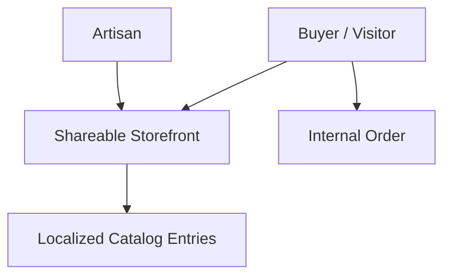

#### Tables

```text
storefronts
storefront_sections
storefront_visits
share_links
```

#### `storefronts`

```sql
CREATE TABLE storefronts (
    id UUID PRIMARY KEY DEFAULT gen_random_uuid(),
    artisan_id UUID NOT NULL UNIQUE REFERENCES artisan_profiles(id) ON DELETE CASCADE,
    slug TEXT NOT NULL UNIQUE,
    display_name TEXT NOT NULL,
    headline TEXT,
    default_language TEXT,
    status TEXT NOT NULL DEFAULT 'ACTIVE',
    created_at TIMESTAMPTZ NOT NULL DEFAULT now(),
    updated_at TIMESTAMPTZ NOT NULL DEFAULT now()
);
```

#### `storefront_sections`

```sql
CREATE TABLE storefront_sections (
    id UUID PRIMARY KEY DEFAULT gen_random_uuid(),
    storefront_id UUID NOT NULL REFERENCES storefronts(id) ON DELETE CASCADE,
    section_type TEXT NOT NULL,
    position INTEGER NOT NULL DEFAULT 0,
    configuration JSONB NOT NULL DEFAULT '{}'::jsonb,
    is_visible BOOLEAN NOT NULL DEFAULT true
);
```

#### `share_links`

```sql
CREATE TABLE share_links (
    id UUID PRIMARY KEY DEFAULT gen_random_uuid(),
    storefront_id UUID NOT NULL REFERENCES storefronts(id) ON DELETE CASCADE,
    channel TEXT NOT NULL,
    token TEXT NOT NULL UNIQUE,
    expires_at TIMESTAMPTZ,
    created_by UUID REFERENCES users(id),
    created_at TIMESTAMPTZ NOT NULL DEFAULT now()
);
```

The initial MVP may simply generate a web link and let the artisan share it through WhatsApp manually. No WhatsApp Business API dependency is required.

---

### Fulfilment, Delivery & Buyer Context

The order model should remain flexible enough to support a basic internal delivery state without pretending to implement a national logistics network.

#### Supporting Tables

```text
order_addresses
fulfilment_events
shipping_quotes
```

#### `order_addresses`

```sql
CREATE TABLE order_addresses (
    id UUID PRIMARY KEY DEFAULT gen_random_uuid(),
    order_id UUID NOT NULL REFERENCES orders(id) ON DELETE CASCADE,
    address_type TEXT NOT NULL,
    recipient_name TEXT,
    phone_number TEXT,
    address_line_1 TEXT NOT NULL,
    address_line_2 TEXT,
    city TEXT,
    district TEXT,
    state TEXT,
    postal_code TEXT,
    country_code CHAR(2) DEFAULT 'IN',
    created_at TIMESTAMPTZ NOT NULL DEFAULT now()
);
```

#### `fulfilment_events`

```sql
CREATE TABLE fulfilment_events (
    id UUID PRIMARY KEY DEFAULT gen_random_uuid(),
    fulfilment_id UUID NOT NULL REFERENCES fulfillments(id) ON DELETE CASCADE,
    event_type TEXT NOT NULL,
    event_time TIMESTAMPTZ NOT NULL DEFAULT now(),
    actor_user_id UUID REFERENCES users(id),
    note TEXT,
    metadata JSONB NOT NULL DEFAULT '{}'::jsonb
);
```

The order state machine remains authoritative in `orders`; fulfilment events provide its operational history.

---

### Earnings & Payout-State Model

The MVP does not need to implement a payment processor, but artisans still need a business-level **Money** view.

#### Earnings Flow


#### Tables

```text
earnings_ledger
payout_accounts
payout_records
```

#### `earnings_ledger`

```sql
CREATE TABLE earnings_ledger (
    id UUID PRIMARY KEY DEFAULT gen_random_uuid(),
    artisan_id UUID NOT NULL REFERENCES artisan_profiles(id),
    order_id UUID REFERENCES orders(id),
    entry_type TEXT NOT NULL,
    amount NUMERIC(12,2) NOT NULL,
    currency CHAR(3) NOT NULL DEFAULT 'INR',
    status TEXT NOT NULL DEFAULT 'POSTED',
    created_at TIMESTAMPTZ NOT NULL DEFAULT now()
);

CREATE INDEX idx_earnings_ledger_artisan ON earnings_ledger(artisan_id, created_at DESC);
```

#### `payout_accounts`

Only store the minimum information needed by the selected payout workflow.

```sql
CREATE TABLE payout_accounts (
    id UUID PRIMARY KEY DEFAULT gen_random_uuid(),
    artisan_id UUID NOT NULL REFERENCES artisan_profiles(id) ON DELETE CASCADE,
    account_type TEXT NOT NULL,
    masked_reference TEXT,
    status TEXT NOT NULL DEFAULT 'PENDING_VERIFICATION',
    created_at TIMESTAMPTZ NOT NULL DEFAULT now(),
    updated_at TIMESTAMPTZ NOT NULL DEFAULT now()
);
```

#### `payout_records`

```sql
CREATE TABLE payout_records (
    id UUID PRIMARY KEY DEFAULT gen_random_uuid(),
    payout_account_id UUID NOT NULL REFERENCES payout_accounts(id),
    amount NUMERIC(12,2) NOT NULL CHECK (amount > 0),
    currency CHAR(3) NOT NULL DEFAULT 'INR',
    status TEXT NOT NULL DEFAULT 'PENDING',
    external_reference TEXT,
    initiated_at TIMESTAMPTZ,
    completed_at TIMESTAMPTZ,
    created_at TIMESTAMPTZ NOT NULL DEFAULT now()
);
```

For the SIH MVP, these tables can power the **My Money** state view without claiming live bank settlement.

---

### Notifications & Actionable Updates

Notifications should be modeled as a delivery concern, not as the business state itself.

#### Notification Flow

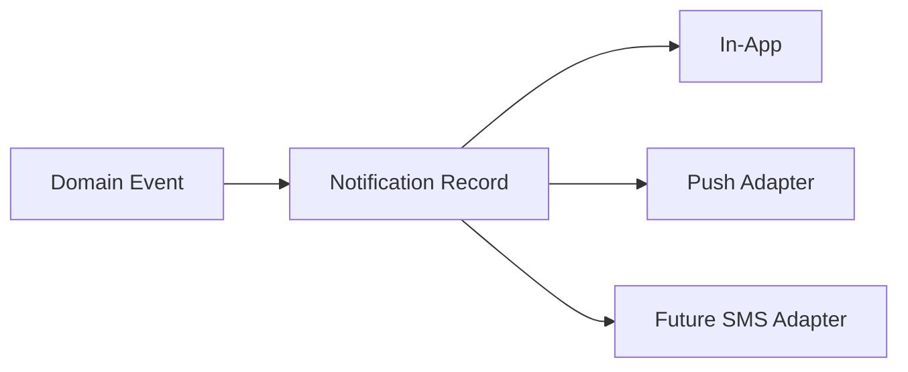

#### Tables

```text
notification_preferences
notifications
notification_deliveries
```

#### `notifications`

```sql
CREATE TABLE notifications (
    id UUID PRIMARY KEY DEFAULT gen_random_uuid(),
    user_id UUID NOT NULL REFERENCES users(id) ON DELETE CASCADE,
    notification_type TEXT NOT NULL,
    title TEXT NOT NULL,
    body TEXT NOT NULL,
    entity_type TEXT,
    entity_id UUID,
    priority SMALLINT NOT NULL DEFAULT 1,
    read_at TIMESTAMPTZ,
    created_at TIMESTAMPTZ NOT NULL DEFAULT now()
);

CREATE INDEX idx_notifications_user ON notifications(user_id, created_at DESC);
```

#### `notification_deliveries`

```sql
CREATE TABLE notification_deliveries (
    id UUID PRIMARY KEY DEFAULT gen_random_uuid(),
    notification_id UUID NOT NULL REFERENCES notifications(id) ON DELETE CASCADE,
    channel TEXT NOT NULL,
    status TEXT NOT NULL DEFAULT 'PENDING',
    provider TEXT,
    external_reference TEXT,
    delivered_at TIMESTAMPTZ,
    error_code TEXT,
    created_at TIMESTAMPTZ NOT NULL DEFAULT now()
);
```

No paid SMS provider is required by the MVP.

---

---

# 13. AI & Voice Tables

## 13.1 `voice_interactions`

```sql
CREATE TABLE voice_interactions (
    id UUID PRIMARY KEY DEFAULT gen_random_uuid(),
    user_id UUID NOT NULL REFERENCES users(id),
    assistance_session_id UUID REFERENCES assistance_sessions(id),
    language_code TEXT,
    audio_object_key TEXT,
    transcript TEXT,
    intent TEXT,
    stt_provider TEXT,
    stt_model TEXT,
    stt_confidence NUMERIC(5,4) CHECK (stt_confidence >= 0 AND stt_confidence <= 1),
    retention_status TEXT NOT NULL DEFAULT 'PROCESSING_ONLY',
    created_at TIMESTAMPTZ NOT NULL DEFAULT now()
);
```

## 13.2 `ai_jobs`

```sql
CREATE TABLE ai_jobs (
    id UUID PRIMARY KEY DEFAULT gen_random_uuid(),
    requested_by UUID REFERENCES users(id),
    voice_interaction_id UUID REFERENCES voice_interactions(id),
    capability TEXT NOT NULL,
    status ai_job_status NOT NULL DEFAULT 'QUEUED',
    priority SMALLINT NOT NULL DEFAULT 1,
    provider TEXT,
    model TEXT,
    input_reference JSONB NOT NULL DEFAULT '{}'::jsonb,
    output_reference JSONB NOT NULL DEFAULT '{}'::jsonb,
    error_code TEXT,
    error_message TEXT,
    started_at TIMESTAMPTZ,
    completed_at TIMESTAMPTZ,
    created_at TIMESTAMPTZ NOT NULL DEFAULT now()
);

CREATE INDEX idx_ai_jobs_status_priority ON ai_jobs(status, priority, created_at);
CREATE INDEX idx_ai_jobs_requested_by ON ai_jobs(requested_by);
```

## 13.3 `ai_decisions`

Stores concise decision evidence and outcome metadata, not hidden chain-of-thought.

```sql
CREATE TABLE ai_decisions (
    id UUID PRIMARY KEY DEFAULT gen_random_uuid(),
    ai_job_id UUID NOT NULL REFERENCES ai_jobs(id) ON DELETE CASCADE,
    entity_type TEXT,
    entity_id UUID,
    action TEXT NOT NULL,
    source_type ai_source_type NOT NULL,
    confidence NUMERIC(5,4) CHECK (confidence >= 0 AND confidence <= 1),
    factors JSONB NOT NULL DEFAULT '[]'::jsonb,
    evidence JSONB NOT NULL DEFAULT '[]'::jsonb,
    proposed_value JSONB NOT NULL DEFAULT '{}'::jsonb,
    confirmation_status TEXT NOT NULL DEFAULT 'PENDING',
    created_at TIMESTAMPTZ NOT NULL DEFAULT now()
);

CREATE INDEX idx_ai_decisions_entity ON ai_decisions(entity_type, entity_id);
CREATE INDEX idx_ai_decisions_job ON ai_decisions(ai_job_id);
```

## 13.4 `ai_corrections`

```sql
CREATE TABLE ai_corrections (
    id UUID PRIMARY KEY DEFAULT gen_random_uuid(),
    ai_decision_id UUID NOT NULL REFERENCES ai_decisions(id) ON DELETE CASCADE,
    reported_by UUID NOT NULL REFERENCES users(id),
    reason_code TEXT NOT NULL,
    corrected_value JSONB,
    notes TEXT,
    created_at TIMESTAMPTZ NOT NULL DEFAULT now()
);
```

## 13.5 `price_recommendations`

```sql
CREATE TABLE price_recommendations (
    id UUID PRIMARY KEY DEFAULT gen_random_uuid(),
    product_id UUID NOT NULL REFERENCES products(id) ON DELETE CASCADE,
    ai_decision_id UUID REFERENCES ai_decisions(id),
    cost_floor NUMERIC(12,2),
    comparable_low NUMERIC(12,2),
    comparable_high NUMERIC(12,2),
    suggested_price NUMERIC(12,2),
    confidence NUMERIC(5,4) CHECK (confidence >= 0 AND confidence <= 1),
    calculation_method TEXT NOT NULL,
    is_selected BOOLEAN NOT NULL DEFAULT false,
    created_at TIMESTAMPTZ NOT NULL DEFAULT now()
);

CREATE INDEX idx_price_recommendations_product ON price_recommendations(product_id, created_at DESC);
```

## 13.6 `market_comparables`

```sql
CREATE TABLE market_comparables (
    id UUID PRIMARY KEY DEFAULT gen_random_uuid(),
    source_name TEXT NOT NULL,
    external_reference TEXT,
    product_category TEXT,
    craft_type TEXT,
    material TEXT,
    region TEXT,
    observed_price NUMERIC(12,2) CHECK (observed_price >= 0),
    observed_at TIMESTAMPTZ,
    metadata JSONB NOT NULL DEFAULT '{}'::jsonb,
    created_at TIMESTAMPTZ NOT NULL DEFAULT now()
);
```

---

### Voice, Intent & Conversation Data Model

Voice is a primary interface, not merely an STT utility. The database should retain enough structured information to reconstruct what happened without retaining unnecessary raw audio indefinitely.

#### Voice Interaction Flow


#### Supporting Tables

```text
voice_intents
voice_entities
voice_confirmations
```

#### `voice_intents`

```sql
CREATE TABLE voice_intents (
    id UUID PRIMARY KEY DEFAULT gen_random_uuid(),
    voice_interaction_id UUID NOT NULL REFERENCES voice_interactions(id) ON DELETE CASCADE,
    intent_name TEXT NOT NULL,
    confidence NUMERIC(5,4) CHECK (confidence BETWEEN 0 AND 1),
    entities JSONB NOT NULL DEFAULT '{}'::jsonb,
    proposed_action JSONB NOT NULL DEFAULT '{}'::jsonb,
    created_at TIMESTAMPTZ NOT NULL DEFAULT now()
);
```

#### `voice_confirmations`

```sql
CREATE TABLE voice_confirmations (
    id UUID PRIMARY KEY DEFAULT gen_random_uuid(),
    voice_interaction_id UUID NOT NULL REFERENCES voice_interactions(id) ON DELETE CASCADE,
    confirmation_method TEXT NOT NULL,
    confirmation_status TEXT NOT NULL,
    confirmed_by UUID REFERENCES users(id),
    created_at TIMESTAMPTZ NOT NULL DEFAULT now()
);
```

Critical rule:

```text
voice_interactions
    ↓
voice_intents
    ↓
AI decision
    ↓
confirmation
    ↓
deterministic domain service
```

Never:

```text
voice transcript → direct UPDATE products/orders/inventory
```

---

### Costing & Dynamic Price-Advice Model

Dynamic pricing requires more than one `suggested_price` column. The database should preserve the evidence used to produce a recommendation.

#### Pricing Data Flow

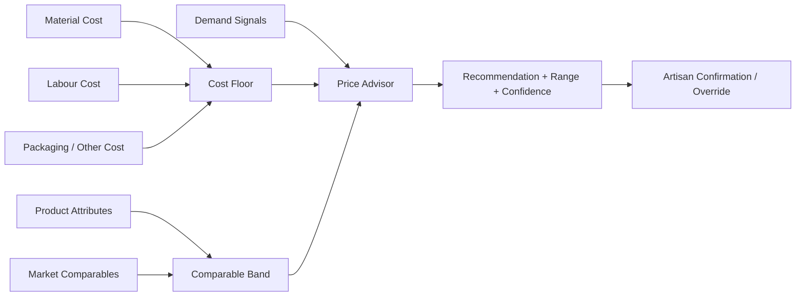

#### Supporting Tables

```text
product_costs
labour_rate_profiles
pricing_runs
pricing_factors
pricing_overrides
```

#### `product_costs`

```sql
CREATE TABLE product_costs (
    id UUID PRIMARY KEY DEFAULT gen_random_uuid(),
    product_id UUID NOT NULL REFERENCES products(id) ON DELETE CASCADE,
    material_cost NUMERIC(12,2) NOT NULL DEFAULT 0 CHECK (material_cost >= 0),
    labour_hours NUMERIC(8,2) CHECK (labour_hours >= 0),
    labour_cost NUMERIC(12,2) NOT NULL DEFAULT 0 CHECK (labour_cost >= 0),
    packaging_cost NUMERIC(12,2) NOT NULL DEFAULT 0 CHECK (packaging_cost >= 0),
    other_cost NUMERIC(12,2) NOT NULL DEFAULT 0 CHECK (other_cost >= 0),
    currency CHAR(3) NOT NULL DEFAULT 'INR',
    source_type ai_source_type NOT NULL DEFAULT 'USER_PROVIDED',
    created_at TIMESTAMPTZ NOT NULL DEFAULT now()
);

CREATE INDEX idx_product_costs_product ON product_costs(product_id, created_at DESC);
```

#### `labour_rate_profiles`

```sql
CREATE TABLE labour_rate_profiles (
    id UUID PRIMARY KEY DEFAULT gen_random_uuid(),
    organization_id UUID REFERENCES organizations(id),
    craft_type TEXT,
    region TEXT,
    hourly_rate NUMERIC(12,2) NOT NULL CHECK (hourly_rate >= 0),
    currency CHAR(3) NOT NULL DEFAULT 'INR',
    valid_from DATE NOT NULL,
    valid_to DATE,
    created_at TIMESTAMPTZ NOT NULL DEFAULT now()
);
```

#### `pricing_runs`

```sql
CREATE TABLE pricing_runs (
    id UUID PRIMARY KEY DEFAULT gen_random_uuid(),
    product_id UUID NOT NULL REFERENCES products(id) ON DELETE CASCADE,
    recommendation_id UUID REFERENCES price_recommendations(id),
    method TEXT NOT NULL,
    model_name TEXT,
    model_version TEXT,
    market_data_available BOOLEAN NOT NULL DEFAULT false,
    confidence NUMERIC(5,4) CHECK (confidence BETWEEN 0 AND 1),
    created_at TIMESTAMPTZ NOT NULL DEFAULT now()
);
```

#### `pricing_factors`

```sql
CREATE TABLE pricing_factors (
    id UUID PRIMARY KEY DEFAULT gen_random_uuid(),
    pricing_run_id UUID NOT NULL REFERENCES pricing_runs(id) ON DELETE CASCADE,
    factor_name TEXT NOT NULL,
    factor_value JSONB NOT NULL,
    contribution NUMERIC(12,4),
    source_reference TEXT
);
```

#### `pricing_overrides`

```sql
CREATE TABLE pricing_overrides (
    id UUID PRIMARY KEY DEFAULT gen_random_uuid(),
    recommendation_id UUID NOT NULL REFERENCES price_recommendations(id) ON DELETE CASCADE,
    previous_price NUMERIC(12,2),
    selected_price NUMERIC(12,2) NOT NULL,
    overridden_by UUID NOT NULL REFERENCES users(id),
    reason TEXT,
    created_at TIMESTAMPTZ NOT NULL DEFAULT now()
);
```

This lets the system explain pricing in plain language without storing model chain-of-thought.

---

### AI Decision Review & Dispute Model

The architecture requires AI auditability without storing hidden chain-of-thought. The database should therefore make **decision evidence, confidence, correction and dispute** explicit.

#### Review Flow

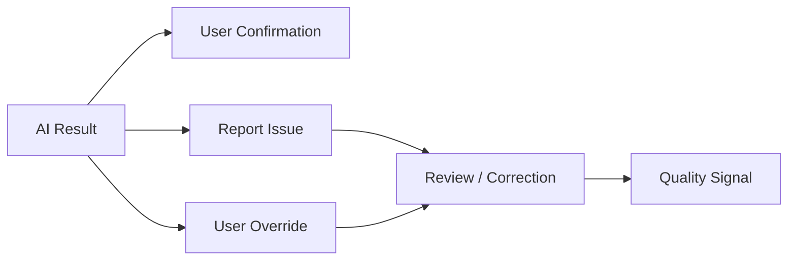

#### Supporting table

```text
ai_issue_reports
```

```sql
CREATE TABLE ai_issue_reports (
    id UUID PRIMARY KEY DEFAULT gen_random_uuid(),
    ai_decision_id UUID NOT NULL REFERENCES ai_decisions(id) ON DELETE CASCADE,
    reported_by UUID NOT NULL REFERENCES users(id),
    issue_type TEXT NOT NULL,
    description TEXT,
    severity TEXT NOT NULL DEFAULT 'MEDIUM',
    resolution_status TEXT NOT NULL DEFAULT 'OPEN',
    resolved_by UUID REFERENCES users(id),
    resolution_notes TEXT,
    created_at TIMESTAMPTZ NOT NULL DEFAULT now(),
    resolved_at TIMESTAMPTZ
);
```

This is the database representation of a **Report / Correct AI Output** workflow.

---

---

# 14. B2B & Market Access Tables

## 14.1 `buyer_requirements`

```sql
CREATE TABLE buyer_requirements (
    id UUID PRIMARY KEY DEFAULT gen_random_uuid(),
    buyer_id UUID NOT NULL REFERENCES customers(id),
    title TEXT NOT NULL,
    description TEXT,
    delivery_deadline TIMESTAMPTZ,
    status TEXT NOT NULL DEFAULT 'OPEN',
    created_at TIMESTAMPTZ NOT NULL DEFAULT now(),
    updated_at TIMESTAMPTZ NOT NULL DEFAULT now()
);
```

## 14.2 `buyer_requirement_items`

```sql
CREATE TABLE buyer_requirement_items (
    id UUID PRIMARY KEY DEFAULT gen_random_uuid(),
    requirement_id UUID NOT NULL REFERENCES buyer_requirements(id) ON DELETE CASCADE,
    category TEXT,
    craft_type TEXT,
    material TEXT,
    target_quantity INTEGER CHECK (target_quantity > 0),
    target_price_min NUMERIC(12,2),
    target_price_max NUMERIC(12,2),
    required_region TEXT,
    required_metadata JSONB NOT NULL DEFAULT '{}'::jsonb
);
```

## 14.3 `quotations`

```sql
CREATE TABLE quotations (
    id UUID PRIMARY KEY DEFAULT gen_random_uuid(),
    requirement_id UUID NOT NULL REFERENCES buyer_requirements(id),
    cluster_id UUID REFERENCES clusters(id),
    submitted_by UUID NOT NULL REFERENCES users(id),
    status TEXT NOT NULL DEFAULT 'DRAFT',
    total_amount NUMERIC(12,2),
    estimated_delivery_at TIMESTAMPTZ,
    notes TEXT,
    created_at TIMESTAMPTZ NOT NULL DEFAULT now(),
    updated_at TIMESTAMPTZ NOT NULL DEFAULT now()
);
```

## 14.4 `quotation_items`

```sql
CREATE TABLE quotation_items (
    id UUID PRIMARY KEY DEFAULT gen_random_uuid(),
    quotation_id UUID NOT NULL REFERENCES quotations(id) ON DELETE CASCADE,
    variant_id UUID REFERENCES product_variants(id),
    quantity INTEGER NOT NULL CHECK (quantity > 0),
    unit_price NUMERIC(12,2) NOT NULL CHECK (unit_price >= 0),
    notes TEXT
);
```

## 14.5 Market Readiness

```sql
CREATE TABLE market_readiness (
    id UUID PRIMARY KEY DEFAULT gen_random_uuid(),
    cluster_id UUID REFERENCES clusters(id),
    artisan_id UUID REFERENCES artisan_profiles(id),
    channel TEXT NOT NULL,
    readiness_status TEXT NOT NULL DEFAULT 'IN_PROGRESS',
    updated_at TIMESTAMPTZ NOT NULL DEFAULT now()
);

CREATE TABLE market_readiness_items (
    id UUID PRIMARY KEY DEFAULT gen_random_uuid(),
    market_readiness_id UUID NOT NULL REFERENCES market_readiness(id) ON DELETE CASCADE,
    requirement_code TEXT NOT NULL,
    title TEXT NOT NULL,
    status TEXT NOT NULL,
    explanation TEXT,
    next_step TEXT,
    requires_assistance BOOLEAN NOT NULL DEFAULT false,
    UNIQUE (market_readiness_id, requirement_code)
);
```

---

### Demand Matching & Opportunity Model

The Market Access Engine is more than a quotation table. It needs to persist the buyer demand signal and the platform's explainable matching result.

#### Matching Flow

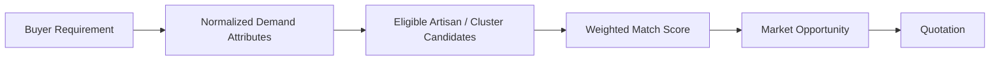

#### Supporting Tables

```text
market_opportunities
market_matches
market_match_factors
cluster_capacity_snapshots
```

#### `market_opportunities`

```sql
CREATE TABLE market_opportunities (
    id UUID PRIMARY KEY DEFAULT gen_random_uuid(),
    buyer_requirement_id UUID NOT NULL REFERENCES buyer_requirements(id) ON DELETE CASCADE,
    status TEXT NOT NULL DEFAULT 'OPEN',
    expires_at TIMESTAMPTZ,
    created_at TIMESTAMPTZ NOT NULL DEFAULT now(),
    updated_at TIMESTAMPTZ NOT NULL DEFAULT now()
);
```

#### `market_matches`

```sql
CREATE TABLE market_matches (
    id UUID PRIMARY KEY DEFAULT gen_random_uuid(),
    opportunity_id UUID NOT NULL REFERENCES market_opportunities(id) ON DELETE CASCADE,
    artisan_id UUID REFERENCES artisan_profiles(id),
    cluster_id UUID REFERENCES clusters(id),
    score NUMERIC(7,4) NOT NULL,
    score_version TEXT NOT NULL,
    status TEXT NOT NULL DEFAULT 'SUGGESTED',
    generated_at TIMESTAMPTZ NOT NULL DEFAULT now()
);

CREATE INDEX idx_market_matches_opportunity ON market_matches(opportunity_id, score DESC);
```

#### `market_match_factors`

```sql
CREATE TABLE market_match_factors (
    id UUID PRIMARY KEY DEFAULT gen_random_uuid(),
    match_id UUID NOT NULL REFERENCES market_matches(id) ON DELETE CASCADE,
    factor_name TEXT NOT NULL,
    weight NUMERIC(7,4),
    normalized_score NUMERIC(7,4),
    explanation TEXT
);
```

The UI should be able to say:

```text
Strong match because:
✓ same craft
✓ within buyer price range
✓ quantity available
✓ delivery date achievable
```

without exposing model internals.

#### `cluster_capacity_snapshots`

```sql
CREATE TABLE cluster_capacity_snapshots (
    id UUID PRIMARY KEY DEFAULT gen_random_uuid(),
    cluster_id UUID NOT NULL REFERENCES clusters(id),
    craft_type TEXT,
    available_quantity INTEGER NOT NULL DEFAULT 0,
    estimated_monthly_capacity INTEGER,
    snapshot_date DATE NOT NULL,
    source_type ai_source_type NOT NULL DEFAULT 'USER_PROVIDED',
    created_at TIMESTAMPTZ NOT NULL DEFAULT now()
);
```

---

### ONDC / External Market Integration Persistence Boundary

The database must support external market adapters without importing their protocol into the core commerce schema.

#### Integration Boundary

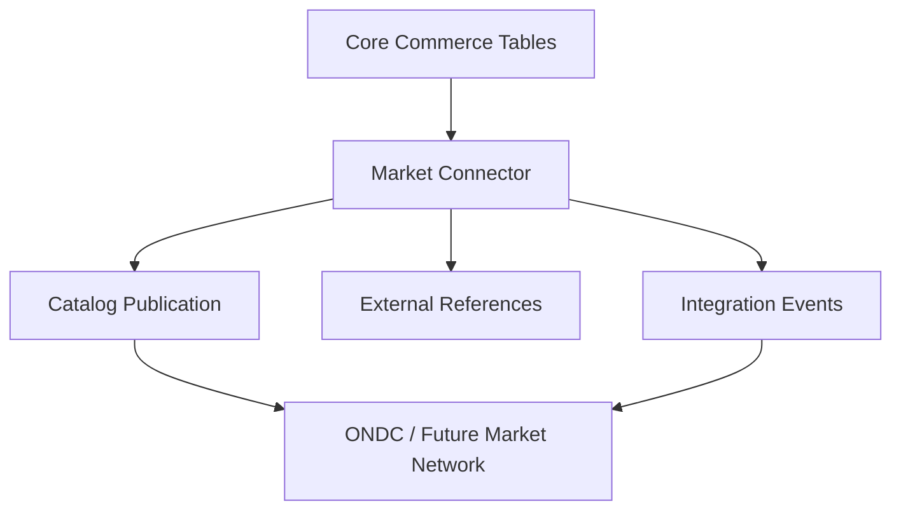

#### Supporting Tables

```text
market_channels
external_entity_references
integration_events
integration_sync_states
```

#### `market_channels`

```sql
CREATE TABLE market_channels (
    code TEXT PRIMARY KEY,
    display_name TEXT NOT NULL,
    channel_type TEXT NOT NULL,
    status TEXT NOT NULL DEFAULT 'ACTIVE',
    configuration JSONB NOT NULL DEFAULT '{}'::jsonb
);
```

#### `external_entity_references`

```sql
CREATE TABLE external_entity_references (
    id UUID PRIMARY KEY DEFAULT gen_random_uuid(),
    channel_code TEXT NOT NULL REFERENCES market_channels(code),
    entity_type TEXT NOT NULL,
    entity_id UUID NOT NULL,
    external_id TEXT NOT NULL,
    external_version TEXT,
    status TEXT NOT NULL DEFAULT 'ACTIVE',
    metadata JSONB NOT NULL DEFAULT '{}'::jsonb,
    created_at TIMESTAMPTZ NOT NULL DEFAULT now(),
    updated_at TIMESTAMPTZ NOT NULL DEFAULT now(),
    UNIQUE (channel_code, entity_type, entity_id),
    UNIQUE (channel_code, entity_type, external_id)
);
```

#### `integration_events`

```sql
CREATE TABLE integration_events (
    id UUID PRIMARY KEY DEFAULT gen_random_uuid(),
    channel_code TEXT NOT NULL REFERENCES market_channels(code),
    direction TEXT NOT NULL,
    event_type TEXT NOT NULL,
    entity_type TEXT,
    entity_id UUID,
    request_reference TEXT,
    response_reference TEXT,
    status TEXT NOT NULL DEFAULT 'RECEIVED',
    payload_metadata JSONB NOT NULL DEFAULT '{}'::jsonb,
    created_at TIMESTAMPTZ NOT NULL DEFAULT now()
);
```

The actual ONDC domain/version payload remains an adapter concern. The core database stores normalized business state plus enough external references/event history for reconciliation.

---

### Government / GeM Readiness Model

The MVP supports guided readiness, not production registration.

#### Readiness Model

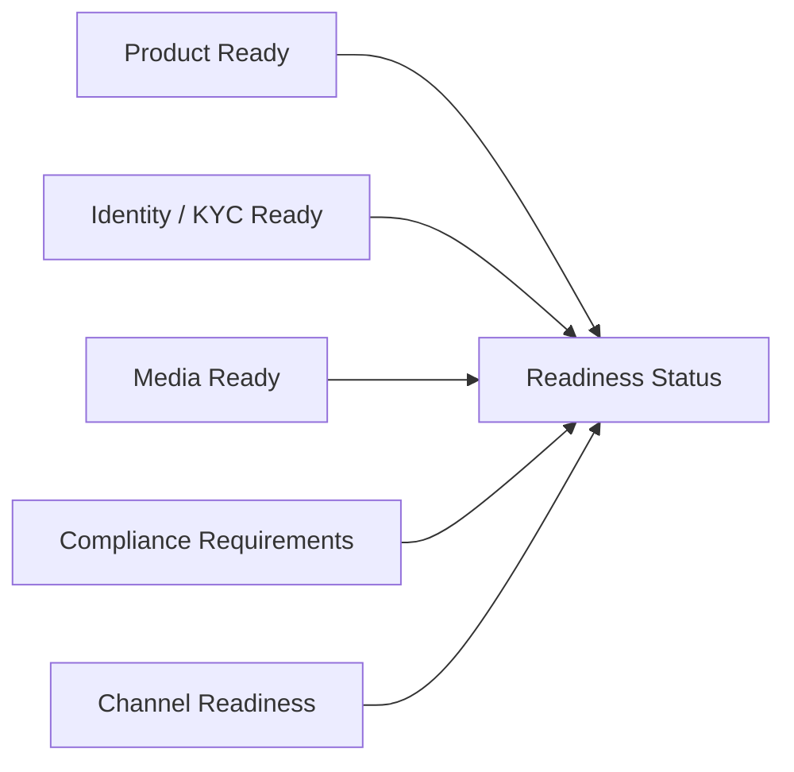

The existing `market_readiness` / `market_readiness_items` tables should represent channel-neutral requirements. GeM-specific requirements are configuration/reference data rather than hardcoded columns in artisan records.

Example requirement configuration:

```json
{
  "channel": "GOVERNMENT",
  "requirement_code": "PAN",
  "severity": "BLOCKING",
  "assistance_recommended": true
}
```

This supports future government channels without redesigning the artisan schema.

---

---

# 15. Offline Sync & Conflict Tables

## 15.1 `sync_queue_items`

```sql
CREATE TABLE sync_queue_items (
    id UUID PRIMARY KEY DEFAULT gen_random_uuid(),
    actor_user_id UUID NOT NULL REFERENCES users(id),
    device_id UUID REFERENCES devices(id),
    entity_type TEXT NOT NULL,
    entity_id UUID NOT NULL,
    operation_type TEXT NOT NULL,
    payload JSONB NOT NULL,
    client_timestamp TIMESTAMPTZ NOT NULL,
    base_revision BIGINT NOT NULL,
    idempotency_key TEXT NOT NULL UNIQUE,
    status sync_item_status NOT NULL DEFAULT 'PENDING',
    error_code TEXT,
    error_message TEXT,
    created_at TIMESTAMPTZ NOT NULL DEFAULT now(),
    processed_at TIMESTAMPTZ
);

CREATE INDEX idx_sync_queue_pending ON sync_queue_items(status, created_at)
WHERE status IN ('PENDING', 'SYNCING');
CREATE INDEX idx_sync_queue_entity ON sync_queue_items(entity_type, entity_id);
```

## 15.2 `sync_conflicts`

```sql
CREATE TABLE sync_conflicts (
    id UUID PRIMARY KEY DEFAULT gen_random_uuid(),
    sync_queue_item_id UUID NOT NULL REFERENCES sync_queue_items(id),
    entity_type TEXT NOT NULL,
    entity_id UUID NOT NULL,
    client_revision BIGINT NOT NULL,
    server_revision BIGINT NOT NULL,
    server_snapshot JSONB NOT NULL,
    client_snapshot JSONB NOT NULL,
    critical_fields JSONB NOT NULL DEFAULT '[]'::jsonb,
    status conflict_status NOT NULL DEFAULT 'OPEN',
    created_at TIMESTAMPTZ NOT NULL DEFAULT now(),
    updated_at TIMESTAMPTZ NOT NULL DEFAULT now()
);

CREATE INDEX idx_sync_conflicts_open ON sync_conflicts(status, created_at)
WHERE status = 'OPEN';
```

## 15.3 `sync_conflict_resolutions`

```sql
CREATE TABLE sync_conflict_resolutions (
    id UUID PRIMARY KEY DEFAULT gen_random_uuid(),
    conflict_id UUID NOT NULL REFERENCES sync_conflicts(id) ON DELETE CASCADE,
    resolved_by UUID NOT NULL REFERENCES users(id),
    resolution_type TEXT NOT NULL,
    selected_version TEXT,
    merged_snapshot JSONB,
    reason TEXT,
    created_at TIMESTAMPTZ NOT NULL DEFAULT now()
);
```

### Conflict Rule

```text
Client revision == Server revision
    → normal mutation

Client revision < Server revision
    → conflict evaluation

Safe fields
    → auto-merge where deterministic

Critical fields
    → user-mediated resolution

Inventory / order conflicts
    → deterministic domain validation before commit
```

---

---

# 16. Verification, Audit & Data Rights Tables

## 16.1 `verifications`

```sql
CREATE TABLE verifications (
    id UUID PRIMARY KEY DEFAULT gen_random_uuid(),
    subject_type TEXT NOT NULL,
    subject_id UUID NOT NULL,
    verification_type TEXT NOT NULL,
    status TEXT NOT NULL DEFAULT 'PENDING',
    verified_by UUID REFERENCES users(id),
    evidence JSONB NOT NULL DEFAULT '{}'::jsonb,
    verified_at TIMESTAMPTZ,
    created_at TIMESTAMPTZ NOT NULL DEFAULT now()
);
```

## 16.2 `audit_events`

```sql
CREATE TABLE audit_events (
    id UUID PRIMARY KEY DEFAULT gen_random_uuid(),
    actor_user_id UUID REFERENCES users(id),
    device_id UUID REFERENCES devices(id),
    assistance_session_id UUID REFERENCES assistance_sessions(id),
    action TEXT NOT NULL,
    entity_type TEXT,
    entity_id UUID,
    source_channel TEXT,
    previous_version BIGINT,
    resulting_version BIGINT,
    metadata JSONB NOT NULL DEFAULT '{}'::jsonb,
    created_at TIMESTAMPTZ NOT NULL DEFAULT now()
);

CREATE INDEX idx_audit_events_entity ON audit_events(entity_type, entity_id, created_at DESC);
CREATE INDEX idx_audit_events_actor ON audit_events(actor_user_id, created_at DESC);
```

Audit rows are append-only from the application perspective.

## 16.3 `data_export_requests`

```sql
CREATE TABLE data_export_requests (
    id UUID PRIMARY KEY DEFAULT gen_random_uuid(),
    requested_by UUID NOT NULL REFERENCES users(id),
    status TEXT NOT NULL DEFAULT 'PENDING',
    export_object_key TEXT,
    created_at TIMESTAMPTZ NOT NULL DEFAULT now(),
    completed_at TIMESTAMPTZ,
    expires_at TIMESTAMPTZ
);
```

## 16.4 `data_deletion_requests`

```sql
CREATE TABLE data_deletion_requests (
    id UUID PRIMARY KEY DEFAULT gen_random_uuid(),
    requested_by UUID NOT NULL REFERENCES users(id),
    scope JSONB NOT NULL,
    status TEXT NOT NULL DEFAULT 'PENDING',
    approved_by UUID REFERENCES users(id),
    created_at TIMESTAMPTZ NOT NULL DEFAULT now(),
    completed_at TIMESTAMPTZ
);
```

Deletion must respect transactional and audit-retention requirements.

---

---

# 17. Database Class / Responsibility Mapping

| Database area | Authoritative responsibility |
|---|---|
| `users`, `roles`, `user_roles` | Identity and access model |
| `devices` | Trusted-device registration |
| `organizations`, `clusters` | Deployment hierarchy |
| `artisan_profiles` | Artisan business identity |
| `assistance_sessions` | Scoped Didi/CRP access |
| `products`, `product_variants` | Sellable product model |
| `product_media`, `production_stories` | Product/craft media |
| `catalog_entries` | Channel/language publication representation |
| `inventory` | Authoritative stock state |
| `inventory_reservations` | Temporary stock allocation |
| `inventory_movements` | Immutable inventory audit trail |
| `orders`, `order_items` | Commerce order state |
| `fulfillments` | Delivery state |
| `payment_records` | Payment/earnings state representation |
| `ai_jobs`, `ai_decisions` | AI execution and decision evidence |
| `price_recommendations` | Price advisory output |
| `market_comparables` | Pricing/market evidence |
| `buyer_requirements`, `quotations` | B2B workflow |
| `market_readiness*` | Government/channel readiness |
| `sync_queue_items` | Offline operation queue |
| `sync_conflicts*` | Conflict state and resolution |
| `audit_events` | System accountability |
| `data_export_requests` | Data portability |
| `data_deletion_requests` | Data deletion workflow |

---

### 17.1 Operational Analytics Foundations

Analytics should not replace the operational schema. The MVP can derive metrics from operational events and add denormalized analytics later.

Useful derived metrics include:

```text
Time to first listing
Time to first sale
CRP assistance rate
AI correction rate
AI fallback rate
Conflict rate
Inventory oversell prevention events
Listing-to-order conversion
Average order value
Market opportunity response rate
Quotation acceptance rate
Artisan independence progression
```

## 55.1 Event Model

The existing `audit_events`, `ai_jobs`, `notifications`, `orders`, `sync_queue_items` and assistance tables provide the event sources needed for the first metrics layer.

A separate analytics warehouse is explicitly **not required for MVP**.

---

---

# 18. Core State Machines

## 18.1 Product

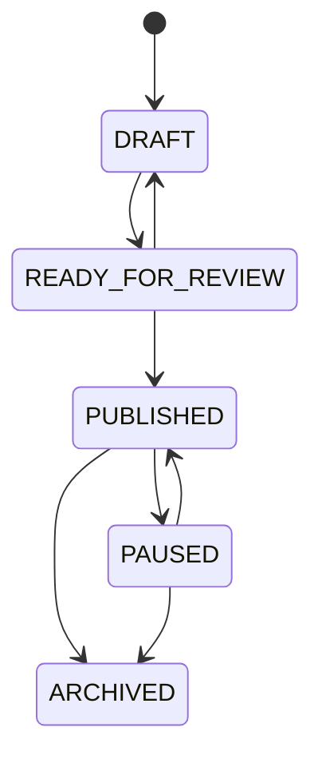

## 18.2 Inventory Reservation

```mermaid
stateDiagram-v2
    [*] --> ACTIVE
    ACTIVE --> CONFIRMED
    ACTIVE --> RELEASED
    ACTIVE --> EXPIRED
    ACTIVE --> CANCELLED
```

## 18.3 Order

```mermaid
stateDiagram-v2
    [*] --> NEW
    NEW --> CONFIRMED
    NEW --> CANCELLED
    CONFIRMED --> PREPARING
    CONFIRMED --> CANCELLED
    PREPARING --> SHIPPED
    PREPARING --> RETURN_REQUESTED
    SHIPPED --> DELIVERED
    SHIPPED --> RETURN_REQUESTED
    DELIVERED --> COMPLETED
    DELIVERED --> RETURN_REQUESTED
    RETURN_REQUESTED --> REFUNDED
    RETURN_REQUESTED --> REJECTED
```

## 18.4 AI Job

```mermaid
stateDiagram-v2
    [*] --> QUEUED
    QUEUED --> RUNNING
    QUEUED --> CANCELLED
    RUNNING --> SUCCEEDED
    RUNNING --> FAILED
    RUNNING --> CANCELLED
```

## 18.5 Sync Item

```mermaid
stateDiagram-v2
    [*] --> PENDING
    PENDING --> SYNCING
    SYNCING --> SYNCED
    SYNCING --> CONFLICT
    SYNCING --> FAILED
    PENDING --> CANCELLED
    FAILED --> SYNCING
    CONFLICT --> SYNCING
```

---

---

# 19. Critical Database Constraints

The following rules are architectural requirements, not optional implementation details.

## 19.1 Inventory

- `available_quantity >= 0`
- `reserved_quantity >= 0`
- reservation quantity must be positive
- inventory revision must increase for every successful mutation
- movement rows are append-only
- reservation/stock changes occur transactionally
- stale revisions must be rejected

## 19.2 Orders

- order items must contain positive quantities
- money values must never be negative
- historical unit prices are snapshotted in `order_items`
- invalid order transitions must be rejected server-side

## 19.3 Authorization

- an Artisan may modify only owned resources
- a CRP/Didi may modify only assigned resources within session scope
- Institution Admin access is limited to its organization hierarchy
- Platform Admin actions must be auditable
- sensitive actions may require artisan confirmation

## 19.4 AI

- no AI result directly mutates commerce state
- externally generated claims require confirmation/verification before publication
- confidence values must remain bounded when stored
- raw voice/media retention must follow explicit policy

## 19.5 Sync

- idempotency keys must be unique
- stale revisions must produce conflict rather than silent overwrite
- conflict resolution must be auditable

---

### 19.1 Extended Domain Integrity Rules

### Identity

```text
A user may have multiple roles.
A user may have multiple registered devices.
A device can be revoked without deleting the user.
An artisan profile belongs to exactly one user.
```

### Organization

```text
A cluster belongs to one organization.
An artisan may belong to at most one primary cluster in MVP.
CRP/Didi access is restricted by assignment + AssistanceSession scope.
```

### Product

```text
A product belongs to one artisan.
A variant belongs to one product.
Media belongs to a product and optionally a variant.
Original media cannot be silently replaced by an enhancement.
```

### Inventory

```text
One variant has one authoritative inventory row in MVP.
Available quantity cannot become negative.
Reserved quantity cannot become negative.
Reservations cannot exceed available stock.
Every mutation creates an InventoryMovement.
Every critical mutation validates the current version.
```

### Orders

```text
Order items preserve product/variant snapshots.
Order totals are deterministic.
Order state transitions follow the defined state machine.
An order cannot commit inventory twice.
Cancellation releases the correct reservation exactly once.
```

### AI

```text
AI output is never authoritative commerce state.
AI decisions record source, confidence and evidence where applicable.
Critical mutations require confirmation.
AI corrections are auditable.
```

### Sync

```text
Each offline mutation has an idempotency key.
A stale base revision cannot silently overwrite server state.
Critical conflicts require explicit resolution.
Resolution is itself auditable.
```

### Data rights

```text
Exports are attributable to the requesting user.
Deletion cannot remove required transactional/audit records blindly.
Raw voice can expire after processing unless retained intentionally.
```

---

---

# 20. Indexing Strategy

Indexes should support the most common access patterns without indiscriminately indexing every column.

## Required MVP Index Families

```text
users
  → phone_number UNIQUE

artisan_profiles
  → cluster_id

assistance_sessions
  → artisan_id
  → crp_user_id
  → active-session partial index

products
  → artisan_id
  → status
  → craft_type

product_variants
  → product_id
  → sku UNIQUE

inventory
  → variant_id UNIQUE

inventory_reservations
  → variant_id + active status
  → order_id

inventory_movements
  → variant_id + created_at DESC
  → order_id

orders
  → customer_id
  → status
  → created_at DESC

order_items
  → order_id
  → variant_id

ai_jobs
  → status + priority + created_at

sync_queue_items
  → status + created_at
  → entity_type + entity_id

sync_conflicts
  → open status + created_at

audit_events
  → entity_type + entity_id + created_at
  → actor_user_id + created_at
```

---

### 20.1 Recommended Access-Pattern Index Set

```text
Identity
- users(phone_number)
- devices(user_id, status)
- clusters(organization_id)
- artisan_profiles(cluster_id)

Products
- products(artisan_id, status)
- products(craft_type, category)
- product_variants(product_id)
- product_variants(sku)
- catalog_entries(product_id, language_code, channel)

Commerce
- inventory(variant_id)
- inventory_reservations(variant_id, status)
- inventory_movements(variant_id, created_at DESC)
- orders(customer_id, created_at DESC)
- orders(status, created_at DESC)
- order_items(order_id)

AI
- ai_jobs(status, priority, created_at)
- ai_decisions(entity_type, entity_id)
- price_recommendations(product_id, created_at DESC)

Market
- buyer_requirements(status, delivery_deadline)
- market_matches(opportunity_id, score DESC)
- quotations(requirement_id, status)

Sync
- sync_queue_items(status, created_at)
- sync_queue_items(entity_type, entity_id)
- sync_conflicts(status, created_at)

Governance
- audit_events(entity_type, entity_id, created_at DESC)
- audit_events(actor_user_id, created_at DESC)
- notifications(user_id, created_at DESC)
```

Partial/filtered indexes should be used where they materially reduce queue or conflict scans.

---

---

# 21. Row-Level Security Strategy

Supabase/PostgreSQL RLS should reinforce application authorization, not replace it.

## 21.1 Artisan

```text
ARTISAN
  → own artisan profile
  → own products
  → own variants
  → own inventory
  → own stories
  → own orders/earnings view
```

## 21.2 CRP / Didi

```text
CRP / DIDI
  → assigned artisans only
  → only while permitted by assistance scope
  → sensitive mutations require confirmation
```

## 21.3 Institution Admin

```text
INSTITUTION ADMIN
  → own organization
  → own clusters
  → assigned deployment/reporting scope
```

## 21.4 Platform Admin

Platform Admin has privileged access, but every sensitive access must generate an audit event.

## 21.5 RLS Rule of Thumb

```text
Application authorization
        +
Database RLS where practical
        +
Domain workflow validation
        =
Defense in depth
```

---

---

# 22. Transaction Boundaries

Transactions are required for operations where multiple rows represent one business action.

## 22.1 Reserve Inventory

```text
BEGIN
  → validate variant
  → validate inventory revision
  → validate available quantity
  → decrement available quantity
  → increment reserved quantity
  → create reservation
  → create inventory movement
  → increment inventory version
COMMIT
```

## 22.2 Confirm Order

```text
BEGIN
  → validate order state
  → validate reservation
  → commit reservation
  → create order item snapshots if not already present
  → update order state
  → write audit event
COMMIT
```

## 22.3 Offline Conflict Resolution

```text
BEGIN
  → load current server version
  → validate client base revision
  → apply accepted/merged change
  → increment entity version
  → create audit event
  → record resolution
COMMIT
```

## 22.4 Publish Product

```text
BEGIN
  → validate required fields
  → validate confirmation state
  → validate media
  → update product status
  → create/update catalog entry
  → write audit event
COMMIT
```

---

---

# 23. Triggers / Database Functions

Database functions should remain limited to integrity concerns. Business workflows belong in the domain layer.

Recommended DB-level helpers:

```text
set_updated_at()
validate_non_negative_money()
validate_revision()
```

A generic `updated_at` trigger may be used for mutable tables.

Inventory reservation logic should remain an explicit transactional domain operation so it can be tested independently and logged with actor/session context.

---

---

# 24. Drizzle ORM Mapping

The database is PostgreSQL-first, with Drizzle used as the application schema/query layer.

Expected project structure:

```text
backend/
└── app/
    ├── db/
    │   ├── client.py
    │   ├── schema/
    │   ├── migrations/
    │   └── seeds/
    └── modules/
        ├── auth/
        ├── artisans/
        ├── products/
        ├── inventory/
        ├── orders/
        ├── market/
        ├── ai/
        └── sync/
```

The exact Drizzle runtime/language binding must follow the final backend implementation choice; the PostgreSQL schema remains authoritative and portable.

---

---

# 25. Migration Strategy

## 25.1 Migration Rules

1. Every schema change is a migration.
2. Migrations are committed to version control.
3. Production migrations must be forward-compatible where practical.
4. Destructive migrations require a separate reviewed migration step.
5. Seed data must be separate from schema migrations.
6. No manual production schema edits should become the source of truth.

## 25.2 Migration Order

```text
001_extensions
002_enums
003_identity
004_organizations_clusters
005_artisans_assistance
006_products_catalog
007_inventory
008_orders
009_ai
010_market
011_sync_conflicts
012_audit_verification
013_data_rights
014_indexes_constraints
015_rls_policies
```

## 25.3 Development Workflow

```mermaid
flowchart LR
    Model[Update DB Design] --> Migration[Create Migration]
    Migration --> Local[Apply Local DB]
    Local --> Tests[Run DB Tests]
    Tests --> Review[Code Review]
    Review --> Staging[Apply Staging]
    Staging --> Production[Production when approved]
```

---

### 25.3 Extended Migration & Versioning Policy

```mermaid
flowchart LR
    SchemaChange[Schema Change]
    Migration[Drizzle Migration]
    LocalTest[Local PostgreSQL Test]
    SeedTest[Seed + Integration Test]
    Review[Schema Review]
    Deploy[Apply Migration]

    SchemaChange --> Migration
    Migration --> LocalTest
    LocalTest --> SeedTest
    SeedTest --> Review
    Review --> Deploy
```

Rules:

1. Never edit production schema manually when a migration can represent the change.
2. Never silently change enum meaning without migration review.
3. Backward-compatible migrations are preferred for deployed versions.
4. Data migrations must be explicit and testable.
5. Every migration must be reproducible from a clean database.

---

---

# 26. Seed Data

The MVP should have deterministic seed data for demonstration.

## Required Seed Categories

```text
Roles
├── ARTISAN
├── CRP_DIDI
├── B2C_BUYER
├── B2B_BUYER
├── INSTITUTION_ADMIN
└── PLATFORM_ADMIN

Organization
└── Demo Institution

Cluster
├── Demo Cluster A
└── Demo Cluster B

Artisans
├── Demo Artisan 1
├── Demo Artisan 2
└── Demo Artisan 3

Products
├── Handwoven textile
├── Embroidered accessory
└── Handcrafted decor item

Buyer Requirements
└── Example bulk order
```

Seed data must never contain real personally identifiable information.

---

---

# 27. Backup & Recovery

The MVP should not introduce a paid backup platform solely for SIH.

However, the database design should assume:

- PostgreSQL is authoritative;
- migrations are reproducible;
- seed data is reproducible;
- production data export is possible;
- database recovery procedures should be documented before production deployment.

Supabase-managed backup capabilities, retention and recovery limits must be checked against the actual deployment plan rather than assumed from this design.

---

---

# 28. Data Retention & Deletion Matrix

| Data | Default handling | Deletion principle |
|---|---|---|
| Raw voice | Temporary processing input | Delete after processing unless retained as story |
| Original product image | Retained if product/media requires it | User-controlled where legally possible |
| Enhanced image | Retained with product media | Delete with underlying media where allowed |
| Product metadata | Business record | Retain until product deletion/archive policy permits |
| Inventory history | Audit/business history | Longer retention |
| Orders | Transactional record | Retain according to business/legal policy |
| Payment records | Transactional record | Retain according to provider/legal requirements |
| Audit events | Accountability record | Longer retention |
| AI job logs | Operational record | Minimize payload and retain according to policy |
| Export packages | Temporary | Expire after download window |

---

---

# 29. Data Export Model

The `Download My Data` workflow should produce a portable package such as:

```text
export.zip
├── profile.json
├── products.json
├── variants.json
├── inventory.json
├── orders.json
├── stories.json
├── quotations.json
├── audit-summary.json
├── media/
│   ├── original/
│   └── retained/
└── manifest.json
```

`manifest.json` should identify export version, generated timestamp and the relationship between media files and domain records.

---

---

# 30. Database-to-Feature Traceability

| Product / architecture feature | Primary database entities |
|---|---|
| Voice-first catalog creation | `voice_interactions`, `ai_jobs`, `ai_decisions`, `products`, `product_field_sources` |
| Image enhancement | `product_media`, `ai_jobs`, `ai_decisions` |
| Multilingual catalog | `catalog_entries` |
| Production story | `production_stories`, `product_media` |
| AI pricing | `price_recommendations`, `market_comparables`, `ai_decisions` |
| Inventory | `inventory`, `inventory_reservations`, `inventory_movements` |
| Orders | `orders`, `order_items`, `fulfillments`, `payment_records` |
| Didi / CRP | `assistance_sessions`, `assistance_session_actions` |
| Offline-first | `sync_queue_items` |
| Conflict resolution | `sync_conflicts`, `sync_conflict_resolutions`, `audit_events` |
| B2B market linkage | `buyer_requirements`, `quotations` |
| Government readiness | `market_readiness`, `market_readiness_items` |
| ONDC adapter | `catalog_entries`, product/inventory/order domain state |
| Data export | `data_export_requests` + domain/media records |
| Data deletion | `data_deletion_requests` |
| Verification / trust | `verifications`, `product_field_sources`, `audit_events` |

---

### 30.1 Expanded Problem-Statement Traceability

| Problem / Requirement | Database support |
|---|---|
| Low digital literacy | voice interactions, guided confirmations, assistance sessions |
| Language barriers | languages, catalog entries, voice language metadata |
| Photography difficulty | product media, quality checks, media derivatives |
| Image enhancement | processing jobs, derivatives, provenance linkage |
| Product cataloging | products, variants, catalog entries, localized versions |
| Voice cataloging | voice interactions, intents, AI decisions |
| Dynamic pricing | costs, comparables, pricing runs, recommendations |
| Market access | storefronts, catalog publications, opportunities, channels |
| B2B demand | buyer requirements, matches, quotations |
| Inventory reliability | inventory, reservations, movement audit |
| Year-round selling | storefront, catalog publication, buyer requirements |
| Assisted onboarding | assistance sessions, onboarding progress |
| Offline usage | sync queue, conflicts, resolutions |
| Trust / provenance | field sources, production stories, provenance, verification |
| AI safety | AI decisions, confirmation, corrections, issue reports |
| Data ownership | export requests, deletion requests, source/ownership metadata |
| Order management | orders, items, fulfilment, payment state |
| Artisan earnings | earnings ledger, payout state |
| Future ONDC | channel publications, external references, integration events |
| Government readiness | market readiness + requirement items |

---

---

# 31. Database Security Checklist

Before database implementation is considered complete:

```text
[ ] Raw PINs are never stored
[ ] Sensitive secrets are outside the database/application source
[ ] RLS policies cover high-risk tables where practical
[ ] Artisan ownership is enforced
[ ] CRP/Didi scope is enforced server-side
[ ] AssistanceSession expiry is enforced
[ ] Inventory writes are transactional
[ ] Inventory movement history is append-only
[ ] Stale revisions are rejected
[ ] Idempotency keys are enforced
[ ] Audit events capture consequential actions
[ ] AI outputs cannot directly mutate commerce state
[ ] Media objects are access-controlled
[ ] Export requests expire
[ ] Deletion does not accidentally destroy required transaction history
```

---

---

# 32. Database Testing Strategy

## 32.1 Constraint Tests

Test:

- negative inventory rejected;
- negative prices rejected;
- zero/negative order quantities rejected;
- duplicate SKU rejected where uniqueness applies;
- invalid foreign keys rejected;
- duplicate idempotency keys rejected.

## 32.2 Commerce Tests

Test:

1. reserve available stock;
2. reject reservation beyond stock;
3. release reservation;
4. confirm reservation;
5. prevent double reservation under concurrency;
6. reject stale inventory revision;
7. produce correct movement history.

## 32.3 Authorization Tests

Test:

- Artisan A cannot access Artisan B's products;
- Didi X cannot access unassigned Artisan Y;
- Institution Admin cannot cross organization boundaries;
- Platform Admin access creates an audit trail;
- expired AssistanceSession cannot mutate artisan resources.

## 32.4 Sync Tests

Test:

- idempotent operation replay;
- normal revision update;
- safe field auto-merge;
- critical-field conflict;
- resolution by Accept Server;
- resolution by Keep Local;
- resolution by Merge;
- audit of resolution.

---

---

# 33. Database Validation Scenarios

The database is not considered implementation-ready until these scenarios pass.

## Scenario A — Artisan Creates Product

```text
Create Artisan
  → Create Product
  → Create Variant
  → Create Inventory
  → Add Original Media
  → Add AI-generated Catalog Draft
  → Confirm
  → Publish
```

## Scenario B — Didi Assists Artisan

```text
Didi authenticated
  → assigned Artisan selected
  → AssistanceSession opened
  → Didi edits allowed field
  → action recorded
  → sensitive action asks Artisan confirmation
  → session closed
```

## Scenario C — Two Devices Edit Price

```text
Device A reads Product v12
Device B changes Product to v13
Device A sends v12 update
  → revision mismatch
  → conflict row created
  → comparison UI
  → user chooses version
  → deterministic validation
  → resolution + audit
```

## Scenario D — Double-Selling Attempt

```text
Inventory = 1

Order A reserves 1
Order B attempts to reserve 1

One succeeds
One is rejected

Inventory never becomes negative
```

## Scenario E — AI Error

```text
AI suggests wrong material
  → artisan rejects
  → correction recorded
  → product remains valid
  → no unsupported claim published
```

---

### 33.2 Expanded Validation Scenarios

## Scenario F — Product Image Enhancement

```text
1. Artisan captures original image.
2. product_media stores original object key.
3. media_processing_jobs records enhancement request.
4. Enhanced derivative is written separately.
5. Artisan compares original and enhanced image.
6. Selected derivative is referenced by publication.
7. Original remains available for provenance.
```

## Scenario G — AI Pricing Recommendation

```text
1. Artisan provides material/labour information.
2. product_costs stores cost inputs.
3. Market comparables are loaded if available.
4. pricing_run records calculation method.
5. pricing_factors record decision evidence.
6. price_recommendations stores range + confidence.
7. Artisan accepts or overrides.
8. Override is recorded.
```

## Scenario H — B2B Opportunity

```text
1. Buyer creates buyer_requirement.
2. Requirement items normalize requested attributes.
3. market_opportunities represents the active demand signal.
4. Candidate artisans/clusters are matched.
5. market_matches store weighted score.
6. market_match_factors explain the score.
7. Cluster creates quotation.
8. Buyer receives structured quotation.
```

## Scenario I — Shareable Storefront

```text
1. Artisan storefront exists.
2. Published catalog entries are selected.
3. share_link is generated.
4. Buyer opens storefront.
5. Buyer creates internal order.
6. Inventory is reserved.
```

## Scenario J — AI Error Report

```text
1. AI generates catalog field.
2. ai_decision stores source/evidence/confidence.
3. Artisan corrects field.
4. ai_correction stores correction.
5. Optional ai_issue_report is created.
6. Review status is tracked.
```

---

---

# 34. MVP Database Scope

## Must Implement

```text
Identity
✓ users
✓ roles / user_roles
✓ devices
✓ organizations / clusters
✓ artisan_profiles

Assistance
✓ assistance_sessions
✓ assistance_session_actions

Product
✓ products
✓ product_variants
✓ product_media
✓ catalog_entries
✓ product_field_sources
✓ production_stories

Commerce
✓ inventory
✓ inventory_reservations
✓ inventory_movements
✓ customers
✓ orders
✓ order_items
✓ fulfillments
✓ payment_records

AI
✓ voice_interactions
✓ ai_jobs
✓ ai_decisions
✓ price_recommendations

Market
✓ buyer_requirements
✓ quotations
✓ market_readiness
✓ market_readiness_items

Sync
✓ sync_queue_items
✓ sync_conflicts
✓ sync_conflict_resolutions

Governance
✓ verifications
✓ audit_events
✓ data_export_requests
✓ data_deletion_requests
```

## Can Be Deferred Within MVP Implementation

- advanced `market_comparables` ingestion;
- full external marketplace-specific persistence;
- advanced analytics warehouse;
- production-scale event sourcing;
- geographic search extensions;
- recommendation-history optimization.

---

### 34.4 Expanded Table Classification

Not every table above must be built on day one.

#### MVP Core Tables

```text
users
roles
user_roles
devices
organizations
clusters
artisan_profiles
assistance_sessions
assistance_session_actions

products
product_variants
product_media
catalog_entries
production_stories
product_field_sources

inventory
inventory_reservations
inventory_movements
customers
orders
order_items
fulfillments
payment_records

audio/voice interactions
voice_interactions
ai_jobs
ai_decisions
ai_corrections
price_recommendations
market_comparables

buyer_requirements
buyer_requirement_items
quotations
quotation_items
market_readiness
market_readiness_items

sync_queue_items
sync_conflicts
sync_conflict_resolutions

audit_events
verifications
data_export_requests
data_deletion_requests
```

#### Strongly Recommended Supporting Tables

```text
craft_profiles
craft_skills
media_processing_jobs
media_derivatives
media_quality_checks
catalog_entry_versions
catalog_publications
catalog_publication_events
product_costs
pricing_runs
pricing_factors
pricing_overrides
market_opportunities
market_matches
market_match_factors
storefronts
storefront_sections
share_links
order_addresses
fulfilment_events
earnings_ledger
notifications
notification_deliveries
```

#### Phase 2 / 3 Ready Tables

```text
labour_rate_profiles
cluster_capacity_snapshots
market_channels
external_entity_references
integration_events
payout_accounts
payout_records
ai_issue_reports
```

These future-ready structures should not create implementation dependencies for the SIH MVP.

---

---

# 35. Implementation Order

```mermaid
flowchart TD
    A[PostgreSQL Project] --> B[Extensions + Enums]
    B --> C[Users / Roles / Devices]
    C --> D[Organizations / Clusters / Artisans]
    D --> E[Assistance Sessions]
    E --> F[Products / Variants / Media]
    F --> G[Inventory / Reservations / Movements]
    G --> H[Customers / Orders / Fulfilment / Payments]
    H --> I[AI / Voice / Pricing]
    I --> J[B2B / Market Readiness]
    J --> K[Offline Sync / Conflicts]
    K --> L[Audit / Verification / Data Rights]
    L --> M[Indexing / RLS / Validation]
    M --> N[Seed + Integration Tests]
```

Recommended order:

1. Create local PostgreSQL development database.
2. Establish Drizzle schema and migration baseline.
3. Implement identity and organization hierarchy.
4. Implement product/catalog domain.
5. Implement inventory with concurrency tests before order work.
6. Implement orders and fulfilment.
7. Add AI decision/provenance tables.
8. Add Didi/CRP assistance tables and authorization.
9. Add offline sync/conflict tables.
10. Add market/B2B/readiness tables.
11. Add RLS, audit, export and deletion workflows.
12. Run the database validation scenarios.

---

---

# 36. Open Database Decisions

These items should be explicitly decided during implementation rather than silently assumed.

| Decision | Current position |
|---|---|
| Exact Drizzle runtime/binding | Follow final backend implementation choice |
| Password/PIN hashing library | Must use a modern password hashing algorithm; final library is implementation-level |
| Supabase Auth integration | Optional production upgrade; not mandatory for ₹0 MVP identity flow |
| Exact RLS policy syntax | Implement after final Supabase auth/session strategy is locked |
| Long-term analytics model | Not needed for MVP |
| Payment-provider-specific fields | Keep adapter-owned; do not pollute core payment state |
| ONDC-specific persistence | Keep external payloads in adapter/integration storage only as required |
| Full data retention durations | Must be finalized against operational/legal requirements before production |

---

---

# 37. Database Definition of Done

The database is ready for API development when:

```text
[ ] ER diagram matches implemented entities
[ ] Class/domain model matches database responsibilities
[ ] All MVP tables have migrations
[ ] All primary/foreign keys are defined
[ ] Commerce state machines are enforced by domain services
[ ] Inventory concurrency tests pass
[ ] Inventory movement audit is append-only
[ ] Order snapshots preserve historical values
[ ] Product provenance is recorded
[ ] AI decisions cannot directly mutate authoritative state
[ ] Didi/CRP scope is enforced
[ ] Assistance sessions have expiry/closure semantics
[ ] Offline revisions and idempotency are implemented
[ ] Conflict resolution persistence is implemented
[ ] Audit events are generated for consequential actions
[ ] RLS policies are reviewed
[ ] Required indexes exist
[ ] Seed data exists
[ ] Integration tests pass
[ ] Export/deletion workflows are testable
[ ] Database can be recreated entirely from migrations + seeds
```

---

---

# 38. Final Database Principle

> **PostgreSQL is the authoritative business memory of PROMETHEUS.**
>
> AI may interpret, extract and recommend. The application may orchestrate. The artisan may confirm. CRP/Didi may assist. External marketplaces may request or report state.
>
> **But deterministic domain services and PostgreSQL remain the final authority over ownership, inventory, orders, permissions, and auditability.**

---

### 38.1 Final Expanded Database Position

The database is intentionally broader than a basic CRUD schema because PROMETHEUS is broader than a basic marketplace.

It must remember:

```text
WHO the artisan is
WHAT they make
HOW it is made
WHERE it comes from
WHAT the product looks like
WHAT the AI understood
WHAT the AI proposed
WHAT the artisan confirmed
WHAT the product costs
WHY a price was suggested
WHERE demand exists
WHICH channels published the product
HOW much inventory exists
WHICH stock is reserved
WHAT orders happened
HOW fulfilment progressed
WHAT the artisan earned
WHO assisted the artisan
WHAT happened offline
WHICH changes conflicted
HOW conflicts were resolved
WHAT was verified
WHAT AI made a mistake
WHAT data the artisan requested
WHAT must be retained
```

The core architectural rule remains:

> **PostgreSQL is the authoritative business memory of PROMETHEUS.**
>
> AI may interpret, extract and recommend. The application may orchestrate. The artisan may confirm. CRP/Didi may assist. External marketplaces may request or report state.
>
> **But deterministic domain services and PostgreSQL remain the final authority over ownership, inventory, orders, permissions, and auditability.**
