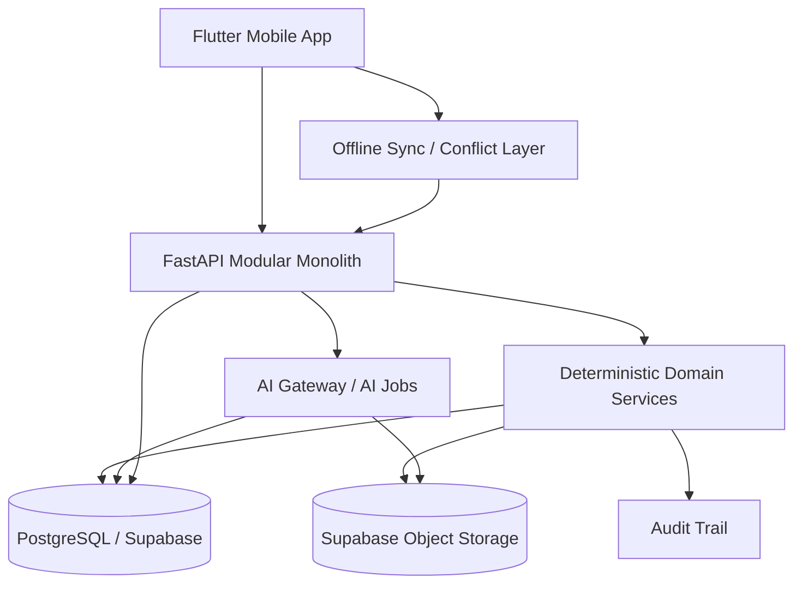
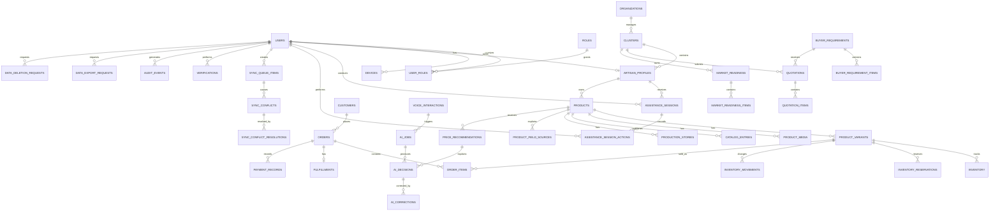
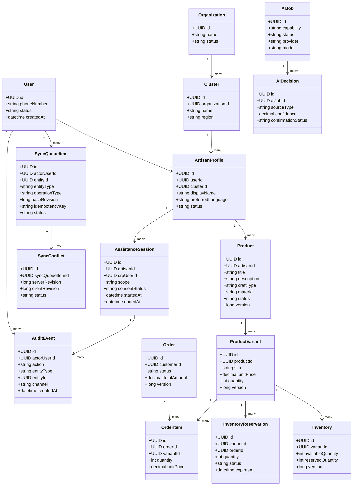
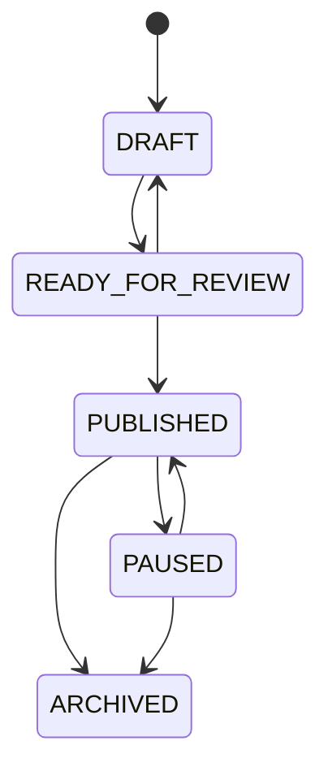
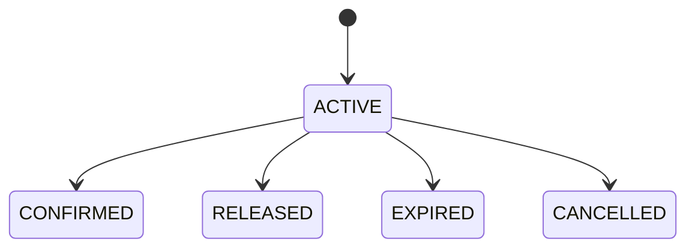
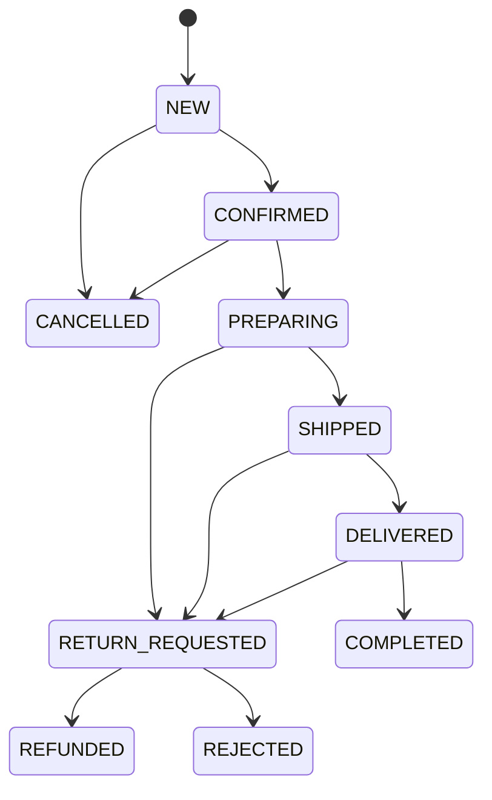
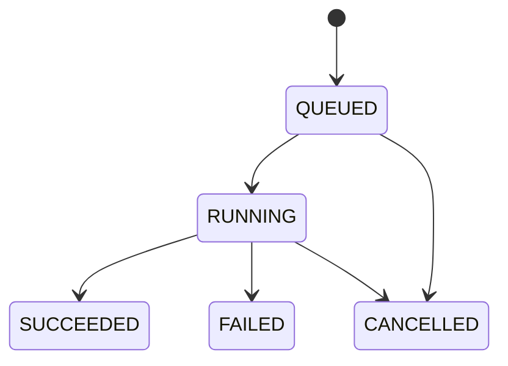
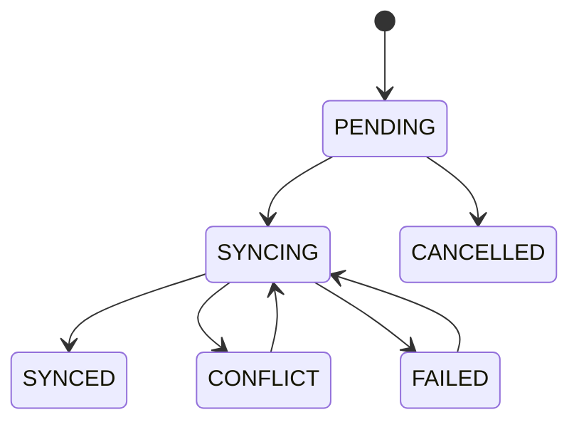
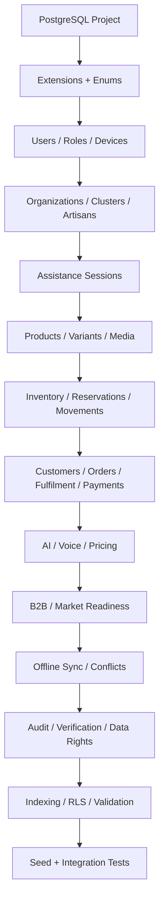

# DATABASE_26090.md

## PS 26090 — AI Business Manager for Marginalized Artisans

> **Purpose:** Define the database contract for the solution and architecture described in `SOLUTION_26090.md` and `ARCHITECTURE_26090_v4.md`.
>
> **Status:** Database design baseline — ₹0 cash-cost SIH MVP
>
> **Primary database:** PostgreSQL
>
> **Managed MVP platform:** Supabase Free
>
> **ORM / query layer:** Drizzle ORM
>
> **Database principle:** Keep authoritative commerce state deterministic, strongly constrained, auditable and safe for offline synchronization while keeping AI-generated information explicitly attributable to its source.

---

# 1. Database Goals

The database must support the complete MVP without becoming tightly coupled to a single UI, AI provider or marketplace.

The database must:

1. Treat PostgreSQL as the authoritative system of record for server-side business state.
2. Support Artisan, CRP/Didi, buyer, organization and administrative roles.
3. Model `Product → ProductVariant → Inventory → Reservation → OrderItem` correctly.
4. Prevent silent inventory overwrite and overselling through revisions and transactional reservations.
5. Support offline-first synchronization and explicit conflict resolution.
6. Record who performed each consequential action and through which session/device/channel.
7. Separate user-provided, AI-extracted, AI-generated and externally verified information.
8. Support AI jobs without making AI tables the authoritative commerce state.
9. Support B2C, B2B, government-readiness and future ONDC adapters without marketplace-specific coupling.
10. Support data export, deletion and retention controls.
11. Support row-level authorization boundaries where practical.
12. Remain portable PostgreSQL so Supabase can be replaced later.
13. Remain implementable with ₹0 required cash expenditure for the SIH MVP.

---

# 2. Database Architecture

## 2.1 Logical Database Architecture



## 2.2 Database Responsibility Boundary

```text
AI
  → proposes / extracts / recommends

Application Services
  → validate / authorize / orchestrate

Domain Services
  → perform deterministic state transitions

PostgreSQL
  → stores authoritative business state

Object Storage
  → stores binary media

Audit Trail
  → records consequential actions and decisions
```

The LLM, STT model, vision model or pricing model must never directly mutate authoritative commerce tables.

---

# 3. PostgreSQL Design Principles

## 3.1 Primary Conventions

| Concern                    | Decision                                             |
| -------------------------- | ---------------------------------------------------- |
| Database                   | PostgreSQL                                           |
| Managed MVP                | Supabase Free                                        |
| ORM/query layer            | Drizzle ORM                                          |
| Primary key                | UUID                                                 |
| Time                       | `TIMESTAMPTZ` in UTC                                 |
| Money                      | `NUMERIC(12,2)`                                      |
| Counts                     | `INTEGER`                                            |
| Long-form text             | `TEXT`                                               |
| Flexible model metadata    | `JSONB` only where justified                         |
| Entity revision            | `BIGINT`                                             |
| Audit timestamps           | `TIMESTAMPTZ`                                        |
| Soft deletion              | Explicit status/deletion timestamp only where needed |
| Binary media               | Object storage, not PostgreSQL blobs                 |
| Server authoritative state | PostgreSQL                                           |

## 3.2 Naming

- Tables use `snake_case` plural nouns.
- Columns use `snake_case`.
- Primary keys are `id`.
- Foreign keys use `<entity>_id`.
- Revision columns use `version` or `revision` consistently by domain.
- Timestamps use `<event>_at`.
- Boolean columns use `is_` / `has_` prefixes where appropriate.

## 3.3 General Row Pattern

Core mutable business entities should normally contain:

```text
id
created_at
updated_at
version / revision
```

Ownership-sensitive entities should additionally contain an explicit owner or parent reference.

---

# 4. Entity Inventory

The database contains the following major entities.

```text
Identity / Access
├── users
├── roles
├── user_roles
├── devices
├── organizations
├── clusters
├── artisan_profiles
├── assistance_sessions
└── assistance_session_actions

Product / Catalog
├── products
├── product_variants
├── product_media
├── catalog_entries
├── production_stories
└── product_field_sources

Commerce
├── inventory
├── inventory_reservations
├── inventory_movements
├── customers
├── orders
├── order_items
├── fulfillments
└── payment_records

AI / Intelligence
├── voice_interactions
├── ai_jobs
├── ai_decisions
├── price_recommendations
├── market_comparables
└── ai_corrections

Market Access
├── buyer_requirements
├── buyer_requirement_items
├── quotations
├── quotation_items
├── market_readiness
└── market_readiness_items

Offline / Reliability
├── sync_queue_items
├── sync_conflicts
└── sync_conflict_resolutions

Governance / Audit
├── verifications
├── audit_events
├── data_export_requests
└── data_deletion_requests
```

---

# 5. Entity Relationship Diagram



---

# 6. Class Diagram

The class diagram describes the application/domain objects represented by the database. It is intentionally separate from the physical SQL schema.



---

# 7. PostgreSQL Enums

Enums should be used for stable finite state machines. Highly configurable values should remain text/reference data instead of becoming enums.

## 7.1 Identity / Access Enums

```sql
CREATE TYPE user_status AS ENUM (
    'ACTIVE',
    'INVITED',
    'SUSPENDED',
    'DELETED'
);

CREATE TYPE role_code AS ENUM (
    'ARTISAN',
    'CRP_DIDI',
    'B2C_BUYER',
    'B2B_BUYER',
    'INSTITUTION_ADMIN',
    'PLATFORM_ADMIN'
);

CREATE TYPE assistance_session_status AS ENUM (
    'ACTIVE',
    'ENDED',
    'EXPIRED',
    'REVOKED'
);

CREATE TYPE consent_status AS ENUM (
    'NOT_REQUIRED',
    'PENDING',
    'CONFIRMED',
    'DECLINED'
);
```

## 7.2 Product / Commerce Enums

```sql
CREATE TYPE product_status AS ENUM (
    'DRAFT',
    'READY_FOR_REVIEW',
    'PUBLISHED',
    'PAUSED',
    'ARCHIVED'
);

CREATE TYPE inventory_reservation_status AS ENUM (
    'ACTIVE',
    'CONFIRMED',
    'RELEASED',
    'EXPIRED',
    'CANCELLED'
);

CREATE TYPE inventory_movement_reason AS ENUM (
    'INITIAL_STOCK',
    'MANUAL_ADJUSTMENT',
    'RESERVATION',
    'RESERVATION_RELEASE',
    'ORDER_COMMIT',
    'ORDER_CANCEL',
    'FULFILMENT',
    'RETURN',
    'DAMAGE',
    'CORRECTION'
);

CREATE TYPE order_status AS ENUM (
    'NEW',
    'CONFIRMED',
    'PREPARING',
    'SHIPPED',
    'DELIVERED',
    'COMPLETED',
    'CANCELLED',
    'RETURN_REQUESTED',
    'REFUNDED',
    'REJECTED'
);
```

## 7.3 AI / Sync Enums

```sql
CREATE TYPE ai_source_type AS ENUM (
    'USER_PROVIDED',
    'AI_EXTRACTED',
    'AI_GENERATED',
    'EXTERNALLY_VERIFIED'
);

CREATE TYPE ai_job_status AS ENUM (
    'QUEUED',
    'RUNNING',
    'SUCCEEDED',
    'FAILED',
    'CANCELLED'
);

CREATE TYPE sync_item_status AS ENUM (
    'PENDING',
    'SYNCING',
    'SYNCED',
    'CONFLICT',
    'FAILED',
    'CANCELLED'
);

CREATE TYPE conflict_status AS ENUM (
    'OPEN',
    'RESOLVED',
    'ESCALATED',
    'DISMISSED'
);
```

---

# 8. Identity & Organization Tables

## 8.1 `users`

Authoritative application identity record.

```sql
CREATE TABLE users (
    id UUID PRIMARY KEY DEFAULT gen_random_uuid(),
    phone_number TEXT NOT NULL UNIQUE,
    pin_hash TEXT NOT NULL,
    status user_status NOT NULL DEFAULT 'INVITED',
    created_at TIMESTAMPTZ NOT NULL DEFAULT now(),
    updated_at TIMESTAMPTZ NOT NULL DEFAULT now()
);
```

> The database must never store the raw PIN.

## 8.2 `roles`

```sql
CREATE TABLE roles (
    code role_code PRIMARY KEY,
    description TEXT NOT NULL
);
```

## 8.3 `user_roles`

```sql
CREATE TABLE user_roles (
    user_id UUID NOT NULL REFERENCES users(id) ON DELETE CASCADE,
    role_code role_code NOT NULL REFERENCES roles(code),
    created_at TIMESTAMPTZ NOT NULL DEFAULT now(),
    PRIMARY KEY (user_id, role_code)
);
```

## 8.4 `devices`

```sql
CREATE TABLE devices (
    id UUID PRIMARY KEY DEFAULT gen_random_uuid(),
    user_id UUID NOT NULL REFERENCES users(id) ON DELETE CASCADE,
    device_fingerprint_hash TEXT NOT NULL,
    platform TEXT NOT NULL,
    app_version TEXT,
    is_trusted BOOLEAN NOT NULL DEFAULT true,
    last_seen_at TIMESTAMPTZ,
    created_at TIMESTAMPTZ NOT NULL DEFAULT now(),
    revoked_at TIMESTAMPTZ
);

CREATE INDEX idx_devices_user_id ON devices(user_id);
```

The fingerprint must be represented by a non-reversible identifier appropriate to the implementation; do not store unnecessary hardware identifiers.

## 8.5 `organizations`

```sql
CREATE TABLE organizations (
    id UUID PRIMARY KEY DEFAULT gen_random_uuid(),
    name TEXT NOT NULL,
    status TEXT NOT NULL DEFAULT 'ACTIVE',
    created_at TIMESTAMPTZ NOT NULL DEFAULT now(),
    updated_at TIMESTAMPTZ NOT NULL DEFAULT now()
);
```

## 8.6 `clusters`

```sql
CREATE TABLE clusters (
    id UUID PRIMARY KEY DEFAULT gen_random_uuid(),
    organization_id UUID NOT NULL REFERENCES organizations(id),
    name TEXT NOT NULL,
    region TEXT,
    created_at TIMESTAMPTZ NOT NULL DEFAULT now(),
    updated_at TIMESTAMPTZ NOT NULL DEFAULT now()
);

CREATE INDEX idx_clusters_org_id ON clusters(organization_id);
```

---

# 9. Artisan & Assisted-Commerce Tables

## 9.1 `artisan_profiles`

```sql
CREATE TABLE artisan_profiles (
    id UUID PRIMARY KEY DEFAULT gen_random_uuid(),
    user_id UUID NOT NULL UNIQUE REFERENCES users(id),
    cluster_id UUID REFERENCES clusters(id),
    display_name TEXT NOT NULL,
    preferred_language TEXT NOT NULL,
    phone_display TEXT,
    craft_region TEXT,
    verification_status TEXT NOT NULL DEFAULT 'UNVERIFIED',
    created_at TIMESTAMPTZ NOT NULL DEFAULT now(),
    updated_at TIMESTAMPTZ NOT NULL DEFAULT now()
);

CREATE INDEX idx_artisan_profiles_cluster_id ON artisan_profiles(cluster_id);
```

## 9.2 `assistance_sessions`

This is the database representation of Didi/CRP assisted-commerce mode.

```sql
CREATE TABLE assistance_sessions (
    id UUID PRIMARY KEY DEFAULT gen_random_uuid(),
    artisan_id UUID NOT NULL REFERENCES artisan_profiles(id),
    crp_user_id UUID NOT NULL REFERENCES users(id),
    organization_id UUID REFERENCES organizations(id),
    cluster_id UUID REFERENCES clusters(id),
    status assistance_session_status NOT NULL DEFAULT 'ACTIVE',
    scope JSONB NOT NULL DEFAULT '{}'::jsonb,
    consent_status consent_status NOT NULL DEFAULT 'NOT_REQUIRED',
    started_at TIMESTAMPTZ NOT NULL DEFAULT now(),
    ended_at TIMESTAMPTZ,
    created_at TIMESTAMPTZ NOT NULL DEFAULT now()
);

CREATE INDEX idx_assistance_sessions_artisan ON assistance_sessions(artisan_id);
CREATE INDEX idx_assistance_sessions_crp ON assistance_sessions(crp_user_id);
CREATE INDEX idx_assistance_sessions_active ON assistance_sessions(status) WHERE status = 'ACTIVE';
```

## 9.3 `assistance_session_actions`

```sql
CREATE TABLE assistance_session_actions (
    id UUID PRIMARY KEY DEFAULT gen_random_uuid(),
    session_id UUID NOT NULL REFERENCES assistance_sessions(id) ON DELETE CASCADE,
    actor_user_id UUID NOT NULL REFERENCES users(id),
    action TEXT NOT NULL,
    entity_type TEXT,
    entity_id UUID,
    requires_artisan_confirmation BOOLEAN NOT NULL DEFAULT false,
    confirmation_status consent_status NOT NULL DEFAULT 'NOT_REQUIRED',
    metadata JSONB NOT NULL DEFAULT '{}'::jsonb,
    created_at TIMESTAMPTZ NOT NULL DEFAULT now()
);

CREATE INDEX idx_assistance_session_actions_session ON assistance_session_actions(session_id);
```

---

# 10. Product & Catalog Tables

## 10.1 `products`

```sql
CREATE TABLE products (
    id UUID PRIMARY KEY DEFAULT gen_random_uuid(),
    artisan_id UUID NOT NULL REFERENCES artisan_profiles(id),
    title TEXT NOT NULL,
    description TEXT,
    craft_type TEXT,
    category TEXT,
    material TEXT,
    origin_text TEXT,
    status product_status NOT NULL DEFAULT 'DRAFT',
    version BIGINT NOT NULL DEFAULT 1,
    created_at TIMESTAMPTZ NOT NULL DEFAULT now(),
    updated_at TIMESTAMPTZ NOT NULL DEFAULT now()
);

CREATE INDEX idx_products_artisan_id ON products(artisan_id);
CREATE INDEX idx_products_status ON products(status);
CREATE INDEX idx_products_craft_type ON products(craft_type);
```

## 10.2 `product_variants`

```sql
CREATE TABLE product_variants (
    id UUID PRIMARY KEY DEFAULT gen_random_uuid(),
    product_id UUID NOT NULL REFERENCES products(id) ON DELETE CASCADE,
    sku TEXT UNIQUE,
    size TEXT,
    color TEXT,
    design TEXT,
    unit_label TEXT,
    unit_price NUMERIC(12,2) CHECK (unit_price >= 0),
    is_one_of_one BOOLEAN NOT NULL DEFAULT false,
    is_made_to_order BOOLEAN NOT NULL DEFAULT false,
    is_available BOOLEAN NOT NULL DEFAULT true,
    version BIGINT NOT NULL DEFAULT 1,
    created_at TIMESTAMPTZ NOT NULL DEFAULT now(),
    updated_at TIMESTAMPTZ NOT NULL DEFAULT now()
);

CREATE INDEX idx_product_variants_product_id ON product_variants(product_id);
```

Quantity should be authoritative in `inventory`, not duplicated as a mutable source of truth here.

## 10.3 `product_media`

```sql
CREATE TABLE product_media (
    id UUID PRIMARY KEY DEFAULT gen_random_uuid(),
    product_id UUID NOT NULL REFERENCES products(id) ON DELETE CASCADE,
    variant_id UUID REFERENCES product_variants(id) ON DELETE SET NULL,
    object_key TEXT NOT NULL,
    media_type TEXT NOT NULL,
    media_role TEXT NOT NULL,
    source_type ai_source_type NOT NULL DEFAULT 'USER_PROVIDED',
    is_original BOOLEAN NOT NULL DEFAULT true,
    is_public BOOLEAN NOT NULL DEFAULT false,
    metadata JSONB NOT NULL DEFAULT '{}'::jsonb,
    created_at TIMESTAMPTZ NOT NULL DEFAULT now()
);

CREATE INDEX idx_product_media_product_id ON product_media(product_id);
```

## 10.4 `catalog_entries`

```sql
CREATE TABLE catalog_entries (
    id UUID PRIMARY KEY DEFAULT gen_random_uuid(),
    product_id UUID NOT NULL REFERENCES products(id) ON DELETE CASCADE,
    language_code TEXT NOT NULL,
    title TEXT NOT NULL,
    description TEXT,
    channel TEXT NOT NULL DEFAULT 'INTERNAL',
    publication_status TEXT NOT NULL DEFAULT 'DRAFT',
    version BIGINT NOT NULL DEFAULT 1,
    created_at TIMESTAMPTZ NOT NULL DEFAULT now(),
    updated_at TIMESTAMPTZ NOT NULL DEFAULT now(),
    UNIQUE (product_id, language_code, channel)
);
```

## 10.5 `production_stories`

```sql
CREATE TABLE production_stories (
    id UUID PRIMARY KEY DEFAULT gen_random_uuid(),
    artisan_id UUID NOT NULL REFERENCES artisan_profiles(id),
    product_id UUID NOT NULL REFERENCES products(id) ON DELETE CASCADE,
    language_code TEXT NOT NULL,
    text TEXT,
    audio_object_key TEXT,
    duration_seconds INTEGER CHECK (duration_seconds >= 0),
    is_public BOOLEAN NOT NULL DEFAULT false,
    created_at TIMESTAMPTZ NOT NULL DEFAULT now()
);
```

## 10.6 `product_field_sources`

This table makes AI/data provenance explicit at field level.

```sql
CREATE TABLE product_field_sources (
    id UUID PRIMARY KEY DEFAULT gen_random_uuid(),
    product_id UUID NOT NULL REFERENCES products(id) ON DELETE CASCADE,
    field_name TEXT NOT NULL,
    source_type ai_source_type NOT NULL,
    source_reference TEXT,
    confidence NUMERIC(5,4) CHECK (confidence >= 0 AND confidence <= 1),
    verified_by UUID REFERENCES users(id),
    verified_at TIMESTAMPTZ,
    created_at TIMESTAMPTZ NOT NULL DEFAULT now()
);

CREATE INDEX idx_product_field_sources_product ON product_field_sources(product_id);
CREATE INDEX idx_product_field_sources_field ON product_field_sources(product_id, field_name);
```

---

# 11. Inventory Tables

## 11.1 `inventory`

One variant should have one authoritative inventory row for the MVP.

```sql
CREATE TABLE inventory (
    id UUID PRIMARY KEY DEFAULT gen_random_uuid(),
    variant_id UUID NOT NULL UNIQUE REFERENCES product_variants(id) ON DELETE CASCADE,
    available_quantity INTEGER NOT NULL DEFAULT 0 CHECK (available_quantity >= 0),
    reserved_quantity INTEGER NOT NULL DEFAULT 0 CHECK (reserved_quantity >= 0),
    version BIGINT NOT NULL DEFAULT 1,
    updated_at TIMESTAMPTZ NOT NULL DEFAULT now()
);
```

Effective sellable quantity is derived from authoritative inventory state, not client-side calculations.

## 11.2 `inventory_reservations`

```sql
CREATE TABLE inventory_reservations (
    id UUID PRIMARY KEY DEFAULT gen_random_uuid(),
    variant_id UUID NOT NULL REFERENCES product_variants(id),
    order_id UUID REFERENCES orders(id),
    quantity INTEGER NOT NULL CHECK (quantity > 0),
    status inventory_reservation_status NOT NULL DEFAULT 'ACTIVE',
    source_channel TEXT NOT NULL DEFAULT 'INTERNAL',
    expires_at TIMESTAMPTZ,
    created_at TIMESTAMPTZ NOT NULL DEFAULT now(),
    updated_at TIMESTAMPTZ NOT NULL DEFAULT now()
);

CREATE INDEX idx_inventory_reservations_variant ON inventory_reservations(variant_id);
CREATE INDEX idx_inventory_reservations_order ON inventory_reservations(order_id);
CREATE INDEX idx_inventory_reservations_active ON inventory_reservations(variant_id, status)
WHERE status = 'ACTIVE';
```

## 11.3 `inventory_movements`

This is append-only for auditability.

```sql
CREATE TABLE inventory_movements (
    id UUID PRIMARY KEY DEFAULT gen_random_uuid(),
    variant_id UUID NOT NULL REFERENCES product_variants(id),
    quantity_delta INTEGER NOT NULL,
    reason inventory_movement_reason NOT NULL,
    actor_user_id UUID REFERENCES users(id),
    source_channel TEXT NOT NULL,
    device_id UUID REFERENCES devices(id),
    order_id UUID REFERENCES orders(id),
    reservation_id UUID REFERENCES inventory_reservations(id),
    previous_revision BIGINT NOT NULL,
    resulting_revision BIGINT NOT NULL,
    metadata JSONB NOT NULL DEFAULT '{}'::jsonb,
    created_at TIMESTAMPTZ NOT NULL DEFAULT now()
);

CREATE INDEX idx_inventory_movements_variant ON inventory_movements(variant_id, created_at DESC);
CREATE INDEX idx_inventory_movements_order ON inventory_movements(order_id);
```

### Inventory Integrity Rule

Every stock mutation should happen inside one transaction that:

1. locks or validates the current inventory revision;
2. verifies available quantity;
3. modifies inventory;
4. increments inventory `version`;
5. inserts an `inventory_movements` record;
6. commits atomically.

No client may directly update `available_quantity` outside the domain service.

---

# 12. Customer, Order & Fulfilment Tables

## 12.1 `customers`

```sql
CREATE TABLE customers (
    id UUID PRIMARY KEY DEFAULT gen_random_uuid(),
    user_id UUID REFERENCES users(id),
    display_name TEXT,
    phone_number TEXT,
    email TEXT,
    customer_type TEXT NOT NULL DEFAULT 'B2C',
    created_at TIMESTAMPTZ NOT NULL DEFAULT now(),
    updated_at TIMESTAMPTZ NOT NULL DEFAULT now()
);
```

## 12.2 `orders`

```sql
CREATE TABLE orders (
    id UUID PRIMARY KEY DEFAULT gen_random_uuid(),
    customer_id UUID NOT NULL REFERENCES customers(id),
    status order_status NOT NULL DEFAULT 'NEW',
    currency CHAR(3) NOT NULL DEFAULT 'INR',
    subtotal_amount NUMERIC(12,2) NOT NULL DEFAULT 0 CHECK (subtotal_amount >= 0),
    shipping_amount NUMERIC(12,2) NOT NULL DEFAULT 0 CHECK (shipping_amount >= 0),
    total_amount NUMERIC(12,2) NOT NULL DEFAULT 0 CHECK (total_amount >= 0),
    version BIGINT NOT NULL DEFAULT 1,
    created_at TIMESTAMPTZ NOT NULL DEFAULT now(),
    updated_at TIMESTAMPTZ NOT NULL DEFAULT now()
);

CREATE INDEX idx_orders_customer ON orders(customer_id);
CREATE INDEX idx_orders_status ON orders(status);
CREATE INDEX idx_orders_created_at ON orders(created_at DESC);
```

## 12.3 `order_items`

```sql
CREATE TABLE order_items (
    id UUID PRIMARY KEY DEFAULT gen_random_uuid(),
    order_id UUID NOT NULL REFERENCES orders(id) ON DELETE CASCADE,
    variant_id UUID NOT NULL REFERENCES product_variants(id),
    product_title_snapshot TEXT NOT NULL,
    variant_label_snapshot TEXT,
    quantity INTEGER NOT NULL CHECK (quantity > 0),
    unit_price NUMERIC(12,2) NOT NULL CHECK (unit_price >= 0),
    line_total NUMERIC(12,2) NOT NULL CHECK (line_total >= 0),
    created_at TIMESTAMPTZ NOT NULL DEFAULT now()
);

CREATE INDEX idx_order_items_order ON order_items(order_id);
CREATE INDEX idx_order_items_variant ON order_items(variant_id);
```

Snapshots are intentional: historical orders must not change when a product title or price is later edited.

## 12.4 `fulfillments`

```sql
CREATE TABLE fulfillments (
    id UUID PRIMARY KEY DEFAULT gen_random_uuid(),
    order_id UUID NOT NULL UNIQUE REFERENCES orders(id) ON DELETE CASCADE,
    status TEXT NOT NULL DEFAULT 'PENDING',
    carrier TEXT,
    tracking_reference TEXT,
    estimated_delivery_at TIMESTAMPTZ,
    shipped_at TIMESTAMPTZ,
    delivered_at TIMESTAMPTZ,
    created_at TIMESTAMPTZ NOT NULL DEFAULT now(),
    updated_at TIMESTAMPTZ NOT NULL DEFAULT now()
);
```

## 12.5 `payment_records`

The MVP stores payment/earnings **state**, not a payment-provider implementation.

```sql
CREATE TABLE payment_records (
    id UUID PRIMARY KEY DEFAULT gen_random_uuid(),
    order_id UUID NOT NULL REFERENCES orders(id) ON DELETE CASCADE,
    status TEXT NOT NULL,
    provider TEXT,
    external_reference TEXT,
    amount NUMERIC(12,2) NOT NULL CHECK (amount >= 0),
    currency CHAR(3) NOT NULL DEFAULT 'INR',
    paid_at TIMESTAMPTZ,
    created_at TIMESTAMPTZ NOT NULL DEFAULT now(),
    updated_at TIMESTAMPTZ NOT NULL DEFAULT now()
);
```

---

# 13. AI & Voice Tables

## 13.1 `voice_interactions`

```sql
CREATE TABLE voice_interactions (
    id UUID PRIMARY KEY DEFAULT gen_random_uuid(),
    user_id UUID NOT NULL REFERENCES users(id),
    assistance_session_id UUID REFERENCES assistance_sessions(id),
    language_code TEXT,
    audio_object_key TEXT,
    transcript TEXT,
    intent TEXT,
    stt_provider TEXT,
    stt_model TEXT,
    stt_confidence NUMERIC(5,4) CHECK (stt_confidence >= 0 AND stt_confidence <= 1),
    retention_status TEXT NOT NULL DEFAULT 'PROCESSING_ONLY',
    created_at TIMESTAMPTZ NOT NULL DEFAULT now()
);
```

## 13.2 `ai_jobs`

```sql
CREATE TABLE ai_jobs (
    id UUID PRIMARY KEY DEFAULT gen_random_uuid(),
    requested_by UUID REFERENCES users(id),
    voice_interaction_id UUID REFERENCES voice_interactions(id),
    capability TEXT NOT NULL,
    status ai_job_status NOT NULL DEFAULT 'QUEUED',
    priority SMALLINT NOT NULL DEFAULT 1,
    provider TEXT,
    model TEXT,
    input_reference JSONB NOT NULL DEFAULT '{}'::jsonb,
    output_reference JSONB NOT NULL DEFAULT '{}'::jsonb,
    error_code TEXT,
    error_message TEXT,
    started_at TIMESTAMPTZ,
    completed_at TIMESTAMPTZ,
    created_at TIMESTAMPTZ NOT NULL DEFAULT now()
);

CREATE INDEX idx_ai_jobs_status_priority ON ai_jobs(status, priority, created_at);
CREATE INDEX idx_ai_jobs_requested_by ON ai_jobs(requested_by);
```

## 13.3 `ai_decisions`

Stores concise decision evidence and outcome metadata, not hidden chain-of-thought.

```sql
CREATE TABLE ai_decisions (
    id UUID PRIMARY KEY DEFAULT gen_random_uuid(),
    ai_job_id UUID NOT NULL REFERENCES ai_jobs(id) ON DELETE CASCADE,
    entity_type TEXT,
    entity_id UUID,
    action TEXT NOT NULL,
    source_type ai_source_type NOT NULL,
    confidence NUMERIC(5,4) CHECK (confidence >= 0 AND confidence <= 1),
    factors JSONB NOT NULL DEFAULT '[]'::jsonb,
    evidence JSONB NOT NULL DEFAULT '[]'::jsonb,
    proposed_value JSONB NOT NULL DEFAULT '{}'::jsonb,
    confirmation_status TEXT NOT NULL DEFAULT 'PENDING',
    created_at TIMESTAMPTZ NOT NULL DEFAULT now()
);

CREATE INDEX idx_ai_decisions_entity ON ai_decisions(entity_type, entity_id);
CREATE INDEX idx_ai_decisions_job ON ai_decisions(ai_job_id);
```

## 13.4 `ai_corrections`

```sql
CREATE TABLE ai_corrections (
    id UUID PRIMARY KEY DEFAULT gen_random_uuid(),
    ai_decision_id UUID NOT NULL REFERENCES ai_decisions(id) ON DELETE CASCADE,
    reported_by UUID NOT NULL REFERENCES users(id),
    reason_code TEXT NOT NULL,
    corrected_value JSONB,
    notes TEXT,
    created_at TIMESTAMPTZ NOT NULL DEFAULT now()
);
```

## 13.5 `price_recommendations`

```sql
CREATE TABLE price_recommendations (
    id UUID PRIMARY KEY DEFAULT gen_random_uuid(),
    product_id UUID NOT NULL REFERENCES products(id) ON DELETE CASCADE,
    ai_decision_id UUID REFERENCES ai_decisions(id),
    cost_floor NUMERIC(12,2),
    comparable_low NUMERIC(12,2),
    comparable_high NUMERIC(12,2),
    suggested_price NUMERIC(12,2),
    confidence NUMERIC(5,4) CHECK (confidence >= 0 AND confidence <= 1),
    calculation_method TEXT NOT NULL,
    is_selected BOOLEAN NOT NULL DEFAULT false,
    created_at TIMESTAMPTZ NOT NULL DEFAULT now()
);

CREATE INDEX idx_price_recommendations_product ON price_recommendations(product_id, created_at DESC);
```

## 13.6 `market_comparables`

```sql
CREATE TABLE market_comparables (
    id UUID PRIMARY KEY DEFAULT gen_random_uuid(),
    source_name TEXT NOT NULL,
    external_reference TEXT,
    product_category TEXT,
    craft_type TEXT,
    material TEXT,
    region TEXT,
    observed_price NUMERIC(12,2) CHECK (observed_price >= 0),
    observed_at TIMESTAMPTZ,
    metadata JSONB NOT NULL DEFAULT '{}'::jsonb,
    created_at TIMESTAMPTZ NOT NULL DEFAULT now()
);
```

---

# 14. B2B & Market Access Tables

## 14.1 `buyer_requirements`

```sql
CREATE TABLE buyer_requirements (
    id UUID PRIMARY KEY DEFAULT gen_random_uuid(),
    buyer_id UUID NOT NULL REFERENCES customers(id),
    title TEXT NOT NULL,
    description TEXT,
    delivery_deadline TIMESTAMPTZ,
    status TEXT NOT NULL DEFAULT 'OPEN',
    created_at TIMESTAMPTZ NOT NULL DEFAULT now(),
    updated_at TIMESTAMPTZ NOT NULL DEFAULT now()
);
```

## 14.2 `buyer_requirement_items`

```sql
CREATE TABLE buyer_requirement_items (
    id UUID PRIMARY KEY DEFAULT gen_random_uuid(),
    requirement_id UUID NOT NULL REFERENCES buyer_requirements(id) ON DELETE CASCADE,
    category TEXT,
    craft_type TEXT,
    material TEXT,
    target_quantity INTEGER CHECK (target_quantity > 0),
    target_price_min NUMERIC(12,2),
    target_price_max NUMERIC(12,2),
    required_region TEXT,
    required_metadata JSONB NOT NULL DEFAULT '{}'::jsonb
);
```

## 14.3 `quotations`

```sql
CREATE TABLE quotations (
    id UUID PRIMARY KEY DEFAULT gen_random_uuid(),
    requirement_id UUID NOT NULL REFERENCES buyer_requirements(id),
    cluster_id UUID REFERENCES clusters(id),
    submitted_by UUID NOT NULL REFERENCES users(id),
    status TEXT NOT NULL DEFAULT 'DRAFT',
    total_amount NUMERIC(12,2),
    estimated_delivery_at TIMESTAMPTZ,
    notes TEXT,
    created_at TIMESTAMPTZ NOT NULL DEFAULT now(),
    updated_at TIMESTAMPTZ NOT NULL DEFAULT now()
);
```

## 14.4 `quotation_items`

```sql
CREATE TABLE quotation_items (
    id UUID PRIMARY KEY DEFAULT gen_random_uuid(),
    quotation_id UUID NOT NULL REFERENCES quotations(id) ON DELETE CASCADE,
    variant_id UUID REFERENCES product_variants(id),
    quantity INTEGER NOT NULL CHECK (quantity > 0),
    unit_price NUMERIC(12,2) NOT NULL CHECK (unit_price >= 0),
    notes TEXT
);
```

## 14.5 Market Readiness

```sql
CREATE TABLE market_readiness (
    id UUID PRIMARY KEY DEFAULT gen_random_uuid(),
    cluster_id UUID REFERENCES clusters(id),
    artisan_id UUID REFERENCES artisan_profiles(id),
    channel TEXT NOT NULL,
    readiness_status TEXT NOT NULL DEFAULT 'IN_PROGRESS',
    updated_at TIMESTAMPTZ NOT NULL DEFAULT now()
);

CREATE TABLE market_readiness_items (
    id UUID PRIMARY KEY DEFAULT gen_random_uuid(),
    market_readiness_id UUID NOT NULL REFERENCES market_readiness(id) ON DELETE CASCADE,
    requirement_code TEXT NOT NULL,
    title TEXT NOT NULL,
    status TEXT NOT NULL,
    explanation TEXT,
    next_step TEXT,
    requires_assistance BOOLEAN NOT NULL DEFAULT false,
    UNIQUE (market_readiness_id, requirement_code)
);
```

---

# 15. Offline Sync & Conflict Tables

## 15.1 `sync_queue_items`

```sql
CREATE TABLE sync_queue_items (
    id UUID PRIMARY KEY DEFAULT gen_random_uuid(),
    actor_user_id UUID NOT NULL REFERENCES users(id),
    device_id UUID REFERENCES devices(id),
    entity_type TEXT NOT NULL,
    entity_id UUID NOT NULL,
    operation_type TEXT NOT NULL,
    payload JSONB NOT NULL,
    client_timestamp TIMESTAMPTZ NOT NULL,
    base_revision BIGINT NOT NULL,
    idempotency_key TEXT NOT NULL UNIQUE,
    status sync_item_status NOT NULL DEFAULT 'PENDING',
    error_code TEXT,
    error_message TEXT,
    created_at TIMESTAMPTZ NOT NULL DEFAULT now(),
    processed_at TIMESTAMPTZ
);

CREATE INDEX idx_sync_queue_pending ON sync_queue_items(status, created_at)
WHERE status IN ('PENDING', 'SYNCING');
CREATE INDEX idx_sync_queue_entity ON sync_queue_items(entity_type, entity_id);
```

## 15.2 `sync_conflicts`

```sql
CREATE TABLE sync_conflicts (
    id UUID PRIMARY KEY DEFAULT gen_random_uuid(),
    sync_queue_item_id UUID NOT NULL REFERENCES sync_queue_items(id),
    entity_type TEXT NOT NULL,
    entity_id UUID NOT NULL,
    client_revision BIGINT NOT NULL,
    server_revision BIGINT NOT NULL,
    server_snapshot JSONB NOT NULL,
    client_snapshot JSONB NOT NULL,
    critical_fields JSONB NOT NULL DEFAULT '[]'::jsonb,
    status conflict_status NOT NULL DEFAULT 'OPEN',
    created_at TIMESTAMPTZ NOT NULL DEFAULT now(),
    updated_at TIMESTAMPTZ NOT NULL DEFAULT now()
);

CREATE INDEX idx_sync_conflicts_open ON sync_conflicts(status, created_at)
WHERE status = 'OPEN';
```

## 15.3 `sync_conflict_resolutions`

```sql
CREATE TABLE sync_conflict_resolutions (
    id UUID PRIMARY KEY DEFAULT gen_random_uuid(),
    conflict_id UUID NOT NULL REFERENCES sync_conflicts(id) ON DELETE CASCADE,
    resolved_by UUID NOT NULL REFERENCES users(id),
    resolution_type TEXT NOT NULL,
    selected_version TEXT,
    merged_snapshot JSONB,
    reason TEXT,
    created_at TIMESTAMPTZ NOT NULL DEFAULT now()
);
```

### Conflict Rule

```text
Client revision == Server revision
    → normal mutation

Client revision < Server revision
    → conflict evaluation

Safe fields
    → auto-merge where deterministic

Critical fields
    → user-mediated resolution

Inventory / order conflicts
    → deterministic domain validation before commit
```

---

# 16. Verification, Audit & Data Rights Tables

## 16.1 `verifications`

```sql
CREATE TABLE verifications (
    id UUID PRIMARY KEY DEFAULT gen_random_uuid(),
    subject_type TEXT NOT NULL,
    subject_id UUID NOT NULL,
    verification_type TEXT NOT NULL,
    status TEXT NOT NULL DEFAULT 'PENDING',
    verified_by UUID REFERENCES users(id),
    evidence JSONB NOT NULL DEFAULT '{}'::jsonb,
    verified_at TIMESTAMPTZ,
    created_at TIMESTAMPTZ NOT NULL DEFAULT now()
);
```

## 16.2 `audit_events`

```sql
CREATE TABLE audit_events (
    id UUID PRIMARY KEY DEFAULT gen_random_uuid(),
    actor_user_id UUID REFERENCES users(id),
    device_id UUID REFERENCES devices(id),
    assistance_session_id UUID REFERENCES assistance_sessions(id),
    action TEXT NOT NULL,
    entity_type TEXT,
    entity_id UUID,
    source_channel TEXT,
    previous_version BIGINT,
    resulting_version BIGINT,
    metadata JSONB NOT NULL DEFAULT '{}'::jsonb,
    created_at TIMESTAMPTZ NOT NULL DEFAULT now()
);

CREATE INDEX idx_audit_events_entity ON audit_events(entity_type, entity_id, created_at DESC);
CREATE INDEX idx_audit_events_actor ON audit_events(actor_user_id, created_at DESC);
```

Audit rows are append-only from the application perspective.

## 16.3 `data_export_requests`

```sql
CREATE TABLE data_export_requests (
    id UUID PRIMARY KEY DEFAULT gen_random_uuid(),
    requested_by UUID NOT NULL REFERENCES users(id),
    status TEXT NOT NULL DEFAULT 'PENDING',
    export_object_key TEXT,
    created_at TIMESTAMPTZ NOT NULL DEFAULT now(),
    completed_at TIMESTAMPTZ,
    expires_at TIMESTAMPTZ
);
```

## 16.4 `data_deletion_requests`

```sql
CREATE TABLE data_deletion_requests (
    id UUID PRIMARY KEY DEFAULT gen_random_uuid(),
    requested_by UUID NOT NULL REFERENCES users(id),
    scope JSONB NOT NULL,
    status TEXT NOT NULL DEFAULT 'PENDING',
    approved_by UUID REFERENCES users(id),
    created_at TIMESTAMPTZ NOT NULL DEFAULT now(),
    completed_at TIMESTAMPTZ
);
```

Deletion must respect transactional and audit-retention requirements.

---

# 17. Database Class / Responsibility Mapping

| Database area                         | Authoritative responsibility                |
| ------------------------------------- | ------------------------------------------- |
| `users`, `roles`, `user_roles`        | Identity and access model                   |
| `devices`                             | Trusted-device registration                 |
| `organizations`, `clusters`           | Deployment hierarchy                        |
| `artisan_profiles`                    | Artisan business identity                   |
| `assistance_sessions`                 | Scoped Didi/CRP access                      |
| `products`, `product_variants`        | Sellable product model                      |
| `product_media`, `production_stories` | Product/craft media                         |
| `catalog_entries`                     | Channel/language publication representation |
| `inventory`                           | Authoritative stock state                   |
| `inventory_reservations`              | Temporary stock allocation                  |
| `inventory_movements`                 | Immutable inventory audit trail             |
| `orders`, `order_items`               | Commerce order state                        |
| `fulfillments`                        | Delivery state                              |
| `payment_records`                     | Payment/earnings state representation       |
| `ai_jobs`, `ai_decisions`             | AI execution and decision evidence          |
| `price_recommendations`               | Price advisory output                       |
| `market_comparables`                  | Pricing/market evidence                     |
| `buyer_requirements`, `quotations`    | B2B workflow                                |
| `market_readiness*`                   | Government/channel readiness                |
| `sync_queue_items`                    | Offline operation queue                     |
| `sync_conflicts*`                     | Conflict state and resolution               |
| `audit_events`                        | System accountability                       |
| `data_export_requests`                | Data portability                            |
| `data_deletion_requests`              | Data deletion workflow                      |

---

# 18. Core State Machines

## 18.1 Product



## 18.2 Inventory Reservation



## 18.3 Order



## 18.4 AI Job



## 18.5 Sync Item



---

# 19. Critical Database Constraints

The following rules are architectural requirements, not optional implementation details.

## 19.1 Inventory

- `available_quantity >= 0`
- `reserved_quantity >= 0`
- reservation quantity must be positive
- inventory revision must increase for every successful mutation
- movement rows are append-only
- reservation/stock changes occur transactionally
- stale revisions must be rejected

## 19.2 Orders

- order items must contain positive quantities
- money values must never be negative
- historical unit prices are snapshotted in `order_items`
- invalid order transitions must be rejected server-side

## 19.3 Authorization

- an Artisan may modify only owned resources
- a CRP/Didi may modify only assigned resources within session scope
- Institution Admin access is limited to its organization hierarchy
- Platform Admin actions must be auditable
- sensitive actions may require artisan confirmation

## 19.4 AI

- no AI result directly mutates commerce state
- externally generated claims require confirmation/verification before publication
- confidence values must remain bounded when stored
- raw voice/media retention must follow explicit policy

## 19.5 Sync

- idempotency keys must be unique
- stale revisions must produce conflict rather than silent overwrite
- conflict resolution must be auditable

---

# 20. Indexing Strategy

Indexes should support the most common access patterns without indiscriminately indexing every column.

## Required MVP Index Families

```text
users
  → phone_number UNIQUE

artisan_profiles
  → cluster_id

assistance_sessions
  → artisan_id
  → crp_user_id
  → active-session partial index

products
  → artisan_id
  → status
  → craft_type

product_variants
  → product_id
  → sku UNIQUE

inventory
  → variant_id UNIQUE

inventory_reservations
  → variant_id + active status
  → order_id

inventory_movements
  → variant_id + created_at DESC
  → order_id

orders
  → customer_id
  → status
  → created_at DESC

order_items
  → order_id
  → variant_id

ai_jobs
  → status + priority + created_at

sync_queue_items
  → status + created_at
  → entity_type + entity_id

sync_conflicts
  → open status + created_at

audit_events
  → entity_type + entity_id + created_at
  → actor_user_id + created_at
```

---

# 21. Row-Level Security Strategy

Supabase/PostgreSQL RLS should reinforce application authorization, not replace it.

## 21.1 Artisan

```text
ARTISAN
  → own artisan profile
  → own products
  → own variants
  → own inventory
  → own stories
  → own orders/earnings view
```

## 21.2 CRP / Didi

```text
CRP / DIDI
  → assigned artisans only
  → only while permitted by assistance scope
  → sensitive mutations require confirmation
```

## 21.3 Institution Admin

```text
INSTITUTION ADMIN
  → own organization
  → own clusters
  → assigned deployment/reporting scope
```

## 21.4 Platform Admin

Platform Admin has privileged access, but every sensitive access must generate an audit event.

## 21.5 RLS Rule of Thumb

```text
Application authorization
        +
Database RLS where practical
        +
Domain workflow validation
        =
Defense in depth
```

---

# 22. Transaction Boundaries

Transactions are required for operations where multiple rows represent one business action.

## 22.1 Reserve Inventory

```text
BEGIN
  → validate variant
  → validate inventory revision
  → validate available quantity
  → decrement available quantity
  → increment reserved quantity
  → create reservation
  → create inventory movement
  → increment inventory version
COMMIT
```

## 22.2 Confirm Order

```text
BEGIN
  → validate order state
  → validate reservation
  → commit reservation
  → create order item snapshots if not already present
  → update order state
  → write audit event
COMMIT
```

## 22.3 Offline Conflict Resolution

```text
BEGIN
  → load current server version
  → validate client base revision
  → apply accepted/merged change
  → increment entity version
  → create audit event
  → record resolution
COMMIT
```

## 22.4 Publish Product

```text
BEGIN
  → validate required fields
  → validate confirmation state
  → validate media
  → update product status
  → create/update catalog entry
  → write audit event
COMMIT
```

---

# 23. Triggers / Database Functions

Database functions should remain limited to integrity concerns. Business workflows belong in the domain layer.

Recommended DB-level helpers:

```text
set_updated_at()
validate_non_negative_money()
validate_revision()
```

A generic `updated_at` trigger may be used for mutable tables.

Inventory reservation logic should remain an explicit transactional domain operation so it can be tested independently and logged with actor/session context.

---

# 24. Drizzle ORM Mapping

The database is PostgreSQL-first, with Drizzle used as the application schema/query layer.

Expected project structure:

```text
backend/
└── app/
    ├── db/
    │   ├── client.py
    │   ├── schema/
    │   ├── migrations/
    │   └── seeds/
    └── modules/
        ├── auth/
        ├── artisans/
        ├── products/
        ├── inventory/
        ├── orders/
        ├── market/
        ├── ai/
        └── sync/
```

The exact Drizzle runtime/language binding must follow the final backend implementation choice; the PostgreSQL schema remains authoritative and portable.

---

# 25. Migration Strategy

## 25.1 Migration Rules

1. Every schema change is a migration.
2. Migrations are committed to version control.
3. Production migrations must be forward-compatible where practical.
4. Destructive migrations require a separate reviewed migration step.
5. Seed data must be separate from schema migrations.
6. No manual production schema edits should become the source of truth.

## 25.2 Migration Order

```text
001_extensions
002_enums
003_identity
004_organizations_clusters
005_artisans_assistance
006_products_catalog
007_inventory
008_orders
009_ai
010_market
011_sync_conflicts
012_audit_verification
013_data_rights
014_indexes_constraints
015_rls_policies
```

## 25.3 Development Workflow


---

# 26. Seed Data

The MVP should have deterministic seed data for demonstration.

## Required Seed Categories

```text
Roles
├── ARTISAN
├── CRP_DIDI
├── B2C_BUYER
├── B2B_BUYER
├── INSTITUTION_ADMIN
└── PLATFORM_ADMIN

Organization
└── Demo Institution

Cluster
├── Demo Cluster A
└── Demo Cluster B

Artisans
├── Demo Artisan 1
├── Demo Artisan 2
└── Demo Artisan 3

Products
├── Handwoven textile
├── Embroidered accessory
└── Handcrafted decor item

Buyer Requirements
└── Example bulk order
```

Seed data must never contain real personally identifiable information.

---

# 27. Backup & Recovery

The MVP should not introduce a paid backup platform solely for SIH.

However, the database design should assume:

- PostgreSQL is authoritative;
- migrations are reproducible;
- seed data is reproducible;
- production data export is possible;
- database recovery procedures should be documented before production deployment.

Supabase-managed backup capabilities, retention and recovery limits must be checked against the actual deployment plan rather than assumed from this design.

---

# 28. Data Retention & Deletion Matrix

| Data                   | Default handling                      | Deletion principle                                   |
| ---------------------- | ------------------------------------- | ---------------------------------------------------- |
| Raw voice              | Temporary processing input            | Delete after processing unless retained as story     |
| Original product image | Retained if product/media requires it | User-controlled where legally possible               |
| Enhanced image         | Retained with product media           | Delete with underlying media where allowed           |
| Product metadata       | Business record                       | Retain until product deletion/archive policy permits |
| Inventory history      | Audit/business history                | Longer retention                                     |
| Orders                 | Transactional record                  | Retain according to business/legal policy            |
| Payment records        | Transactional record                  | Retain according to provider/legal requirements      |
| Audit events           | Accountability record                 | Longer retention                                     |
| AI job logs            | Operational record                    | Minimize payload and retain according to policy      |
| Export packages        | Temporary                             | Expire after download window                         |

---

# 29. Data Export Model

The `Download My Data` workflow should produce a portable package such as:

```text
export.zip
├── profile.json
├── products.json
├── variants.json
├── inventory.json
├── orders.json
├── stories.json
├── quotations.json
├── audit-summary.json
├── media/
│   ├── original/
│   └── retained/
└── manifest.json
```

`manifest.json` should identify export version, generated timestamp and the relationship between media files and domain records.

---

# 30. Database-to-Feature Traceability

| Product / architecture feature | Primary database entities                                                            |
| ------------------------------ | ------------------------------------------------------------------------------------ |
| Voice-first catalog creation   | `voice_interactions`, `ai_jobs`, `ai_decisions`, `products`, `product_field_sources` |
| Image enhancement              | `product_media`, `ai_jobs`, `ai_decisions`                                           |
| Multilingual catalog           | `catalog_entries`                                                                    |
| Production story               | `production_stories`, `product_media`                                                |
| AI pricing                     | `price_recommendations`, `market_comparables`, `ai_decisions`                        |
| Inventory                      | `inventory`, `inventory_reservations`, `inventory_movements`                         |
| Orders                         | `orders`, `order_items`, `fulfillments`, `payment_records`                           |
| Didi / CRP                     | `assistance_sessions`, `assistance_session_actions`                                  |
| Offline-first                  | `sync_queue_items`                                                                   |
| Conflict resolution            | `sync_conflicts`, `sync_conflict_resolutions`, `audit_events`                        |
| B2B market linkage             | `buyer_requirements`, `quotations`                                                   |
| Government readiness           | `market_readiness`, `market_readiness_items`                                         |
| ONDC adapter                   | `catalog_entries`, product/inventory/order domain state                              |
| Data export                    | `data_export_requests` + domain/media records                                        |
| Data deletion                  | `data_deletion_requests`                                                             |
| Verification / trust           | `verifications`, `product_field_sources`, `audit_events`                             |

---

# 31. Database Security Checklist

Before database implementation is considered complete:

```text
[ ] Raw PINs are never stored
[ ] Sensitive secrets are outside the database/application source
[ ] RLS policies cover high-risk tables where practical
[ ] Artisan ownership is enforced
[ ] CRP/Didi scope is enforced server-side
[ ] AssistanceSession expiry is enforced
[ ] Inventory writes are transactional
[ ] Inventory movement history is append-only
[ ] Stale revisions are rejected
[ ] Idempotency keys are enforced
[ ] Audit events capture consequential actions
[ ] AI outputs cannot directly mutate commerce state
[ ] Media objects are access-controlled
[ ] Export requests expire
[ ] Deletion does not accidentally destroy required transaction history
```

---

# 32. Database Testing Strategy

## 32.1 Constraint Tests

Test:

- negative inventory rejected;
- negative prices rejected;
- zero/negative order quantities rejected;
- duplicate SKU rejected where uniqueness applies;
- invalid foreign keys rejected;
- duplicate idempotency keys rejected.

## 32.2 Commerce Tests

Test:

1. reserve available stock;
2. reject reservation beyond stock;
3. release reservation;
4. confirm reservation;
5. prevent double reservation under concurrency;
6. reject stale inventory revision;
7. produce correct movement history.

## 32.3 Authorization Tests

Test:

- Artisan A cannot access Artisan B's products;
- Didi X cannot access unassigned Artisan Y;
- Institution Admin cannot cross organization boundaries;
- Platform Admin access creates an audit trail;
- expired AssistanceSession cannot mutate artisan resources.

## 32.4 Sync Tests

Test:

- idempotent operation replay;
- normal revision update;
- safe field auto-merge;
- critical-field conflict;
- resolution by Accept Server;
- resolution by Keep Local;
- resolution by Merge;
- audit of resolution.

---

# 33. Database Validation Scenarios

The database is not considered implementation-ready until these scenarios pass.

## Scenario A — Artisan Creates Product

```text
Create Artisan
  → Create Product
  → Create Variant
  → Create Inventory
  → Add Original Media
  → Add AI-generated Catalog Draft
  → Confirm
  → Publish
```

## Scenario B — Didi Assists Artisan

```text
Didi authenticated
  → assigned Artisan selected
  → AssistanceSession opened
  → Didi edits allowed field
  → action recorded
  → sensitive action asks Artisan confirmation
  → session closed
```

## Scenario C — Two Devices Edit Price

```text
Device A reads Product v12
Device B changes Product to v13
Device A sends v12 update
  → revision mismatch
  → conflict row created
  → comparison UI
  → user chooses version
  → deterministic validation
  → resolution + audit
```

## Scenario D — Double-Selling Attempt

```text
Inventory = 1

Order A reserves 1
Order B attempts to reserve 1

One succeeds
One is rejected

Inventory never becomes negative
```

## Scenario E — AI Error

```text
AI suggests wrong material
  → artisan rejects
  → correction recorded
  → product remains valid
  → no unsupported claim published
```

---

# 34. MVP Database Scope

## Must Implement

```text
Identity
✓ users
✓ roles / user_roles
✓ devices
✓ organizations / clusters
✓ artisan_profiles

Assistance
✓ assistance_sessions
✓ assistance_session_actions

Product
✓ products
✓ product_variants
✓ product_media
✓ catalog_entries
✓ product_field_sources
✓ production_stories

Commerce
✓ inventory
✓ inventory_reservations
✓ inventory_movements
✓ customers
✓ orders
✓ order_items
✓ fulfillments
✓ payment_records

AI
✓ voice_interactions
✓ ai_jobs
✓ ai_decisions
✓ price_recommendations

Market
✓ buyer_requirements
✓ quotations
✓ market_readiness
✓ market_readiness_items

Sync
✓ sync_queue_items
✓ sync_conflicts
✓ sync_conflict_resolutions

Governance
✓ verifications
✓ audit_events
✓ data_export_requests
✓ data_deletion_requests
```

## Can Be Deferred Within MVP Implementation

- advanced `market_comparables` ingestion;
- full external marketplace-specific persistence;
- advanced analytics warehouse;
- production-scale event sourcing;
- geographic search extensions;
- recommendation-history optimization.

---

# 35. Implementation Order



Recommended order:

1. Create local PostgreSQL development database.
2. Establish Drizzle schema and migration baseline.
3. Implement identity and organization hierarchy.
4. Implement product/catalog domain.
5. Implement inventory with concurrency tests before order work.
6. Implement orders and fulfilment.
7. Add AI decision/provenance tables.
8. Add Didi/CRP assistance tables and authorization.
9. Add offline sync/conflict tables.
10. Add market/B2B/readiness tables.
11. Add RLS, audit, export and deletion workflows.
12. Run the database validation scenarios.

---

# 36. Open Database Decisions

These items should be explicitly decided during implementation rather than silently assumed.

| Decision                         | Current position                                                                    |
| -------------------------------- | ----------------------------------------------------------------------------------- |
| Exact Drizzle runtime/binding    | Follow final backend implementation choice                                          |
| Password/PIN hashing library     | Must use a modern password hashing algorithm; final library is implementation-level |
| Supabase Auth integration        | Optional production upgrade; not mandatory for ₹0 MVP identity flow                 |
| Exact RLS policy syntax          | Implement after final Supabase auth/session strategy is locked                      |
| Long-term analytics model        | Not needed for MVP                                                                  |
| Payment-provider-specific fields | Keep adapter-owned; do not pollute core payment state                               |
| ONDC-specific persistence        | Keep external payloads in adapter/integration storage only as required              |
| Full data retention durations    | Must be finalized against operational/legal requirements before production          |

---

# 37. Database Definition of Done

The database is ready for API development when:

```text
[ ] ER diagram matches implemented entities
[ ] Class/domain model matches database responsibilities
[ ] All MVP tables have migrations
[ ] All primary/foreign keys are defined
[ ] Commerce state machines are enforced by domain services
[ ] Inventory concurrency tests pass
[ ] Inventory movement audit is append-only
[ ] Order snapshots preserve historical values
[ ] Product provenance is recorded
[ ] AI decisions cannot directly mutate authoritative state
[ ] Didi/CRP scope is enforced
[ ] Assistance sessions have expiry/closure semantics
[ ] Offline revisions and idempotency are implemented
[ ] Conflict resolution persistence is implemented
[ ] Audit events are generated for consequential actions
[ ] RLS policies are reviewed
[ ] Required indexes exist
[ ] Seed data exists
[ ] Integration tests pass
[ ] Export/deletion workflows are testable
[ ] Database can be recreated entirely from migrations + seeds
```

---

# 38. Final Database Principle

> **PostgreSQL is the authoritative business memory of PROMETHEUS.**
>
> AI may interpret, extract and recommend. The application may orchestrate. The artisan may confirm. CRP/Didi may assist. External marketplaces may request or report state.
>
> **But deterministic domain services and PostgreSQL remain the final authority over ownership, inventory, orders, permissions, and auditability.**
