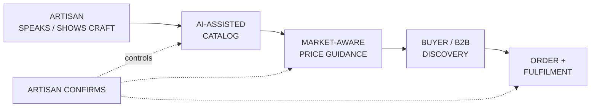
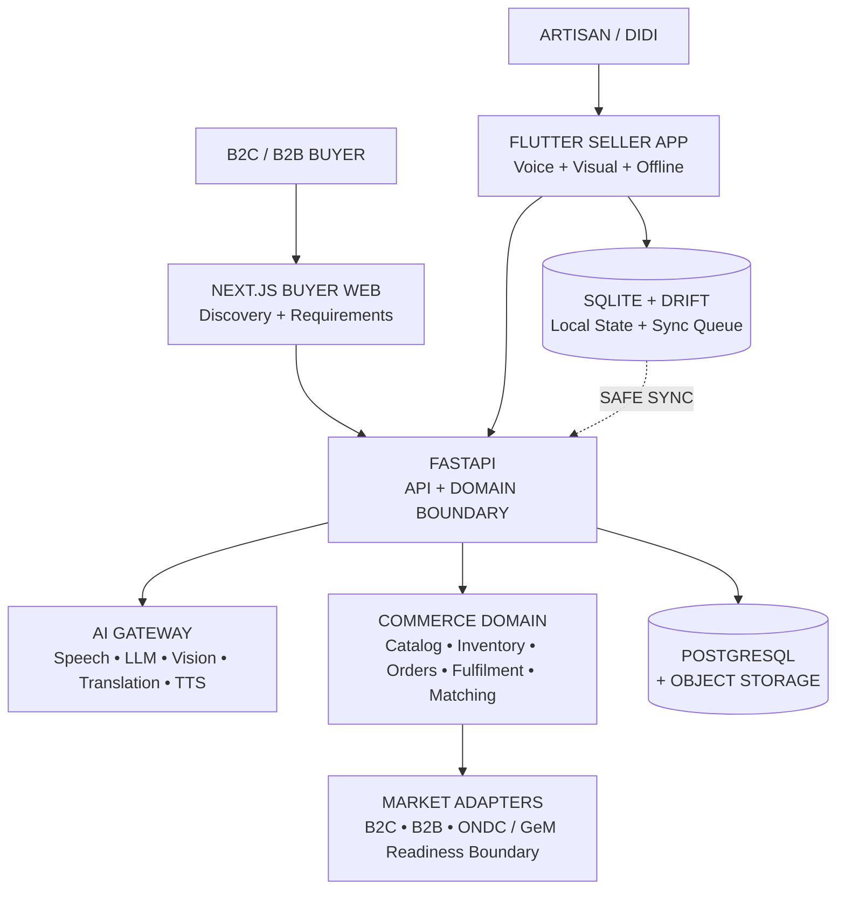
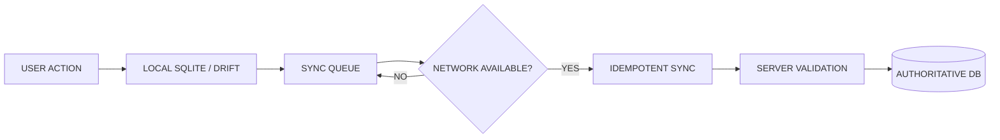
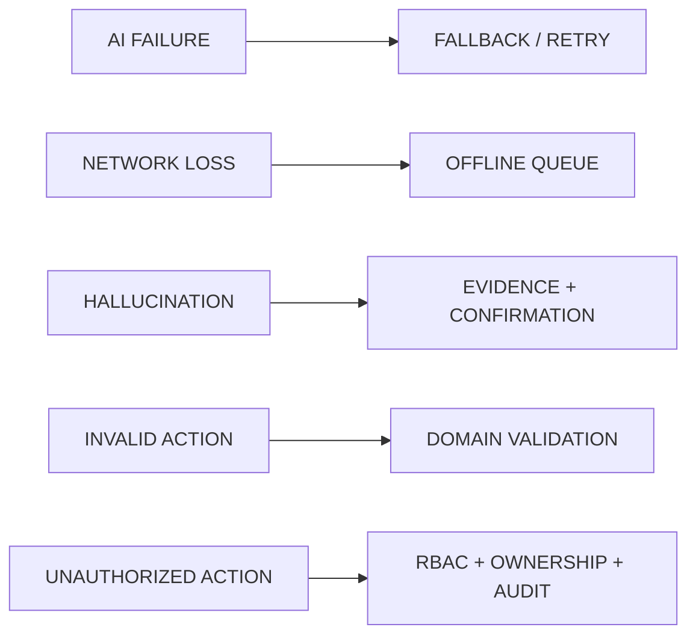
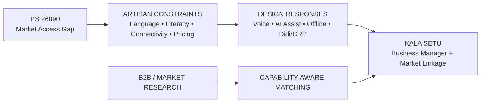

# KALA SETU — FINAL SIH 2026 6-SLIDE CONTENT MASTER
## Problem Statement 26090 | AI-Driven Market Linkage and Smart Cataloging Mobile Application for Marginalized Artisans

> **This is the single final content set for the six-slide SIH PPT.**
> No alternate slide versions. No duplicate stories. No extra slides.

---

# DECK STRATEGY

The PPT should tell one continuous story:

**THE ARTISAN HAS THE CRAFT → DIGITAL COMMERCE CREATES THE FRICTION → KALA SETU REMOVES THAT FRICTION → AI ASSISTS WITHOUT CONTROLLING COMMERCE → THE SYSTEM REMAINS FEASIBLE IN REAL CONDITIONS → ARTISANS GET YEAR-ROUND MARKET OPPORTUNITY.**

| Slide | Official section | What the judge must understand |
|---|---|---|
| 1 | Title Page | What Kala Setu is, whom it serves, and which PS it solves |
| 2 | Proposed Solution | Exactly how Kala Setu turns artisan capability into market-ready commerce |
| 3 | Technical Approach | Why the architecture is credible, controlled, and resilient |
| 4 | Feasibility & Viability | Why this can realistically work with artisan, infrastructure, cost, and trust constraints |
| 5 | Impact & Benefits | What changes for artisans, assisted workers, buyers, and the ecosystem |
| 6 | Research & References | Why the solution is grounded in the PS, language-AI research, and market reality |

## Core presentation rule

Use **one dominant visual argument per slide**. Text explains the visual; it does not compete with it.

Do not turn the deck into compressed documentation. The database, APIs, 62-screen wireframe, detailed AI spec, auth model, role matrix, and complete backlog belong in Q&A/supporting material.

---

# SLIDE 1 — TITLE PAGE

## Job of the slide

**Establish identity and seriousness. Do not explain the system here.**

### Exact copy

```text
SMART INDIA HACKATHON 2026

PROBLEM STATEMENT 26090
AI-DRIVEN MARKET LINKAGE AND SMART CATALOGING
MOBILE APPLICATION FOR MARGINALIZED ARTISANS

KALA SETU
AI-POWERED BUSINESS MANAGER
FOR MARGINALIZED ARTISANS

THEME: HERITAGE & CULTURE
CATEGORY: SOFTWARE

TEAM ID: [REGISTERED TEAM ID]
TEAM NAME: [REGISTERED TEAM NAME]
```

## Visual direction

**NO DIAGRAM. NO FLOWCHART. NO ARCHITECTURE.**

Use:
- one authentic artisan / craft hero image;
- Kala Setu logo;
- a restrained heritage-inspired background treatment;
- strong typography with a clear title hierarchy;
- Team ID and Team Name in a small footer area.

### Recommended composition

```text
┌────────────────────────────────────────────────────────────┐
│ SMART INDIA HACKATHON 2026             [KALA SETU LOGO]    │
│                                                            │
│ PROBLEM STATEMENT 26090                                    │
│ AI-DRIVEN MARKET LINKAGE AND                               │
│ SMART CATALOGING MOBILE APPLICATION                        │
│ FOR MARGINALIZED ARTISANS                                  │
│                                                            │
│                         KALA SETU                           │
│              AI-POWERED BUSINESS MANAGER                   │
│              FOR MARGINALIZED ARTISANS                     │
│                                                            │
│ [LARGE ARTISAN / CRAFT HERO VISUAL]                        │
│                                                            │
│ THEME: HERITAGE & CULTURE      CATEGORY: SOFTWARE          │
│ TEAM ID: ...                  TEAM NAME: ...               │
└────────────────────────────────────────────────────────────┘
```

### Slide 1 rule

The judge should be able to remember:

> **KALA SETU = AI-POWERED BUSINESS MANAGER FOR MARGINALIZED ARTISANS**

Nothing else needs to compete for attention.

---

# SLIDE 2 — PROPOSED SOLUTION

## Headline

# FROM CRAFT TO COMMERCE — WITHOUT MAKING THE ARTISAN BECOME A DIGITAL EXPERT

## Problem diagnosis

The problem is not simply “artisans need another marketplace.”

The harder barrier is the chain between **making a product and successfully operating digital commerce**:

| Barrier | What actually breaks |
|---|---|
| **CREATE** | Photography, catalog fields, descriptions, variants, product information |
| **COMMUNICATE** | Text-heavy interfaces, language barriers, unfamiliar digital terminology |
| **DECIDE** | Pricing requires cost awareness plus market context; demand is uncertain |
| **CONNECT** | Market access is fragmented across direct buyers, B2B opportunities, and digital channels |
| **OPERATE** | Orders, inventory, updates, and fulfillment still have to be managed after the listing exists |

### Strong problem statement for the slide

> **Artisans do not only need market access. They need a simpler way to operate the digital journey that creates, prices, presents, and connects their craft to that market.**

---

## Kala Setu — one product, two connected sides

### SELLER SIDE
**Voice-first + visual business manager**

- create and enrich catalogues;
- edit products through natural voice commands;
- receive explainable pricing guidance;
- manage inventory and orders;
- operate through offline-first workflows;
- receive assisted support through Didi/CRP mode.

### BUYER SIDE
**Market discovery + requirement matching**

- discover products and artisans;
- search using product or requirement context;
- access richer product/heritage information;
- discover relevant artisan capability;
- support B2C and B2B demand pathways.

---

## Dominant visual: “Speak → Create → Price → Match → Sell”



### Small caption beneath the visual

**Voice-first, not voice-only:** voice reduces digital effort; visual confirmation keeps the workflow understandable and auditable.

---

## Four core product capabilities

### 01 — VOICE-TO-ACTION

> **“Is saree ka daam 200 rupaye kam kar do.”**

AI converts natural speech into a structured proposal; the user confirms; the deterministic commerce layer performs the action.

### 02 — SMART CATALOGING

**Voice + image → structured product draft**

Product title, description, material, technique, dimensions, language variants, and other supported fields are proposed from the available evidence.

### 03 — SMART PRICING

**Cost inputs + market signals → explainable price guidance**

The system supports pricing decisions rather than silently deciding the final price.

### 04 — MARKET LINKAGE

**Product demand + buyer requirements → relevant artisan opportunities**

The B2B pathway can match demand against structured artisan capability, not only against an existing listing.

---

## The key differentiation

> ### **MOST PLATFORMS START WITH A PRODUCT LISTING. KALA SETU ALSO STARTS WITH ARTISAN CAPABILITY.**

### Capability can include

**Craft · Technique · Material · Skill · Capacity · Batch limits · Lead time · Customization · Availability · Location · Evidence**

Then:


This enables the platform to reason about questions such as:

> **“Can this requirement actually be fulfilled by this artisan or cluster?”**

rather than only:

> **“Does this exact product already exist in the catalogue?”**

---

## Innovation ribbon — keep compact

**VOICE-TO-ACTION — MVP**  |  **HERITAGE VISUAL SEARCH — Buyer Intelligence**  |  **OFFLINE SMS ORDER FALLBACK — Future resilience**  |  **ZERO-UI VOICE AGENT — Future / Phase 3**

These are supporting innovations. **They must not overpower the central proposition.**

---

# SLIDE 3 — TECHNICAL APPROACH

## Headline

# ONE COMMERCE PLATFORM. PLUGGABLE AI. DETERMINISTIC CONTROL.

## Architecture statement

> **Kala Setu is not an AI chatbot with commerce features. It is a commerce platform with an intelligence layer.**

---

## Dominant visual: system architecture



---

## The architecture rule that protects commerce

### LARGE CENTER STATEMENT

> **AI PROPOSES → HUMAN CONFIRMS WHEN REQUIRED → DOMAIN VALIDATES → AUTHORITATIVE STATE COMMITS**

### What this means

**AI layer**
- understands speech, images, language, and business intent;
- returns structured proposals, confidence, and evidence;
- can be replaced or upgraded independently.

**Domain layer**
- validates permissions and business rules;
- owns catalog, inventory, orders, fulfillment, and matching state;
- is the only path that commits authoritative commerce changes.

**Audit/evidence layer**
- records the relevant AI interaction, proposal, confirmation state, and decision evidence.

---

## Offline design — show this as the supporting visual



### Critical boundary

> **Offline product work is supported. Offline real-time commerce is not assumed.**

This distinction makes the design credible instead of overpromising “everything works offline.”

---

## Technology choices — show as a compact footer

| Layer | Choice |
|---|---|
| Seller app | Flutter |
| Buyer | Next.js |
| Backend | Python + FastAPI |
| Source of truth | PostgreSQL / Supabase |
| Mobile local state | SQLite + Drift |
| AI abstraction | AI Gateway / provider adapters |
| AI direction | AI4Bharat / Bhashini / local-open models first; replaceable fallbacks |
| Edge / delivery | Cloudflare-oriented low-cost deployment boundary |

Do not turn this table into the main visual. **Architecture and control are the story.**

---

# SLIDE 4 — FEASIBILITY & VIABILITY

## Headline

# DESIGNED AROUND THE CONSTRAINTS — NOT A PERFECT-INTERNET DEMO

## Opening statement

> **The MVP deliberately avoids making one paid AI vendor, continuous internet, paid GPU hosting, or AI-controlled commerce a mandatory dependency.**

---

## Feasibility matrix — this should be the dominant visual

| Real constraint | Kala Setu design response | Why it is feasible |
|---|---|---|
| **Low digital literacy** | Voice-first + visual confirmation + simple task-oriented flows | Reduces typing and unfamiliar UI interaction |
| **Regional language needs** | Speech + translation adapters + multilingual content boundary | AI providers can be changed without rewriting commerce logic |
| **Weak / variable connectivity** | Local state + queued synchronization + retry/idempotency | Core seller work can continue without constant connectivity |
| **Limited infrastructure budget** | Open-source/local AI first + modular providers + low-cost cloud stack | Expensive services remain optional rather than foundational |
| **AI uncertainty** | Evidence, confidence, human confirmation, deterministic commit | AI cannot silently change authoritative commerce state |
| **Assisted onboarding** | Didi/CRP mode with scoped permissions | Human support can help without taking ownership from the artisan |
| **Market integration complexity** | Adapter boundary for external commerce networks | External integrations can evolve independently of the core domain |

---

## Trust and operational safety

Use a compact five-part strip:



---

## MVP boundary — communicate discipline

### MVP focuses on

**Seller:**
- onboarding;
- voice interactions;
- smart catalog drafting;
- product editing;
- pricing guidance;
- inventory/order workflows;
- offline-safe product operations;
- Didi/CRP assistance.

**Buyer:**
- product discovery;
- artisan/profile discovery;
- B2C purchase flow;
- B2B requirement capture;
- capability-aware matching foundation.

### Not a mandatory MVP dependency

**Full production ONDC integration · full GeM production integration · always-on AI telephony · paid GPU infrastructure · external paid SMS/telephony as a core dependency**

These remain future/integration boundaries rather than assumptions hidden inside the MVP.

---

## Viability statement

> **The system is modular enough to start small, prove the artisan workflow, and add external market channels without rebuilding the core commerce platform.**

---

# SLIDE 5 — IMPACT & BENEFITS

## Headline

# FROM DIGITAL BARRIER TO YEAR-ROUND MARKET OPPORTUNITY

## Primary impact chain


---

## What changes for each stakeholder

### ARTISAN — “I can participate without becoming a digital expert.”

- speak instead of typing wherever practical;
- create a market-ready listing with AI assistance;
- make changes through natural language;
- receive pricing guidance with visible reasoning/evidence;
- continue safe seller work when connectivity is poor;
- retain ownership and confirmation authority over important commerce actions.

### DIDI / CRP — “I can assist without replacing the artisan.”

- guided onboarding;
- assisted catalogue creation;
- scoped account access;
- support for corrections and complex tasks;
- auditable assistance sessions.

### BUYER — “I can find the right craft, not only a random listing.”

- richer product information;
- multilingual/heritage context;
- better artisan discovery;
- requirement-led B2B discovery;
- future visual search for craft identification.

### ECOSYSTEM / PROGRAMS — “Exposure can become persistent digital intelligence.”

- structured artisan capability data;
- persistent unmet-demand signals;
- evidence of activity and corrections;
- better visibility into market requirements;
- foundations for future institutional / network channels.

---

## Before → After comparison

| Today’s friction | Kala Setu direction |
|---|---|
| Knowledge remains informal | Capability becomes structured digital knowledge |
| Manual / difficult catalog creation | Voice + image assisted cataloging |
| Language and typing barriers | Voice-first multilingual interaction |
| One-off market exposure | Persistent digital storefront + buyer discovery |
| Buyer searches only existing listings | Demand can be matched against capability |
| Fragmented supply | Capability → Demand → Match → Feasible Supply |
| AI may feel like a black box | Proposal + evidence + confirmation + audit |

---

## Pilot measurement — use this instead of making unsupported outcome claims

Present these as **what the prototype / pilot will measure**, not as achieved results:

**CATALOG CREATION** — time and completion rate with vs. without AI assistance

**VOICE-TO-ACTION** — successful command interpretation, correction, and confirmation rate

**MARKET LINKAGE** — relevant buyer/requirement matches and progression toward inquiry/quote

**ASSISTED ACCESS** — proportion of workflows completed directly by artisans vs. Didi/CRP assistance

**RESILIENCE** — successful sync / conflict resolution across weak-connectivity scenarios

This makes the impact slide measurable without inventing numbers.

---

## Cultural message

> ### **DIGITAL INCLUSION SHOULD NOT REQUIRE AN ARTISAN TO FIRST BECOME A DIGITAL OPERATOR.**

---

# SLIDE 6 — RESEARCH & REFERENCES

## Headline

# GROUNDED IN THE SIH PROBLEM, LANGUAGE-AI RESEARCH, AND MARKET REALITY

## What this slide must do

Do not make it a wall of citations. Show a clear chain:

**SOURCE → OBSERVATION → DESIGN DECISION**

---

## Evidence block 1 — the official problem

### SIH 2026 — Problem Statement 26090

**Ministry of Social Justice & Empowerment · Heritage & Culture**

Use the official PS to anchor the core requirements:

- marginalized artisans need broader, continuous market access;
- low digital literacy and language barriers reduce participation;
- professional photography/cataloguing can be difficult;
- pricing is a practical barrier;
- the expected solution requires AI-assisted image/catalog work, multilingual voice interaction, dynamic pricing support, mobile delivery, scalable backend, and a simple UX.

### Design decision

**Kala Setu therefore starts with a voice-first seller experience rather than adding AI only after a conventional marketplace has been built.**

---

## Evidence block 2 — language and AI foundations

### Technology / research anchors

**Bhashini** — Indian-language language technology ecosystem / multilingual access boundary

**AI4Bharat** — Indian-language speech, translation, and language-model research direction

**Open-source model ecosystem** — enables replaceable / local-first inference choices

### Design decision

**Language intelligence is placed behind a provider abstraction, so the product is not locked to one model or vendor.**

---

## Evidence block 3 — ecosystem / market reality

Reference the product and market context researched for the project:

**Government / network:** GeM readiness boundary, ONDC ecosystem

**Artisan commerce examples:** Amazon Karigar, iTokri, Dastkari Haat-type digital craft discovery models

**B2B patterns:** procurement, multi-supplier sourcing, requirement-led buying

### Design decision

**Kala Setu is not positioned as “another artisan catalogue.” Its deeper differentiation is the bridge between artisan capability and buyer demand, including requirements that may not map to one existing listing.**

---

## Evidence block 4 — project evidence

Show only working assets:

**[GITHUB QR]**  Code / implementation evidence

**[DEMO QR]**  End-to-end prototype

**[FIGMA QR]**  Seller + buyer experience

**[DOCS QR]**  Architecture / AI / API documentation

---

## Research → design bridge



---

## Reference footer — add as small text / QR-linked source list

Suggested visible references:

- Smart India Hackathon 2026 — PS 26090
- Bhashini / Digital India language technology resources
- AI4Bharat research / models
- ONDC ecosystem documentation
- GeM public resources
- Relevant artisan-commerce / digital craft platforms studied during competitive research
- Kala Setu GitHub repository / Figma / prototype / project documentation

**Use actual source URLs in the final PPT export and/or linked QR landing page.**

---

# FINAL 6-SLIDE NARRATIVE

```text
SLIDE 1 — IDENTITY
Kala Setu is the AI-powered business manager for marginalized artisans.

        ↓

SLIDE 2 — SOLUTION
It removes the digital friction between craft and customer.

        ↓

SLIDE 3 — TECHNICAL APPROACH
AI understands and proposes; deterministic domain services control commerce.

        ↓

SLIDE 4 — FEASIBILITY
The design is built around low literacy, weak connectivity, cost, AI uncertainty, and trust.

        ↓

SLIDE 5 — IMPACT
The outcome is not merely a listing; it is persistent market participation and better linkage to demand.

        ↓

SLIDE 6 — EVIDENCE
The solution is grounded in PS 26090, Indian-language AI research, market research, and project implementation evidence.
```

---

# THE ONE SENTENCE THE JUDGE SHOULD REMEMBER

> ## **KALA SETU LETS MARGINALIZED ARTISANS SPEAK, CREATE, MANAGE AND SELL WITH LESS DIGITAL EFFORT — WHILE CONNECTING THEIR REAL CAPABILITY TO REAL MARKET DEMAND.**

---

# VISUAL ASSET PRIORITY

## Highest priority

1. **Slide 1:** authentic artisan / craft hero image + Kala Setu logo
2. **Slide 2:** polished “Speak → Create → Price → Match → Sell” product journey + 3–4 real UI screenshots
3. **Slide 3:** clean architecture graphic + AI confirmation control visual + offline sync visual
4. **Slide 4:** feasibility matrix + risk-response strip
5. **Slide 5:** impact chain + before/after + stakeholder icons/screens
6. **Slide 6:** 4 evidence blocks + working QR codes

## Use real UI where possible

Strong screenshots to prioritize:

- Seller Home
- Voice Proposal / Voice-to-Action
- AI Catalog Draft
- Price Advisor
- B2B Requirement Capture
- B2B Match / Opportunity View

Avoid filling the deck with all 62 screens.

---

# WHAT MUST STAY OUT OF THE SIX SLIDES

Keep these for live Q&A / appendix / project documentation:

- complete database ERD;
- full API catalogue;
- all 62 wireframe screens;
- complete AI capability specification;
- complete auth/RBAC implementation;
- full provider matrix;
- every uniqueness idea as a separate feature section;
- detailed role allocation;
- backlog and milestone tables;
- long competitor descriptions;
- unsupported market-size or impact numbers;
- claims of production ONDC / GeM integration unless actually implemented.

---

# FINAL BUILD CHECKLIST

Before submission:

- [ ] Exactly **6 slides** using the official SIH structure/template.
- [ ] Slide 1 contains **no diagram**.
- [ ] Team ID and Team Name are correct.
- [ ] Every slide has one dominant message.
- [ ] No paragraph is long enough to require reading aloud.
- [ ] Slide 2 contains the clearest product demonstration.
- [ ] Slide 3 clearly shows **AI → confirmation → deterministic commerce**.
- [ ] Slide 4 clearly shows why the MVP survives real constraints.
- [ ] Slide 5 distinguishes **intended/pilot measures** from achieved results.
- [ ] Slide 6 uses real, working QR codes.
- [ ] All external references are traceable.
- [ ] No duplicate diagram appears merely to fill space.
- [ ] No feature is claimed as implemented unless it actually is.
- [ ] Exported PDF is checked at normal presentation scale.

---

# FINAL DESIGN PRINCIPLE

> **The PPT should make the judge think: “I understand the problem, I can see the product, I believe the architecture, I believe the feasibility, and I understand why this matters.”**
