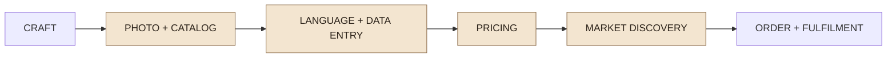
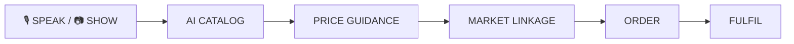
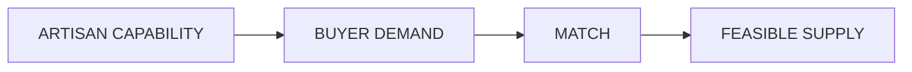
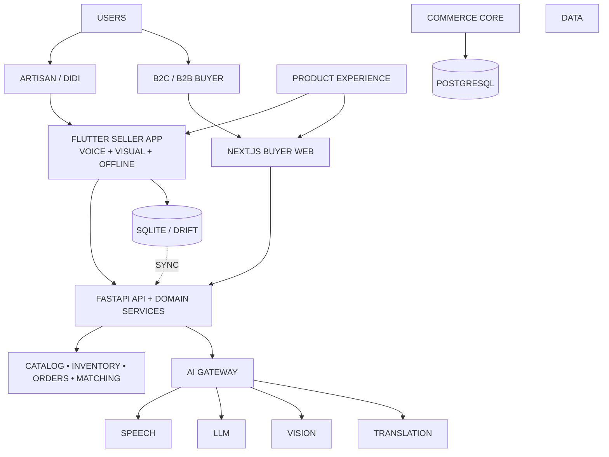
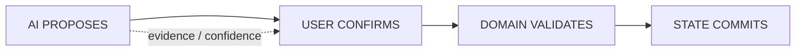
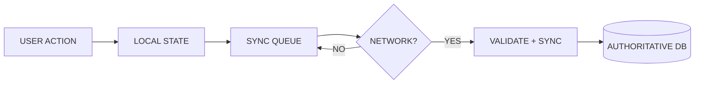
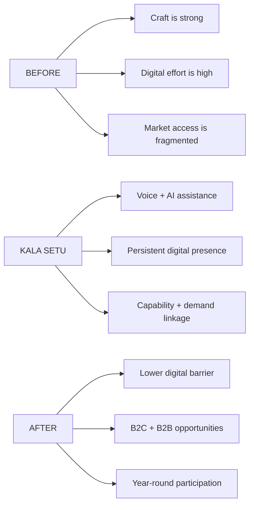
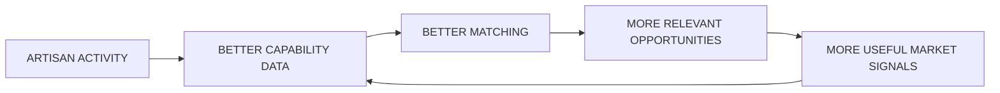
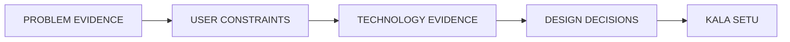

# KALA SETU — FINAL SIH 2026 PPT
## Problem Statement 26090 | AI-Driven Market Linkage and Smart Cataloging Mobile Application for Marginalized Artisans

> **Final visual-first six-slide specification.**
> The objective is not to fit the project documentation into six slides. The objective is to make the judge understand the product in seconds.

---

# DECK STORY

```text
1  IDENTITY       →  What is Kala Setu?
2  PROBLEM        →  Where does the artisan journey break?
3  SOLUTION       →  How does Kala Setu remove the friction?
4  TECHNOLOGY     →  Why can the system actually work?
5  IMPACT         →  What changes for artisans and buyers?
6  EVIDENCE       →  Why should the judge believe it?
```

## Global visual rule

**Aim for ~70% visuals / ~30% text.**

Every slide should contain:
- one dominant visual;
- one short headline;
- only the labels required to understand the visual;
- real UI screenshots wherever possible.

Avoid paragraphs, long tables, and repeated explanations.

---

# SLIDE 1 — TITLE PAGE

## PURPOSE

Pure identity. **No solution explanation. No diagram. No architecture.**

## Exact copy

```text
SMART INDIA HACKATHON 2026

PROBLEM STATEMENT 26090
AI-DRIVEN MARKET LINKAGE AND
SMART CATALOGING MOBILE APPLICATION
FOR MARGINALIZED ARTISANS

KALA SETU
AI-POWERED BUSINESS MANAGER
FOR MARGINALIZED ARTISANS

THEME: HERITAGE & CULTURE
CATEGORY: SOFTWARE

TEAM ID: [REGISTERED TEAM ID]
TEAM NAME: [REGISTERED TEAM NAME]
```

## VISUAL COMPOSITION

```text
┌──────────────────────────────────────────────────────────────┐
│ SMART INDIA HACKATHON 2026              [KALA SETU LOGO]    │
│                                                              │
│ PROBLEM STATEMENT 26090                                     │
│ AI-DRIVEN MARKET LINKAGE AND                                │
│ SMART CATALOGING MOBILE APPLICATION                          │
│ FOR MARGINALIZED ARTISANS                                   │
│                                                              │
│ KALA SETU                                                    │
│ AI-POWERED BUSINESS MANAGER                                  │
│ FOR MARGINALIZED ARTISANS                                   │
│                                                              │
│                    [FULL-BLEED ARTISAN / CRAFT HERO]        │
│                                                              │
│ THEME: HERITAGE & CULTURE     CATEGORY: SOFTWARE            │
│ TEAM ID: ...                  TEAM NAME: ...                 │
└──────────────────────────────────────────────────────────────┘
```

## Visual asset

Use **one strong authentic artisan/craft photograph** or a high-quality editorial-style illustration.

Do not use a collage of many small images.

## Judge takeaway

> **Kala Setu = AI-powered business manager for marginalized artisans.**

---

# SLIDE 2 — PROPOSED SOLUTION

## HEADLINE

# THE ARTISAN HAS THE CRAFT. KALA SETU REMOVES THE DIGITAL FRICTION.

## Do NOT use a problem paragraph.

Turn the problem into a **visual friction journey**.

### DOMINANT VISUAL — “WHERE THE JOURNEY BREAKS”



Under each friction point show **one short label**:

| Stage | Visual micro-label |
|---|---|
| Photo + Catalog | `Hard to produce` |
| Language + Data | `Text-heavy` |
| Pricing | `Uncertain` |
| Market Discovery | `Fragmented` |
| Order + Fulfilment | `Still manual` |

---

## KALA SETU — REPLACE THE FRICTION WITH A SINGLE VISUAL JOURNEY

### Dominant visual



In the actual PPT, use **icons + screenshots**, not these text boxes.

### Place 4 real screenshots directly under the flow

```text
[VOICE PROPOSAL]   [AI CATALOG]   [PRICE ADVISOR]   [B2B MATCH]
```

Each screenshot gets **one caption only**:

- **Speak → structured action**
- **Voice + image → product draft**
- **Cost + market signals → guidance**
- **Capability + demand → opportunity**

---

## DIFFERENTIATOR — SHOW IT, DON'T EXPLAIN IT

### Large center visual



Around **ARTISAN CAPABILITY**, use small chips:

`CRAFT` · `TECHNIQUE` · `MATERIAL` · `CAPACITY` · `LEAD TIME` · `CUSTOMIZATION` · `LOCATION`

### One line only

> **Most platforms start with the listing. Kala Setu can also start with what the artisan is capable of producing.**

This is the **single strongest differentiation statement** on Slide 2.

---

## MINI FEATURE STRIP

Use four icon cards, each with **3–5 words maximum**:

| Icon | Label | Micro-copy |
|---|---|---|
| 🎙 | Voice-to-Action | `Speak → Confirm → Act` |
| ✨ | Smart Catalog | `Voice + Image → Listing` |
| ₹ | Smart Pricing | `Cost + Market → Guidance` |
| 🔎 | Heritage Search | `Craft image → Discovery` |

Do not add long descriptions.

### Footer ribbon

**MVP:** Voice-to-Action · Smart Catalog · Smart Pricing · Market Linkage

**Future:** Zero-UI Voice Agent · SMS fallback

---

# SLIDE 3 — TECHNICAL APPROACH

## HEADLINE

# AI UNDERSTANDS. THE COMMERCE SYSTEM DECIDES.

## The slide should visually answer three questions

```text
HOW USERS ENTER      HOW AI HELPS       HOW DATA STAYS SAFE
```

---

## DOMINANT VISUAL — THREE-LAYER ARCHITECTURE



### In PPT

Render as **3 horizontal layers**, not a dense technical flowchart:

**USER EXPERIENCE**
Flutter Seller · Next.js Buyer

↓

**COMMERCE CORE**
FastAPI · Catalog · Inventory · Orders · Matching

↓

**INTELLIGENCE + DATA**
AI Gateway · PostgreSQL · Object Storage · Offline Sync

Put provider names in small text below the AI Gateway, not inside the main architecture.

---

## CENTERPIECE — THE SAFETY CONTROL LOOP

Make this the visual focus at the bottom half of the slide:



### Beneath it, only four words

**AI = ASSIST** · **HUMAN = CONTROL** · **DOMAIN = AUTHORITY** · **DB = TRUTH**

This is more memorable than a paragraph about responsible AI.

---

## OFFLINE — SHOW THE RESILIENCE, NOT A PARAGRAPH



Add one small label:

> **Offline-first for seller work. Real-time authority remains server-side.**

---

## TECH STACK — ICON ROW ONLY

```text
Flutter   |   Next.js   |   FastAPI   |   PostgreSQL   |   SQLite/Drift

AI4Bharat / Bhashini / Local-Open Models / Replaceable AI Providers
```

No technology descriptions on the slide.

---

# SLIDE 4 — FEASIBILITY & VIABILITY

## HEADLINE

# BUILT FOR THE REAL WORLD — NOT A PERFECT-INTERNET DEMO

## Replace the large feasibility table with a visual “constraint wall”

### LEFT: REAL-WORLD CONSTRAINTS

```text
LOW DIGITAL LITERACY
        ↓
LANGUAGE BARRIERS
        ↓
WEAK CONNECTIVITY
        ↓
LIMITED BUDGET
        ↓
AI UNCERTAINTY
        ↓
TRUST / CONTROL
```

### RIGHT: KALA SETU RESPONSE

```text
VOICE-FIRST UX
        ↓
MULTILINGUAL AI LAYER
        ↓
LOCAL STATE + SYNC QUEUE
        ↓
OPEN-SOURCE / LOCAL-FIRST AI
        ↓
EVIDENCE + CONFIDENCE
        ↓
HUMAN CONFIRMATION + DOMAIN RULES
```

Connect each pair with thin arrows.

---

## FIVE “WHY IT IS FEASIBLE” CARDS

Use **5 large icon cards** instead of explanatory paragraphs.

### 01 — LOW COST
**Open-source / local-first AI**

`Paid providers stay replaceable.`

### 02 — MODULAR
**Provider abstraction**

`AI can change without rebuilding commerce.`

### 03 — RESILIENT
**Offline + retry + idempotency**

`Network failure ≠ lost work.`

### 04 — SAFE
**Human confirmation + deterministic validation**

`AI cannot silently alter commerce truth.`

### 05 — SCALABLE
**Market adapters**

`External channels can evolve independently.`

---

## RISK → RESPONSE STRIP

Use icons and arrows:

```text
AI FAILURE        → fallback / retry
NETWORK LOSS      → offline queue
HALLUCINATION     → evidence + confirmation
INVALID ACTION    → domain validation
UNAUTHORIZED      → RBAC + ownership + audit
```

This should be **one horizontal visual**, not a table.

---

## MVP BOUNDARY — SMALL FOOTER

### BUILD NOW
`Seller workflow · Smart Catalog · Voice-to-Action · Pricing guidance · Orders · B2B requirement matching foundation`

### READY LATER
`ONDC / GeM integrations · Zero-UI telephony · SMS order fallback · deeper network integrations`

The point is **discipline**, not feature volume.

---

# SLIDE 5 — IMPACT & BENEFITS

## HEADLINE

# FROM ONE-TIME EXPOSURE TO YEAR-ROUND MARKET OPPORTUNITY

## DOMINANT VISUAL — BEFORE → KALA SETU → AFTER



In PPT, make this **three big illustrated columns**.

---

## STAKEHOLDER IMPACT — FOUR ICONS

### 👩‍🎨 ARTISAN
**Less digital effort**

`Speak · Create · Manage · Sell`

### 🤝 DIDI / CRP
**Better assisted access**

`Onboard · Correct · Support`

### 🛒 BUYER
**Better discovery**

`Find products · Find artisans · Find capability`

### 🏛 ECOSYSTEM
**Persistent market intelligence**

`Demand · Capability · Evidence`

---

## IMPACT LOOP — SHOW THE LONG-TERM VALUE



### Single caption

> **The system gets smarter from structured capability, demand, corrections, and evidence — not from AI alone.**

---

## MEASUREMENT — 5 SIMPLE GAUGES

Do not claim results before the pilot. Show what you will measure.

```text
CATALOG TIME         VOICE SUCCESS       MATCH RELEVANCE
     ◯                    ◯                    ◯
ASSISTED COMPLETION   OFFLINE SYNC SUCCESS
         ◯                    ◯
```

Labels below each gauge:

- `Time to publish`
- `Correct action interpretation`
- `Relevant opportunities`
- `Artisan vs. assisted completion`
- `Successful sync / conflict recovery`

These are **pilot KPIs, not fabricated achievements**.

---

# SLIDE 6 — RESEARCH & REFERENCES

## HEADLINE

# EVERY MAJOR DESIGN CHOICE HAS A REASON

## Do NOT use a bibliography wall.

Use **four visual evidence blocks**.

---

## BLOCK 1 — PROBLEM SOURCE

### SIH 2026 • PS 26090

Icon: 📄

**Problem signal**
`Market access · low literacy · language · cataloging · pricing`

→

**Kala Setu response**
`Voice · AI Catalog · Pricing · Market Linkage`

---

## BLOCK 2 — INDIAN LANGUAGE AI

### BHASHINI + AI4BHARAT

Icon: 🗣

**Research signal**
`Indian-language speech / translation / language technology`

→

**Kala Setu response**
`Multilingual voice-first interaction + provider abstraction`

---

## BLOCK 3 — MARKET / ECOSYSTEM RESEARCH

### GEᵐ + ONDC + ARTISAN COMMERCE PATTERNS

Icon: 🌐

**Observed pattern**
`Market channels, digital craft discovery, procurement, sourcing`

→

**Kala Setu response**
`B2C discovery + B2B requirements + capability-aware matching`

---

## BLOCK 4 — OUR OWN IMPLEMENTATION EVIDENCE

### WORKING ARTIFACTS

Use four large QR tiles:

```text
┌────────────┐  ┌────────────┐
│   GITHUB   │  │    DEMO    │
│    [QR]    │  │    [QR]    │
└────────────┘  └────────────┘

┌────────────┐  ┌────────────┐
│   FIGMA    │  │   DOCS     │
│    [QR]    │  │    [QR]    │
└────────────┘  └────────────┘
```

Add one-line captions only:

`Code` · `Prototype` · `UI/UX` · `Architecture / AI / API`

---

## RESEARCH → DESIGN VISUAL

Use one small footer flow:



### Bottom statement

> **Research is used to choose the product architecture — not added afterwards as decoration.**

---

# FINAL SIX-SLIDE STORY

```text
SLIDE 1
KALA SETU
“Who are we?”

        ↓

SLIDE 2
CRAFT → DIGITAL FRICTION → KALA SETU
“What exactly are we solving?”

        ↓

SLIDE 3
AI ASSIST → HUMAN CONTROL → COMMERCE
“How does it work safely?”

        ↓

SLIDE 4
CONSTRAINT → DESIGN RESPONSE
“Why can it work in the real world?”

        ↓

SLIDE 5
BEFORE → KALA SETU → YEAR-ROUND OPPORTUNITY
“Why does it matter?”

        ↓

SLIDE 6
SOURCE → DECISION → EVIDENCE
“Why should I believe it?”
```

---

# VISUAL PRIORITY ORDER

If time is limited, spend design effort in this order:

**1. Slide 2 product journey**

**2. Slide 3 architecture + safety loop**

**3. Slide 5 before/after impact**

**4. Slide 4 feasibility wall**

**5. Slide 6 evidence / QR tiles**

**6. Slide 1 hero image**

---

# REAL UI SCREENS TO USE

Do not use screenshots just because they exist. Use the screens that explain the story visually.

### Slide 2
- Seller Home
- Voice Proposal
- AI Catalog Draft
- B2B Match

### Slide 3
- Voice Proposal with confirmation state
- Offline / sync state if visually strong

### Slide 5
- Buyer discovery
- Seller profile / storefront
- B2B opportunity view

Maximum **6–7 screenshots across the entire deck**.

---

# WHAT NOT TO PUT ON THE SIX SLIDES

Keep these for Q&A / appendix:

- full database ERD;
- full API list;
- complete 62-screen wireframe;
- complete AI specification;
- complete RBAC/auth model;
- provider matrix;
- role allocation;
- backlog;
- long competitor descriptions;
- unsupported market-size claims;
- fabricated impact numbers.

---

# FIVE-SECOND TEST

At normal slide size, a judge should be able to answer:

### Slide 1
**What is this?**

### Slide 2
**What does it do?**

### Slide 3
**How does it work?**

### Slide 4
**Why is it feasible?**

### Slide 5
**Why does it matter?**

### Slide 6
**Why should I trust it?**

If a sentence requires reading the whole slide, turn that sentence into a **diagram, card row, icon strip, screenshot, or before/after visual**.

---

# FINAL ONE-LINE POSITIONING

> ## **KALA SETU LETS MARGINALIZED ARTISANS SPEAK, CREATE, MANAGE AND SELL WITH LESS DIGITAL EFFORT — WHILE CONNECTING THEIR REAL CAPABILITY TO REAL MARKET DEMAND.**

---

# FINAL DESIGN RULE

> **Do not make the PPT look like six pages of documentation. Make it look like a visual product argument that happens to contain the required SIH information.**
