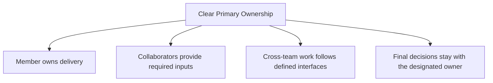
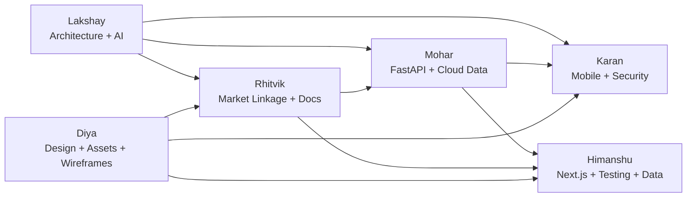
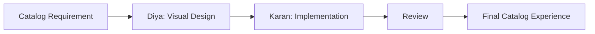
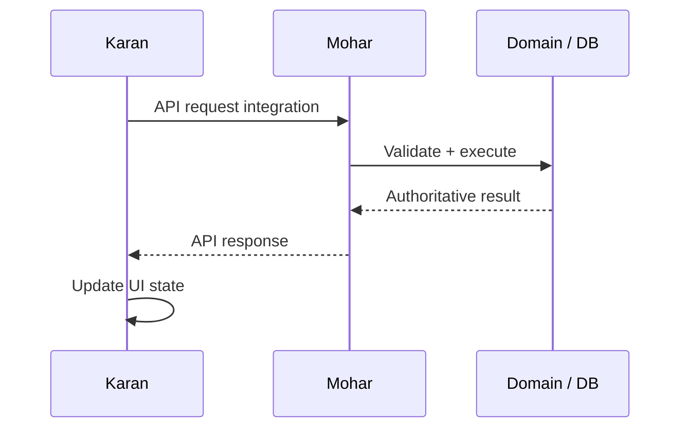
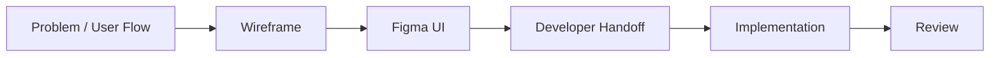
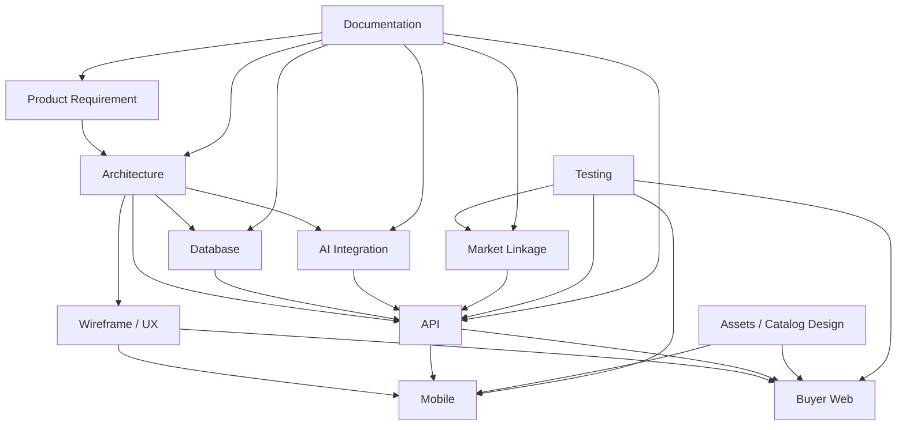
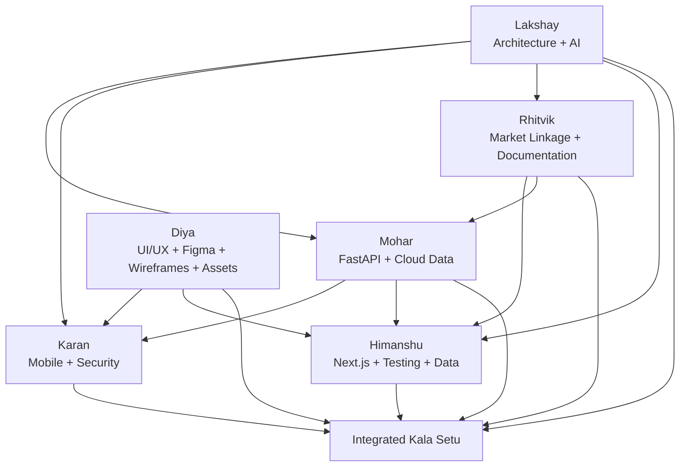

# Kala Setu — Team Roles & Ownership

## SIH 2026 — Problem Statement 26090

> **Product:** Kala Setu  
> **Problem Statement:** 26090  
> **Purpose:** Define clear ownership, responsibility boundaries, collaboration points, and delivery expectations for the Kala Setu implementation.

---

# 1. Role Ownership Principle

Kala Setu uses **clear primary ownership with explicit collaboration boundaries**.

A member can collaborate on another area without becoming its owner.



The purpose of this document is to prevent:

- duplicated work
- unclear responsibility
- ownership conflicts
- accidental scope mixing
- critical tasks being left without an owner

---

# 2. Team Ownership Overview

| Member                 | Primary Responsibility                   |
| ---------------------- | ---------------------------------------- |
| **Lakshay**            | System Architecture                      |
| **Lakshay**            | AI Integration                           |
| **Karan**              | Mobile UI Development                    |
| **Mohar**              | Python Backend — FastAPI                 |
| **Mohar + Lakshay**    | Cloud Data — Database & Storage          |
| **Rhitvik**            | Market Linkage                           |
| **Himanshu**           | Ecommerce Components — Next.js           |
| **Himanshu + Rhitvik** | Testing                                  |
| **Diya**               | Assets                                   |
| **Rhitvik**            | Documentation                            |
| **Diya + Karan**       | Catalog Design                           |
| **Diya**               | Wireframing                              |
| **Mohar + Karan**      | API                                      |
| **Himanshu + Rhitvik** | Dataset Research / Analytics / Mock Data |
| **Diya**               | UI/UX — Figma                            |
| **Karan**              | Security                                 |

---

# 3. Ownership Model



The diagram represents collaboration relationships, not shared ownership unless the ownership table explicitly names both members.

---

# 4. Lakshay — System Architecture

## Ownership

**Primary owner:** Lakshay

## Area

System-wide architecture and technical structure of Kala Setu.

## Responsibilities

Lakshay owns the architectural direction across:

```text
Flutter Seller App
Buyer Web Application
FastAPI backend
AI Gateway
Database
Storage
Async workers
Authentication / authorization boundaries
Integration adapters
Offline synchronization
Commerce domain boundaries
```

## Key responsibilities

### Architecture definition

- maintain the system architecture
- define service and module boundaries
- define frontend/backend responsibilities
- maintain system-wide technical consistency
- ensure the same architecture is reflected across implementation documents

### Domain boundaries

Ensure:

```text
AI
≠
Authoritative commerce state
```

and:

```text
Frontend
→ API
→ Domain services
→ Database
```

rather than direct bypasses.

### Cross-system consistency

Validate that:

```text
Architecture
↔ Database
↔ API
↔ Auth
↔ AI
↔ Wireframe
↔ Implementation
```

remain aligned.

### Architecture decisions

Own decisions regarding:

- modular-monolith boundaries
- integration patterns
- async processing
- offline-first structure
- provider abstraction
- deterministic domain services
- system-level scalability decisions

## Deliverables

```text
ARCHITECTURE_26090_B2B_B2C.md
Architecture diagrams
Module boundaries
Integration boundaries
System-level technical decisions
Architecture review
```

## Does not own

Lakshay is **not automatically the owner** of every implementation area merely because architecture touches it.

For example:

```text
Mobile UI → Karan
FastAPI implementation → Mohar
Next.js implementation → Himanshu
Figma/UIUX → Diya
Security implementation → Karan
```

Lakshay defines architectural boundaries and reviews cross-system consistency.

---

# 5. Lakshay — AI Integration

## Ownership

**Primary owner:** Lakshay

## Area

Integration of AI capabilities into the Kala Setu product architecture.

## Responsibilities

Own the integration of:

```text
Speech / STT
LLM
Vision
Translation
TTS
Embeddings
AI Gateway
Provider abstraction
AI jobs
AI decision flow
AI confirmation flow
AI fallback behavior
```

## Key principles

AI must follow:

```text
AI proposes
      ↓
Human confirms when required
      ↓
Deterministic domain service
      ↓
Authoritative mutation
```

AI must not become the authoritative source of commerce state.

## Main responsibilities

- define AI provider interfaces
- integrate AI models/providers with FastAPI
- implement AI request/response contracts
- manage AI fallback logic
- integrate AI jobs and asynchronous processing
- connect AI decisions to confirmation flows
- connect AI outputs to structured domain data
- maintain AI safety and hallucination controls
- support voice, image, catalog, pricing and matching intelligence

## Deliverables

```text
AI Gateway integration
AI provider adapters
AI workflows
AI decision integration
AI job integration
AI safety controls
AI implementation alignment with AI_26090.md
```

## Collaboration

```text
Lakshay ↔ Mohar
AI ↔ FastAPI

Lakshay ↔ Karan
AI ↔ Mobile voice/action UX

Lakshay ↔ Rhitvik
AI ↔ Market matching logic

Lakshay ↔ Himanshu
AI ↔ Buyer Web capabilities
```

---

# 6. Karan — Mobile UI Development

## Ownership

**Primary owner:** Karan

## Area

Flutter Seller App implementation.

## Responsibilities

Own the implementation of seller-side mobile screens and interaction behavior.

Primary scope includes:

```text
Authentication screens
Seller home
Voice interaction
Product creation
Product editing
Catalog flow
Pricing flow
Orders
Fulfilment
My Money
Offline state
Sync state
Conflict review
Didi / assisted workflows
```

## Responsibilities

- implement Flutter screens
- connect UI states to API contracts
- implement local UI behavior
- integrate voice interaction UX
- implement confirmation flows
- implement loading/error/empty states
- support offline UI
- support sync/conflict UI
- implement responsive interaction patterns from Figma/wireframes

## Collaboration

```text
Karan ↔ Diya
Figma → Flutter

Karan ↔ Mohar
API integration

Karan ↔ Lakshay
Architecture + AI integration

Karan ↔ Security
Security implementation is owned by Karan
```

---

# 7. Mohar — Python Backend / FastAPI

## Ownership

**Primary owner:** Mohar

## Area

FastAPI backend implementation.

## Responsibilities

Own the server-side implementation of:

```text
API routes
Application services
Domain services
Validation
Commerce workflows
Async jobs
Database access integration
Authentication integration
Business rules
```

## Core responsibilities

- implement FastAPI project structure
- implement API endpoints
- implement request/response validation
- implement application services
- implement domain logic
- integrate database access
- implement asynchronous job execution
- enforce server-side authorization boundaries
- implement deterministic commerce mutations

## Core invariant

```text
Frontend
   ↓
FastAPI
   ↓
Domain validation
   ↓
Authoritative state
```

The backend must prevent clients or AI providers from directly bypassing domain rules.

## Deliverables

```text
FastAPI application
API route implementations
Domain services
Application services
Background workers
Validation
Server-side authorization enforcement
```

---

# 8. Mohar + Lakshay — Cloud Data / Database & Storage

## Joint ownership

**Primary owners:** Mohar + Lakshay

## Area

PostgreSQL database, cloud persistence and object storage.

## Responsibilities

### Database

```text
PostgreSQL
Schemas
Tables
Relations
Constraints
Indexes
Transactions
Migrations
Seed data
```

### Storage

```text
Product images
Media derivatives
Audio where retained
AI-generated assets
Other binary media
```

## Joint responsibility split

### Lakshay

Primary focus:

```text
Data architecture
Entity boundaries
Cross-system consistency
Domain data model
Architecture-level data decisions
```

### Mohar

Primary focus:

```text
Database implementation
Queries
Migrations
Constraints
ORM integration
Transactions
Backend data access
```

## Critical responsibilities

Ensure:

```text
Database
↔ API
↔ Domain services
↔ AI outputs
```

remain consistent.

## Important invariants

Examples include:

```text
Authoritative inventory state
Transactional order mutations
Revision/version protection
Auditability
Referential integrity
```

---

# 9. Rhitvik — Market Linkage

## Ownership

**Primary owner:** Rhitvik

## Area

The market-linkage domain.

## Responsibilities

Own the implementation and business logic for:

```text
B2B requirements
Market opportunities
Demand matching
Market matches
Match factors
Quotation workflows
Market readiness
Market channels
Buyer-side market linkage
```

## Core responsibilities

### Requirement understanding

Define how buyer requirements become structured:

```text
Category
Craft
Material
Quantity
Budget
Deadline
Location
Customization
Other constraints
```

### Matching

Own the market-side rules around:

```text
Hard constraints
Candidate selection
Ranking
Match explanations
Single supplier matching
Multi-supplier opportunities
```

### Opportunity lifecycle

Own:

```text
Requirement
→ Opportunity
→ Match
→ Quote
→ Commerce conversion
```

## Collaboration

```text
Rhitvik ↔ Lakshay
Market AI / matching architecture

Rhitvik ↔ Mohar
FastAPI implementation

Rhitvik ↔ Himanshu
B2B buyer web flows

Rhitvik ↔ Testing
Market workflow validation
```

---

# 10. Himanshu — Ecommerce Components / Next.js

## Ownership

**Primary owner:** Himanshu

## Area

Buyer Web Application implementation.

## Scope

```text
B2C
B2B
```

## B2C responsibilities

```text
Home
Search
Filters
Product detail
Craft story
Artisan profile
Cart
Checkout
Address
Order confirmation
Order tracking
Order history
Buyer account
```

## B2B responsibilities

```text
B2B home
Requirement creation
Requirement review
Match results
Match detail
Quote request
Quotation detail
Quote comparison
Change request
Converted order
```

## Responsibilities

- implement Next.js UI
- connect frontend to API
- implement buyer states
- implement search/discovery flows
- implement cart/checkout
- implement B2B requirement workflows
- implement market opportunity display
- integrate buyer-side AI capabilities where defined

---

# 11. Himanshu + Rhitvik — Testing

## Joint ownership

**Primary owners:** Himanshu + Rhitvik

## Area

System and workflow testing.

## Responsibilities

### Himanshu

Focus:

```text
Buyer Web
B2C
B2B
Frontend integration
Browser behavior
```

### Rhitvik

Focus:

```text
Market linkage
Requirement workflows
Matching
Quotations
Market domain logic
```

## Joint testing coverage

```text
Unit tests
Integration tests
API tests
Workflow tests
Regression tests
UI tests
Edge cases
Error states
```

## Critical workflows

```text
Authentication
Product creation
Catalog generation
Pricing
Inventory
Orders
B2C checkout
B2B requirement
Matching
Quotation
Offline sync
Conflict resolution
```

---

# 12. Diya — Assets

## Ownership

**Primary owner:** Diya

## Area

Visual and supporting product assets.

## Responsibilities

```text
Logos
Icons
Illustrations
Visual assets
Brand assets
Presentation-support assets
Product visual materials
```

## Responsibilities include

- maintain asset consistency
- prepare required visual assets
- maintain naming/organization
- provide production-ready assets to implementation owners

---

# 13. Rhitvik — Documentation

## Ownership

**Primary owner:** Rhitvik

## Area

Project documentation coordination.

## Responsibilities

Own documentation consistency across:

```text
Solution
Architecture
Database
API
Auth
AI
Wireframe
Uniqueness
Roles
Implementation documentation
```

## Responsibilities

- maintain documentation structure
- track document versions
- maintain cross-document terminology
- identify documentation gaps
- coordinate updates from technical owners
- ensure implementation documentation reflects actual system decisions

## Important boundary

Documentation ownership does **not** mean Rhitvik unilaterally changes technical decisions.

Technical owners remain authoritative for their domains.

```text
Technical owner → technical decision
Rhitvik → documentation of that decision
```

---

# 14. Diya + Karan — Catalog Design

## Joint ownership

**Primary owners:** Diya + Karan

## Area

Catalog visual design and seller-facing catalog presentation.

### Diya

Primary focus:

```text
Visual design
Typography
Spacing
Hierarchy
Brand consistency
Visual presentation
```

### Karan

Primary focus:

```text
Implementation feasibility
Flutter rendering
UI behavior
Interaction states
Responsive implementation
```

## Workflow



---

# 15. Diya — Wireframing

## Ownership

**Primary owner:** Diya

## Area

Product wireframes and interaction structure.

## Responsibilities

Own:

```text
Seller flows
Didi flows
Buyer B2C flows
Buyer B2B flows
Navigation structure
Screen composition
Interaction states
```

## Responsibilities

- maintain wireframes
- reflect approved product flows
- ensure screen-to-screen continuity
- maintain UI states
- coordinate with API/DB requirements where screens need data
- communicate implementation intent to Karan and Himanshu

## Deliverable

```text
WIREFRAME_26090_v8_API_DB_LINKED.md
```

---

# 16. Mohar + Karan — API

## Joint ownership

**Primary owners:** Mohar + Karan

## Area

API contract implementation and frontend integration.

### Mohar

Owns:

```text
FastAPI endpoint implementation
Validation
Server behavior
Response contracts
Domain integration
```

### Karan

Owns:

```text
Flutter API consumption
Request integration
Response handling
Client state
Error/loading states
```

## Workflow



The API contract itself must remain consistent with the architecture specification.

---

# 17. Himanshu + Rhitvik — Dataset Research / Analytics / Mock Data

## Joint ownership

**Primary owners:** Himanshu + Rhitvik

## Area

Research datasets, analytics and controlled mock data for development and demonstration.

## Responsibilities

```text
Craft data
Artisan profiles
Capability records
Product data
Buyer requirements
Demand scenarios
Matching scenarios
Quotation scenarios
B2C product records
B2B test cases
```

## Mock data principle

Mock data must be:

```text
Internally consistent
Realistic
Traceable to defined scenarios
Compatible with database schema
Compatible with API contracts
```

Avoid creating mock values that contradict the domain model.

## Analytics

Focus on:

```text
Match outcomes
Demand distribution
Capacity distribution
Product/category patterns
Testing metrics
Demo metrics
```

---

# 18. Diya — UI/UX / Figma

## Ownership

**Primary owner:** Diya

## Area

Visual product design and design system.

## Responsibilities

Own:

```text
Design system
Color palette
Typography
Spacing
Component design
Mobile UI/UX
Buyer Web UI/UX
Interaction patterns
Accessibility considerations
```

## Design workflow



## Collaboration

```text
Diya ↔ Karan
Seller Mobile

Diya ↔ Himanshu
Buyer Web

Diya ↔ Rhitvik
Product / Documentation consistency
```

---

# 19. Karan — Security

## Ownership

**Primary owner:** Karan

## Area

Security implementation.

## Responsibilities

Own technical implementation of:

```text
Authentication security
Device binding
Session security
Authorization enforcement support
Secure API usage
Client-side security
Secrets handling on client
Input safety
Security hardening
```

## Security boundary

Security is not a separate isolated layer.

It must operate across:

```text
Flutter
FastAPI
Database
Storage
Authentication
AI
API
Offline sync
```

## Collaboration

```text
Karan ↔ Lakshay
Security architecture

Karan ↔ Mohar
Backend security

Karan ↔ API
Secure API contracts

Karan ↔ Diya
Secure UX / safe flows
```

---

# 20. Cross-Ownership Matrix

| Area                            | Primary Owner      | Supporting Owner(s)                     |
| ------------------------------- | ------------------ | --------------------------------------- |
| System Architecture             | Lakshay            | All technical owners                    |
| AI Integration                  | Lakshay            | Mohar, Karan, Rhitvik, Himanshu         |
| Flutter Mobile UI               | Karan              | Diya                                    |
| FastAPI Backend                 | Mohar              | Lakshay                                 |
| Database Architecture           | Lakshay + Mohar    | —                                       |
| Cloud Storage                   | Lakshay + Mohar    | Karan, Himanshu                         |
| Market Linkage                  | Rhitvik            | Lakshay, Mohar, Himanshu                |
| Buyer Web / Next.js             | Himanshu           | Diya, Rhitvik                           |
| Testing                         | Himanshu + Rhitvik | All implementation owners               |
| Assets                          | Diya               | All                                     |
| Documentation                   | Rhitvik            | All owners                              |
| Catalog Design                  | Diya + Karan       | Lakshay / AI integration where relevant |
| Wireframing                     | Diya               | Karan, Himanshu                         |
| API                             | Mohar + Karan      | Lakshay                                 |
| Dataset / Analytics / Mock Data | Himanshu + Rhitvik | Relevant domain owners                  |
| UI/UX / Figma                   | Diya               | Karan, Himanshu                         |
| Security                        | Karan              | Lakshay, Mohar                          |

---

# 21. Critical Collaboration Boundaries

## Architecture vs implementation

```text
Lakshay
    ↓
Defines architecture
    ↓
Mohar / Karan / Himanshu implement
```

Architecture ownership does not mean implementation ownership.

---

## Design vs implementation

```text
Diya
    ↓
Figma / UX / Wireframe
    ↓
Karan / Himanshu
    ↓
Implementation
```

Design defines intended experience; developers own implementation.

---

## AI vs backend

```text
Lakshay
    ↓
AI integration / provider behavior
    ↓
Mohar
    ↓
FastAPI / domain execution
```

AI should not independently mutate authoritative commerce state.

---

## Market linkage vs backend

```text
Rhitvik
    ↓
Market logic / rules / workflows
    ↓
Mohar
    ↓
FastAPI implementation
```

Market-domain ownership does not replace backend implementation ownership.

---

## Documentation vs technical decisions

```text
Technical Owner
    ↓
Decision
    ↓
Rhitvik
    ↓
Documented decision
```

Documentation should reflect approved technical decisions.

---

# 22. End-to-End Responsibility Flow



---

# 23. Definition of Ownership

For this project, **ownership means responsibility for delivery and correctness of the named area**.

Ownership includes:

```text
Planning
Implementation
Review
Integration
Bug fixing
Documentation input
Final readiness
```

Shared ownership means the named members jointly own the deliverable.

It does **not** mean:

```text
Everyone owns everything.
```

---

# 24. Escalation Rules

When a task crosses multiple domains:

### Step 1

Identify the primary owner.

### Step 2

Identify the required supporting owner.

### Step 3

The primary owner coordinates implementation.

### Step 4

Cross-domain conflicts are resolved using the higher-level architecture and agreed domain boundaries.

Example:

```text
Voice command changes product price

AI → Lakshay
API/domain execution → Mohar
Mobile UI → Karan
Security → Karan
Documentation → Rhitvik
```

No single member needs to own every part of the task.

---

# 25. Avoiding Responsibility Drift

The team should avoid:

```text
Architecture
→ everyone

AI
→ everyone

Security
→ everyone

Database
→ everyone

UI
→ everyone
```

Instead:

```text
Named owner
+
Named collaborator
+
Defined interface
```

This keeps execution predictable.

---

# 26. Final Team Map



---

# 27. Final Ownership Table

| Member                 | Owned Areas                                       |
| ---------------------- | ------------------------------------------------- |
| **Lakshay**            | System Architecture; AI Integration               |
| **Karan**              | Mobile UI Development; Security                   |
| **Mohar**              | Python Backend — FastAPI                          |
| **Mohar + Lakshay**    | Cloud Data — Database & Storage                   |
| **Rhitvik**            | Market Linkage; Documentation                     |
| **Himanshu**           | Ecommerce Components — Next.js                    |
| **Himanshu + Rhitvik** | Testing; Dataset Research / Analytics / Mock Data |
| **Diya**               | Assets; Wireframing; UI/UX — Figma                |
| **Diya + Karan**       | Catalog Design                                    |
| **Mohar + Karan**      | API                                               |

---

# 28. Final Principle

> **Own your domain deeply, collaborate across interfaces, and never leave critical responsibility ambiguous.**

Kala Setu should be built as:

```text
Clear Ownership
+
Strong Interfaces
+
Defined Collaboration
+
Shared System Goal
```

rather than as six people independently building disconnected pieces.
