# Kala Setu — Uniqueness & Competitive Differentiation

## SIH 2026 — Problem Statement 26090

> **Problem Statement:** 26090  
> **Title:** AI-Driven Market Linkage and Smart Cataloging Mobile Application for Marginalized Artisans  
> **Product:** Kala Setu  
> **Status:** Uniqueness baseline for SIH 2026

---

# 0. Executive Decision

Kala Setu should **not** claim:

> "We are unique because we use AI for artisans."

That is too weak.

Kala Setu should also **not** claim:

> "We are the first artisan marketplace."

That is unsafe because established programs and marketplaces already connect artisans and handmade products to buyers.

The strongest uniqueness proposition is:

> **Kala Setu turns fragmented artisan capability into structured, continuously matchable supply intelligence, preserves buyer demand even when it cannot be fulfilled immediately, and can compose multiple compatible artisans or clusters into a feasible opportunity for a specific buyer requirement.**

The accessibility mechanism is:

> **The system learns this capability through voice, image, assisted interaction, and incremental confirmation rather than requiring conventional commerce forms.**

The overall loop:

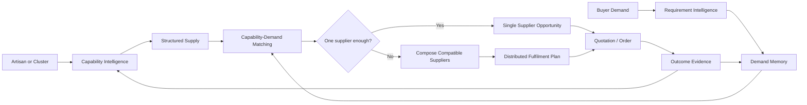

The intended differentiation is the **closed-loop, artisan-specific combination and operational data model**.

---

# 1. Original Four Planned Uniqueness Features

These four were the **original uniqueness features planned during brainstorming**. They remain part of Kala Setu's uniqueness strategy and must not be replaced by the later system-level differentiators.

| #   | Original feature                         | Purpose                                                                             | MVP status                               | Uniqueness role                        |
| --- | ---------------------------------------- | ----------------------------------------------------------------------------------- | ---------------------------------------- | -------------------------------------- |
| O1  | **Zero-UI AI Voice Agent**               | Phone-call business manager for artisans without smartphones or reliable app access | **Phase 3 / Future**                     | Accessibility differentiator           |
| O2  | **Natural Voice Edit / Voice-to-Action** | Conversational management of shop operations without navigating complex UI          | **MVP**                                  | AI interaction differentiator          |
| O3  | **Offline SMS Order Pipeline**           | Structured SMS fallback for critical order communication and confirmation           | **Architecture / future operating mode** | Connectivity-resilience differentiator |
| O4  | **Heritage Visual Search**               | Buyer-side image search for craft/style/region discovery                            | **Planned buyer intelligence**           | Heritage-discovery differentiator      |

These four are the **original feature-level uniqueness layer**.

The later brainstorming added a deeper **system-level uniqueness layer** rather than replacing these four.

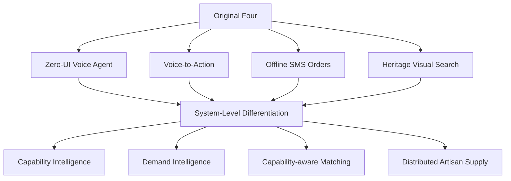

## O1 — Zero-UI AI Voice Agent

### Concept

A phone-call-based business manager for artisans who may not have a smartphone, app access, reliable internet, or comfort with digital interfaces.

```text
Artisan calls phone number
        ↓
Conversational AI
        ↓
Speech understanding
        ↓
Intent + entity extraction
        ↓
Commerce proposal
        ↓
Artisan confirmation
        ↓
Authoritative domain action
```

The intended future interaction is:

```text
"mere 10 basket ka order confirm kar do"
"pichhle order ka status kya hai?"
"ye saree ka daam 200 rupaye kam kar do"
"mere naye product ko add karo"
```

### Value

The differentiator is not merely speech recognition.

It is:

> **A business-management interface that requires neither a smartphone nor conventional app navigation.**

### Scope

This is **not an MVP claim**.

The current MVP remains:

```text
Flutter Mobile App
+
In-app Voice AI
+
Catalog
+
Pricing
+
Orders
+
Market Linkage
```

The phone-call channel is a **Phase 3 future accessibility channel** after the core workflow is validated.

---

## O2 — Natural Voice Edit / Voice-to-Action

### Concept

The artisan manages the business by speaking naturally.

Example:

```text
Artisan:
"is saree ka daam 200 rupaye kam kar do"
```

System:

```text
Speech
 ↓
STT
 ↓
Intent = UPDATE_VARIANT_PRICE
 ↓
Target = Saree Variant
 ↓
Argument = -₹200
 ↓
Confirmation
 ↓
Deterministic commerce mutation
```

This is already strongly aligned with the existing AI + API architecture.

The key distinction is:

> **Voice is not just an input method for creating listings. It becomes a control layer for the business itself.**

The API contract requires AI to remain proposal/recommendation infrastructure and prevents AI from directly bypassing deterministic commerce services. fileciteturn17file8L987-L1005

### Why this matters

A conventional commerce UI requires:

```text
Open product
→ find variant
→ tap edit
→ find price
→ type price
→ save
```

Kala Setu can aim for:

```text
Speak
→ understand
→ confirm
→ execute
```

---

## O3 — Offline SMS Order Pipeline

### Concept

When internet connectivity is unavailable or unreliable, critical commerce events can have a structured SMS fallback.

```text
Order Event
    ↓
Connectivity unavailable
    ↓
Structured SMS
    ↓
Artisan receives message
    ↓
Artisan replies YES / NO
    ↓
Gateway / backend processes response
    ↓
Confirmation state
```

The important design principle is:

> **SMS is a fallback transport, not a second commerce database.**

The authoritative state remains on the server.

This keeps the offline/SMS layer consistent with the broader architecture's deterministic commerce model.

### Value

The differentiator is operational resilience for users operating in connectivity-constrained environments.

It should be presented as:

> **critical-order communication fallback**

rather than claiming that the entire commerce system works fully through SMS.

---

## O4 — Heritage Visual Search

### Concept

The buyer can upload an image of a craft and use visual intelligence to discover likely craft/category/style/region matches.


Example:

```text
Buyer uploads image
        ↓
Possible craft:
Warli / Madhubani / Regional textile / etc.
        ↓
Relevant craft categories
        ↓
Matching products
        ↓
Matching artisans / clusters
```

The strongest version is not:

> "Our AI recognizes art."

It is:

> **visual discovery bridges the naming gap between urban buyers who do not know the craft terminology and artisan products that are difficult to discover through text search.**

This should remain a buyer-side intelligence feature supporting market discovery.

---

## 1.1 How the Original Four Fit the Final Product

The original four are complementary:

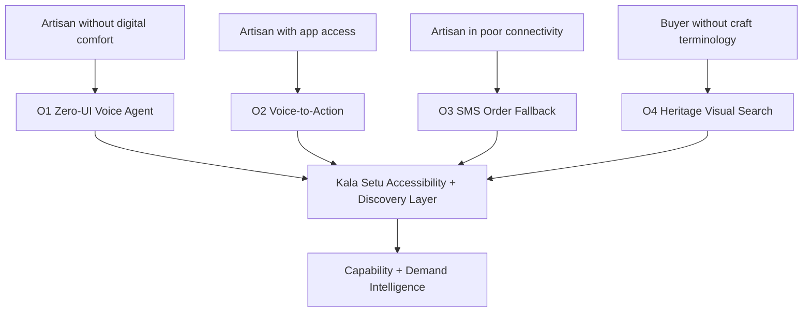

These features solve **interface and accessibility barriers**.

The newer uniqueness concepts solve the **market-structure problem**.

# 1. What We Already Know From the Project

The earlier brainstorming explicitly established that capability intelligence, virtual/distributed production, demand-driven market linkage, multi-artisan fulfilment, and AI-mediated communication are the strong central directions. It also classified catalog generation, image enhancement, multilingual support, pricing assistance, assisted mode, and human-in-the-loop as important but not unique by themselves. fileciteturn18file0L47-L71

The prior direction document similarly concluded that the stronger innovation lives in **capability understanding + distributed fulfilment**, while voice, vision, cataloguing, and pricing are mechanisms supporting that layer. fileciteturn18file1L1248-L1277

That conclusion still holds after the current architecture, database, API, auth, wireframe, and AI work.

---

# 2. Later System-Level Uniqueness Directions

The later brainstorming produced a second layer of differentiation:

| #   | System-level direction                          | Role                                  | Strength  |
| --- | ----------------------------------------------- | ------------------------------------- | --------- |
| S1  | **Artisan Capability Intelligence**             | Core supply model                     | Very High |
| S2  | **Requirement-to-Capability Matching**          | Core market-linkage model             | Very High |
| S3  | **Dynamic Distributed Artisan Supply**          | Core fulfilment model                 | Very High |
| S4  | **Exhibition-to-Evergreen Market Intelligence** | PS-specific market-intelligence layer | Very High |
| S5  | **Persistent Unmet-Demand Memory**              | Temporal opportunity layer            | Very High |
| S6  | **AI-Mediated Requirement Reconciliation**      | Supporting mechanism                  | High      |

These should **not** be presented as four unrelated features.

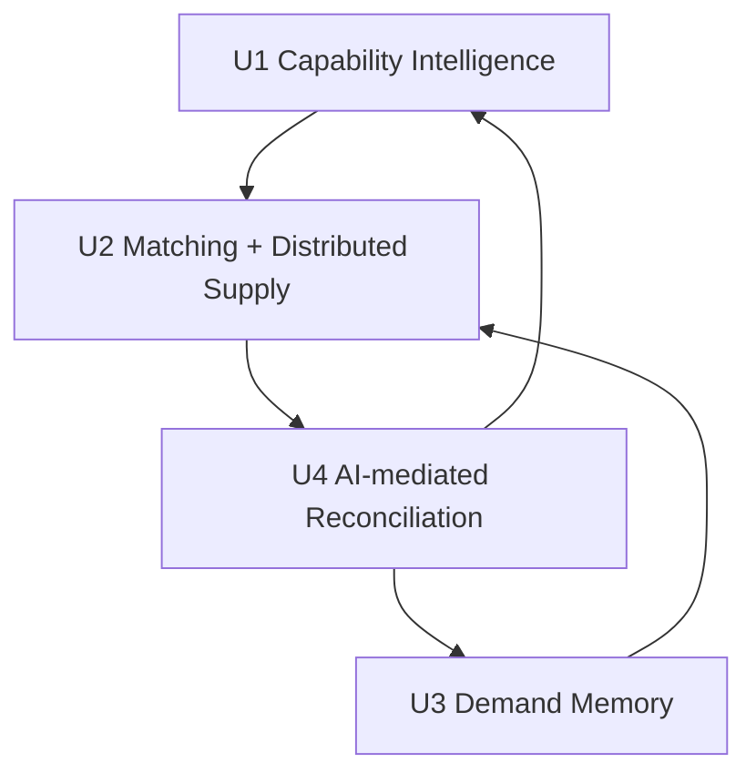

The loop is more defensible than any single feature.

---

# 3. U1 — Artisan Capability Intelligence

## 3.1 Product-first vs capability-first

A conventional marketplace mostly stores:

```text
Seller
├── Name
├── Product
├── Price
├── Photos
└── Description
```

Kala Setu aims to additionally represent:

```text
Artisan / Cluster
├── Crafts
├── Skills
├── Techniques
├── Materials
├── Products
├── Production capacity
├── Typical batch size
├── Maximum practical capacity
├── Production time
├── Lead time
├── Availability
├── Existing commitments
├── Customisation capability
├── Quality characteristics
├── Cost structure
├── Location / cluster
└── Languages
```

This changes the platform's basic supply object from:

> **seller of listed inventory**

toward:

> **structured production capability**

The prior brainstorming explicitly framed this as the shift from **Product** to **Artisan Capability**. fileciteturn18file0L75-L115

---

## 3.2 The capability interview

The system is not merely asking:

> "What products do you sell?"

It attempts to learn:

> "What can you realistically produce, under what constraints, and how much?"

Example:

```text
Artisan:
"I make bamboo baskets.
One takes around two days.
I normally make about fifteen each week.
I can change the size."
```

Structured result:

```text
Craft = bamboo weaving
Product family = baskets
Production time = ~2 days/unit
Typical capacity = ~15/week
Customization = supported
```

The important output is the structured capability state.

---

## 3.3 Why voice alone is not the differentiator

Weak framing:

```text
Voice
 ↓
Speech-to-text
 ↓
Text
```

Stronger framing:

```text
Voice
 ↓
Intent + entity extraction
 ↓
Capability facts
 ↓
Evidence / confidence
 ↓
Artisan confirmation
 ↓
Structured capability state
 ↓
Matching / pricing / opportunity generation
```

The earlier direction document explicitly described the adaptive interview as an information-acquisition mechanism, not merely a chatbot. fileciteturn18file1L1061-L1078

---

# 4. U2 — Requirement-to-Capability Matching

## 4.1 Conventional marketplace


This assumes:

> The requested product already exists as a listing.

---

## 4.2 Kala Setu model


The request can therefore be satisfied even when:

```text
No exact catalog listing exists
```

provided that capable artisans exist.

---

# 5. U3 — Dynamic Distributed Artisan Supply

Suppose:

```text
Artisan A = 350
Artisan B = 450
Cluster C = 500
Cluster D = 700
```

and a buyer requires:

```text
2,000 units
```

The platform can reason over compatible supply:

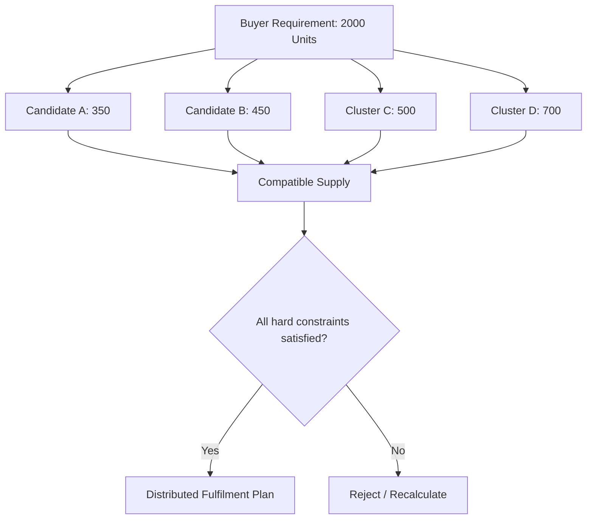

The important output is:

> **a temporary digital supply opportunity for a specific requirement**

rather than a list of independent sellers.

---

# 6. The Critical Novelty Boundary

We must explicitly acknowledge what research disproves.

### Multi-supplier procurement itself is not unique.

SAP Ariba supports split awards of a line item across multiple suppliers. IFS supports splitting a requirement among multiple suppliers, and other procurement products support multi-supplier orders. citeturn207642search13turn207642search2turn207642search12

Therefore do **not** claim:

> "No platform can split an order across multiple suppliers."

The stronger claim is:

> **Kala Setu applies multi-supplier fulfilment reasoning to fragmented marginalized artisan capacity, where supplier selection is driven by structured craft capability, production constraints, customization ability, location, and continuously changing small-scale capacity.**

---

# 7. U4 — Exhibition-to-Evergreen Market Intelligence

The PS explicitly references physical exhibitions, cluster programs, trade fairs, Shilp Samagam, Surajkund Mela and Dilli Haat, and the lack of continuous year-round market access. citeturn331234search2turn331234search3

That makes exhibitions strategically relevant.

Traditional lifecycle:

```text
Exhibition
   ↓
Artisan + Product + Buyer Interaction
   ↓
Event Ends
   ↓
Most context decays
```

Kala Setu's intended lifecycle:

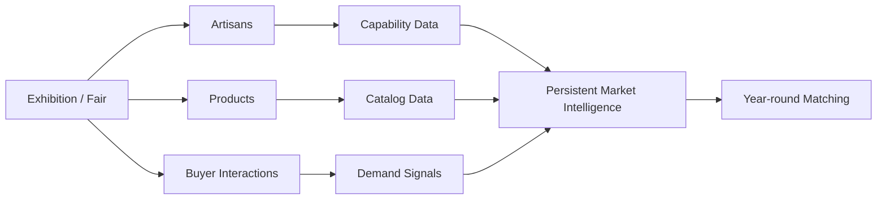

---

# 8. U5 — Persistent Unmet-Demand Memory

This is one of the strongest additions from the brainstorming process.

A buyer asks:

> "Can you make 500 units in two weeks?"

No participating artisan can.

Traditional flow:

```text
Demand
  ↓
No supplier
  ↓
Opportunity disappears
```

Kala Setu can preserve:

```text
Demand
  ↓
Unmet requirement
  ↓
Persistent market opportunity
  ↓
New capability appears later
  ↓
Re-match
  ↓
Opportunity reactivated
```

The earlier brainstorming explicitly identified persistent memory of unmet market demand as a strong uniqueness candidate. fileciteturn17file6L694-L710

---

# 9. Why Unmet-Demand Memory Is Different From Lead Capture

Normal CRM:

```text
Lead
 ↓
Follow-up
 ↓
Won / Lost
```

Kala Setu:

```text
Demand Requirement
       ↓
Can supply now?
   ↙       ↘
 Yes        No
 ↓           ↓
Opportunity  Demand Memory
             ↓
       Re-evaluate later
             ↓
      Capability changes
             ↓
          Re-match
```

The persistent object is not merely a person or lead.

It is:

> **a still-relevant commercial requirement that the artisan ecosystem could not satisfy at that moment.**

---

# 10. Capability as a First-Class Market Object

This is a deeper formulation of U1 + U2.

Normal commerce has:

```text
Product
Inventory
Order
```

Kala Setu can additionally represent:

```text
Capability
Capacity
Availability
Lead time
Customisation
Demand compatibility
```

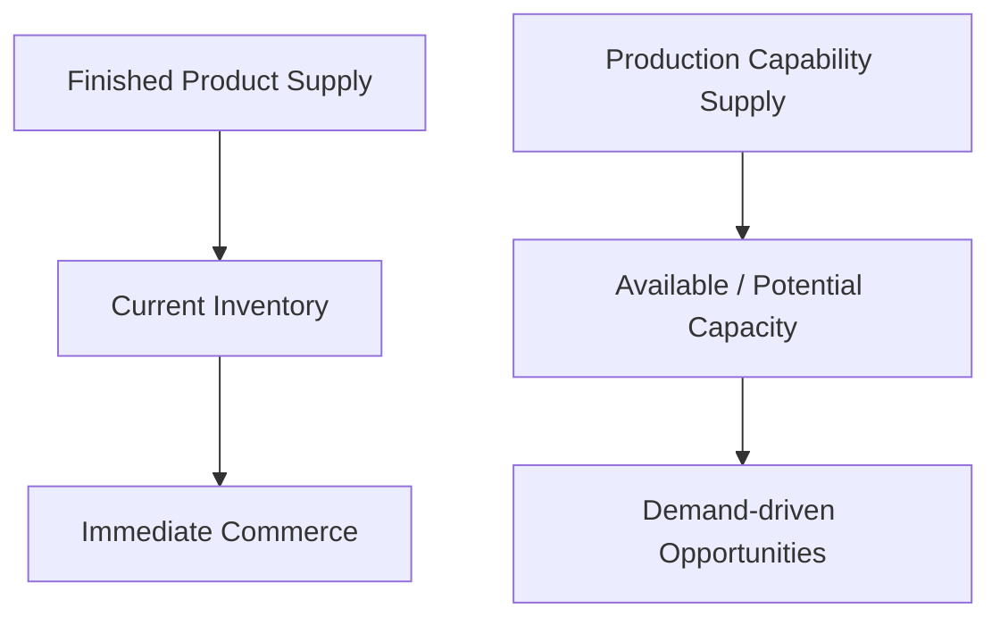

The principle:

> **Market access is not limited to finished inventory; it can also operate over feasible production capacity.**

---

# 11. AI as Commerce Intermediary, Not Chatbot

The earlier brainstorming retained AI-mediated communication because simply giving the buyer a contact number recreates the original digital barrier. fileciteturn18file0L322-L419

Intended flow:

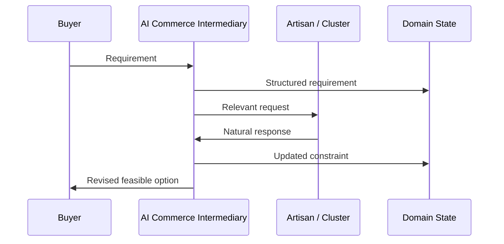

AI work can include:

```text
Translate
Summarize
Extract requirements
Identify missing constraints
Ask clarification questions
Check constraints
Present opportunities
Interpret artisan responses
Prepare quotation information
Record confirmed decisions
```

But:

> **AI proposes; humans confirm.**

---

# 12. New Uniqueness: Requirement-to-Supply Closure

After the competitive scan, the strongest way to describe the system is:

> **Kala Setu closes the loop from a real buyer requirement to a feasible, explainable artisan supply opportunity.**

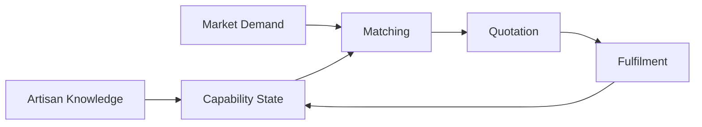

The distinctive object is therefore not AI.

It is the:

> **requirement-to-supply closure loop**

---

# 13. New Uniqueness: Opportunity Reactivation

An opportunity that cannot be fulfilled today does not have to disappear.

```text
Demand
  ↓
No match
  ↓
Store requirement
  ↓
Capability changes
  ↓
Re-match
  ↓
New opportunity
```

This creates **temporal market intelligence**.

The platform is no longer asking only:

> "Who can do this now?"

It can also ask:

> "Who may become able to do this later?"

---

# 14. New Uniqueness: Capability Evolution

The capability profile should not be a one-time onboarding record.

It can evolve:

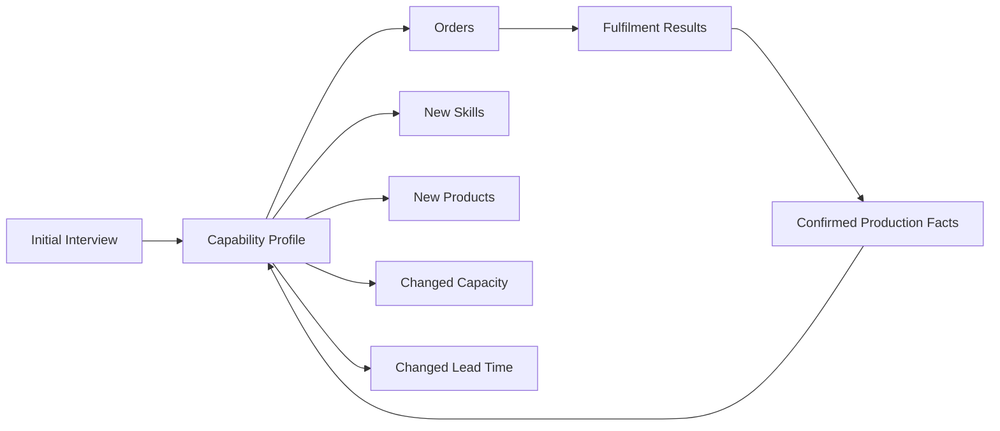

This creates a future distinction between:

```text
Declared capability
```

and:

```text
Confirmed / observed capability
```

That should remain evidence-backed rather than inferred blindly by AI.

---

# 15. New Uniqueness: Capability Evidence

A raw AI inference should not automatically become trusted data.

Conceptually:

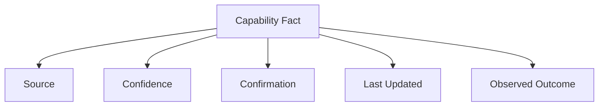

The existing AI and data architecture already supports source types such as:

```text
USER_PROVIDED
AI_EXTRACTED
AI_GENERATED
EXTERNALLY_VERIFIED
```

This yields a useful trust property:

> **Kala Setu can distinguish what the artisan said, what AI inferred, what was confirmed, and what later evidence supports.**

This is a supporting differentiator, not the headline.

---

# 16. Competitive Reality — Artisan Marketplaces

Artisan digital commerce is already established.

Amazon Karigar provides artisan onboarding, training, imaging/cataloguing support, a dedicated storefront, and access to Amazon's commerce ecosystem. citeturn982253search0turn982253search6

iTokri reports 10,000+ artisans, 500+ craft clusters and 100,000+ products. citeturn982253search10

Dastkari Haat Samiti reports 75,000+ artisans enabled through Dilli Haat and maintains extensive craft documentation. citeturn331234search17

Therefore:

> **"Digital marketplace for artisans" is not unique.**

---

# 17. Competitive Reality — Government Market Linkage

The Development Commissioner Handlooms reports approximately 1.5 lakh handloom weavers onboarded on GeM for direct government-market access. citeturn982253search5

The Ministry of Social Justice and Empowerment launched TULIP in 2024 as a digital platform intended to provide artisans with e-commerce exposure. citeturn331234search0

Therefore:

> **Kala Setu cannot claim that simply creating a government-facing digital artisan marketplace is novel.**

The deeper system behavior must be the innovation.

---

# 18. Competitive Reality — Exhibition Intelligence

Exhibition lead capture is already a product category.

BoothCRM provides AI exhibition lead capture, conversation summaries and qualification. citeturn207642search6

HelloGrowthCRM provides exhibition capture, AI enrichment, event attribution and follow-up. citeturn207642search14turn207642search18

Therefore:

> **"AI captures exhibition leads" is not unique.**

The narrower Kala Setu position is:

> **capture artisan capability + buyer demand + unmet requirements from artisan-focused exhibitions, then turn them into persistent supply/demand intelligence for later matching.**

---

# 19. Competitive Reality — Bulk Artisan Sourcing

Existing craft businesses already support bulk and customized sourcing.

Indian's Craft advertises direct artisan-cluster sourcing, scalable production and institutional procurement. citeturn331234search8

Culturati supports bulk orders and customisation based on product, quantity, customization, occasion and budget. citeturn331234search10

Heritage Art Bazaar describes artisan-community partnerships for production at scale for bulk orders. citeturn331234search11

Loomfolks describes a 200+ artisan-family network and wholesale/bulk sourcing. citeturn331234search16

Therefore:

> **"We support bulk orders from artisans" is not enough.**

---

# 20. Competitive Reality — Multi-Supplier Procurement

Enterprise procurement already supports supplier splitting.

SAP Ariba supports split awards across multiple suppliers. citeturn207642search13

IFS supports splitting a requirement among multiple suppliers. citeturn207642search2

Prism supports single-order multi-supplier transactions. citeturn207642search12

Vikri supports RFQ comparison and split awards across suppliers. citeturn207642search16

Therefore:

> **"We combine multiple suppliers for a single requirement" is not unique.**

Kala Setu's intended differentiation is domain-specific:

```text
Fragmented artisan capacity
+
Craft and material constraints
+
Small-cluster capacity
+
Accessible AI interaction
+
Demand memory
+
Human-confirmed fulfilment
```

---

# 21. Competitive Reality — AI Sourcing

AI sourcing itself is not unique.

Autonoma describes AI supplier discovery, proposal analysis and sourcing workflows. citeturn207642search20

Baswai describes specialized AI agents for requirements, supplier discovery, evaluation and negotiation. citeturn207642search10

Ocular describes AI procurement, supplier intelligence and splitting production across multiple suppliers. citeturn207642search4

Therefore:

> **"AI for supplier discovery" is not a safe uniqueness claim.**

---

# 22. The Competitive White Space

The strongest white space is the specific combination:

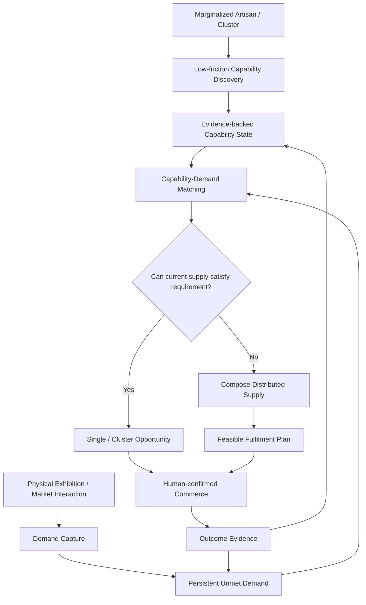

The defensible product story is therefore:

> **capability intelligence + persistent demand intelligence + capability-aware matching + distributed supply formation + accessible AI mediation**

for the specific marginalized artisan context.

---

# 23. Final Four Core Uniqueness Pillars

## U1 — Capability-First Artisan Intelligence

> **Kala Setu models what artisans and clusters can produce, not only what they have already listed for sale.**

Strength: **VERY HIGH**

---

## U2 — Requirement-to-Capability Matching

> **Kala Setu matches real buyer requirements against structured artisan capability, even where an exact product listing does not already exist.**

Strength: **VERY HIGH**

---

## U3 — Dynamic Distributed Artisan Supply

> **When no single artisan can satisfy a requirement, Kala Setu can reason over compatible artisans or clusters and compose a temporary supply opportunity.**

Strength: **VERY HIGH**

Qualifier:

> Multi-supplier procurement exists elsewhere. The differentiation is applying that pattern to fragmented marginalized-artisan capability networks and integrating it with capability intelligence and demand memory.

---

## U4 — Exhibition-to-Evergreen Demand Intelligence

> **Kala Setu can turn buyer requests from exhibitions, fairs, assisted commerce and digital channels into persistent demand intelligence, including requirements that cannot be fulfilled immediately.**

Strength: **VERY HIGH**

This is especially aligned with PS 26090.

---

# 24. Supporting Differentiators

### S1 — Persistent Unmet-Demand Memory

Demand can remain matchable after an initial "no supplier found" result.

### S2 — AI-Mediated Requirement Reconciliation

The AI translates, clarifies, summarizes and reconciles buyer/artisan requirements while humans retain approval.

### S3 — Evidence-Backed Capability State

Capability facts can carry source, confidence, confirmation and later evidence.

### S4 — Capability Evolution

Actual commerce outcomes can improve the representation of production capability over time.

These should strengthen the core four pillars rather than compete with them.

---

# 25. What Should NOT Be Called Unique

| Capability                     | Role                | Headline uniqueness? |
| ------------------------------ | ------------------- | -------------------- |
| AI image enhancement           | Presentation        | No                   |
| AI catalog generation          | Lower seller effort | No                   |
| Voice UI                       | Accessibility       | No                   |
| Translation                    | Accessibility       | No                   |
| Pricing recommendation         | Commerce support    | No                   |
| B2C storefront                 | Market access       | No                   |
| B2B requirement form           | Workflow            | No                   |
| Human approval                 | Safety              | No                   |
| Didi/CRP mode                  | Deployment          | No                   |
| Offline-first                  | Resilience          | No                   |
| ONDC adapter                   | Market reach        | No                   |
| GeM readiness                  | Government pathway  | No                   |
| AI chatbot                     | Interaction         | No                   |
| Standard search                | Discovery           | No                   |
| Basic bulk ordering            | B2B                 | No                   |
| Basic multi-supplier splitting | Procurement         | No                   |

---

# 26. Uniqueness Stack

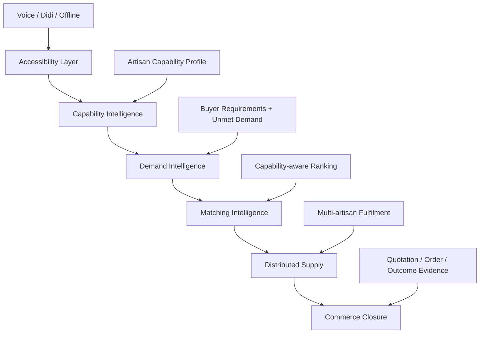

The higher layers make the lower layers possible.

---

# 27. Why the Architecture Strengthens the Uniqueness

The API contract establishes:

> **one API, one commerce domain, one authoritative database, multiple interfaces.**

It also explicitly prevents AI from bypassing deterministic domain services for authoritative commerce mutations. fileciteturn17file8L971-L1005

This yields:

```text
AI proposal
   ↓
Human confirmation
   ↓
Deterministic domain action
   ↓
Authoritative state
   ↓
Audit
```

The uniqueness can therefore be real system behavior, not just a marketing claim.

---

# 28. Database Traceability

| Uniqueness concept | Representative data structures                               |
| ------------------ | ------------------------------------------------------------ |
| Artisan capability | `artisan_profiles`, `craft_profiles`, `craft_skills`         |
| Product evidence   | `product_field_sources`, `catalog_entry_versions`            |
| Capacity           | `cluster_capacity_snapshots`                                 |
| Buyer demand       | `buyer_requirements`, `buyer_requirement_items`              |
| Opportunities      | `market_opportunities`                                       |
| Matching           | `market_matches`, `market_match_factors`                     |
| Distributed supply | market matches + capacity + quotations                       |
| Quotes             | `quotations`, `quotation_items`                              |
| AI evidence        | `ai_jobs`, `ai_decisions`, `ai_corrections`                  |
| Voice trace        | `voice_interactions`, `voice_intents`, `voice_confirmations` |
| Outcomes           | orders, inventory movements, fulfilments                     |
| Audit              | `audit_events`                                               |

The important point:

> **The uniqueness is represented as persistent domain data rather than trapped inside an AI prompt.**

---

# 29. API Traceability

The uniqueness should be exposed as deterministic business workflows, not only generic AI endpoints.

Representative flows:

```text
POST /v1/voice/interactions
POST /v1/voice/interactions/{interaction_id}/confirm

POST /v1/buyer-requirements
GET  /v1/buyer-requirements/{id}

GET  /v1/market/opportunities
GET  /v1/market/opportunities/{id}

GET  /v1/market/matches
GET  /v1/market/matches/{id}

POST /v1/market/quotations
GET  /v1/market/quotations/{id}

POST /v1/products/{product_id}/pricing/recommend
```

---

# 30. Strongest SIH Demo

The strongest demo is **not** AI product description generation.

The strongest moment is:

### Step 1 — Teach Kala Setu three suppliers

```text
Artisan A
Capacity = 400
Lead time = 12 days

Artisan B
Capacity = 300
Lead time = 15 days

Cluster C
Capacity = 500
Lead time = 18 days
```

### Step 2 — Buyer requests

```text
1,000 units
20 days
Specific material
Custom branding
Budget range
```

### Step 3 — Kala Setu reasons

```text
No single supplier can satisfy quantity.
```

### Step 4 — Compose

```text
A + B + C = 1,200 capacity
```

### Step 5 — Validate

```text
Quantity ✓
Material ✓
Budget ✓
Deadline ✓
Customisation ✓
```

### Step 6 — Output

```text
Feasible distributed supply opportunity
```

### Step 7 — Human confirmation

No silent commercial commitment.

---

# 31. Second Strong Demo — Demand That Doesn't Die

```text
Buyer asks:
"Can you supply 500?"

Current artisans:
"No."
```

Store:

```text
Persistent unmet requirement
```

Later:

```text
New artisan capability
+
new cluster capacity
```

System:

```text
Re-evaluate stored demand
        ↓
Potential match
        ↓
Opportunity
```

This demonstrates that Kala Setu is not simply:

> marketplace + chatbot.

It has a **memory of economic opportunity**.

---

# 32. 36-Hour SIH Prototype Scope

The entire uniqueness thesis does not need to be fully implemented.

## Must demonstrate

```text
1. Artisan capability intake
2. Capability profile creation
3. Buyer requirement
4. Capability-aware matching
5. Single vs multi-artisan decision
6. Distributed supply proposal
7. Human confirmation
```

## Strong optional demonstration

```text
8. Unmet-demand memory
9. Re-match after new capability
10. AI-mediated clarification
```

## Architectural / future

```text
11. Exhibition-scale ingestion
12. Advanced capacity forecasting
13. Raw-material pooling
14. Craft substitution
15. Automated recurring opportunity discovery
16. Full production planning
```

The prototype should prove one vertical slice extremely well.

---

# 33. Prototype Vertical Slice

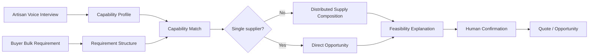

---

# 34. Competitive Positioning Matrix

| Capability                     |    Artisan market | Exhibition CRM |       Generic procurement |            Kala Setu |
| ------------------------------ | ----------------: | -------------: | ------------------------: | -------------------: |
| Artisan digital selling        |                 ✓ |              — |                         — |                    ✓ |
| Craft storytelling             |                 ✓ |              — |                         — |                    ✓ |
| Bulk ordering                  |                 ✓ |              — |                         ✓ |                    ✓ |
| Multi-supplier splitting       |              Some |              — |                         ✓ |                    ✓ |
| Structured artisan capability  |       Not primary |              — |  Supplier-master oriented |             **Core** |
| Demand-to-capability matching  |       Not primary |              — | Generic supplier matching |             **Core** |
| Persistent unmet demand        |          Not core | Lead follow-up |            Sourcing state |     **Core concept** |
| Exhibition signals             |              Some |              ✓ |                         — | **Artisan-specific** |
| Dynamic artisan network        |     Some networks |              — |                         ✓ |      **Core design** |
| AI communication               |           Limited |   AI summaries |                Increasing |  **Domain-specific** |
| Offline / assisted artisan use | Program-dependent |   Not relevant |              Not relevant |             **Core** |
| Capability evidence            |            Varies |  Lead evidence |         Supplier evidence |      **Core design** |

Interpretation:

> The individual capabilities are not all novel. The differentiation is the **specific integrated system behavior around marginalized artisan capability and market linkage**.

---

# 35. Uniqueness Strength Ranking

| Rank | Candidate                                         | Strength           | Reason                                      |
| ---- | ------------------------------------------------- | ------------------ | ------------------------------------------- |
| 1    | Capability → demand → distributed fulfilment loop | **Very High**      | Whole-system differentiation                |
| 2    | Persistent unmet-demand memory                    | **Very High**      | Temporal market intelligence                |
| 3    | Capability-first artisan representation           | **Very High**      | Changes the supply representation           |
| 4    | Exhibition-to-evergreen intelligence              | **High–Very High** | Strong PS alignment                         |
| 5    | Dynamic supply formation                          | **High**           | Strong mechanism; generic analogues exist   |
| 6    | AI-mediated buyer-artisan reconciliation          | **High**           | Useful but AI procurement exists            |
| 7    | Capability evidence / provenance                  | **Medium–High**    | Strong trust layer                          |
| 8    | Adaptive AI interview                             | **Medium–High**    | Excellent information-acquisition mechanism |
| 9    | Idle capacity marketplace                         | **Medium**         | Natural extension                           |
| 10   | Pricing AI                                        | **Low–Medium**     | Common                                      |
| 11   | Catalog AI                                        | **Low**            | Common                                      |
| 12   | Image AI                                          | **Low**            | Common                                      |
| 13   | Voice UI                                          | **Low**            | Interface, not product novelty              |

---

# 36. What a Competitor Would Need to Reproduce

A competitor could copy:

```text
Voice listing
Product photos
Catalog generation
Search
Cart
Checkout
```

without reproducing the central idea.

To reproduce the strongest concept they would need:

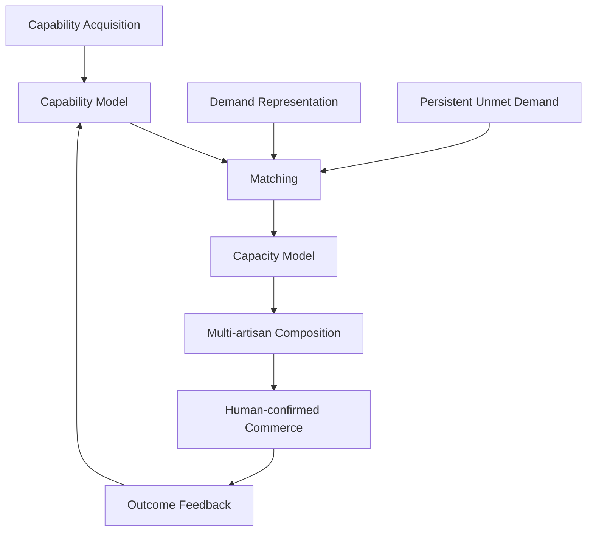

That is a deeper replication burden than copying isolated AI features.

---

# 37. Defensibility Model

This is **not a patentability opinion**.

It is a product/system defensibility model.

### 37.1 Data defensibility

Over time:

```text
Capability facts
+
Confirmed production facts
+
Demand requirements
+
Match outcomes
+
Fulfilment outcomes
```

form a domain-specific dataset.

### 37.2 Workflow defensibility

```text
Capability
→ demand
→ match
→ quote
→ fulfilment
→ outcome
```

### 37.3 Network defensibility

More artisans/clusters can increase:

```text
Capability coverage
        ↓
Match possibilities
        ↓
Successful opportunities
```

### 37.4 Temporal defensibility

```text
Demand history
+
Capability evolution
        ↓
Better future matching
```

---

# 38. What We Should Say to Judges

## 10-second version

> **"Most platforms list what artisans sell. Kala Setu builds a structured understanding of what artisan networks can produce and connects that capability to real demand."**

## 30-second version

> **"Our core innovation is not AI catalog generation. Kala Setu converts fragmented artisan capability—skills, materials, capacity, lead time, customization and availability—into structured supply intelligence. When a buyer has a requirement, the platform matches that demand against capability, and when one artisan is insufficient, it can compose multiple compatible artisans or clusters into a feasible supply opportunity."**

## 60-second version

> **"The problem with a normal artisan marketplace is that it assumes the product already exists as a listing. But many marginalized artisans have capabilities that are not represented digitally, and many B2B requirements do not exactly match existing inventory. Kala Setu uses voice, image and assisted interaction to understand capability, stores it as structured supply intelligence, captures buyer requirements as demand intelligence, remembers unmet demand, and can assemble compatible artisan capacity for a specific requirement. So we are not merely digitizing products—we are creating an intelligence layer between fragmented artisan capability and real market demand."**

---

# 39. Claims We Must Avoid

Do not claim:

```text
"We are the world's first artisan AI platform."
"No platform supports multi-supplier procurement."
"No one uses AI for supplier discovery."
"No one digitizes exhibitions."
"No one supports bulk artisan orders."
"No one has artisan marketplaces."
"Our matching guarantees fulfilment."
"Our AI knows the true price."
```

The competitive scan gives direct reasons not to make these claims. citeturn982253search0turn982253search10turn207642search4turn207642search13

---

# 40. Claims We Can Defend More Carefully

Prefer:

> **"Our architecture is designed around capability-first artisan supply representation rather than listing-first marketplace representation."**

Prefer:

> **"Our prototype demonstrates requirement-to-capability matching rather than only keyword product search."**

Prefer:

> **"Our design includes a persistent model for unmet demand so requirements that cannot be fulfilled today can become future opportunities."**

Prefer:

> **"Our distributed fulfilment design composes compatible artisan capacity for a specific B2B requirement."**

Prefer:

> **"Our exhibition intelligence concept converts temporary artisan-market interactions into persistent supply and demand records."**

These statements describe intended system behavior rather than unverifiable global-first claims.

---

# 41. Final Uniqueness Architecture

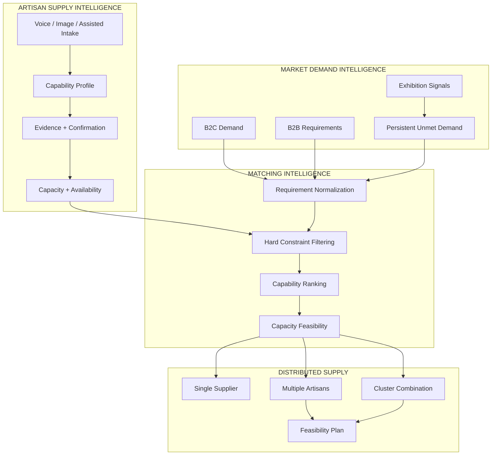

---

# 42. Final Positioning

## The product is not:

```text
An AI catalog app
```

## The product is not:

```text
Another artisan marketplace
```

## The product is not:

```text
A procurement chatbot
```

## The product is:

```text
An AI-assisted artisan capability and market-linkage network
```

with:

```text
Capability intelligence
+
Demand intelligence
+
Persistent demand memory
+
Capability-aware matching
+
Distributed supply formation
+
Human-confirmed commerce
```

---

# 43. One-Line Technical Definition

> **Kala Setu is a capability-first commerce intelligence platform that transforms informal artisan knowledge into structured, evidence-backed supply capability and uses persistent demand intelligence to identify and compose feasible artisan supply for real market requirements.**

# 44. One-Line SIH Definition

> **Kala Setu connects what marginalized artisan networks can produce with what real buyers need—not only by listing products, but by understanding capability, remembering demand, and forming feasible supply opportunities.**

---

# 45. Final Scorecard

| Dimension                 | Score | Reason                                            |
| ------------------------- | ----: | ------------------------------------------------- |
| Problem alignment         | 10/10 | Directly addresses year-round market linkage      |
| Artisan specificity       | 10/10 | Capability-first rather than generic seller-first |
| B2B differentiation       |  9/10 | Requirement + capability + distributed supply     |
| AI differentiation        |  8/10 | AI embedded in a domain workflow                  |
| System-level novelty      |  9/10 | Strong combination and operational loop           |
| Prototype demonstrability | 10/10 | Small controlled dataset is enough                |
| Technical traceability    | 10/10 | Architecture, DB, API and AI support it           |
| Scalability               |  9/10 | Capability network improves with data             |
| Competitive defensibility |  8/10 | Combination is stronger than individual features  |
| Claim safety              |  9/10 | Avoids unsupported "first ever" claims            |

---

# 46. Final Decision

Kala Setu's uniqueness should be presented as **two complementary layers**, not as a choice between the original four and the later system-level ideas.

## Layer A — Original Feature-Level Differentiators

```text
O1 — Zero-UI AI Voice Agent
O2 — Natural Voice Edit / Voice-to-Action
O3 — Offline SMS Order Pipeline
O4 — Heritage Visual Search
```

### Their roles

```text
O1 → zero-smartphone / zero-app accessibility
O2 → zero-navigation business control
O3 → connectivity-resilient critical commerce
O4 → heritage-aware buyer discovery
```

## Layer B — Deeper System-Level Differentiation

```text
S1 — Capability-First Artisan Intelligence
S2 — Requirement-to-Capability Matching
S3 — Dynamic Distributed Artisan Supply
S4 — Exhibition-to-Evergreen Demand Intelligence
S5 — Persistent Unmet-Demand Memory
S6 — AI-Mediated Requirement Reconciliation
```

## The final combined story

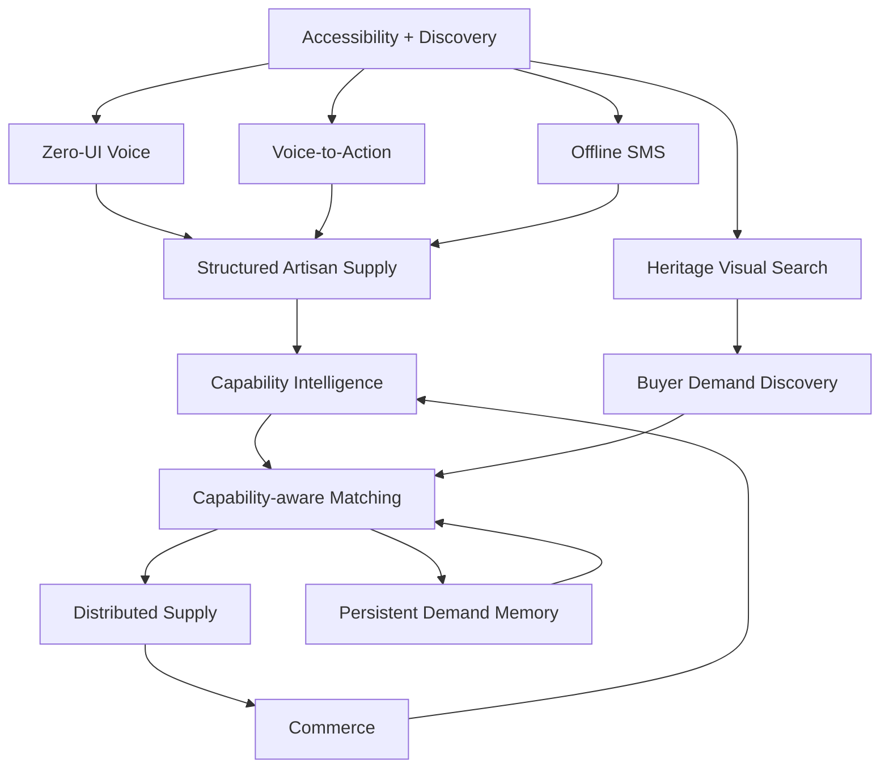

### Final core positioning

> **Kala Setu combines a low-friction, voice-first and connectivity-resilient artisan interface with a deeper capability-first market-linkage engine: it understands what artisan networks can produce, understands what buyers need, remembers demand that cannot yet be fulfilled, and can compose feasible supply from fragmented artisan capacity.**

## What belongs in the SIH 36-hour demo

### Demonstrate directly

```text
O2 — Voice-to-Action
S1 — Capability Intelligence
S2 — Requirement-to-Capability Matching
S3 — Distributed Artisan Supply
```

### Demonstrate if time permits

```text
O4 — Heritage Visual Search
S5 — Persistent Unmet-Demand Memory
```

### Demonstrate architecturally, not as a required live build

```text
O1 — Zero-UI Phone Agent
O3 — SMS Order Fallback
O6 — Advanced AI-mediated negotiation
S4 — Full exhibition intelligence
```

This keeps the original four intact while making the **capability → demand → feasible supply** loop the main competitive story.

# 47. Final Judge Narrative

```text
Most digital artisan platforms start with products.

Kala Setu starts with capability.

An artisan may not know how to create an
e-commerce listing, but they know their craft,
materials, techniques, production limits and what
they can customize.

Kala Setu learns that through natural interaction
and turns it into structured supply intelligence.

When a buyer submits a requirement, Kala Setu does
not only search for an existing listing.

It asks:

"Who can actually produce this?"

If one artisan cannot fulfil it, the system can
reason over compatible artisans or clusters and
compose a feasible supply opportunity.

And if today's demand cannot be fulfilled, it does
not have to disappear.

The requirement can remain as market intelligence
and be reconsidered when new artisan capability
becomes available.

So Kala Setu is not just digitizing artisans.

It is turning fragmented artisan capability into
an intelligent, continuously matchable supply
network.
```

---

# 48. Competitive Sources

- Amazon Karigar — artisan onboarding, training, imaging/cataloguing and dedicated storefront.  
  https://sell.amazon.in/grow-your-business/amazon-karigar citeturn982253search0

- iTokri Craft Partner Program — 10,000+ artisans, 500+ clusters and 100,000+ handmade products.  
  https://itokri.com/pages/itokri-craft-partner-program citeturn982253search10

- Dastkari Haat Samiti — large artisan and craft digitisation ecosystem.  
  https://dastkarihaat.com/ citeturn331234search17

- Development Commissioner Handlooms / GeM — large-scale weaver onboarding for government market access.  
  https://www.handlooms.gov.in/government_e_marketplace.php citeturn982253search5

- PIB / TULIP — Social Justice & Empowerment digital artisan market initiative.  
  https://www.pib.gov.in/PressReleasePage.aspx?PRID=2070951&lang=2&reg=48 citeturn331234search0

- Indian's Craft — bulk artisan-cluster sourcing.  
  https://indianscraft.com/bulk-order citeturn331234search8

- Culturati — bulk orders and customisation.  
  https://culturati.in/pages/bulk-orders-and-customizations-on-culturati citeturn331234search10

- Heritage Art Bazaar — artisan-community production at scale.  
  https://www.heritageartbazaar.com/ citeturn331234search11

- SAP Ariba — split awards across multiple suppliers. citeturn207642search13

- IFS — multi-supplier requirement splitting. citeturn207642search2

- Prism — multi-supplier ordering. citeturn207642search12

- Vikri — RFQ comparison and split awards. citeturn207642search16

- Autonoma — AI supplier discovery and sourcing. citeturn207642search20

- Baswai — agentic sourcing workflow. citeturn207642search10

- Ocular — AI procurement and multi-supplier production. citeturn207642search4

- BoothCRM — AI exhibition lead capture and conversation intelligence. citeturn207642search6

- HelloGrowthCRM — exhibition capture and AI follow-up. citeturn207642search18

---

# 49. Important Interpretation

This document is a **product uniqueness and competitive-positioning document**, not a patentability opinion and not a formal legal prior-art search.

The safest position is:

> **Kala Setu's innovation is the integrated, artisan-specific system behavior and data loop—not the isolated existence of any one feature.**

Avoid absolute claims such as "first", "only", or "no one else does this" unless separately verified.

---

# 50. Final Principle

> ### **Do not defend Kala Setu by saying nobody has built its individual pieces.**
>
> ### **Defend Kala Setu by showing why its pieces form a different system.**
>
> **Capability → Demand → Matching → Distributed Supply → Commerce → Evidence → Better Capability**

That is the uniqueness strategy.
