# WIREFRAME_26090.md
## Kala Setu — Complete Dual-Platform Wireframe & UX Specification

> **Status:** Rebuilt from the supplied wireframe after full structural review.
> **Surfaces:** Seller App for Artisan + Didi/CRP; Buyer Web for B2C + B2B.
> **Key rule:** Screen diagrams are static UI compositions. Flowcharts describe navigation. Sequence diagrams describe system interaction. State diagrams describe lifecycle transitions.

---

# 0. Full-File Review Findings

| Finding | Evidence in previous file | Correction in this version |
|---|---|---|
| Missing screen definitions | Inventory contained 62 screens but only a subset had dedicated screen sections | Every inventory ID below has a dedicated screen-composition diagram |
| Stale copied frame labels | Later sections reused frame names from earlier sections | Every diagram is generated from its own screen ID and title |
| Buyer and seller navigation mixed | Several Buyer screens showed Seller navigation | Buyer B2C and B2B navigation is isolated |
| Screen composition looked like a process chart | Header to body to actions arrows appeared inside static screens | Screen diagrams contain grouped regions with no transition arrows |
| Critical journey diagrams were placeholders | End-to-end sections reused an empty buyer screen | Critical journey diagrams now reference real screen IDs |
| B2B coverage was incomplete visually | Many inventory screens had no actual screen diagram | All 12 B2B inventory screens are represented |
| Missing states were disconnected from screens | Error, empty, confirmation and responsive sections stood alone | Shared states are mapped to the affected screen families |

## 0.1 Visual grammar
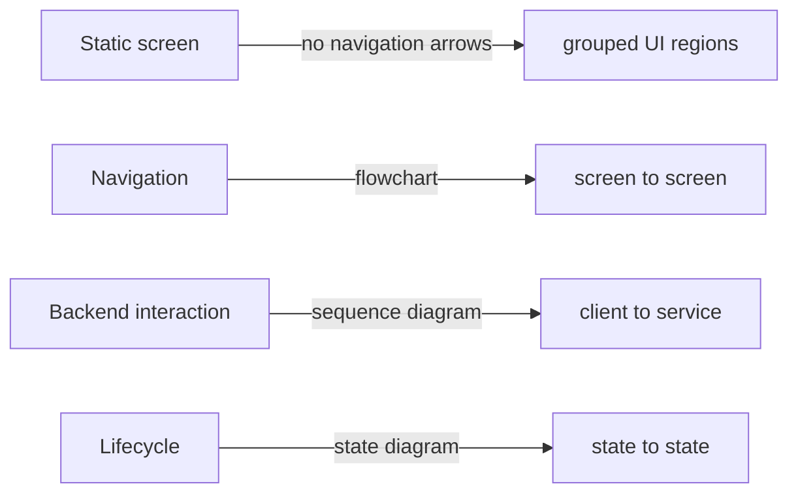

---

# 1. Platform Architecture & Traceability

The wireframe is a frontend contract, not an isolated UX artifact. Every screen resolves through the same chain:

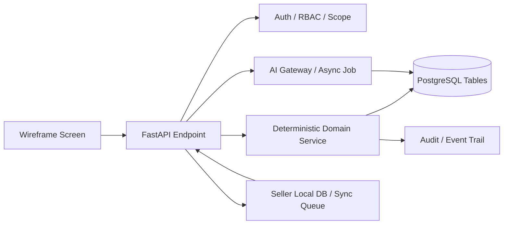

## 1.1 Screen Traceability Rule

Each screen specification in this document has five implementation bindings:

| Binding | Meaning | Source contract |
|---|---|---|
| UI responsibility | What the user is trying to accomplish | Wireframe |
| API operation | Exact read/mutation used by the screen | `API_26090_v2.md` |
| Authorization | Role, ownership, session or buyer scope | `AUTH_26090.md` + API |
| Database state | Tables that provide or persist the screen data | `DATABASE_26090_B2B_B2C.md` |
| State authority | Whether the UI reflects server truth, local draft, AI proposal or external state | Architecture/API |

## 1.2 Platform-to-Backend Map

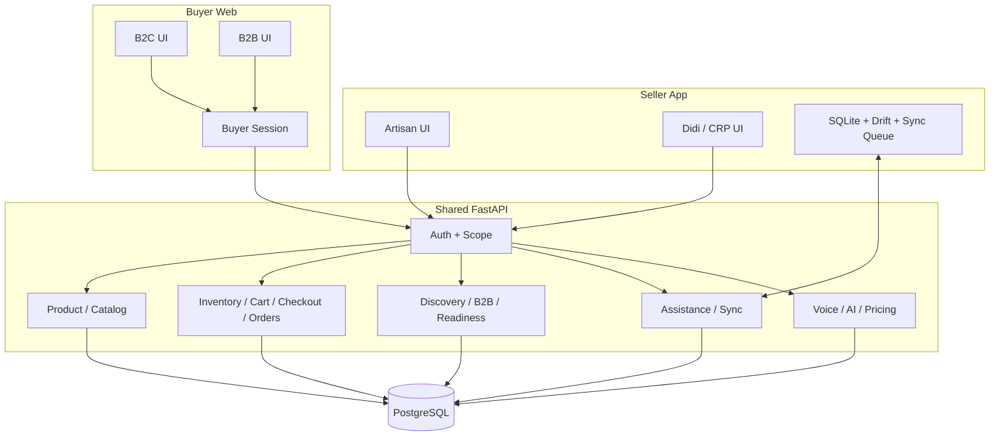

## 1.3 Shared-State Rule

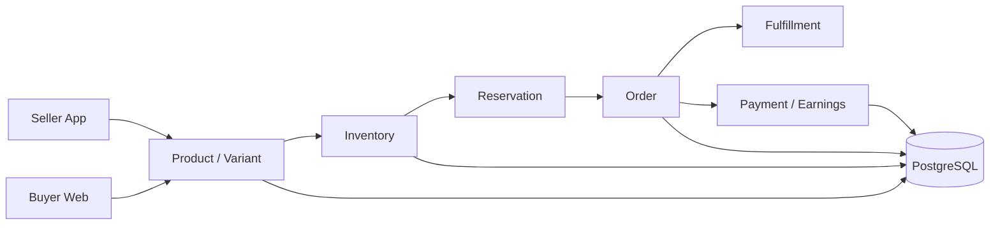

A Buyer Web screen never invents a second version of any authoritative state.

# 1. Platform Boundary

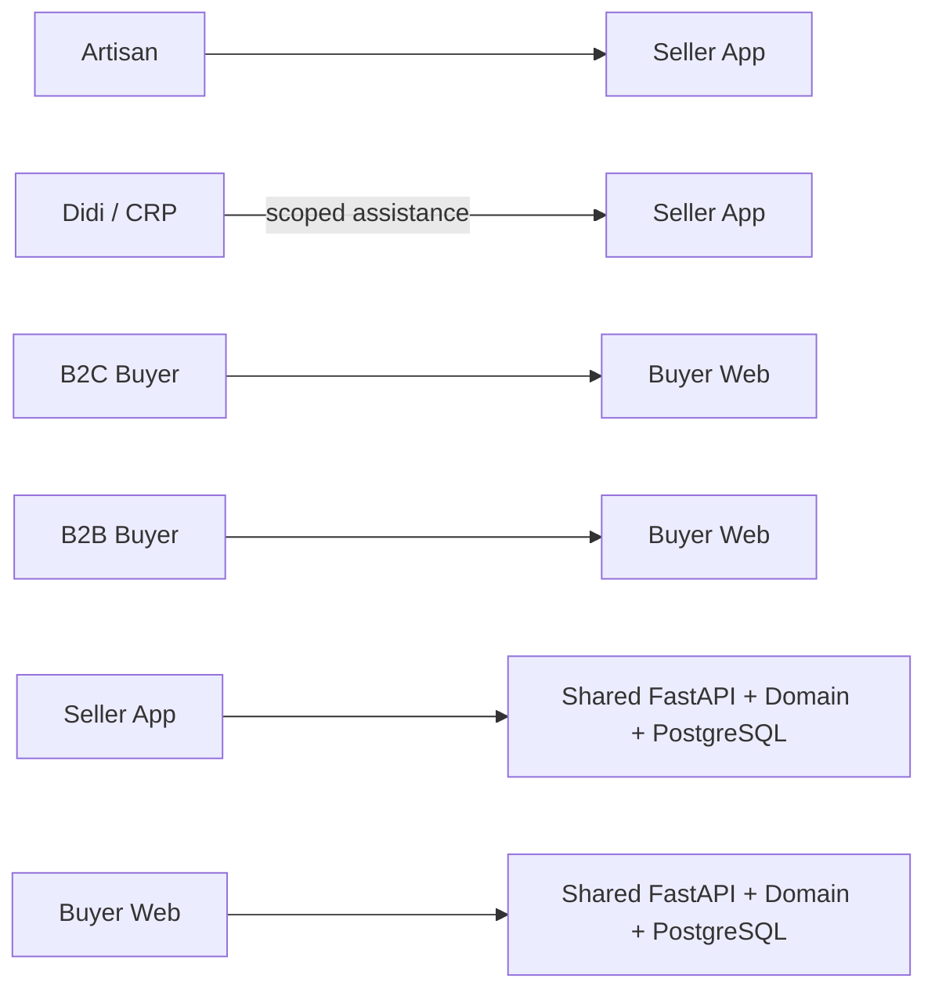

| Surface | Primary user | Navigation | Main outcome |
|---|---|---|---|
| Seller App | Artisan | Sell / My Orders / My Money | Independent digital selling and operations |
| Didi Mode | CRP / Didi | Home / Artisans / Sessions / Progress | Scoped assisted commerce |
| Buyer B2C | Consumer | Discover / Cart / Orders / Account | Product discovery and purchase |
| Buyer B2B | Business buyer | Workspace / Requirements / Matches / Quotes | Bulk sourcing and quotation |

---

# 2. Wireframe Rules

## 2.1 Screen diagrams
Every screen diagram below follows one of two composition templates. The regions are spatial groups, not process steps.

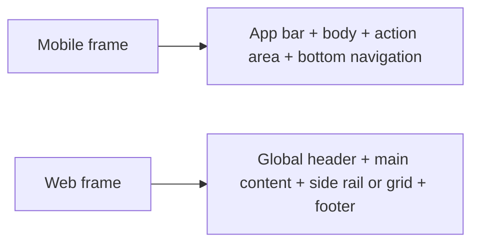

## 2.2 Seller rules
- One primary task per screen.
- One dominant primary action.
- Voice is contextual, not a replacement for visual confirmation.
- AI proposals are visually distinguishable from confirmed data.
- Offline and sync status never masquerade as live commerce state.
- Didi mode always exposes artisan identity and active assistance scope.

## 2.3 Buyer rules
- B2C stays optimized for discovery and purchase.
- B2B stays optimized for requirements, matching and quotations.
- Buyer UI never exposes seller-side concepts such as revision counters or assistance sessions.
- Inventory, reservation, order and payment state are domain-authoritative.

## 2.4 Baseline frames
| Surface | Baseline | Responsive variants |
|---|---|---|
| Seller App | 390 x 844 | 360 x 800, 412 x 915 |
| Buyer Web | 1440 x 1024 | 1280, 1024 tablet, 390 mobile |

---

# 3. Global Seller Shell

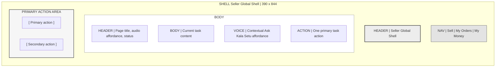

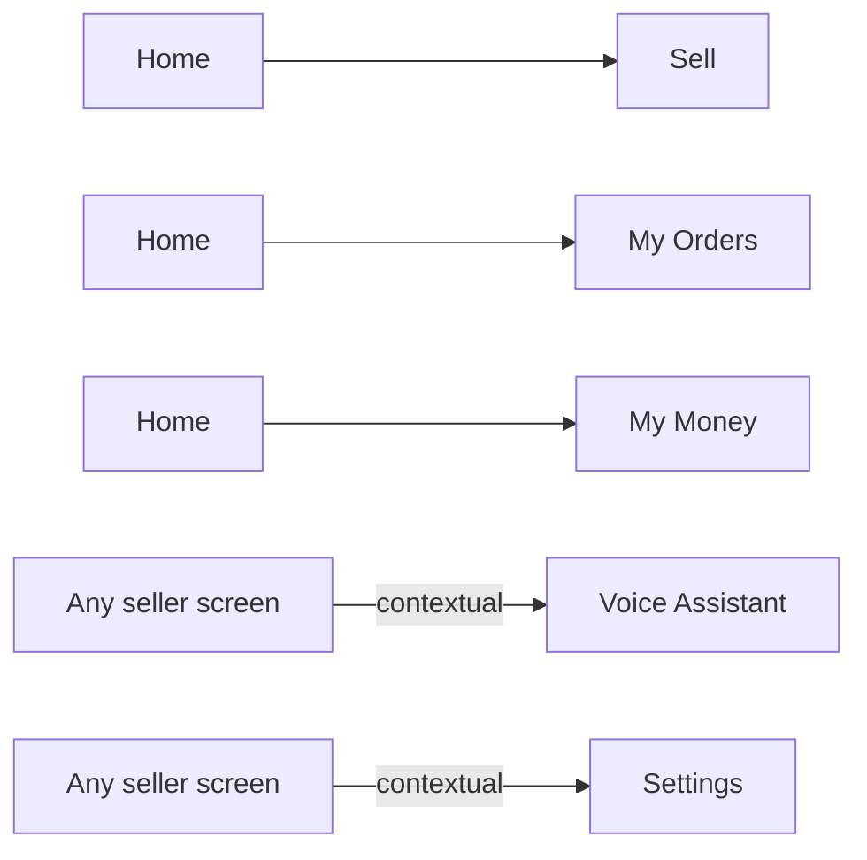

---

# 4. Seller App — Screen System

## 4.1 Coverage
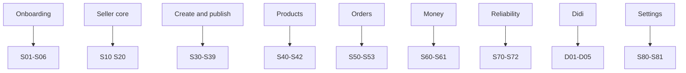


### Implementation Linkage

| Contract layer | Screen binding |
|---|---|
| Screen responsibility | Onboarding entry; no server mutation |
| API | `—` |
| Primary database state | `—` |
| Authorization | Public / unauthenticated |
| State authority | Server-authoritative state unless the screen is explicitly an onboarding/local-draft screen. |

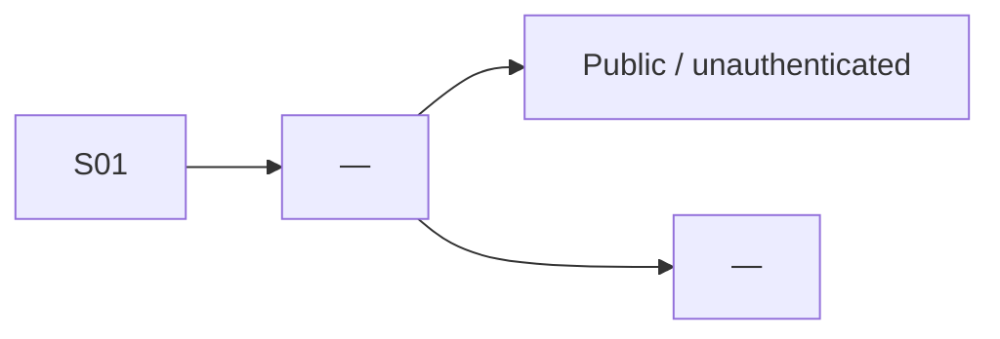
## S01 — Welcome
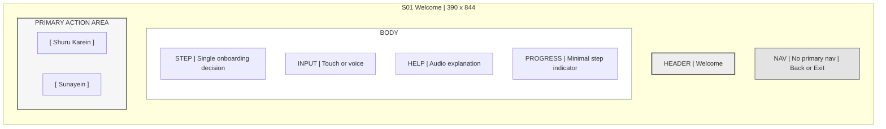

**Entry:** contextual seller navigation or prior screen. **Priority:** P0. **Implementation linkage:** See the screen-level API/DB contract immediately below each visual wireframe.


### Implementation Linkage

| Contract layer | Screen binding |
|---|---|
| Screen responsibility | Persist selected language |
| API | `PATCH /v1/users/me` |
| Primary database state | `users, artisan_languages` |
| Authorization | Authenticated after identity exists |
| State authority | Server-authoritative state unless the screen is explicitly an onboarding/local-draft screen. |

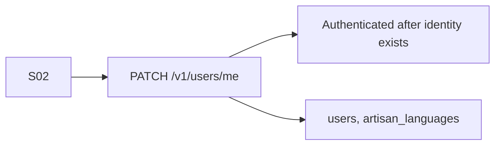
## S02 — Language
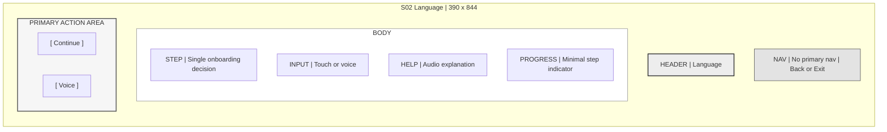

**Entry:** contextual seller navigation or prior screen. **Priority:** P0. **Implementation linkage:** See the screen-level API/DB contract immediately below each visual wireframe.


### Implementation Linkage

| Contract layer | Screen binding |
|---|---|
| Screen responsibility | Register or identify phone account |
| API | `POST /v1/auth/register` |
| Primary database state | `users, devices` |
| Authorization | Unauthenticated / registration |
| State authority | Server-authoritative state unless the screen is explicitly an onboarding/local-draft screen. |

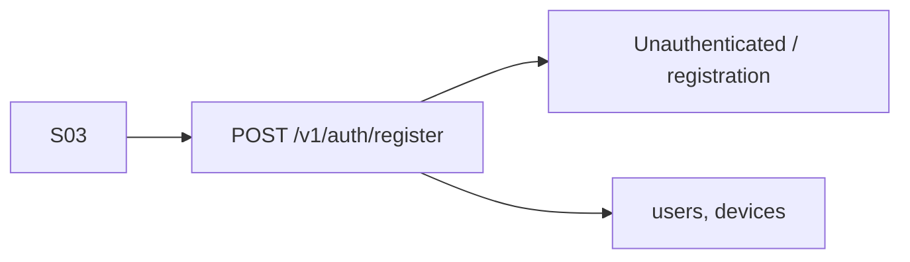
## S03 — Phone
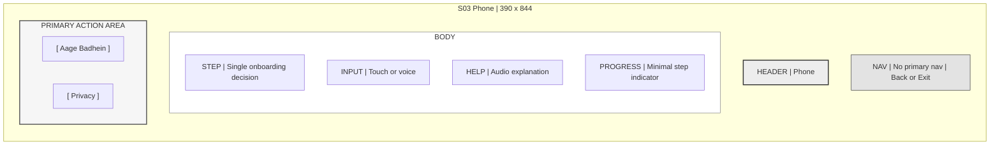

**Entry:** contextual seller navigation or prior screen. **Priority:** P0. **Implementation linkage:** See the screen-level API/DB contract immediately below each visual wireframe.


### Implementation Linkage

| Contract layer | Screen binding |
|---|---|
| Screen responsibility | Create or verify PIN and establish session |
| API | `POST /v1/auth/register or POST /v1/auth/login` |
| Primary database state | `users, devices` |
| Authorization | Unauthenticated / auth boundary |
| State authority | Server-authoritative state unless the screen is explicitly an onboarding/local-draft screen. |

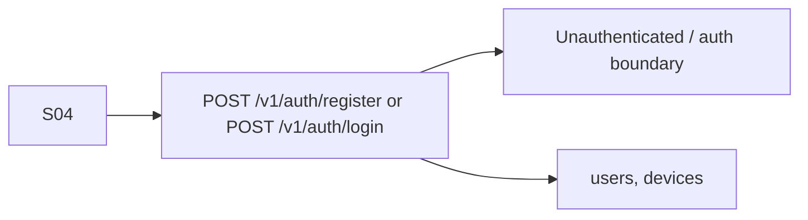
## S04 — PIN
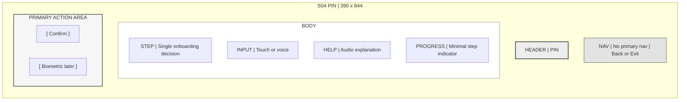

**Entry:** contextual seller navigation or prior screen. **Priority:** P0. **Implementation linkage:** See the screen-level API/DB contract immediately below each visual wireframe.


### Implementation Linkage

| Contract layer | Screen binding |
|---|---|
| Screen responsibility | Save artisan basics and craft selection |
| API | `PATCH /v1/artisans/me; POST /v1/artisans/me/crafts` |
| Primary database state | `artisan_profiles, artisan_languages, craft_profiles, craft_skills, artisan_onboarding_progress` |
| Authorization | Artisan owner |
| State authority | Server-authoritative state unless the screen is explicitly an onboarding/local-draft screen. |

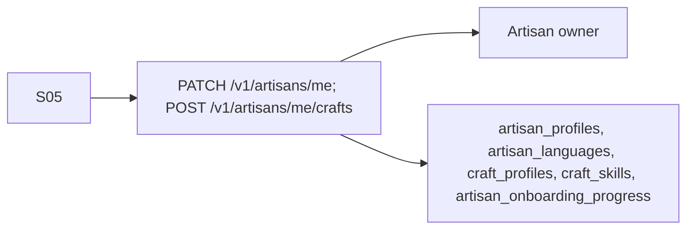
## S05 — Artisan Basics
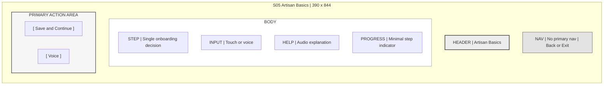

**Entry:** contextual seller navigation or prior screen. **Priority:** P0. **Implementation linkage:** See the screen-level API/DB contract immediately below each visual wireframe.


### Implementation Linkage

| Contract layer | Screen binding |
|---|---|
| Screen responsibility | Read onboarding completion and enter seller home |
| API | `GET /v1/artisans/me/onboarding` |
| Primary database state | `artisan_onboarding_progress, artisan_profiles` |
| Authorization | Artisan owner |
| State authority | Server-authoritative state unless the screen is explicitly an onboarding/local-draft screen. |

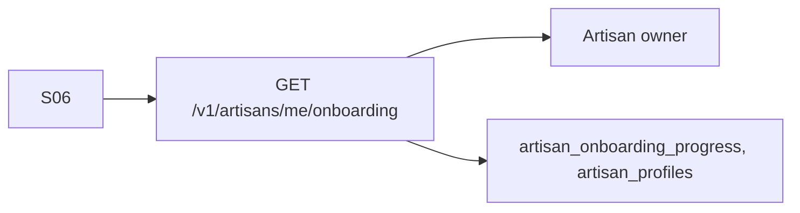
## S06 — Ready
```mermaid
flowchart TB
  subgraph SCREEN["S06 Ready | 390 x 844"]
    direction TB
    APPBAR["HEADER | Ready"]
    subgraph BODY["BODY"]
      direction TB
      B1["STEP | Single onboarding decision"]
      B2["INPUT | Touch or voice"]
      B3["HELP | Audio explanation"]
      B4["PROGRESS | Minimal step indicator"]
    end
    subgraph ACTIONS["PRIMARY ACTION AREA"]
      direction LR
      PRIMARY["[ Bechein ]"]
      SECONDARY["[ Sunayein ]"]
    end
    NAV["NAV | No primary nav | Back or Exit"]
  end
  classDef app fill:#EDEDED,stroke:#333,stroke-width:2px;
  classDef body fill:#FFFFFF,stroke:#888,stroke-width:1px;
  classDef action fill:#F6F6F6,stroke:#555,stroke-width:2px;
  classDef nav fill:#E3E3E3,stroke:#444,stroke-width:1px;
  class APPBAR app
  class BODY body
  class ACTIONS action
  class NAV nav
```

**Entry:** contextual seller navigation or prior screen. **Priority:** P0. **Implementation linkage:** See the screen-level API/DB contract immediately below each visual wireframe.


### Implementation Linkage

| Contract layer | Screen binding |
|---|---|
| Screen responsibility | Load seller dashboard summary |
| API | `GET /v1/artisans/me; GET /v1/orders?owner=me; GET /v1/earnings/summary; GET /v1/notifications` |
| Primary database state | `artisan_profiles, orders, order_items, earnings_ledger, notifications, notification_deliveries` |
| Authorization | Artisan owner |
| State authority | Server-authoritative state unless the screen is explicitly an onboarding/local-draft screen. |

```mermaid
flowchart LR
    UI["S10"] --> API["GET /v1/artisans/me; GET /v1/orders?owner=me; GET /v1/earnings/summary; GET /v1/notifications"]
    API --> AUTH["Artisan owner"]
    API --> DB["artisan_profiles, orders, order_items, earnings_ledger, notifications, notification_deliveries"]
```
## S10 — Home
```mermaid
flowchart TB
  subgraph SCREEN["S10 Home | 390 x 844"]
    direction TB
    APPBAR["HEADER | Home"]
    subgraph BODY["BODY"]
      direction TB
      B1["PRIMARY | Sell now or resume a draft"]
      B2["ATTENTION | One highest priority banner only"]
      B3["VOICE | Ask Kala Setu"]
      B4["STATUS | Online or sync state"]
    end
    subgraph ACTIONS["PRIMARY ACTION AREA"]
      direction LR
      PRIMARY["[ Naya Product ]"]
      SECONDARY["[ Back ]"]
    end
    NAV["NAV | Sell | My Orders | My Money"]
  end
  classDef app fill:#EDEDED,stroke:#333,stroke-width:2px;
  classDef body fill:#FFFFFF,stroke:#888,stroke-width:1px;
  classDef action fill:#F6F6F6,stroke:#555,stroke-width:2px;
  classDef nav fill:#E3E3E3,stroke:#444,stroke-width:1px;
  class APPBAR app
  class BODY body
  class ACTIONS action
  class NAV nav
```

**Entry:** contextual seller navigation or prior screen. **Priority:** P0. **Implementation linkage:** See the screen-level API/DB contract immediately below each visual wireframe.


### Implementation Linkage

| Contract layer | Screen binding |
|---|---|
| Screen responsibility | Create an AI action proposal from voice |
| API | `POST /v1/voice/interactions; GET /v1/ai/decisions/{decision_id}; POST /v1/voice/interactions/{interaction_id}/confirm` |
| Primary database state | `voice_interactions, voice_intents, voice_confirmations, ai_jobs, ai_decisions, ai_corrections` |
| Authorization | Artisan + sensitive-action confirmation |
| State authority | AI proposal/job state until explicit confirmation; authoritative commerce state only after domain commit. |

```mermaid
flowchart LR
    UI["S20"] --> API["POST /v1/voice/interactions; GET /v1/ai/decisions/{decision_id}; POST /v1/voice/interactions/{interaction_id}/confirm"]
    API --> AUTH["Artisan + sensitive-action confirmation"]
    API --> DB["voice_interactions, voice_intents, voice_confirmations, ai_jobs, ai_decisions, ai_corrections"]
```
## S20 — Voice Proposal
```mermaid
flowchart TB
  subgraph SCREEN["S20 Voice Proposal | 390 x 844"]
    direction TB
    APPBAR["HEADER | Voice Proposal"]
    subgraph BODY["BODY"]
      direction TB
      B1["PRIMARY CONTENT | Voice Proposal"]
      B2["CONTEXT | Relevant record and current state"]
      B3["DETAILS | Domain-backed information"]
      B4["ACTIONS | Only actions allowed in this state"]
    end
    subgraph ACTIONS["PRIMARY ACTION AREA"]
      direction LR
      PRIMARY["[ Haan ]"]
      SECONDARY["[ Badlein ]"]
    end
    NAV["NAV | Sell | My Orders | My Money"]
  end
  classDef app fill:#EDEDED,stroke:#333,stroke-width:2px;
  classDef body fill:#FFFFFF,stroke:#888,stroke-width:1px;
  classDef action fill:#F6F6F6,stroke:#555,stroke-width:2px;
  classDef nav fill:#E3E3E3,stroke:#444,stroke-width:1px;
  class APPBAR app
  class BODY body
  class ACTIONS action
  class NAV nav
```

**Entry:** contextual seller navigation or prior screen. **Priority:** P0. **Implementation linkage:** See the screen-level API/DB contract immediately below each visual wireframe.


### Implementation Linkage

| Contract layer | Screen binding |
|---|---|
| Screen responsibility | Create product draft |
| API | `POST /v1/products` |
| Primary database state | `products, product_variants` |
| Authorization | Artisan owner / scoped Didi session |
| State authority | Server-authoritative state unless the screen is explicitly an onboarding/local-draft screen. |

```mermaid
flowchart LR
    UI["S30"] --> API["POST /v1/products"]
    API --> AUTH["Artisan owner / scoped Didi session"]
    API --> DB["products, product_variants"]
```
## S30 — Start Product
```mermaid
flowchart TB
  subgraph SCREEN["S30 Start Product | 390 x 844"]
    direction TB
    APPBAR["HEADER | Start Product"]
    subgraph BODY["BODY"]
      direction TB
      B1["ENTRY | Photo voice or draft"]
      B2["GUIDANCE | Simple next step"]
      B3["INPUT | Camera or microphone"]
      B4["DRAFT | Local save supported"]
    end
    subgraph ACTIONS["PRIMARY ACTION AREA"]
      direction LR
      PRIMARY["[ Photo ]"]
      SECONDARY["[ Drafts ]"]
    end
    NAV["NAV | Sell | My Orders | My Money"]
  end
  classDef app fill:#EDEDED,stroke:#333,stroke-width:2px;
  classDef body fill:#FFFFFF,stroke:#888,stroke-width:1px;
  classDef action fill:#F6F6F6,stroke:#555,stroke-width:2px;
  classDef nav fill:#E3E3E3,stroke:#444,stroke-width:1px;
  class APPBAR app
  class BODY body
  class ACTIONS action
  class NAV nav
```

**Entry:** contextual seller navigation or prior screen. **Priority:** P0. **Primary API:** `/v1/products`. **Primary tables:** `products`.


### Implementation Linkage

| Contract layer | Screen binding |
|---|---|
| Screen responsibility | Initialize product media upload |
| API | `POST /v1/products/{product_id}/media/upload-init` |
| Primary database state | `product_media` |
| Authorization | Artisan owner / scoped Didi session |
| State authority | Server-authoritative state unless the screen is explicitly an onboarding/local-draft screen. |

```mermaid
flowchart LR
    UI["S31"] --> API["POST /v1/products/{product_id}/media/upload-init"]
    API --> AUTH["Artisan owner / scoped Didi session"]
    API --> DB["product_media"]
```
## S31 — Camera Guidance
```mermaid
flowchart TB
  subgraph SCREEN["S31 Camera Guidance | 390 x 844"]
    direction TB
    APPBAR["HEADER | Camera Guidance"]
    subgraph BODY["BODY"]
      direction TB
      B1["CAMERA | Live product framing"]
      B2["GUIDE | Lighting and framing hint"]
      B3["ORIGINAL | No mutation yet"]
      B4["ACTION | Capture"]
    end
    subgraph ACTIONS["PRIMARY ACTION AREA"]
      direction LR
      PRIMARY["[ Capture ]"]
      SECONDARY["[ Retake ]"]
    end
    NAV["NAV | Sell | My Orders | My Money"]
  end
  classDef app fill:#EDEDED,stroke:#333,stroke-width:2px;
  classDef body fill:#FFFFFF,stroke:#888,stroke-width:1px;
  classDef action fill:#F6F6F6,stroke:#555,stroke-width:2px;
  classDef nav fill:#E3E3E3,stroke:#444,stroke-width:1px;
  class APPBAR app
  class BODY body
  class ACTIONS action
  class NAV nav
```

**Entry:** contextual seller navigation or prior screen. **Priority:** P0. **Primary API:** `/v1/products/{product_id}/media/upload-init`. **Primary tables:** `product_media, media_processing_jobs`.


### Implementation Linkage

| Contract layer | Screen binding |
|---|---|
| Screen responsibility | Finalize or read captured media |
| API | `POST /v1/products/{product_id}/media/{media_id}/finalize; GET /v1/products/{product_id}/media` |
| Primary database state | `product_media, media_processing_jobs` |
| Authorization | Artisan owner |
| State authority | Server-authoritative state unless the screen is explicitly an onboarding/local-draft screen. |

```mermaid
flowchart LR
    UI["S32"] --> API["POST /v1/products/{product_id}/media/{media_id}/finalize; GET /v1/products/{product_id}/media"]
    API --> AUTH["Artisan owner"]
    API --> DB["product_media, media_processing_jobs"]
```
## S32 — Photo Review
```mermaid
flowchart TB
  subgraph SCREEN["S32 Photo Review | 390 x 844"]
    direction TB
    APPBAR["HEADER | Photo Review"]
    subgraph BODY["BODY"]
      direction TB
      B1["PHOTO | Original image"]
      B2["QUALITY | Basic quality feedback"]
      B3["TRUST | Original preserved"]
      B4["CHOICE | Retake or use"]
    end
    subgraph ACTIONS["PRIMARY ACTION AREA"]
      direction LR
      PRIMARY["[ Use Photo ]"]
      SECONDARY["[ Retake ]"]
    end
    NAV["NAV | Sell | My Orders | My Money"]
  end
  classDef app fill:#EDEDED,stroke:#333,stroke-width:2px;
  classDef body fill:#FFFFFF,stroke:#888,stroke-width:1px;
  classDef action fill:#F6F6F6,stroke:#555,stroke-width:2px;
  classDef nav fill:#E3E3E3,stroke:#444,stroke-width:1px;
  class APPBAR app
  class BODY body
  class ACTIONS action
  class NAV nav
```

**Entry:** contextual seller navigation or prior screen. **Priority:** P0. **Implementation linkage:** See the screen-level API/DB contract immediately below each visual wireframe.


### Implementation Linkage

| Contract layer | Screen binding |
|---|---|
| Screen responsibility | Submit voice description |
| API | `POST /v1/voice/interactions` |
| Primary database state | `voice_interactions, ai_jobs` |
| Authorization | Artisan / scoped Didi session |
| State authority | Server-authoritative state unless the screen is explicitly an onboarding/local-draft screen. |

```mermaid
flowchart LR
    UI["S33"] --> API["POST /v1/voice/interactions"]
    API --> AUTH["Artisan / scoped Didi session"]
    API --> DB["voice_interactions, ai_jobs"]
```
## S33 — Voice Description
```mermaid
flowchart TB
  subgraph SCREEN["S33 Voice Description | 390 x 844"]
    direction TB
    APPBAR["HEADER | Voice Description"]
    subgraph BODY["BODY"]
      direction TB
      B1["VOICE | Microphone state"]
      B2["PROMPT | What to describe"]
      B3["TRANSCRIPT | Optional live transcript"]
      B4["CONTROL | Redo or complete"]
    end
    subgraph ACTIONS["PRIMARY ACTION AREA"]
      direction LR
      PRIMARY["[ Ho Gaya ]"]
      SECONDARY["[ Dobara ]"]
    end
    NAV["NAV | Sell | My Orders | My Money"]
  end
  classDef app fill:#EDEDED,stroke:#333,stroke-width:2px;
  classDef body fill:#FFFFFF,stroke:#888,stroke-width:1px;
  classDef action fill:#F6F6F6,stroke:#555,stroke-width:2px;
  classDef nav fill:#E3E3E3,stroke:#444,stroke-width:1px;
  class APPBAR app
  class BODY body
  class ACTIONS action
  class NAV nav
```

**Entry:** contextual seller navigation or prior screen. **Priority:** P0. **Primary API:** `/v1/voice/interactions`. **Primary tables:** `voice_interactions`.


### Implementation Linkage

| Contract layer | Screen binding |
|---|---|
| Screen responsibility | Show structured AI extraction for confirmation |
| API | `GET /v1/voice/interactions/{interaction_id}; GET /v1/ai/decisions/{decision_id}` |
| Primary database state | `voice_intents, ai_jobs, ai_decisions, product_field_sources` |
| Authorization | Artisan confirmation required before authoritative commit |
| State authority | AI proposal/job state until explicit confirmation; authoritative commerce state only after domain commit. |

```mermaid
flowchart LR
    UI["S34"] --> API["GET /v1/voice/interactions/{interaction_id}; GET /v1/ai/decisions/{decision_id}"]
    API --> AUTH["Artisan confirmation required before authoritative commit"]
    API --> DB["voice_intents, ai_jobs, ai_decisions, product_field_sources"]
```
## S34 — Extracted Facts
```mermaid
flowchart TB
  subgraph SCREEN["S34 Extracted Facts | 390 x 844"]
    direction TB
    APPBAR["HEADER | Extracted Facts"]
    subgraph BODY["BODY"]
      direction TB
      B1["FACTS | Material craft size time"]
      B2["SOURCE | AI extracted"]
      B3["CONFIDENCE | Only when useful"]
      B4["EDIT | Field level correction"]
    end
    subgraph ACTIONS["PRIMARY ACTION AREA"]
      direction LR
      PRIMARY["[ Sahi ]"]
      SECONDARY["[ Badlein ]"]
    end
    NAV["NAV | Sell | My Orders | My Money"]
  end
  classDef app fill:#EDEDED,stroke:#333,stroke-width:2px;
  classDef body fill:#FFFFFF,stroke:#888,stroke-width:1px;
  classDef action fill:#F6F6F6,stroke:#555,stroke-width:2px;
  classDef nav fill:#E3E3E3,stroke:#444,stroke-width:1px;
  class APPBAR app
  class BODY body
  class ACTIONS action
  class NAV nav
```

**Entry:** contextual seller navigation or prior screen. **Priority:** P0. **Primary API:** `/v1/ai/decisions/{decision_id}`. **Primary tables:** `ai_decisions, product_field_sources`.


### Implementation Linkage

| Contract layer | Screen binding |
|---|---|
| Screen responsibility | Run safe image enhancement and compare result |
| API | `POST /v1/products/{product_id}/media/{media_id}/enhance` |
| Primary database state | `media_processing_jobs, media_derivatives, media_quality_checks, product_media` |
| Authorization | Artisan owner |
| State authority | AI proposal/job state until explicit confirmation; authoritative commerce state only after domain commit. |

```mermaid
flowchart LR
    UI["S35"] --> API["POST /v1/products/{product_id}/media/{media_id}/enhance"]
    API --> AUTH["Artisan owner"]
    API --> DB["media_processing_jobs, media_derivatives, media_quality_checks, product_media"]
```
## S35 — Image Studio
```mermaid
flowchart TB
  subgraph SCREEN["S35 Image Studio | 390 x 844"]
    direction TB
    APPBAR["HEADER | Image Studio"]
    subgraph BODY["BODY"]
      direction TB
      B1["ORIGINAL | Original image"]
      B2["STORE | Enhanced image"]
      B3["CHANGES | Safe transformations"]
      B4["COMPARE | Original versus store"]
    end
    subgraph ACTIONS["PRIMARY ACTION AREA"]
      direction LR
      PRIMARY["[ Use Store Photo ]"]
      SECONDARY["[ Original Dekhein ]"]
    end
    NAV["NAV | Sell | My Orders | My Money"]
  end
  classDef app fill:#EDEDED,stroke:#333,stroke-width:2px;
  classDef body fill:#FFFFFF,stroke:#888,stroke-width:1px;
  classDef action fill:#F6F6F6,stroke:#555,stroke-width:2px;
  classDef nav fill:#E3E3E3,stroke:#444,stroke-width:1px;
  class APPBAR app
  class BODY body
  class ACTIONS action
  class NAV nav
```

**Entry:** contextual seller navigation or prior screen. **Priority:** P0. **Primary API:** `/v1/products/{product_id}/media/{media_id}/enhance`. **Primary tables:** `media_derivatives, media_quality_checks`.


### Implementation Linkage

| Contract layer | Screen binding |
|---|---|
| Screen responsibility | Generate and review localized catalog draft |
| API | `POST /v1/products/{product_id}/catalog/generate; GET /v1/products/{product_id}/catalog; PATCH /v1/products/{product_id}/catalog/{catalog_entry_id}` |
| Primary database state | `catalog_entries, catalog_entry_versions, product_field_sources, languages` |
| Authorization | Artisan owner |
| State authority | AI proposal/job state until explicit confirmation; authoritative commerce state only after domain commit. |

```mermaid
flowchart LR
    UI["S36"] --> API["POST /v1/products/{product_id}/catalog/generate; GET /v1/products/{product_id}/catalog; PATCH /v1/products/{product_id}/catalog/{catalog_entry_id}"]
    API --> AUTH["Artisan owner"]
    API --> DB["catalog_entries, catalog_entry_versions, product_field_sources, languages"]
```
## S36 — Catalog Draft
```mermaid
flowchart TB
  subgraph SCREEN["S36 Catalog Draft | 390 x 844"]
    direction TB
    APPBAR["HEADER | Catalog Draft"]
    subgraph BODY["BODY"]
      direction TB
      B1["TITLE | Hindi or source language"]
      B2["DESCRIPTION | Buyer facing copy"]
      B3["ENGLISH | Translated copy if enabled"]
      B4["TAGS | Category and search terms"]
    end
    subgraph ACTIONS["PRIMARY ACTION AREA"]
      direction LR
      PRIMARY["[ Confirm Catalog ]"]
      SECONDARY["[ Edit ]"]
    end
    NAV["NAV | Sell | My Orders | My Money"]
  end
  classDef app fill:#EDEDED,stroke:#333,stroke-width:2px;
  classDef body fill:#FFFFFF,stroke:#888,stroke-width:1px;
  classDef action fill:#F6F6F6,stroke:#555,stroke-width:2px;
  classDef nav fill:#E3E3E3,stroke:#444,stroke-width:1px;
  class APPBAR app
  class BODY body
  class ACTIONS action
  class NAV nav
```

**Entry:** contextual seller navigation or prior screen. **Priority:** P0. **Primary API:** `/v1/products/{product_id}/catalog/generate`. **Primary tables:** `catalog_entries, catalog_entry_versions`.


### Implementation Linkage

| Contract layer | Screen binding |
|---|---|
| Screen responsibility | Request transparent price recommendation |
| API | `POST /v1/products/{product_id}/pricing/recommend; GET /v1/products/{product_id}/pricing/recommendations/{recommendation_id}` |
| Primary database state | `pricing_runs, pricing_factors, price_recommendations, product_costs, labour_rate_profiles, market_comparables` |
| Authorization | Artisan owner |
| State authority | AI proposal/job state until explicit confirmation; authoritative commerce state only after domain commit. |

```mermaid
flowchart LR
    UI["S37"] --> API["POST /v1/products/{product_id}/pricing/recommend; GET /v1/products/{product_id}/pricing/recommendations/{recommendation_id}"]
    API --> AUTH["Artisan owner"]
    API --> DB["pricing_runs, pricing_factors, price_recommendations, product_costs, labour_rate_profiles, market_comparables"]
```
## S37 — Price Advisor
```mermaid
flowchart TB
  subgraph SCREEN["S37 Price Advisor | 390 x 844"]
    direction TB
    APPBAR["HEADER | Price Advisor"]
    subgraph BODY["BODY"]
      direction TB
      B1["COST FLOOR | Material labor packaging"]
      B2["MARKET BAND | Comparable range"]
      B3["SUGGESTED | Advisory price"]
      B4["EXPLANATION | Plain language reason"]
    end
    subgraph ACTIONS["PRIMARY ACTION AREA"]
      direction LR
      PRIMARY["[ Choose Price ]"]
      SECONDARY["[ Listen ]"]
    end
    NAV["NAV | Sell | My Orders | My Money"]
  end
  classDef app fill:#EDEDED,stroke:#333,stroke-width:2px;
  classDef body fill:#FFFFFF,stroke:#888,stroke-width:1px;
  classDef action fill:#F6F6F6,stroke:#555,stroke-width:2px;
  classDef nav fill:#E3E3E3,stroke:#444,stroke-width:1px;
  class APPBAR app
  class BODY body
  class ACTIONS action
  class NAV nav
```

**Entry:** contextual seller navigation or prior screen. **Priority:** P0. **Primary API:** `/v1/products/{product_id}/pricing/recommend`. **Primary tables:** `pricing_runs, pricing_factors, price_recommendations, market_comparables`.


### Implementation Linkage

| Contract layer | Screen binding |
|---|---|
| Screen responsibility | Confirm final product data and price override if needed |
| API | `POST /v1/products/{product_id}/catalog/{catalog_entry_id}/confirm; POST /v1/products/{product_id}/pricing/overrides` |
| Primary database state | `catalog_entries, catalog_entry_versions, price_recommendations, pricing_overrides, ai_decisions` |
| Authorization | Artisan explicit confirmation |
| State authority | Server-authoritative state unless the screen is explicitly an onboarding/local-draft screen. |

```mermaid
flowchart LR
    UI["S38"] --> API["POST /v1/products/{product_id}/catalog/{catalog_entry_id}/confirm; POST /v1/products/{product_id}/pricing/overrides"]
    API --> AUTH["Artisan explicit confirmation"]
    API --> DB["catalog_entries, catalog_entry_versions, price_recommendations, pricing_overrides, ai_decisions"]
```
## S38 — Final Confirmation
```mermaid
flowchart TB
  subgraph SCREEN["S38 Final Confirmation | 390 x 844"]
    direction TB
    APPBAR["HEADER | Final Confirmation"]
    subgraph BODY["BODY"]
      direction TB
      B1["PRODUCT | Title material dimensions"]
      B2["PRICE | Selected price"]
      B3["STOCK | Quantity"]
      B4["TRUST | Claims and origin"]
    end
    subgraph ACTIONS["PRIMARY ACTION AREA"]
      direction LR
      PRIMARY["[ Sab Sahi ]"]
      SECONDARY["[ Badlein ]"]
    end
    NAV["NAV | Sell | My Orders | My Money"]
  end
  classDef app fill:#EDEDED,stroke:#333,stroke-width:2px;
  classDef body fill:#FFFFFF,stroke:#888,stroke-width:1px;
  classDef action fill:#F6F6F6,stroke:#555,stroke-width:2px;
  classDef nav fill:#E3E3E3,stroke:#444,stroke-width:1px;
  class APPBAR app
  class BODY body
  class ACTIONS action
  class NAV nav
```

**Entry:** contextual seller navigation or prior screen. **Priority:** P0. **Primary API:** `/v1/voice/interactions/{interaction_id}/confirm`. **Primary tables:** `ai_decisions, catalog_entry_versions`.


### Implementation Linkage

| Contract layer | Screen binding |
|---|---|
| Screen responsibility | Publish product to seller storefront and create authoritative sellable state |
| API | `POST /v1/products/{product_id}/catalog/{catalog_entry_id}/publish; PATCH /v1/storefronts/me; POST /v1/share-links` |
| Primary database state | `catalog_publications, catalog_publication_events, storefronts, storefront_sections, share_links, products, product_variants, inventory` |
| Authorization | Artisan explicit confirmation |
| State authority | Server-authoritative state unless the screen is explicitly an onboarding/local-draft screen. |

```mermaid
flowchart LR
    UI["S39"] --> API["POST /v1/products/{product_id}/catalog/{catalog_entry_id}/publish; PATCH /v1/storefronts/me; POST /v1/share-links"]
    API --> AUTH["Artisan explicit confirmation"]
    API --> DB["catalog_publications, catalog_publication_events, storefronts, storefront_sections, share_links, products, product_variants, inventory"]
```
## S39 — Publish Result
```mermaid
flowchart TB
  subgraph SCREEN["S39 Publish Result | 390 x 844"]
    direction TB
    APPBAR["HEADER | Publish Result"]
    subgraph BODY["BODY"]
      direction TB
      B1["RESULT | Published state"]
      B2["STOREFRONT | Public availability"]
      B3["INVENTORY | Available quantity"]
      B4["READINESS | Channel readiness stage"]
    end
    subgraph ACTIONS["PRIMARY ACTION AREA"]
      direction LR
      PRIMARY["[ Product Dekhein ]"]
      SECONDARY["[ Agla Product ]"]
    end
    NAV["NAV | Sell | My Orders | My Money"]
  end
  classDef app fill:#EDEDED,stroke:#333,stroke-width:2px;
  classDef body fill:#FFFFFF,stroke:#888,stroke-width:1px;
  classDef action fill:#F6F6F6,stroke:#555,stroke-width:2px;
  classDef nav fill:#E3E3E3,stroke:#444,stroke-width:1px;
  class APPBAR app
  class BODY body
  class ACTIONS action
  class NAV nav
```

**Entry:** contextual seller navigation or prior screen. **Priority:** P0. **Primary API:** `/v1/products/{product_id}/catalog/{catalog_entry_id}/publish`. **Primary tables:** `catalog_publications, market_readiness`.


### Implementation Linkage

| Contract layer | Screen binding |
|---|---|
| Screen responsibility | Read product, variants, media, catalog and inventory |
| API | `GET /v1/products/{product_id}; GET /v1/products/{product_id}/variants/{variant_id}; GET /v1/products/{product_id}/media; GET /v1/products/{product_id}/catalog` |
| Primary database state | `products, product_variants, product_media, catalog_entries, inventory` |
| Authorization | Artisan owner |
| State authority | Server-authoritative state unless the screen is explicitly an onboarding/local-draft screen. |

```mermaid
flowchart LR
    UI["S40"] --> API["GET /v1/products/{product_id}; GET /v1/products/{product_id}/variants/{variant_id}; GET /v1/products/{product_id}/media; GET /v1/products/{product_id}/catalog"]
    API --> AUTH["Artisan owner"]
    API --> DB["products, product_variants, product_media, catalog_entries, inventory"]
```
## S40 — Product Detail
```mermaid
flowchart TB
  subgraph SCREEN["S40 Product Detail | 390 x 844"]
    direction TB
    APPBAR["HEADER | Product Detail"]
    subgraph BODY["BODY"]
      direction TB
      B1["PRODUCT | Title photo price stock"]
      B2["CATALOG | Published or draft content"]
      B3["EDIT | Allowed fields"]
      B4["REVISION | Pending changes or conflict if present"]
    end
    subgraph ACTIONS["PRIMARY ACTION AREA"]
      direction LR
      PRIMARY["[ Edit ]"]
      SECONDARY["[ Share ]"]
    end
    NAV["NAV | Sell | My Orders | My Money"]
  end
  classDef app fill:#EDEDED,stroke:#333,stroke-width:2px;
  classDef body fill:#FFFFFF,stroke:#888,stroke-width:1px;
  classDef action fill:#F6F6F6,stroke:#555,stroke-width:2px;
  classDef nav fill:#E3E3E3,stroke:#444,stroke-width:1px;
  class APPBAR app
  class BODY body
  class ACTIONS action
  class NAV nav
```

**Entry:** contextual seller navigation or prior screen. **Priority:** P0. **Implementation linkage:** See the screen-level API/DB contract immediately below each visual wireframe.


### Implementation Linkage

| Contract layer | Screen binding |
|---|---|
| Screen responsibility | Edit product or variant fields with optimistic revision |
| API | `PATCH /v1/products/{product_id}; PATCH /v1/products/{product_id}/variants/{variant_id}` |
| Primary database state | `products, product_variants, product_field_sources, audit_events` |
| Authorization | Artisan owner / confirmation for consequential fields |
| State authority | Server-authoritative state unless the screen is explicitly an onboarding/local-draft screen. |

```mermaid
flowchart LR
    UI["S41"] --> API["PATCH /v1/products/{product_id}; PATCH /v1/products/{product_id}/variants/{variant_id}"]
    API --> AUTH["Artisan owner / confirmation for consequential fields"]
    API --> DB["products, product_variants, product_field_sources, audit_events"]
```
## S41 — Product Edit
```mermaid
flowchart TB
  subgraph SCREEN["S41 Product Edit | 390 x 844"]
    direction TB
    APPBAR["HEADER | Product Edit"]
    subgraph BODY["BODY"]
      direction TB
      B1["PRODUCT | Title photo price stock"]
      B2["CATALOG | Published or draft content"]
      B3["EDIT | Allowed fields"]
      B4["REVISION | Pending changes or conflict if present"]
    end
    subgraph ACTIONS["PRIMARY ACTION AREA"]
      direction LR
      PRIMARY["[ Save Change ]"]
      SECONDARY["[ Cancel ]"]
    end
    NAV["NAV | Sell | My Orders | My Money"]
  end
  classDef app fill:#EDEDED,stroke:#333,stroke-width:2px;
  classDef body fill:#FFFFFF,stroke:#888,stroke-width:1px;
  classDef action fill:#F6F6F6,stroke:#555,stroke-width:2px;
  classDef nav fill:#E3E3E3,stroke:#444,stroke-width:1px;
  class APPBAR app
  class BODY body
  class ACTIONS action
  class NAV nav
```

**Entry:** contextual seller navigation or prior screen. **Priority:** P1. **Implementation linkage:** See the screen-level API/DB contract immediately below each visual wireframe.


### Implementation Linkage

| Contract layer | Screen binding |
|---|---|
| Screen responsibility | List draft products and continue local/server work |
| API | `GET /v1/products?status=draft` |
| Primary database state | `products, product_variants, product_media, ai_jobs` |
| Authorization | Artisan owner |
| State authority | Server-authoritative state unless the screen is explicitly an onboarding/local-draft screen. |

```mermaid
flowchart LR
    UI["S42"] --> API["GET /v1/products?status=draft"]
    API --> AUTH["Artisan owner"]
    API --> DB["products, product_variants, product_media, ai_jobs"]
```
## S42 — Drafts
```mermaid
flowchart TB
  subgraph SCREEN["S42 Drafts | 390 x 844"]
    direction TB
    APPBAR["HEADER | Drafts"]
    subgraph BODY["BODY"]
      direction TB
      B1["PRODUCT | Title photo price stock"]
      B2["CATALOG | Published or draft content"]
      B3["EDIT | Allowed fields"]
      B4["REVISION | Pending changes or conflict if present"]
    end
    subgraph ACTIONS["PRIMARY ACTION AREA"]
      direction LR
      PRIMARY["[ Continue ]"]
      SECONDARY["[ Delete ]"]
    end
    NAV["NAV | Sell | My Orders | My Money"]
  end
  classDef app fill:#EDEDED,stroke:#333,stroke-width:2px;
  classDef body fill:#FFFFFF,stroke:#888,stroke-width:1px;
  classDef action fill:#F6F6F6,stroke:#555,stroke-width:2px;
  classDef nav fill:#E3E3E3,stroke:#444,stroke-width:1px;
  class APPBAR app
  class BODY body
  class ACTIONS action
  class NAV nav
```

**Entry:** contextual seller navigation or prior screen. **Priority:** P0. **Implementation linkage:** See the screen-level API/DB contract immediately below each visual wireframe.


### Implementation Linkage

| Contract layer | Screen binding |
|---|---|
| Screen responsibility | List seller orders needing action |
| API | `GET /v1/orders?owner=me` |
| Primary database state | `orders, order_items, customers, fulfillments, fulfilment_events` |
| Authorization | Artisan owner |
| State authority | Server-authoritative state unless the screen is explicitly an onboarding/local-draft screen. |

```mermaid
flowchart LR
    UI["S50"] --> API["GET /v1/orders?owner=me"]
    API --> AUTH["Artisan owner"]
    API --> DB["orders, order_items, customers, fulfillments, fulfilment_events"]
```
## S50 — Order Inbox
```mermaid
flowchart TB
  subgraph SCREEN["S50 Order Inbox | 390 x 844"]
    direction TB
    APPBAR["HEADER | Order Inbox"]
    subgraph BODY["BODY"]
      direction TB
      B1["ORDER | Order number item quantity amount"]
      B2["STATUS | Current lifecycle state"]
      B3["NEXT ACTION | One clear next step"]
      B4["HELP | Exception or support path"]
    end
    subgraph ACTIONS["PRIMARY ACTION AREA"]
      direction LR
      PRIMARY["[ Open Order ]"]
      SECONDARY["[ Filter ]"]
    end
    NAV["NAV | Sell | My Orders | My Money"]
  end
  classDef app fill:#EDEDED,stroke:#333,stroke-width:2px;
  classDef body fill:#FFFFFF,stroke:#888,stroke-width:1px;
  classDef action fill:#F6F6F6,stroke:#555,stroke-width:2px;
  classDef nav fill:#E3E3E3,stroke:#444,stroke-width:1px;
  class APPBAR app
  class BODY body
  class ACTIONS action
  class NAV nav
```

**Entry:** contextual seller navigation or prior screen. **Priority:** P0. **Primary API:** `/v1/orders?owner=me`. **Primary tables:** `orders, order_items`.


### Implementation Linkage

| Contract layer | Screen binding |
|---|---|
| Screen responsibility | Read order lifecycle, fulfillment and payment state |
| API | `GET /v1/orders/{order_id}; GET /v1/orders/{order_id}/fulfillment; GET /v1/orders/{order_id}/payment` |
| Primary database state | `orders, order_items, order_addresses, fulfillments, fulfilment_events, payment_records` |
| Authorization | Artisan owner |
| State authority | Server-authoritative state unless the screen is explicitly an onboarding/local-draft screen. |

```mermaid
flowchart LR
    UI["S51"] --> API["GET /v1/orders/{order_id}; GET /v1/orders/{order_id}/fulfillment; GET /v1/orders/{order_id}/payment"]
    API --> AUTH["Artisan owner"]
    API --> DB["orders, order_items, order_addresses, fulfillments, fulfilment_events, payment_records"]
```
## S51 — Order Detail
```mermaid
flowchart TB
  subgraph SCREEN["S51 Order Detail | 390 x 844"]
    direction TB
    APPBAR["HEADER | Order Detail"]
    subgraph BODY["BODY"]
      direction TB
      B1["ORDER | Order number item quantity amount"]
      B2["STATUS | Current lifecycle state"]
      B3["NEXT ACTION | One clear next step"]
      B4["HELP | Exception or support path"]
    end
    subgraph ACTIONS["PRIMARY ACTION AREA"]
      direction LR
      PRIMARY["[ Confirm Order ]"]
      SECONDARY["[ Help ]"]
    end
    NAV["NAV | Sell | My Orders | My Money"]
  end
  classDef app fill:#EDEDED,stroke:#333,stroke-width:2px;
  classDef body fill:#FFFFFF,stroke:#888,stroke-width:1px;
  classDef action fill:#F6F6F6,stroke:#555,stroke-width:2px;
  classDef nav fill:#E3E3E3,stroke:#444,stroke-width:1px;
  class APPBAR app
  class BODY body
  class ACTIONS action
  class NAV nav
```

**Entry:** contextual seller navigation or prior screen. **Priority:** P0. **Primary API:** `/v1/orders/{order_id}`. **Primary tables:** `orders, order_items, order_addresses`.


### Implementation Linkage

| Contract layer | Screen binding |
|---|---|
| Screen responsibility | Move order through preparation/shipping and record fulfillment events |
| API | `POST /v1/orders/{order_id}/prepare; POST /v1/orders/{order_id}/ship; POST /v1/orders/{order_id}/fulfillment/events` |
| Primary database state | `orders, fulfillments, fulfilment_events, inventory_movements, notifications` |
| Authorization | Artisan owner |
| State authority | Server-authoritative state unless the screen is explicitly an onboarding/local-draft screen. |

```mermaid
flowchart LR
    UI["S52"] --> API["POST /v1/orders/{order_id}/prepare; POST /v1/orders/{order_id}/ship; POST /v1/orders/{order_id}/fulfillment/events"]
    API --> AUTH["Artisan owner"]
    API --> DB["orders, fulfillments, fulfilment_events, inventory_movements, notifications"]
```
## S52 — Fulfilment
```mermaid
flowchart TB
  subgraph SCREEN["S52 Fulfilment | 390 x 844"]
    direction TB
    APPBAR["HEADER | Fulfilment"]
    subgraph BODY["BODY"]
      direction TB
      B1["ORDER | Order number item quantity amount"]
      B2["STATUS | Current lifecycle state"]
      B3["NEXT ACTION | One clear next step"]
      B4["HELP | Exception or support path"]
    end
    subgraph ACTIONS["PRIMARY ACTION AREA"]
      direction LR
      PRIMARY["[ Shipment Ready ]"]
      SECONDARY["[ Listen ]"]
    end
    NAV["NAV | Sell | My Orders | My Money"]
  end
  classDef app fill:#EDEDED,stroke:#333,stroke-width:2px;
  classDef body fill:#FFFFFF,stroke:#888,stroke-width:1px;
  classDef action fill:#F6F6F6,stroke:#555,stroke-width:2px;
  classDef nav fill:#E3E3E3,stroke:#444,stroke-width:1px;
  class APPBAR app
  class BODY body
  class ACTIONS action
  class NAV nav
```

**Entry:** contextual seller navigation or prior screen. **Priority:** P0. **Primary API:** `/v1/orders/{order_id}/fulfillment/events`. **Primary tables:** `fulfillments, fulfilment_events`.


### Implementation Linkage

| Contract layer | Screen binding |
|---|---|
| Screen responsibility | Handle cancellation, return and refund exception |
| API | `POST /v1/orders/{order_id}/cancel; POST /v1/orders/{order_id}/return-requests; POST /v1/orders/{order_id}/refunds` |
| Primary database state | `orders, fulfillments, payment_records, audit_events` |
| Authorization | Artisan/customer rules + consequential confirmation |
| State authority | Server-authoritative state unless the screen is explicitly an onboarding/local-draft screen. |

```mermaid
flowchart LR
    UI["S53"] --> API["POST /v1/orders/{order_id}/cancel; POST /v1/orders/{order_id}/return-requests; POST /v1/orders/{order_id}/refunds"]
    API --> AUTH["Artisan/customer rules + consequential confirmation"]
    API --> DB["orders, fulfillments, payment_records, audit_events"]
```
## S53 — Order Exception
```mermaid
flowchart TB
  subgraph SCREEN["S53 Order Exception | 390 x 844"]
    direction TB
    APPBAR["HEADER | Order Exception"]
    subgraph BODY["BODY"]
      direction TB
      B1["ORDER | Order number item quantity amount"]
      B2["STATUS | Current lifecycle state"]
      B3["NEXT ACTION | One clear next step"]
      B4["HELP | Exception or support path"]
    end
    subgraph ACTIONS["PRIMARY ACTION AREA"]
      direction LR
      PRIMARY["[ Choose Issue ]"]
      SECONDARY["[ Support ]"]
    end
    NAV["NAV | Sell | My Orders | My Money"]
  end
  classDef app fill:#EDEDED,stroke:#333,stroke-width:2px;
  classDef body fill:#FFFFFF,stroke:#888,stroke-width:1px;
  classDef action fill:#F6F6F6,stroke:#555,stroke-width:2px;
  classDef nav fill:#E3E3E3,stroke:#444,stroke-width:1px;
  class APPBAR app
  class BODY body
  class ACTIONS action
  class NAV nav
```

**Entry:** contextual seller navigation or prior screen. **Priority:** P1. **Primary API:** `/v1/orders/{order_id}/cancel or return-requests or refunds`. **Primary tables:** `orders, payment_records, fulfillments`.


### Implementation Linkage

| Contract layer | Screen binding |
|---|---|
| Screen responsibility | Load earnings summary |
| API | `GET /v1/earnings/summary` |
| Primary database state | `earnings_ledger, payment_records, payout_records` |
| Authorization | Artisan owner |
| State authority | Server-authoritative state unless the screen is explicitly an onboarding/local-draft screen. |

```mermaid
flowchart LR
    UI["S60"] --> API["GET /v1/earnings/summary"]
    API --> AUTH["Artisan owner"]
    API --> DB["earnings_ledger, payment_records, payout_records"]
```
## S60 — My Money
```mermaid
flowchart TB
  subgraph SCREEN["S60 My Money | 390 x 844"]
    direction TB
    APPBAR["HEADER | My Money"]
    subgraph BODY["BODY"]
      direction TB
      B1["MONEY | Gross net and current balance"]
      B2["DETAIL | Fees adjustments payout state"]
      B3["RECENT | Recent transactions"]
      B4["AUDIO | Read consequential amounts"]
    end
    subgraph ACTIONS["PRIMARY ACTION AREA"]
      direction LR
      PRIMARY["[ Detail Dekhein ]"]
      SECONDARY["[ Listen ]"]
    end
    NAV["NAV | Sell | My Orders | My Money"]
  end
  classDef app fill:#EDEDED,stroke:#333,stroke-width:2px;
  classDef body fill:#FFFFFF,stroke:#888,stroke-width:1px;
  classDef action fill:#F6F6F6,stroke:#555,stroke-width:2px;
  classDef nav fill:#E3E3E3,stroke:#444,stroke-width:1px;
  class APPBAR app
  class BODY body
  class ACTIONS action
  class NAV nav
```

**Entry:** contextual seller navigation or prior screen. **Priority:** P0. **Primary API:** `/v1/earnings/summary`. **Primary tables:** `earnings_ledger, payment_records`.


### Implementation Linkage

| Contract layer | Screen binding |
|---|---|
| Screen responsibility | Read earnings ledger and payout state |
| API | `GET /v1/earnings/ledger; GET /v1/payouts; GET /v1/payout-accounts` |
| Primary database state | `earnings_ledger, payout_accounts, payout_records, payment_records` |
| Authorization | Artisan owner; payout mutations additionally protected |
| State authority | Server-authoritative state unless the screen is explicitly an onboarding/local-draft screen. |

```mermaid
flowchart LR
    UI["S61"] --> API["GET /v1/earnings/ledger; GET /v1/payouts; GET /v1/payout-accounts"]
    API --> AUTH["Artisan owner; payout mutations additionally protected"]
    API --> DB["earnings_ledger, payout_accounts, payout_records, payment_records"]
```
## S61 — Earnings Detail
```mermaid
flowchart TB
  subgraph SCREEN["S61 Earnings Detail | 390 x 844"]
    direction TB
    APPBAR["HEADER | Earnings Detail"]
    subgraph BODY["BODY"]
      direction TB
      B1["MONEY | Gross net and current balance"]
      B2["DETAIL | Fees adjustments payout state"]
      B3["RECENT | Recent transactions"]
      B4["AUDIO | Read consequential amounts"]
    end
    subgraph ACTIONS["PRIMARY ACTION AREA"]
      direction LR
      PRIMARY["[ View Order ]"]
      SECONDARY["[ Listen ]"]
    end
    NAV["NAV | Sell | My Orders | My Money"]
  end
  classDef app fill:#EDEDED,stroke:#333,stroke-width:2px;
  classDef body fill:#FFFFFF,stroke:#888,stroke-width:1px;
  classDef action fill:#F6F6F6,stroke:#555,stroke-width:2px;
  classDef nav fill:#E3E3E3,stroke:#444,stroke-width:1px;
  class APPBAR app
  class BODY body
  class ACTIONS action
  class NAV nav
```

**Entry:** contextual seller navigation or prior screen. **Priority:** P1. **Primary API:** `/v1/earnings/ledger`. **Primary tables:** `earnings_ledger, payout_records`.


### Implementation Linkage

| Contract layer | Screen binding |
|---|---|
| Screen responsibility | Show local/offline state; no server write until sync |
| API | `GET /v1/sync/status when connected; local SQLite/Drift state offline` |
| Primary database state | `sync_queue_items, devices` |
| Authorization | Authenticated device + local offline state |
| State authority | Local draft / sync state until server acknowledgement; conflicts remain server-authoritative. |

```mermaid
flowchart LR
    UI["S70"] --> API["GET /v1/sync/status when connected; local SQLite/Drift state offline"]
    API --> AUTH["Authenticated device + local offline state"]
    API --> DB["sync_queue_items, devices"]
```
## S70 — Offline State
```mermaid
flowchart TB
  subgraph SCREEN["S70 Offline State | 390 x 844"]
    direction TB
    APPBAR["HEADER | Offline State"]
    subgraph BODY["BODY"]
      direction TB
      B1["CONNECTIVITY | Online offline state"]
      B2["LOCAL | Saved on device"]
      B3["SERVER | Accepted server state"]
      B4["ACTION | Retry review or resolve"]
    end
    subgraph ACTIONS["PRIMARY ACTION AREA"]
      direction LR
      PRIMARY["[ Draft Dekhein ]"]
      SECONDARY["[ Retry ]"]
    end
    NAV["NAV | Sell | My Orders | My Money"]
  end
  classDef app fill:#EDEDED,stroke:#333,stroke-width:2px;
  classDef body fill:#FFFFFF,stroke:#888,stroke-width:1px;
  classDef action fill:#F6F6F6,stroke:#555,stroke-width:2px;
  classDef nav fill:#E3E3E3,stroke:#444,stroke-width:1px;
  class APPBAR app
  class BODY body
  class ACTIONS action
  class NAV nav
```

**Entry:** contextual seller navigation or prior screen. **Priority:** P0. **Primary API:** `/v1/sync/status`. **Primary tables:** `sync_queue_items, devices`.


### Implementation Linkage

| Contract layer | Screen binding |
|---|---|
| Screen responsibility | Read sync cursor/status and queued work |
| API | `GET /v1/sync/status; GET /v1/sync/pull?cursor=<cursor>` |
| Primary database state | `sync_queue_items, sync_conflicts` |
| Authorization | Authenticated device |
| State authority | Local draft / sync state until server acknowledgement; conflicts remain server-authoritative. |

```mermaid
flowchart LR
    UI["S71"] --> API["GET /v1/sync/status; GET /v1/sync/pull?cursor=<cursor>"]
    API --> AUTH["Authenticated device"]
    API --> DB["sync_queue_items, sync_conflicts"]
```
## S71 — Sync Status
```mermaid
flowchart TB
  subgraph SCREEN["S71 Sync Status | 390 x 844"]
    direction TB
    APPBAR["HEADER | Sync Status"]
    subgraph BODY["BODY"]
      direction TB
      B1["CONNECTIVITY | Online offline state"]
      B2["LOCAL | Saved on device"]
      B3["SERVER | Accepted server state"]
      B4["ACTION | Retry review or resolve"]
    end
    subgraph ACTIONS["PRIMARY ACTION AREA"]
      direction LR
      PRIMARY["[ Review ]"]
      SECONDARY["[ Retry ]"]
    end
    NAV["NAV | Sell | My Orders | My Money"]
  end
  classDef app fill:#EDEDED,stroke:#333,stroke-width:2px;
  classDef body fill:#FFFFFF,stroke:#888,stroke-width:1px;
  classDef action fill:#F6F6F6,stroke:#555,stroke-width:2px;
  classDef nav fill:#E3E3E3,stroke:#444,stroke-width:1px;
  class APPBAR app
  class BODY body
  class ACTIONS action
  class NAV nav
```

**Entry:** contextual seller navigation or prior screen. **Priority:** P0. **Primary API:** `/v1/sync/status and /v1/sync/pull`. **Primary tables:** `sync_queue_items, sync_conflicts`.


### Implementation Linkage

| Contract layer | Screen binding |
|---|---|
| Screen responsibility | Compare and resolve server/client conflict |
| API | `GET /v1/conflicts/{conflict_id}; GET /v1/conflicts/{conflict_id}/comparison; POST /v1/conflicts/{conflict_id}/resolve` |
| Primary database state | `sync_conflicts, sync_conflict_resolutions, target entity table, audit_events` |
| Authorization | Authenticated actor + resource scope |
| State authority | Server conflict record + explicit resolution result. |

```mermaid
flowchart LR
    UI["S72"] --> API["GET /v1/conflicts/{conflict_id}; GET /v1/conflicts/{conflict_id}/comparison; POST /v1/conflicts/{conflict_id}/resolve"]
    API --> AUTH["Authenticated actor + resource scope"]
    API --> DB["sync_conflicts, sync_conflict_resolutions, target entity table, audit_events"]
```
## S72 — Conflict Review
```mermaid
flowchart TB
  subgraph SCREEN["S72 Conflict Review | 390 x 844"]
    direction TB
    APPBAR["HEADER | Conflict Review"]
    subgraph BODY["BODY"]
      direction TB
      B1["CONNECTIVITY | Online offline state"]
      B2["LOCAL | Saved on device"]
      B3["SERVER | Accepted server state"]
      B4["ACTION | Retry review or resolve"]
    end
    subgraph ACTIONS["PRIMARY ACTION AREA"]
      direction LR
      PRIMARY["[ Use Server ]"]
      SECONDARY["[ Compare ]"]
    end
    NAV["NAV | Sell | My Orders | My Money"]
  end
  classDef app fill:#EDEDED,stroke:#333,stroke-width:2px;
  classDef body fill:#FFFFFF,stroke:#888,stroke-width:1px;
  classDef action fill:#F6F6F6,stroke:#555,stroke-width:2px;
  classDef nav fill:#E3E3E3,stroke:#444,stroke-width:1px;
  class APPBAR app
  class BODY body
  class ACTIONS action
  class NAV nav
```

**Entry:** contextual seller navigation or prior screen. **Priority:** P0. **Primary API:** `/v1/conflicts/{conflict_id}/comparison and /resolve`. **Primary tables:** `sync_conflicts, sync_conflict_resolutions`.


### Implementation Linkage

| Contract layer | Screen binding |
|---|---|
| Screen responsibility | Load assigned-artisan assistance workload |
| API | `GET /v1/assistance-sessions; GET /v1/admin/clusters/{cluster_id}/artisans` |
| Primary database state | `assistance_sessions, assistance_session_actions, artisan_profiles, clusters` |
| Authorization | CRP/Didi RBAC + organization/cluster scope |
| State authority | Server-authoritative assisted-commerce state scoped by active assistance session. |

```mermaid
flowchart LR
    UI["D01"] --> API["GET /v1/assistance-sessions; GET /v1/admin/clusters/{cluster_id}/artisans"]
    API --> AUTH["CRP/Didi RBAC + organization/cluster scope"]
    API --> DB["assistance_sessions, assistance_session_actions, artisan_profiles, clusters"]
```
## D01 — Didi Home
```mermaid
flowchart TB
  subgraph SCREEN["D01 Didi Home | 390 x 844"]
    direction TB
    APPBAR["HEADER | Didi Home"]
    subgraph BODY["BODY"]
      direction TB
      B1["ARTISAN | Who is being assisted"]
      B2["SCOPE | Current assistance scope"]
      B3["ACTIONS | Only permitted actions"]
      B4["AUDIT | Session and confirmation visibility"]
    end
    subgraph ACTIONS["PRIMARY ACTION AREA"]
      direction LR
      PRIMARY["[ Assist Artisan ]"]
      SECONDARY["[ Progress ]"]
    end
    NAV["NAV | Home | Artisans | Sessions | Progress"]
  end
  classDef app fill:#EDEDED,stroke:#333,stroke-width:2px;
  classDef body fill:#FFFFFF,stroke:#888,stroke-width:1px;
  classDef action fill:#F6F6F6,stroke:#555,stroke-width:2px;
  classDef nav fill:#E3E3E3,stroke:#444,stroke-width:1px;
  class APPBAR app
  class BODY body
  class ACTIONS action
  class NAV nav
```

**Entry:** contextual seller navigation or prior screen. **Priority:** P0. **Implementation linkage:** See the screen-level API/DB contract immediately below each visual wireframe.


### Implementation Linkage

| Contract layer | Screen binding |
|---|---|
| Screen responsibility | Browse artisans assigned to the CRP |
| API | `GET /v1/admin/clusters/{cluster_id}/artisans` |
| Primary database state | `artisan_profiles, clusters, artisan_onboarding_progress` |
| Authorization | CRP/Didi scope |
| State authority | Server-authoritative assisted-commerce state scoped by active assistance session. |

```mermaid
flowchart LR
    UI["D02"] --> API["GET /v1/admin/clusters/{cluster_id}/artisans"]
    API --> AUTH["CRP/Didi scope"]
    API --> DB["artisan_profiles, clusters, artisan_onboarding_progress"]
```
## D02 — Artisan List
```mermaid
flowchart TB
  subgraph SCREEN["D02 Artisan List | 390 x 844"]
    direction TB
    APPBAR["HEADER | Artisan List"]
    subgraph BODY["BODY"]
      direction TB
      B1["ARTISAN | Who is being assisted"]
      B2["SCOPE | Current assistance scope"]
      B3["ACTIONS | Only permitted actions"]
      B4["AUDIT | Session and confirmation visibility"]
    end
    subgraph ACTIONS["PRIMARY ACTION AREA"]
      direction LR
      PRIMARY["[ Open Artisan ]"]
      SECONDARY["[ Filter ]"]
    end
    NAV["NAV | Home | Artisans | Sessions | Progress"]
  end
  classDef app fill:#EDEDED,stroke:#333,stroke-width:2px;
  classDef body fill:#FFFFFF,stroke:#888,stroke-width:1px;
  classDef action fill:#F6F6F6,stroke:#555,stroke-width:2px;
  classDef nav fill:#E3E3E3,stroke:#444,stroke-width:1px;
  class APPBAR app
  class BODY body
  class ACTIONS action
  class NAV nav
```

**Entry:** contextual seller navigation or prior screen. **Priority:** P0. **Implementation linkage:** See the screen-level API/DB contract immediately below each visual wireframe.


### Implementation Linkage

| Contract layer | Screen binding |
|---|---|
| Screen responsibility | Start a scoped assistance session |
| API | `POST /v1/assistance-sessions` |
| Primary database state | `assistance_sessions, assistance_session_actions, audit_events` |
| Authorization | CRP/Didi + assigned artisan + requested scope |
| State authority | Server-authoritative assisted-commerce state scoped by active assistance session. |

```mermaid
flowchart LR
    UI["D03"] --> API["POST /v1/assistance-sessions"]
    API --> AUTH["CRP/Didi + assigned artisan + requested scope"]
    API --> DB["assistance_sessions, assistance_session_actions, audit_events"]
```
## D03 — Assistance Session Setup
```mermaid
flowchart TB
  subgraph SCREEN["D03 Assistance Session Setup | 390 x 844"]
    direction TB
    APPBAR["HEADER | Assistance Session Setup"]
    subgraph BODY["BODY"]
      direction TB
      B1["ARTISAN | Who is being assisted"]
      B2["SCOPE | Current assistance scope"]
      B3["ACTIONS | Only permitted actions"]
      B4["AUDIT | Session and confirmation visibility"]
    end
    subgraph ACTIONS["PRIMARY ACTION AREA"]
      direction LR
      PRIMARY["[ Session Shuru Karein ]"]
      SECONDARY["[ Cancel ]"]
    end
    NAV["NAV | Home | Artisans | Sessions | Progress"]
  end
  classDef app fill:#EDEDED,stroke:#333,stroke-width:2px;
  classDef body fill:#FFFFFF,stroke:#888,stroke-width:1px;
  classDef action fill:#F6F6F6,stroke:#555,stroke-width:2px;
  classDef nav fill:#E3E3E3,stroke:#444,stroke-width:1px;
  class APPBAR app
  class BODY body
  class ACTIONS action
  class NAV nav
```

**Entry:** contextual seller navigation or prior screen. **Priority:** P0. **Implementation linkage:** See the screen-level API/DB contract immediately below each visual wireframe.


### Implementation Linkage

| Contract layer | Screen binding |
|---|---|
| Screen responsibility | Perform scoped assistance actions |
| API | `GET /v1/assistance-sessions/{session_id}; POST /v1/assistance-sessions/{session_id}/actions; POST /v1/assistance-sessions/{session_id}/close` |
| Primary database state | `assistance_sessions, assistance_session_actions, audit_events, affected business tables` |
| Authorization | Active assistance session; sensitive actions require artisan confirmation |
| State authority | Server-authoritative assisted-commerce state scoped by active assistance session. |

```mermaid
flowchart LR
    UI["D04"] --> API["GET /v1/assistance-sessions/{session_id}; POST /v1/assistance-sessions/{session_id}/actions; POST /v1/assistance-sessions/{session_id}/close"]
    API --> AUTH["Active assistance session; sensitive actions require artisan confirmation"]
    API --> DB["assistance_sessions, assistance_session_actions, audit_events, affected business tables"]
```
## D04 — Active Assistance Session
```mermaid
flowchart TB
  subgraph SCREEN["D04 Active Assistance Session | 390 x 844"]
    direction TB
    APPBAR["HEADER | Active Assistance Session"]
    subgraph BODY["BODY"]
      direction TB
      B1["ARTISAN | Who is being assisted"]
      B2["SCOPE | Current assistance scope"]
      B3["ACTIONS | Only permitted actions"]
      B4["AUDIT | Session and confirmation visibility"]
    end
    subgraph ACTIONS["PRIMARY ACTION AREA"]
      direction LR
      PRIMARY["[ Perform Action ]"]
      SECONDARY["[ End Session ]"]
    end
    NAV["NAV | Home | Artisans | Sessions | Progress"]
  end
  classDef app fill:#EDEDED,stroke:#333,stroke-width:2px;
  classDef body fill:#FFFFFF,stroke:#888,stroke-width:1px;
  classDef action fill:#F6F6F6,stroke:#555,stroke-width:2px;
  classDef nav fill:#E3E3E3,stroke:#444,stroke-width:1px;
  class APPBAR app
  class BODY body
  class ACTIONS action
  class NAV nav
```

**Entry:** contextual seller navigation or prior screen. **Priority:** P0. **Implementation linkage:** See the screen-level API/DB contract immediately below each visual wireframe.


### Implementation Linkage

| Contract layer | Screen binding |
|---|---|
| Screen responsibility | Review prior assistance sessions |
| API | `GET /v1/assistance-sessions` |
| Primary database state | `assistance_sessions, assistance_session_actions, audit_events` |
| Authorization | CRP/Didi scoped history |
| State authority | Server-authoritative assisted-commerce state scoped by active assistance session. |

```mermaid
flowchart LR
    UI["D05"] --> API["GET /v1/assistance-sessions"]
    API --> AUTH["CRP/Didi scoped history"]
    API --> DB["assistance_sessions, assistance_session_actions, audit_events"]
```
## D05 — Assistance History
```mermaid
flowchart TB
  subgraph SCREEN["D05 Assistance History | 390 x 844"]
    direction TB
    APPBAR["HEADER | Assistance History"]
    subgraph BODY["BODY"]
      direction TB
      B1["ARTISAN | Who is being assisted"]
      B2["SCOPE | Current assistance scope"]
      B3["ACTIONS | Only permitted actions"]
      B4["AUDIT | Session and confirmation visibility"]
    end
    subgraph ACTIONS["PRIMARY ACTION AREA"]
      direction LR
      PRIMARY["[ Open Session ]"]
      SECONDARY["[ Filter ]"]
    end
    NAV["NAV | Home | Artisans | Sessions | Progress"]
  end
  classDef app fill:#EDEDED,stroke:#333,stroke-width:2px;
  classDef body fill:#FFFFFF,stroke:#888,stroke-width:1px;
  classDef action fill:#F6F6F6,stroke:#555,stroke-width:2px;
  classDef nav fill:#E3E3E3,stroke:#444,stroke-width:1px;
  class APPBAR app
  class BODY body
  class ACTIONS action
  class NAV nav
```

**Entry:** contextual seller navigation or prior screen. **Priority:** P1. **Implementation linkage:** See the screen-level API/DB contract immediately below each visual wireframe.


### Implementation Linkage

| Contract layer | Screen binding |
|---|---|
| Screen responsibility | Read/update seller profile and language preferences |
| API | `GET /v1/users/me; PATCH /v1/users/me; GET /v1/artisans/me; PATCH /v1/artisans/me` |
| Primary database state | `users, artisan_profiles, artisan_languages, verifications` |
| Authorization | Artisan owner |
| State authority | Server-authoritative state unless the screen is explicitly an onboarding/local-draft screen. |

```mermaid
flowchart LR
    UI["S80"] --> API["GET /v1/users/me; PATCH /v1/users/me; GET /v1/artisans/me; PATCH /v1/artisans/me"]
    API --> AUTH["Artisan owner"]
    API --> DB["users, artisan_profiles, artisan_languages, verifications"]
```
## S80 — Profile
```mermaid
flowchart TB
  subgraph SCREEN["S80 Profile | 390 x 844"]
    direction TB
    APPBAR["HEADER | Profile"]
    subgraph BODY["BODY"]
      direction TB
      B1["ACCOUNT | Identity and profile"]
      B2["SECURITY | Session and device state"]
      B3["PRIVACY | Export voice data deletion"]
      B4["VERIFICATION | Verification status"]
    end
    subgraph ACTIONS["PRIMARY ACTION AREA"]
      direction LR
      PRIMARY["[ Edit ]"]
      SECONDARY["[ Listen ]"]
    end
    NAV["NAV | Sell | My Orders | My Money"]
  end
  classDef app fill:#EDEDED,stroke:#333,stroke-width:2px;
  classDef body fill:#FFFFFF,stroke:#888,stroke-width:1px;
  classDef action fill:#F6F6F6,stroke:#555,stroke-width:2px;
  classDef nav fill:#E3E3E3,stroke:#444,stroke-width:1px;
  class APPBAR app
  class BODY body
  class ACTIONS action
  class NAV nav
```

**Entry:** contextual seller navigation or prior screen. **Priority:** P1. **Implementation linkage:** See the screen-level API/DB contract immediately below each visual wireframe.


### Implementation Linkage

| Contract layer | Screen binding |
|---|---|
| Screen responsibility | Manage export/deletion/privacy choices |
| API | `POST /v1/data-rights/export; GET /v1/data-rights/export/{request_id}; POST /v1/data-rights/deletion` |
| Primary database state | `data_export_requests, data_deletion_requests, audit_events, governed business data` |
| Authorization | Artisan owner; destructive requests audited |
| State authority | Server-authoritative state unless the screen is explicitly an onboarding/local-draft screen. |

```mermaid
flowchart LR
    UI["S81"] --> API["POST /v1/data-rights/export; GET /v1/data-rights/export/{request_id}; POST /v1/data-rights/deletion"]
    API --> AUTH["Artisan owner; destructive requests audited"]
    API --> DB["data_export_requests, data_deletion_requests, audit_events, governed business data"]
```
## S81 — Data & Privacy
```mermaid
flowchart TB
  subgraph SCREEN["S81 Data & Privacy | 390 x 844"]
    direction TB
    APPBAR["HEADER | Data & Privacy"]
    subgraph BODY["BODY"]
      direction TB
      B1["ACCOUNT | Identity and profile"]
      B2["SECURITY | Session and device state"]
      B3["PRIVACY | Export voice data deletion"]
      B4["VERIFICATION | Verification status"]
    end
    subgraph ACTIONS["PRIMARY ACTION AREA"]
      direction LR
      PRIMARY["[ Download My Data ]"]
      SECONDARY["[ Privacy Choices ]"]
    end
    NAV["NAV | Sell | My Orders | My Money"]
  end
  classDef app fill:#EDEDED,stroke:#333,stroke-width:2px;
  classDef body fill:#FFFFFF,stroke:#888,stroke-width:1px;
  classDef action fill:#F6F6F6,stroke:#555,stroke-width:2px;
  classDef nav fill:#E3E3E3,stroke:#444,stroke-width:1px;
  class APPBAR app
  class BODY body
  class ACTIONS action
  class NAV nav
```

### Implementation Linkage

| Contract layer | Screen binding |
|---|---|
| Screen responsibility | Manage export/deletion/privacy choices |
| API | `POST /v1/data-rights/export; GET /v1/data-rights/export/{request_id}; POST /v1/data-rights/deletion` |
| Primary database state | `data_export_requests, data_deletion_requests, audit_events, governed business data` |
| Authorization | Artisan owner; destructive requests audited |
| State authority | Server-authoritative transactional state. |

```mermaid
flowchart LR
    UI["S81"] --> API["POST /v1/data-rights/export; GET /v1/data-rights/export/{request_id}; POST /v1/data-rights/deletion"]
    API --> AUTH["Artisan owner; destructive requests audited"]
    API --> DB["data_export_requests, data_deletion_requests, audit_events, governed business data"]
```


**Entry:** contextual seller navigation or prior screen. **Priority:** P1. **Implementation linkage:** See the screen-level API/DB contract immediately below each visual wireframe.

## 4.2 Seller onboarding journey
```mermaid
flowchart LR
  A0["S01 Welcome"] --> B0["S02 Language"]
  A1["S02 Language"] --> B1["S03 Phone"]
  A2["S03 Phone"] --> B2["S04 PIN"]
  A3["S04 PIN"] --> B3["S05 Artisan Basics"]
  A4["S05 Artisan Basics"] --> B4["S06 Ready"]
  A5["S06 Ready"] --> B5["S10 Home"]
```

## 4.3 Product creation journey
```mermaid
flowchart LR
  A0["S30 Start Product"] --> B0["S31 Camera"]
  A1["S31 Camera"] --> B1["S32 Photo Review"]
  A2["S32 Photo Review"] --> B2["S33 Voice Description"]
  A3["S33 Voice Description"] --> B3["S34 Extracted Facts"]
  A4["S34 Extracted Facts"] --> B4["S35 Image Studio"]
  A5["S35 Image Studio"] --> B5["S36 Catalog Draft"]
  A6["S36 Catalog Draft"] --> B6["S37 Price Advisor"]
  A7["S37 Price Advisor"] --> B7["S38 Final Confirmation"]
  A8["S38 Final Confirmation"] --> B8["S39 Publish Result"]
```

```mermaid
sequenceDiagram
  participant U as "Artisan"
  participant APP as "Seller App"
  participant API as "API"
  participant AI as "AI Gateway"
  participant DOM as "Domain"
  U->>APP: Speak product detail
  APP->>API: Create voice interaction
  API->>AI: Transcribe and extract
  AI->>API: Return proposal
  API->>APP: Show proposed state
  APP->>U: Request confirmation
  U->>APP: Confirm
  APP->>API: Commit confirmed action
  API->>DOM: Execute deterministic mutation
  DOM->>API: Return authoritative state
  API->>APP: Render updated screen
```

## 4.4 Product state machine
```mermaid
stateDiagram-v2
  [*] --> Draft
  Draft --> MediaCaptured: "capture media"
  MediaCaptured --> FactsProposed: "voice processed"
  FactsProposed --> CatalogProposed: "confirm facts"
  CatalogProposed --> PriceProposed: "generate price"
  PriceProposed --> ReadyToPublish: "confirm price"
  ReadyToPublish --> Published: "publish"
  FactsProposed --> Draft: "edit"
  CatalogProposed --> Draft: "edit"
  PriceProposed --> Draft: "edit"
```

## 4.5 Order lifecycle
```mermaid
stateDiagram-v2
  [*] --> New
  New --> Confirmed: "confirm"
  Confirmed --> Preparing: "start preparing"
  Preparing --> Shipped: "ship"
  Shipped --> Delivered: "deliver"
  Delivered --> Completed: "complete"
  New --> Cancelled: "cancel"
  Confirmed --> Cancelled: "cancel"
  Delivered --> ReturnRequested: "return"
  ReturnRequested --> Refunded: "refund"
```

## 4.6 Offline lifecycle
```mermaid
stateDiagram-v2
  [*] --> LocalDraft
  LocalDraft --> Queued: "save"
  Queued --> Syncing: "connection"
  Syncing --> Synced: "accepted"
  Syncing --> Conflict: "revision mismatch"
  Conflict --> Review: "open conflict"
  Review --> Resolved: "select resolution"
  Resolved --> Syncing: "retry"
  Syncing --> Failed: "retryable failure"
  Failed --> Queued: "retry later"
```

## 4.7 Didi session lifecycle
```mermaid
sequenceDiagram
  participant D as "Didi"
  participant APP as "Seller App"
  participant API as "API"
  participant DOM as "Domain"
  participant A as "Artisan"
  D->>APP: Open assigned artisan
  APP->>API: Start scoped session
  API->>DOM: Validate assignment and scope
  DOM->>API: Authorize session
  API->>APP: Show session scope
  D->>APP: Perform scoped action
  APP->>API: Submit action
  API->>A: Request confirmation when required
  A->>APP: Confirm
  APP->>API: Commit
  API->>DOM: Mutate authoritative state
  D->>APP: End session
  APP->>API: Close session
```

---

# 5. Buyer Web — Global Shell

```mermaid
flowchart TB
  subgraph SCREEN["WEB-SHELL Buyer Global Shell | Responsive Web"]
    direction TB
    APPBAR["HEADER | Buyer Global Shell"]
    subgraph BODY["BODY"]
      direction TB
      B1["HEADER | Logo, search, mode switch, cart, account"]
      B2["NAV | B2C discovery and B2B workspace"]
      B3["MAIN | Responsive content container"]
      B4["FOOTER | Policies, help, contact"]
    end
    subgraph ACTIONS["PRIMARY ACTION AREA"]
      direction LR
      PRIMARY["[ Context Action ]"]
      SECONDARY["[ Secondary Action ]"]
    end
    NAV["NAV | Home | B2C | B2B | Account"]
  end
  classDef app fill:#EDEDED,stroke:#333,stroke-width:2px;
  classDef body fill:#FFFFFF,stroke:#888,stroke-width:1px;
  classDef action fill:#F6F6F6,stroke:#555,stroke-width:2px;
  classDef nav fill:#E3E3E3,stroke:#444,stroke-width:1px;
  class APPBAR app
  class BODY body
  class ACTIONS action
  class NAV nav
```

```mermaid
flowchart LR
  A0["Public"] --> B0["B2C discovery"]
  A1["Product detail"] --> B1["Cart"]
  A2["Cart"] --> B2["Checkout"]
  A3["Checkout"] --> B3["Order tracking"]
  A4["B2B home"] --> B4["Requirement"]
  A5["Requirement"] --> B5["Matches"]
  A6["Matches"] --> B6["Quotation"]
  A7["Quotation"] --> B7["Converted order"]
```

---

# 6. Buyer Web — B2C

```mermaid
flowchart LR
  A0["B10"] --> B0["B20 Search"]
  A1["B20 Search"] --> B1["B21 Filters"]
  A2["B20 Search"] --> B2["B30 Product"]
  A3["B30 Product"] --> B3["B31 Story"]
  A4["B30 Product"] --> B4["B32 Artisan"]
  A5["B30 Product"] --> B5["B40 Cart"]
  A6["B40 Cart"] --> B6["B50 Checkout"]
  A7["B50 Checkout"] --> B7["B51 Address"]
  A8["B50 Checkout"] --> B8["B52 Confirmation"]
  A9["B52 Confirmation"] --> B9["B60 Tracking"]
  A10["B60 Tracking"] --> B10["B61 History"]
  A11["B10"] --> B11["B70 Account"]
```


### Implementation Linkage

| Contract layer | Screen binding |
|---|---|
| Screen responsibility | Discover public catalog landing content |
| API | `POST /v1/buyer/session; GET /v1/discovery/products` |
| Primary database state | `buyer_sessions, customers, catalog_entries, catalog_publications, products, product_media` |
| Authorization | Public / buyer session |
| State authority | Public catalog or buyer-owned transactional state; seller operational internals are hidden. |

```mermaid
flowchart LR
    UI["B10"] --> API["POST /v1/buyer/session; GET /v1/discovery/products"]
    API --> AUTH["Public / buyer session"]
    API --> DB["buyer_sessions, customers, catalog_entries, catalog_publications, products, product_media"]
```
## B10 — B2C Home
```mermaid
flowchart TB
  subgraph SCREEN["B10 B2C Home | Responsive Web"]
    direction TB
    APPBAR["HEADER | B2C Home"]
    subgraph BODY["BODY"]
      direction TB
      B1["DISCOVER | Featured crafts and categories"]
      B2["SEARCH | Persistent search"]
      B3["STORY | Craft or maker story entry"]
      B4["TRUST | Visible verification cue"]
    end
    subgraph ACTIONS["PRIMARY ACTION AREA"]
      direction LR
      PRIMARY["[ Explore Products ]"]
      SECONDARY["[ Browse Categories ]"]
    end
    NAV["NAV | Home | B2C | B2B | Account"]
  end
  classDef app fill:#EDEDED,stroke:#333,stroke-width:2px;
  classDef body fill:#FFFFFF,stroke:#888,stroke-width:1px;
  classDef action fill:#F6F6F6,stroke:#555,stroke-width:2px;
  classDef nav fill:#E3E3E3,stroke:#444,stroke-width:1px;
  class APPBAR app
  class BODY body
  class ACTIONS action
  class NAV nav
```

**Priority:** P0. **Primary API:** `/v1/discovery/products`. **Primary tables:** `catalog_entries, catalog_publications, products`.


### Implementation Linkage

| Contract layer | Screen binding |
|---|---|
| Screen responsibility | Search and paginate public product catalog |
| API | `GET /v1/discovery/products` |
| Primary database state | `catalog_entries, catalog_publications, products, product_variants, craft_categories, languages` |
| Authorization | Public / buyer session |
| State authority | Public catalog or buyer-owned transactional state; seller operational internals are hidden. |

```mermaid
flowchart LR
    UI["B20"] --> API["GET /v1/discovery/products"]
    API --> AUTH["Public / buyer session"]
    API --> DB["catalog_entries, catalog_publications, products, product_variants, craft_categories, languages"]
```
## B20 — Search Results
```mermaid
flowchart TB
  subgraph SCREEN["B20 Search Results | Responsive Web"]
    direction TB
    APPBAR["HEADER | Search Results"]
    subgraph BODY["BODY"]
      direction TB
      B1["QUERY | Search term and result count"]
      B2["FILTERS | Craft region price material"]
      B3["GRID | Product cards"]
      B4["SORT | Relevance price newest"]
    end
    subgraph ACTIONS["PRIMARY ACTION AREA"]
      direction LR
      PRIMARY["[ Open Product ]"]
      SECONDARY["[ Filter ]"]
    end
    NAV["NAV | Home | B2C | B2B | Account"]
  end
  classDef app fill:#EDEDED,stroke:#333,stroke-width:2px;
  classDef body fill:#FFFFFF,stroke:#888,stroke-width:1px;
  classDef action fill:#F6F6F6,stroke:#555,stroke-width:2px;
  classDef nav fill:#E3E3E3,stroke:#444,stroke-width:1px;
  class APPBAR app
  class BODY body
  class ACTIONS action
  class NAV nav
```

**Priority:** P0. **Primary API:** `/v1/discovery/products`. **Primary tables:** `catalog_entries, products, inventory`.


### Implementation Linkage

| Contract layer | Screen binding |
|---|---|
| Screen responsibility | Apply discovery filters and update search query |
| API | `GET /v1/discovery/products` |
| Primary database state | `catalog_entries, products, product_variants, craft_categories, craft_profiles` |
| Authorization | Public / buyer session |
| State authority | Public catalog or buyer-owned transactional state; seller operational internals are hidden. |

```mermaid
flowchart LR
    UI["B21"] --> API["GET /v1/discovery/products"]
    API --> AUTH["Public / buyer session"]
    API --> DB["catalog_entries, products, product_variants, craft_categories, craft_profiles"]
```
## B21 — Filters
```mermaid
flowchart TB
  subgraph SCREEN["B21 Filters | Responsive Web"]
    direction TB
    APPBAR["HEADER | Filters"]
    subgraph BODY["BODY"]
      direction TB
      B1["CRAFT | Category selection"]
      B2["REGION | Craft geography"]
      B3["PRICE | Range"]
      B4["AVAILABILITY | In stock or made to order"]
    end
    subgraph ACTIONS["PRIMARY ACTION AREA"]
      direction LR
      PRIMARY["[ Apply Filters ]"]
      SECONDARY["[ Clear ]"]
    end
    NAV["NAV | Home | B2C | B2B | Account"]
  end
  classDef app fill:#EDEDED,stroke:#333,stroke-width:2px;
  classDef body fill:#FFFFFF,stroke:#888,stroke-width:1px;
  classDef action fill:#F6F6F6,stroke:#555,stroke-width:2px;
  classDef nav fill:#E3E3E3,stroke:#444,stroke-width:1px;
  class APPBAR app
  class BODY body
  class ACTIONS action
  class NAV nav
```

**Priority:** P0. **Primary API:** `/v1/discovery/products`. **Primary tables:** `catalog_entries, products`.


### Implementation Linkage

| Contract layer | Screen binding |
|---|---|
| Screen responsibility | Read public product detail and related products |
| API | `GET /v1/public/products/{product_id}; GET /v1/public/products/{product_id}/related` |
| Primary database state | `products, product_variants, product_media, catalog_entries, production_stories, craft_provenance_records, inventory` |
| Authorization | Public / buyer session |
| State authority | Public catalog or buyer-owned transactional state; seller operational internals are hidden. |

```mermaid
flowchart LR
    UI["B30"] --> API["GET /v1/public/products/{product_id}; GET /v1/public/products/{product_id}/related"]
    API --> AUTH["Public / buyer session"]
    API --> DB["products, product_variants, product_media, catalog_entries, production_stories, craft_provenance_records, inventory"]
```
## B30 — Product Detail
```mermaid
flowchart TB
  subgraph SCREEN["B30 Product Detail | Responsive Web"]
    direction TB
    APPBAR["HEADER | Product Detail"]
    subgraph BODY["BODY"]
      direction TB
      B1["GALLERY | Original and store image"]
      B2["FACTS | Material size craft"]
      B3["TRUST | Artisan verification"]
      B4["PURCHASE | Price variant stock"]
    end
    subgraph ACTIONS["PRIMARY ACTION AREA"]
      direction LR
      PRIMARY["[ Add to Cart ]"]
      SECONDARY["[ Buy Now ]"]
    end
    NAV["NAV | Home | B2C | B2B | Account"]
  end
  classDef app fill:#EDEDED,stroke:#333,stroke-width:2px;
  classDef body fill:#FFFFFF,stroke:#888,stroke-width:1px;
  classDef action fill:#F6F6F6,stroke:#555,stroke-width:2px;
  classDef nav fill:#E3E3E3,stroke:#444,stroke-width:1px;
  class APPBAR app
  class BODY body
  class ACTIONS action
  class NAV nav
```

**Priority:** P0. **Primary API:** `/v1/public/products/{product_id} and /v1/carts/{cart_id}/items`. **Primary tables:** `products, product_variants, inventory`.


### Implementation Linkage

| Contract layer | Screen binding |
|---|---|
| Screen responsibility | Read production/craft story content |
| API | `GET /v1/public/products/{product_id}; public story data within product response` |
| Primary database state | `production_stories, craft_provenance_records, product_field_sources` |
| Authorization | Public |
| State authority | Public catalog or buyer-owned transactional state; seller operational internals are hidden. |

```mermaid
flowchart LR
    UI["B31"] --> API["GET /v1/public/products/{product_id}; public story data within product response"]
    API --> AUTH["Public"]
    API --> DB["production_stories, craft_provenance_records, product_field_sources"]
```
## B31 — Craft Story
```mermaid
flowchart TB
  subgraph SCREEN["B31 Craft Story | Responsive Web"]
    direction TB
    APPBAR["HEADER | Craft Story"]
    subgraph BODY["BODY"]
      direction TB
      B1["STORY | Maker narrative"]
      B2["AUDIO | Listen to story"]
      B3["CRAFT | Technique and region"]
      B4["MEDIA | Process media if available"]
    end
    subgraph ACTIONS["PRIMARY ACTION AREA"]
      direction LR
      PRIMARY["[ Listen ]"]
      SECONDARY["[ Back to Product ]"]
    end
    NAV["NAV | Home | B2C | B2B | Account"]
  end
  classDef app fill:#EDEDED,stroke:#333,stroke-width:2px;
  classDef body fill:#FFFFFF,stroke:#888,stroke-width:1px;
  classDef action fill:#F6F6F6,stroke:#555,stroke-width:2px;
  classDef nav fill:#E3E3E3,stroke:#444,stroke-width:1px;
  class APPBAR app
  class BODY body
  class ACTIONS action
  class NAV nav
```

**Priority:** P0. **Primary API:** `/v1/products/{product_id}/stories`. **Primary tables:** `production_stories, craft_provenance_records`.


### Implementation Linkage

| Contract layer | Screen binding |
|---|---|
| Screen responsibility | Read artisan public profile and trust signals |
| API | `GET /v1/public/artisans/{artisan_id}` |
| Primary database state | `artisan_profiles, craft_profiles, craft_skills, verifications, craft_provenance_records` |
| Authorization | Public |
| State authority | Public catalog or buyer-owned transactional state; seller operational internals are hidden. |

```mermaid
flowchart LR
    UI["B32"] --> API["GET /v1/public/artisans/{artisan_id}"]
    API --> AUTH["Public"]
    API --> DB["artisan_profiles, craft_profiles, craft_skills, verifications, craft_provenance_records"]
```
## B32 — Artisan Profile
```mermaid
flowchart TB
  subgraph SCREEN["B32 Artisan Profile | Responsive Web"]
    direction TB
    APPBAR["HEADER | Artisan Profile"]
    subgraph BODY["BODY"]
      direction TB
      B1["ARTISAN | Name and location"]
      B2["VERIFY | Verification"]
      B3["CRAFT | Skills and craft"]
      B4["SHOP | Published products"]
    end
    subgraph ACTIONS["PRIMARY ACTION AREA"]
      direction LR
      PRIMARY["[ View Products ]"]
      SECONDARY["[ Share ]"]
    end
    NAV["NAV | Home | B2C | B2B | Account"]
  end
  classDef app fill:#EDEDED,stroke:#333,stroke-width:2px;
  classDef body fill:#FFFFFF,stroke:#888,stroke-width:1px;
  classDef action fill:#F6F6F6,stroke:#555,stroke-width:2px;
  classDef nav fill:#E3E3E3,stroke:#444,stroke-width:1px;
  class APPBAR app
  class BODY body
  class ACTIONS action
  class NAV nav
```

**Priority:** P0. **Primary API:** `/v1/public/artisans/{artisan_id}`. **Primary tables:** `artisan_profiles, craft_profiles, verifications`.


### Implementation Linkage

| Contract layer | Screen binding |
|---|---|
| Screen responsibility | Load and mutate current cart |
| API | `GET /v1/carts/current; POST /v1/carts/{cart_id}/items; PATCH /v1/carts/{cart_id}/items/{cart_item_id}; DELETE /v1/carts/{cart_id}/items/{cart_item_id}` |
| Primary database state | `buyer_sessions, carts, cart_items, product_variants, inventory` |
| Authorization | Buyer session / cart owner |
| State authority | Public catalog or buyer-owned transactional state; seller operational internals are hidden. |

```mermaid
flowchart LR
    UI["B40"] --> API["GET /v1/carts/current; POST /v1/carts/{cart_id}/items; PATCH /v1/carts/{cart_id}/items/{cart_item_id}; DELETE /v1/carts/{cart_id}/items/{cart_item_id}"]
    API --> AUTH["Buyer session / cart owner"]
    API --> DB["buyer_sessions, carts, cart_items, product_variants, inventory"]
```
## B40 — Cart
```mermaid
flowchart TB
  subgraph SCREEN["B40 Cart | Responsive Web"]
    direction TB
    APPBAR["HEADER | Cart"]
    subgraph BODY["BODY"]
      direction TB
      B1["ITEMS | Cart lines and quantities"]
      B2["PRICE | Subtotal delivery total"]
      B3["REVALIDATION | Price and stock status"]
      B4["ACTION | Checkout"]
    end
    subgraph ACTIONS["PRIMARY ACTION AREA"]
      direction LR
      PRIMARY["[ Checkout ]"]
      SECONDARY["[ Continue Shopping ]"]
    end
    NAV["NAV | Home | B2C | B2B | Account"]
  end
  classDef app fill:#EDEDED,stroke:#333,stroke-width:2px;
  classDef body fill:#FFFFFF,stroke:#888,stroke-width:1px;
  classDef action fill:#F6F6F6,stroke:#555,stroke-width:2px;
  classDef nav fill:#E3E3E3,stroke:#444,stroke-width:1px;
  class APPBAR app
  class BODY body
  class ACTIONS action
  class NAV nav
```

**Priority:** P0. **Primary API:** `/v1/carts/current`. **Primary tables:** `buyer_sessions, carts, cart_items`.


### Implementation Linkage

| Contract layer | Screen binding |
|---|---|
| Screen responsibility | Validate checkout before committing |
| API | `POST /v1/checkout/validate` |
| Primary database state | `carts, cart_items, inventory, inventory_reservations, products, product_variants` |
| Authorization | Buyer session / cart owner |
| State authority | Public catalog or buyer-owned transactional state; seller operational internals are hidden. |

```mermaid
flowchart LR
    UI["B50"] --> API["POST /v1/checkout/validate"]
    API --> AUTH["Buyer session / cart owner"]
    API --> DB["carts, cart_items, inventory, inventory_reservations, products, product_variants"]
```
## B50 — Checkout
```mermaid
flowchart TB
  subgraph SCREEN["B50 Checkout | Responsive Web"]
    direction TB
    APPBAR["HEADER | Checkout"]
    subgraph BODY["BODY"]
      direction TB
      B1["ADDRESS | Selected delivery address"]
      B2["REVIEW | Line items and totals"]
      B3["PAYMENT | Available method"]
      B4["CONFIRM | Place order"]
    end
    subgraph ACTIONS["PRIMARY ACTION AREA"]
      direction LR
      PRIMARY["[ Place Order ]"]
      SECONDARY["[ Edit ]"]
    end
    NAV["NAV | Home | B2C | B2B | Account"]
  end
  classDef app fill:#EDEDED,stroke:#333,stroke-width:2px;
  classDef body fill:#FFFFFF,stroke:#888,stroke-width:1px;
  classDef action fill:#F6F6F6,stroke:#555,stroke-width:2px;
  classDef nav fill:#E3E3E3,stroke:#444,stroke-width:1px;
  class APPBAR app
  class BODY body
  class ACTIONS action
  class NAV nav
```

**Priority:** P0. **Primary API:** `/v1/checkout/validate and /v1/checkout/orders`. **Primary tables:** `orders, order_items, order_addresses, payment_records, inventory_reservations`.


### Implementation Linkage

| Contract layer | Screen binding |
|---|---|
| Screen responsibility | Capture or select delivery address for checkout |
| API | `POST /v1/checkout/validate; POST /v1/checkout/orders` |
| Primary database state | `customers, order_addresses, carts, cart_items` |
| Authorization | Buyer session / customer |
| State authority | Public catalog or buyer-owned transactional state; seller operational internals are hidden. |

```mermaid
flowchart LR
    UI["B51"] --> API["POST /v1/checkout/validate; POST /v1/checkout/orders"]
    API --> AUTH["Buyer session / customer"]
    API --> DB["customers, order_addresses, carts, cart_items"]
```
## B51 — Address
```mermaid
flowchart TB
  subgraph SCREEN["B51 Address | Responsive Web"]
    direction TB
    APPBAR["HEADER | Address"]
    subgraph BODY["BODY"]
      direction TB
      B1["SAVED | Saved addresses"]
      B2["FORM | New address fields"]
      B3["MASKING | Sensitive address display"]
      B4["SELECT | Use this address"]
    end
    subgraph ACTIONS["PRIMARY ACTION AREA"]
      direction LR
      PRIMARY["[ Use This Address ]"]
      SECONDARY["[ Add New ]"]
    end
    NAV["NAV | Home | B2C | B2B | Account"]
  end
  classDef app fill:#EDEDED,stroke:#333,stroke-width:2px;
  classDef body fill:#FFFFFF,stroke:#888,stroke-width:1px;
  classDef action fill:#F6F6F6,stroke:#555,stroke-width:2px;
  classDef nav fill:#E3E3E3,stroke:#444,stroke-width:1px;
  class APPBAR app
  class BODY body
  class ACTIONS action
  class NAV nav
```

**Priority:** P0. **Primary API:** `/v1/checkout/validate`. **Primary tables:** `order_addresses`.


### Implementation Linkage

| Contract layer | Screen binding |
|---|---|
| Screen responsibility | Create authoritative B2C order from validated cart |
| API | `POST /v1/checkout/orders` |
| Primary database state | `orders, order_items, order_addresses, inventory_reservations, inventory_movements, payment_records, customers` |
| Authorization | Buyer session; deterministic checkout transaction |
| State authority | Public catalog or buyer-owned transactional state; seller operational internals are hidden. |

```mermaid
flowchart LR
    UI["B52"] --> API["POST /v1/checkout/orders"]
    API --> AUTH["Buyer session; deterministic checkout transaction"]
    API --> DB["orders, order_items, order_addresses, inventory_reservations, inventory_movements, payment_records, customers"]
```
## B52 — Order Confirmation
```mermaid
flowchart TB
  subgraph SCREEN["B52 Order Confirmation | Responsive Web"]
    direction TB
    APPBAR["HEADER | Order Confirmation"]
    subgraph BODY["BODY"]
      direction TB
      B1["CONFIRMATION | Order number"]
      B2["SUMMARY | Items amount destination"]
      B3["FULFILMENT | Expected next state"]
      B4["TRACK | Link to tracking"]
    end
    subgraph ACTIONS["PRIMARY ACTION AREA"]
      direction LR
      PRIMARY["[ Track Order ]"]
      SECONDARY["[ Continue Shopping ]"]
    end
    NAV["NAV | Home | B2C | B2B | Account"]
  end
  classDef app fill:#EDEDED,stroke:#333,stroke-width:2px;
  classDef body fill:#FFFFFF,stroke:#888,stroke-width:1px;
  classDef action fill:#F6F6F6,stroke:#555,stroke-width:2px;
  classDef nav fill:#E3E3E3,stroke:#444,stroke-width:1px;
  class APPBAR app
  class BODY body
  class ACTIONS action
  class NAV nav
```

**Priority:** P0. **Primary API:** `/v1/orders/{order_id}`. **Primary tables:** `orders, fulfillments, payment_records`.


### Implementation Linkage

| Contract layer | Screen binding |
|---|---|
| Screen responsibility | Read buyer-facing order and fulfillment tracking |
| API | `GET /v1/buyer/orders/{id}; GET /v1/orders/{order_id}/fulfillment; GET /v1/orders/{order_id}/fulfillment/events` |
| Primary database state | `orders, order_items, fulfillments, fulfilment_events, payment_records` |
| Authorization | Buyer owns/read scope |
| State authority | Public catalog or buyer-owned transactional state; seller operational internals are hidden. |

```mermaid
flowchart LR
    UI["B60"] --> API["GET /v1/buyer/orders/{id}; GET /v1/orders/{order_id}/fulfillment; GET /v1/orders/{order_id}/fulfillment/events"]
    API --> AUTH["Buyer owns/read scope"]
    API --> DB["orders, order_items, fulfillments, fulfilment_events, payment_records"]
```
## B60 — Order Tracking
```mermaid
flowchart TB
  subgraph SCREEN["B60 Order Tracking | Responsive Web"]
    direction TB
    APPBAR["HEADER | Order Tracking"]
    subgraph BODY["BODY"]
      direction TB
      B1["TIMELINE | Confirmed preparing shipped delivered"]
      B2["ITEM | Product summary"]
      B3["DELIVERY | Masked address and progress"]
      B4["HELP | Support path"]
    end
    subgraph ACTIONS["PRIMARY ACTION AREA"]
      direction LR
      PRIMARY["[ Need Help ]"]
      SECONDARY["[ View Details ]"]
    end
    NAV["NAV | Home | B2C | B2B | Account"]
  end
  classDef app fill:#EDEDED,stroke:#333,stroke-width:2px;
  classDef body fill:#FFFFFF,stroke:#888,stroke-width:1px;
  classDef action fill:#F6F6F6,stroke:#555,stroke-width:2px;
  classDef nav fill:#E3E3E3,stroke:#444,stroke-width:1px;
  class APPBAR app
  class BODY body
  class ACTIONS action
  class NAV nav
```

**Priority:** P0. **Primary API:** `/v1/orders/{order_id}/fulfillment`. **Primary tables:** `orders, fulfillments, fulfilment_events`.


### Implementation Linkage

| Contract layer | Screen binding |
|---|---|
| Screen responsibility | List buyer order history |
| API | `GET /v1/buyer/orders` |
| Primary database state | `orders, order_items, fulfillments` |
| Authorization | Buyer customer scope |
| State authority | Public catalog or buyer-owned transactional state; seller operational internals are hidden. |

```mermaid
flowchart LR
    UI["B61"] --> API["GET /v1/buyer/orders"]
    API --> AUTH["Buyer customer scope"]
    API --> DB["orders, order_items, fulfillments"]
```
## B61 — Order History
```mermaid
flowchart TB
  subgraph SCREEN["B61 Order History | Responsive Web"]
    direction TB
    APPBAR["HEADER | Order History"]
    subgraph BODY["BODY"]
      direction TB
      B1["ORDERS | Active and completed"]
      B2["FILTERS | Status or date"]
      B3["SUMMARY | Amount and seller"]
      B4["OPEN | Order detail"]
    end
    subgraph ACTIONS["PRIMARY ACTION AREA"]
      direction LR
      PRIMARY["[ Open Order ]"]
      SECONDARY["[ Filter ]"]
    end
    NAV["NAV | Home | B2C | B2B | Account"]
  end
  classDef app fill:#EDEDED,stroke:#333,stroke-width:2px;
  classDef body fill:#FFFFFF,stroke:#888,stroke-width:1px;
  classDef action fill:#F6F6F6,stroke:#555,stroke-width:2px;
  classDef nav fill:#E3E3E3,stroke:#444,stroke-width:1px;
  class APPBAR app
  class BODY body
  class ACTIONS action
  class NAV nav
```

**Priority:** P1. **Primary API:** `/v1/orders?mine=true`. **Primary tables:** `orders, fulfillments`.


### Implementation Linkage

| Contract layer | Screen binding |
|---|---|
| Screen responsibility | Read buyer account/session |
| API | `GET /v1/buyer/session; POST /v1/buyer/session/logout` |
| Primary database state | `buyer_sessions, customers` |
| Authorization | Buyer session |
| State authority | Public catalog or buyer-owned transactional state; seller operational internals are hidden. |

```mermaid
flowchart LR
    UI["B70"] --> API["GET /v1/buyer/session; POST /v1/buyer/session/logout"]
    API --> AUTH["Buyer session"]
    API --> DB["buyer_sessions, customers"]
```
## B70 — Account
```mermaid
flowchart TB
  subgraph SCREEN["B70 Account | Responsive Web"]
    direction TB
    APPBAR["HEADER | Account"]
    subgraph BODY["BODY"]
      direction TB
      B1["IDENTITY | Buyer identity"]
      B2["MODES | B2C and B2B access"]
      B3["ORDERS | Order history"]
      B4["SECURITY | Session controls"]
    end
    subgraph ACTIONS["PRIMARY ACTION AREA"]
      direction LR
      PRIMARY["[ Manage Account ]"]
      SECONDARY["[ Switch Mode ]"]
    end
    NAV["NAV | Home | B2C | B2B | Account"]
  end
  classDef app fill:#EDEDED,stroke:#333,stroke-width:2px;
  classDef body fill:#FFFFFF,stroke:#888,stroke-width:1px;
  classDef action fill:#F6F6F6,stroke:#555,stroke-width:2px;
  classDef nav fill:#E3E3E3,stroke:#444,stroke-width:1px;
  class APPBAR app
  class BODY body
  class ACTIONS action
  class NAV nav
```

### Implementation Linkage

| Contract layer | Screen binding |
|---|---|
| Screen responsibility | Read buyer account and session controls |
| API | `GET /v1/buyer/session; POST /v1/buyer/session/logout` |
| Primary database state | `buyer_sessions, customers, users` |
| Authorization | Buyer session |
| State authority | Server-authoritative transactional state. |

```mermaid
flowchart LR
    UI["B70"] --> API["GET /v1/buyer/session; POST /v1/buyer/session/logout"]
    API --> AUTH["Buyer session"]
    API --> DB["buyer_sessions, customers, users"]
```


**Priority:** P1. **Implementation linkage:** See the screen-level API/DB contract immediately below the visual wireframe.

## 6.1 B2C checkout transaction
```mermaid
sequenceDiagram
  participant B as "Buyer"
  participant WEB as "Buyer Web"
  participant API as "API"
  participant INV as "Inventory"
  participant ORD as "Order"
  B->>WEB: Open checkout
  WEB->>API: Validate cart
  API->>INV: Check price stock
  INV->>API: Return authoritative state
  API->>WEB: Show validated summary
  B->>WEB: Place order
  WEB->>API: Create checkout order
  API->>INV: Reserve stock transactionally
  API->>ORD: Create order
  ORD->>API: Return order
  API->>WEB: Confirmation
```

---

# 7. Buyer Web — B2B

```mermaid
flowchart LR
  A0["BB10"] --> B0["BB20 Step 1"]
  A1["BB20 Step 1"] --> B1["BB21 Quantity Budget"]
  A2["BB21 Quantity Budget"] --> B2["BB22 Deadline Delivery"]
  A3["BB22 Deadline Delivery"] --> B3["BB23 Review"]
  A4["BB23 Review"] --> B4["BB30 Matches"]
  A5["BB30 Matches"] --> B5["BB31 Match Detail"]
  A6["BB31 Match Detail"] --> B6["BB32 Quote Request"]
  A7["BB32 Quote Request"] --> B7["BB40 Quotation"]
  A8["BB40 Quotation"] --> B8["BB41 Compare"]
  A9["BB40 Quotation"] --> B9["BB42 Change Request"]
  A10["BB40 Quotation"] --> B10["BB50 Converted Order"]
```


### Implementation Linkage

| Contract layer | Screen binding |
|---|---|
| Screen responsibility | Load buyer B2B dashboard |
| API | `GET /v1/b2b/requirements?mine=true` |
| Primary database state | `customers, buyer_requirements, market_opportunities, market_matches, quotations` |
| Authorization | B2B buyer session |
| State authority | Public catalog or buyer-owned transactional state; seller operational internals are hidden. |

```mermaid
flowchart LR
    UI["BB10"] --> API["GET /v1/b2b/requirements?mine=true"]
    API --> AUTH["B2B buyer session"]
    API --> DB["customers, buyer_requirements, market_opportunities, market_matches, quotations"]
```
## BB10 — B2B Home
```mermaid
flowchart TB
  subgraph SCREEN["BB10 B2B Home | Responsive Web"]
    direction TB
    APPBAR["HEADER | B2B Home"]
    subgraph BODY["BODY"]
      direction TB
      B1["OVERVIEW | Active requirements"]
      B2["MATCHES | New matches"]
      B3["QUOTES | Waiting responses"]
      B4["ORDERS | Converted orders"]
    end
    subgraph ACTIONS["PRIMARY ACTION AREA"]
      direction LR
      PRIMARY["[ New Requirement ]"]
      SECONDARY["[ Open Requirement ]"]
    end
    NAV["NAV | Home | B2C | B2B | Account"]
  end
  classDef app fill:#EDEDED,stroke:#333,stroke-width:2px;
  classDef body fill:#FFFFFF,stroke:#888,stroke-width:1px;
  classDef action fill:#F6F6F6,stroke:#555,stroke-width:2px;
  classDef nav fill:#E3E3E3,stroke:#444,stroke-width:1px;
  class APPBAR app
  class BODY body
  class ACTIONS action
  class NAV nav
```

**Priority:** P0. **Primary API:** `/v1/b2b/requirements?mine=true`. **Primary tables:** `buyer_requirements, quotations`.


### Implementation Linkage

| Contract layer | Screen binding |
|---|---|
| Screen responsibility | Create B2B requirement draft |
| API | `POST /v1/b2b/requirements` |
| Primary database state | `buyer_requirements, buyer_requirement_items` |
| Authorization | B2B buyer |
| State authority | Public catalog or buyer-owned transactional state; seller operational internals are hidden. |

```mermaid
flowchart LR
    UI["BB20"] --> API["POST /v1/b2b/requirements"]
    API --> AUTH["B2B buyer"]
    API --> DB["buyer_requirements, buyer_requirement_items"]
```
## BB20 — Requirement Step 1
```mermaid
flowchart TB
  subgraph SCREEN["BB20 Requirement Step 1 | Responsive Web"]
    direction TB
    APPBAR["HEADER | Requirement Step 1"]
    subgraph BODY["BODY"]
      direction TB
      B1["PROGRESS | Requirement step"]
      B2["FORM | Only fields for current step"]
      B3["SUMMARY | Accumulated requirement"]
      B4["SAVE | Save draft"]
    end
    subgraph ACTIONS["PRIMARY ACTION AREA"]
      direction LR
      PRIMARY["[ Next ]"]
      SECONDARY["[ Save Draft ]"]
    end
    NAV["NAV | Home | B2C | B2B | Account"]
  end
  classDef app fill:#EDEDED,stroke:#333,stroke-width:2px;
  classDef body fill:#FFFFFF,stroke:#888,stroke-width:1px;
  classDef action fill:#F6F6F6,stroke:#555,stroke-width:2px;
  classDef nav fill:#E3E3E3,stroke:#444,stroke-width:1px;
  class APPBAR app
  class BODY body
  class ACTIONS action
  class NAV nav
```

**Priority:** P0. **Primary API:** `/v1/b2b/requirements`. **Primary tables:** `buyer_requirements, buyer_requirement_items`.


### Implementation Linkage

| Contract layer | Screen binding |
|---|---|
| Screen responsibility | Add craft/material/quantity/budget requirement attributes |
| API | `PATCH /v1/b2b/requirements/{requirement_id}` |
| Primary database state | `buyer_requirements, buyer_requirement_items` |
| Authorization | B2B buyer |
| State authority | Public catalog or buyer-owned transactional state; seller operational internals are hidden. |

```mermaid
flowchart LR
    UI["BB21"] --> API["PATCH /v1/b2b/requirements/{requirement_id}"]
    API --> AUTH["B2B buyer"]
    API --> DB["buyer_requirements, buyer_requirement_items"]
```
## BB21 — Requirement Step 2
```mermaid
flowchart TB
  subgraph SCREEN["BB21 Requirement Step 2 | Responsive Web"]
    direction TB
    APPBAR["HEADER | Requirement Step 2"]
    subgraph BODY["BODY"]
      direction TB
      B1["PROGRESS | Requirement step"]
      B2["FORM | Only fields for current step"]
      B3["SUMMARY | Accumulated requirement"]
      B4["SAVE | Save draft"]
    end
    subgraph ACTIONS["PRIMARY ACTION AREA"]
      direction LR
      PRIMARY["[ Next ]"]
      SECONDARY["[ Back ]"]
    end
    NAV["NAV | Home | B2C | B2B | Account"]
  end
  classDef app fill:#EDEDED,stroke:#333,stroke-width:2px;
  classDef body fill:#FFFFFF,stroke:#888,stroke-width:1px;
  classDef action fill:#F6F6F6,stroke:#555,stroke-width:2px;
  classDef nav fill:#E3E3E3,stroke:#444,stroke-width:1px;
  class APPBAR app
  class BODY body
  class ACTIONS action
  class NAV nav
```

**Priority:** P0. **Primary API:** `/v1/b2b/requirements/{id}`. **Primary tables:** `buyer_requirements, buyer_requirement_items`.


### Implementation Linkage

| Contract layer | Screen binding |
|---|---|
| Screen responsibility | Add deadline/location and finalize requirement fields |
| API | `PATCH /v1/b2b/requirements/{requirement_id}` |
| Primary database state | `buyer_requirements, buyer_requirement_items` |
| Authorization | B2B buyer |
| State authority | Public catalog or buyer-owned transactional state; seller operational internals are hidden. |

```mermaid
flowchart LR
    UI["BB22"] --> API["PATCH /v1/b2b/requirements/{requirement_id}"]
    API --> AUTH["B2B buyer"]
    API --> DB["buyer_requirements, buyer_requirement_items"]
```
## BB22 — Requirement Step 3
```mermaid
flowchart TB
  subgraph SCREEN["BB22 Requirement Step 3 | Responsive Web"]
    direction TB
    APPBAR["HEADER | Requirement Step 3"]
    subgraph BODY["BODY"]
      direction TB
      B1["PROGRESS | Requirement step"]
      B2["FORM | Only fields for current step"]
      B3["SUMMARY | Accumulated requirement"]
      B4["SAVE | Save draft"]
    end
    subgraph ACTIONS["PRIMARY ACTION AREA"]
      direction LR
      PRIMARY["[ Review ]"]
      SECONDARY["[ Back ]"]
    end
    NAV["NAV | Home | B2C | B2B | Account"]
  end
  classDef app fill:#EDEDED,stroke:#333,stroke-width:2px;
  classDef body fill:#FFFFFF,stroke:#888,stroke-width:1px;
  classDef action fill:#F6F6F6,stroke:#555,stroke-width:2px;
  classDef nav fill:#E3E3E3,stroke:#444,stroke-width:1px;
  class APPBAR app
  class BODY body
  class ACTIONS action
  class NAV nav
```

**Priority:** P0. **Primary API:** `/v1/b2b/requirements/{id}`. **Primary tables:** `buyer_requirements`.


### Implementation Linkage

| Contract layer | Screen binding |
|---|---|
| Screen responsibility | Review and publish requirement |
| API | `POST /v1/b2b/requirements/{requirement_id}/publish` |
| Primary database state | `buyer_requirements, buyer_requirement_items, market_opportunities` |
| Authorization | B2B buyer explicit submit |
| State authority | Public catalog or buyer-owned transactional state; seller operational internals are hidden. |

```mermaid
flowchart LR
    UI["BB23"] --> API["POST /v1/b2b/requirements/{requirement_id}/publish"]
    API --> AUTH["B2B buyer explicit submit"]
    API --> DB["buyer_requirements, buyer_requirement_items, market_opportunities"]
```
## BB23 — Requirement Review
```mermaid
flowchart TB
  subgraph SCREEN["BB23 Requirement Review | Responsive Web"]
    direction TB
    APPBAR["HEADER | Requirement Review"]
    subgraph BODY["BODY"]
      direction TB
      B1["PROGRESS | Requirement step"]
      B2["FORM | Only fields for current step"]
      B3["SUMMARY | Accumulated requirement"]
      B4["SAVE | Save draft"]
    end
    subgraph ACTIONS["PRIMARY ACTION AREA"]
      direction LR
      PRIMARY["[ Submit Requirement ]"]
      SECONDARY["[ Save Draft ]"]
    end
    NAV["NAV | Home | B2C | B2B | Account"]
  end
  classDef app fill:#EDEDED,stroke:#333,stroke-width:2px;
  classDef body fill:#FFFFFF,stroke:#888,stroke-width:1px;
  classDef action fill:#F6F6F6,stroke:#555,stroke-width:2px;
  classDef nav fill:#E3E3E3,stroke:#444,stroke-width:1px;
  class APPBAR app
  class BODY body
  class ACTIONS action
  class NAV nav
```

**Priority:** P0. **Primary API:** `/v1/b2b/requirements/{id}/publish`. **Primary tables:** `buyer_requirements, buyer_requirement_items`.


### Implementation Linkage

| Contract layer | Screen binding |
|---|---|
| Screen responsibility | Generate and read ranked matches |
| API | `POST /v1/b2b/requirements/{requirement_id}/match; GET /v1/b2b/requirements/{requirement_id}/matches` |
| Primary database state | `market_opportunities, market_matches, market_match_factors, cluster_capacity_snapshots, artisan_profiles, product_variants` |
| Authorization | B2B buyer |
| State authority | Public catalog or buyer-owned transactional state; seller operational internals are hidden. |

```mermaid
flowchart LR
    UI["BB30"] --> API["POST /v1/b2b/requirements/{requirement_id}/match; GET /v1/b2b/requirements/{requirement_id}/matches"]
    API --> AUTH["B2B buyer"]
    API --> DB["market_opportunities, market_matches, market_match_factors, cluster_capacity_snapshots, artisan_profiles, product_variants"]
```
## BB30 — Match Results
```mermaid
flowchart TB
  subgraph SCREEN["BB30 Match Results | Responsive Web"]
    direction TB
    APPBAR["HEADER | Match Results"]
    subgraph BODY["BODY"]
      direction TB
      B1["REQUIREMENT | Pinned buyer requirement"]
      B2["RANKED | Match score and rank"]
      B3["FACTORS | Material quantity geography lead time"]
      B4["ACTION | Request quote"]
    end
    subgraph ACTIONS["PRIMARY ACTION AREA"]
      direction LR
      PRIMARY["[ Request Quote ]"]
      SECONDARY["[ Adjust Requirement ]"]
    end
    NAV["NAV | Home | B2C | B2B | Account"]
  end
  classDef app fill:#EDEDED,stroke:#333,stroke-width:2px;
  classDef body fill:#FFFFFF,stroke:#888,stroke-width:1px;
  classDef action fill:#F6F6F6,stroke:#555,stroke-width:2px;
  classDef nav fill:#E3E3E3,stroke:#444,stroke-width:1px;
  class APPBAR app
  class BODY body
  class ACTIONS action
  class NAV nav
```

**Priority:** P0. **Primary API:** `/v1/b2b/requirements/{id}/matches`. **Primary tables:** `market_opportunities, market_matches, market_match_factors`.


### Implementation Linkage

| Contract layer | Screen binding |
|---|---|
| Screen responsibility | Inspect a matched artisan/cluster opportunity |
| API | `GET /v1/b2b/matches/{match_id}` |
| Primary database state | `market_matches, market_match_factors, market_opportunities, cluster_capacity_snapshots, artisan_profiles` |
| Authorization | B2B buyer |
| State authority | Public catalog or buyer-owned transactional state; seller operational internals are hidden. |

```mermaid
flowchart LR
    UI["BB31"] --> API["GET /v1/b2b/matches/{match_id}"]
    API --> AUTH["B2B buyer"]
    API --> DB["market_matches, market_match_factors, market_opportunities, cluster_capacity_snapshots, artisan_profiles"]
```
## BB31 — Match Detail
```mermaid
flowchart TB
  subgraph SCREEN["BB31 Match Detail | Responsive Web"]
    direction TB
    APPBAR["HEADER | Match Detail"]
    subgraph BODY["BODY"]
      direction TB
      B1["MATCH | Cluster or artisan context"]
      B2["CAPACITY | Available capacity"]
      B3["WHY | Human readable match factors"]
      B4["ACTION | Request quote"]
    end
    subgraph ACTIONS["PRIMARY ACTION AREA"]
      direction LR
      PRIMARY["[ Request Quote ]"]
      SECONDARY["[ Back to Matches ]"]
    end
    NAV["NAV | Home | B2C | B2B | Account"]
  end
  classDef app fill:#EDEDED,stroke:#333,stroke-width:2px;
  classDef body fill:#FFFFFF,stroke:#888,stroke-width:1px;
  classDef action fill:#F6F6F6,stroke:#555,stroke-width:2px;
  classDef nav fill:#E3E3E3,stroke:#444,stroke-width:1px;
  class APPBAR app
  class BODY body
  class ACTIONS action
  class NAV nav
```

**Priority:** P0. **Primary API:** `/v1/b2b/matches/{id}`. **Primary tables:** `market_matches, market_match_factors, cluster_capacity_snapshots`.


### Implementation Linkage

| Contract layer | Screen binding |
|---|---|
| Screen responsibility | Request a quotation from a match |
| API | `POST /v1/b2b/matches/{match_id}/quotation-requests` |
| Primary database state | `market_matches, quotations, quotation_items, buyer_requirements` |
| Authorization | B2B buyer |
| State authority | Public catalog or buyer-owned transactional state; seller operational internals are hidden. |

```mermaid
flowchart LR
    UI["BB32"] --> API["POST /v1/b2b/matches/{match_id}/quotation-requests"]
    API --> AUTH["B2B buyer"]
    API --> DB["market_matches, quotations, quotation_items, buyer_requirements"]
```
## BB32 — Quote Request
```mermaid
flowchart TB
  subgraph SCREEN["BB32 Quote Request | Responsive Web"]
    direction TB
    APPBAR["HEADER | Quote Request"]
    subgraph BODY["BODY"]
      direction TB
      B1["REQUEST | Selected match and quantity"]
      B2["TERMS | Required specifications"]
      B3["DEADLINE | Response deadline"]
      B4["SEND | Send request"]
    end
    subgraph ACTIONS["PRIMARY ACTION AREA"]
      direction LR
      PRIMARY["[ Send Request ]"]
      SECONDARY["[ Cancel ]"]
    end
    NAV["NAV | Home | B2C | B2B | Account"]
  end
  classDef app fill:#EDEDED,stroke:#333,stroke-width:2px;
  classDef body fill:#FFFFFF,stroke:#888,stroke-width:1px;
  classDef action fill:#F6F6F6,stroke:#555,stroke-width:2px;
  classDef nav fill:#E3E3E3,stroke:#444,stroke-width:1px;
  class APPBAR app
  class BODY body
  class ACTIONS action
  class NAV nav
```

**Priority:** P0. **Primary API:** `/v1/b2b/matches/{id}/quotation-requests`. **Primary tables:** `quotations, quotation_items`.


### Implementation Linkage

| Contract layer | Screen binding |
|---|---|
| Screen responsibility | Read quotation detail and negotiation state |
| API | `GET /v1/b2b/quotations/{quotation_id}; GET /v1/b2b/requirements/{requirement_id}/quotations` |
| Primary database state | `quotations, quotation_items, buyer_requirements, market_matches` |
| Authorization | B2B buyer / responding cluster scope |
| State authority | Public catalog or buyer-owned transactional state; seller operational internals are hidden. |

```mermaid
flowchart LR
    UI["BB40"] --> API["GET /v1/b2b/quotations/{quotation_id}; GET /v1/b2b/requirements/{requirement_id}/quotations"]
    API --> AUTH["B2B buyer / responding cluster scope"]
    API --> DB["quotations, quotation_items, buyer_requirements, market_matches"]
```
## BB40 — Quotation Detail
```mermaid
flowchart TB
  subgraph SCREEN["BB40 Quotation Detail | Responsive Web"]
    direction TB
    APPBAR["HEADER | Quotation Detail"]
    subgraph BODY["BODY"]
      direction TB
      B1["QUOTE | Seller or cluster terms"]
      B2["ITEMS | Quantity unit price total"]
      B3["DELIVERY | Lead time"]
      B4["QUALITY | Specifications attachments"]
    end
    subgraph ACTIONS["PRIMARY ACTION AREA"]
      direction LR
      PRIMARY["[ Accept Quote ]"]
      SECONDARY["[ Request Changes ]"]
    end
    NAV["NAV | Home | B2C | B2B | Account"]
  end
  classDef app fill:#EDEDED,stroke:#333,stroke-width:2px;
  classDef body fill:#FFFFFF,stroke:#888,stroke-width:1px;
  classDef action fill:#F6F6F6,stroke:#555,stroke-width:2px;
  classDef nav fill:#E3E3E3,stroke:#444,stroke-width:1px;
  class APPBAR app
  class BODY body
  class ACTIONS action
  class NAV nav
```

**Priority:** P0. **Primary API:** `/v1/b2b/quotations/{id}`. **Primary tables:** `quotations, quotation_items`.


### Implementation Linkage

| Contract layer | Screen binding |
|---|---|
| Screen responsibility | Compare quotations |
| API | `GET /v1/b2b/requirements/{requirement_id}/quotations` |
| Primary database state | `quotations, quotation_items` |
| Authorization | B2B buyer |
| State authority | Public catalog or buyer-owned transactional state; seller operational internals are hidden. |

```mermaid
flowchart LR
    UI["BB41"] --> API["GET /v1/b2b/requirements/{requirement_id}/quotations"]
    API --> AUTH["B2B buyer"]
    API --> DB["quotations, quotation_items"]
```
## BB41 — Quote Comparison
```mermaid
flowchart TB
  subgraph SCREEN["BB41 Quote Comparison | Responsive Web"]
    direction TB
    APPBAR["HEADER | Quote Comparison"]
    subgraph BODY["BODY"]
      direction TB
      B1["COLUMNS | Comparable quotations"]
      B2["PRICE | Unit and total price"]
      B3["CAPACITY | Capacity and lead time"]
      B4["QUALITY | Requirement fit"]
    end
    subgraph ACTIONS["PRIMARY ACTION AREA"]
      direction LR
      PRIMARY["[ Select Quote ]"]
      SECONDARY["[ Back ]"]
    end
    NAV["NAV | Home | B2C | B2B | Account"]
  end
  classDef app fill:#EDEDED,stroke:#333,stroke-width:2px;
  classDef body fill:#FFFFFF,stroke:#888,stroke-width:1px;
  classDef action fill:#F6F6F6,stroke:#555,stroke-width:2px;
  classDef nav fill:#E3E3E3,stroke:#444,stroke-width:1px;
  class APPBAR app
  class BODY body
  class ACTIONS action
  class NAV nav
```

**Priority:** P1. **Primary API:** `/v1/b2b/requirements/{id}/quotations`. **Primary tables:** `quotations, quotation_items, market_matches`.


### Implementation Linkage

| Contract layer | Screen binding |
|---|---|
| Screen responsibility | Request quotation revision |
| API | `POST /v1/b2b/quotations/{quotation_id}/revision-request` |
| Primary database state | `quotations, quotation_items, audit_events` |
| Authorization | B2B buyer |
| State authority | Public catalog or buyer-owned transactional state; seller operational internals are hidden. |

```mermaid
flowchart LR
    UI["BB42"] --> API["POST /v1/b2b/quotations/{quotation_id}/revision-request"]
    API --> AUTH["B2B buyer"]
    API --> DB["quotations, quotation_items, audit_events"]
```
## BB42 — Change Request
```mermaid
flowchart TB
  subgraph SCREEN["BB42 Change Request | Responsive Web"]
    direction TB
    APPBAR["HEADER | Change Request"]
    subgraph BODY["BODY"]
      direction TB
      B1["QUOTE | Current quotation"]
      B2["CHANGE | Structured requested changes"]
      B3["REASON | Why change is needed"]
      B4["SUBMIT | Send request"]
    end
    subgraph ACTIONS["PRIMARY ACTION AREA"]
      direction LR
      PRIMARY["[ Send Change Request ]"]
      SECONDARY["[ Cancel ]"]
    end
    NAV["NAV | Home | B2C | B2B | Account"]
  end
  classDef app fill:#EDEDED,stroke:#333,stroke-width:2px;
  classDef body fill:#FFFFFF,stroke:#888,stroke-width:1px;
  classDef action fill:#F6F6F6,stroke:#555,stroke-width:2px;
  classDef nav fill:#E3E3E3,stroke:#444,stroke-width:1px;
  class APPBAR app
  class BODY body
  class ACTIONS action
  class NAV nav
```

**Priority:** P1. **Primary API:** `/v1/b2b/quotations/{id}/reject`. **Primary tables:** `quotations, quotation_items`.


### Implementation Linkage

| Contract layer | Screen binding |
|---|---|
| Screen responsibility | Accept quotation / view converted order |
| API | `POST /v1/b2b/quotations/{quotation_id}/accept; GET /v1/orders/{order_id}` |
| Primary database state | `quotations, quotation_items, orders, order_items, inventory_reservations, payment_records` |
| Authorization | B2B buyer; deterministic conversion |
| State authority | Public catalog or buyer-owned transactional state; seller operational internals are hidden. |

```mermaid
flowchart LR
    UI["BB50"] --> API["POST /v1/b2b/quotations/{quotation_id}/accept; GET /v1/orders/{order_id}"]
    API --> AUTH["B2B buyer; deterministic conversion"]
    API --> DB["quotations, quotation_items, orders, order_items, inventory_reservations, payment_records"]
```
## BB50 — Converted Order
```mermaid
flowchart TB
  subgraph SCREEN["BB50 Converted Order | Responsive Web"]
    direction TB
    APPBAR["HEADER | Converted Order"]
    subgraph BODY["BODY"]
      direction TB
      B1["ORDER | Converted order"]
      B2["SOURCE | Accepted quotation"]
      B3["FULFILMENT | Next steps"]
      B4["TRACK | Order status"]
    end
    subgraph ACTIONS["PRIMARY ACTION AREA"]
      direction LR
      PRIMARY["[ View Order ]"]
      SECONDARY["[ B2B Home ]"]
    end
    NAV["NAV | Home | B2C | B2B | Account"]
  end
  classDef app fill:#EDEDED,stroke:#333,stroke-width:2px;
  classDef body fill:#FFFFFF,stroke:#888,stroke-width:1px;
  classDef action fill:#F6F6F6,stroke:#555,stroke-width:2px;
  classDef nav fill:#E3E3E3,stroke:#444,stroke-width:1px;
  class APPBAR app
  class BODY body
  class ACTIONS action
  class NAV nav
```

### Implementation Linkage

| Contract layer | Screen binding |
|---|---|
| Screen responsibility | Accept quotation and read converted order |
| API | `POST /v1/b2b/quotations/{quotation_id}/accept; GET /v1/orders/{order_id}` |
| Primary database state | `quotations, quotation_items, orders, order_items, fulfillments` |
| Authorization | B2B buyer; deterministic conversion |
| State authority | Server-authoritative transactional state. |

```mermaid
flowchart LR
    UI["BB50"] --> API["POST /v1/b2b/quotations/{quotation_id}/accept; GET /v1/orders/{order_id}"]
    API --> AUTH["B2B buyer; deterministic conversion"]
    API --> DB["quotations, quotation_items, orders, order_items, fulfillments"]
```


**Priority:** P1. **Implementation linkage:** See the screen-level API/DB contract immediately below the visual wireframe.

## 7.1 B2B quotation state
```mermaid
stateDiagram-v2
  [*] --> Draft
  Draft --> Submitted: "seller submits"
  Submitted --> Viewed: "buyer opens"
  Viewed --> ChangesRequested: "buyer asks for changes"
  Viewed --> Accepted: "buyer accepts"
  ChangesRequested --> Resubmitted: "seller revises"
  Resubmitted --> Viewed: "buyer reviews"
  Accepted --> ConvertedToOrder: "deterministic conversion"
  Submitted --> Expired: "deadline reached"
```

---

# 8. Shared Visual States

## 8.1 Seller error
```mermaid
flowchart TB
  subgraph SCREEN["S-ERROR Seller Error State | 390 x 844"]
    direction TB
    APPBAR["HEADER | Seller Error State"]
    subgraph BODY["BODY"]
      direction TB
      B1["MESSAGE | What happened in plain language"]
      B2["SAFETY | What is safe and what is not committed"]
      B3["RECOVERY | Retry, save later or contact support"]
      B4["STATUS | Connectivity or server state"]
    end
    subgraph ACTIONS["PRIMARY ACTION AREA"]
      direction LR
      PRIMARY["[ Try Again ]"]
      SECONDARY["[ Save for Later ]"]
    end
    NAV["NAV | Sell | My Orders | My Money"]
  end
  classDef app fill:#EDEDED,stroke:#333,stroke-width:2px;
  classDef body fill:#FFFFFF,stroke:#888,stroke-width:1px;
  classDef action fill:#F6F6F6,stroke:#555,stroke-width:2px;
  classDef nav fill:#E3E3E3,stroke:#444,stroke-width:1px;
  class APPBAR app
  class BODY body
  class ACTIONS action
  class NAV nav
```

## 8.2 Buyer error
```mermaid
flowchart TB
  subgraph SCREEN["B-ERROR Buyer Error State | Responsive Web"]
    direction TB
    APPBAR["HEADER | Buyer Error State"]
    subgraph BODY["BODY"]
      direction TB
      B1["MESSAGE | What happened"]
      B2["PERSISTENCE | What user work was preserved"]
      B3["RECOVERY | Retry or continue shopping"]
      B4["HELP | Support path if needed"]
    end
    subgraph ACTIONS["PRIMARY ACTION AREA"]
      direction LR
      PRIMARY["[ Try Again ]"]
      SECONDARY["[ Continue Shopping ]"]
    end
    NAV["NAV | Home | B2C | B2B | Account"]
  end
  classDef app fill:#EDEDED,stroke:#333,stroke-width:2px;
  classDef body fill:#FFFFFF,stroke:#888,stroke-width:1px;
  classDef action fill:#F6F6F6,stroke:#555,stroke-width:2px;
  classDef nav fill:#E3E3E3,stroke:#444,stroke-width:1px;
  class APPBAR app
  class BODY body
  class ACTIONS action
  class NAV nav
```

## 8.3 Seller consequential confirmation
```mermaid
flowchart TB
  subgraph SCREEN["S-CONF Consequential Confirmation | 390 x 844"]
    direction TB
    APPBAR["HEADER | Consequential Confirmation"]
    subgraph BODY["BODY"]
      direction TB
      B1["BEFORE | Current value"]
      B2["PROPOSED | New value"]
      B3["IMPACT | What this changes"]
      B4["SOURCE | AI proposal or user action"]
    end
    subgraph ACTIONS["PRIMARY ACTION AREA"]
      direction LR
      PRIMARY["[ Confirm ]"]
      SECONDARY["[ Cancel ]"]
    end
    NAV["NAV | Sell | My Orders | My Money"]
  end
  classDef app fill:#EDEDED,stroke:#333,stroke-width:2px;
  classDef body fill:#FFFFFF,stroke:#888,stroke-width:1px;
  classDef action fill:#F6F6F6,stroke:#555,stroke-width:2px;
  classDef nav fill:#E3E3E3,stroke:#444,stroke-width:1px;
  class APPBAR app
  class BODY body
  class ACTIONS action
  class NAV nav
```

## 8.4 Buyer checkout revalidation
```mermaid
flowchart TB
  subgraph SCREEN["B-CONF Checkout Revalidation | Responsive Web"]
    direction TB
    APPBAR["HEADER | Checkout Revalidation"]
    subgraph BODY["BODY"]
      direction TB
      B1["CHANGE | Price stock or delivery changed"]
      B2["AFFECTED LINE | Exact item and value"]
      B3["TOTAL | Updated total"]
      B4["NEXT | Return to cart or continue if allowed"]
    end
    subgraph ACTIONS["PRIMARY ACTION AREA"]
      direction LR
      PRIMARY["[ Review Cart ]"]
      SECONDARY["[ Continue ]"]
    end
    NAV["NAV | Home | B2C | B2B | Account"]
  end
  classDef app fill:#EDEDED,stroke:#333,stroke-width:2px;
  classDef body fill:#FFFFFF,stroke:#888,stroke-width:1px;
  classDef action fill:#F6F6F6,stroke:#555,stroke-width:2px;
  classDef nav fill:#E3E3E3,stroke:#444,stroke-width:1px;
  class APPBAR app
  class BODY body
  class ACTIONS action
  class NAV nav
```

## 8.5 Empty states
```mermaid
flowchart TB
  subgraph SCREEN["S-EMPTY Seller Empty Products | 390 x 844"]
    direction TB
    APPBAR["HEADER | Seller Empty Products"]
    subgraph BODY["BODY"]
      direction TB
      B1["MESSAGE | No products yet"]
      B2["NEXT | Create first product"]
      B3["HELP | Audio explanation"]
    end
    subgraph ACTIONS["PRIMARY ACTION AREA"]
      direction LR
      PRIMARY["[ Create Product ]"]
      SECONDARY["[ Listen ]"]
    end
    NAV["NAV | Sell | My Orders | My Money"]
  end
  classDef app fill:#EDEDED,stroke:#333,stroke-width:2px;
  classDef body fill:#FFFFFF,stroke:#888,stroke-width:1px;
  classDef action fill:#F6F6F6,stroke:#555,stroke-width:2px;
  classDef nav fill:#E3E3E3,stroke:#444,stroke-width:1px;
  class APPBAR app
  class BODY body
  class ACTIONS action
  class NAV nav
```

```mermaid
flowchart TB
  subgraph SCREEN["B-EMPTY Buyer Empty Search | Responsive Web"]
    direction TB
    APPBAR["HEADER | Buyer Empty Search"]
    subgraph BODY["BODY"]
      direction TB
      B1["QUERY | Keep query and filter context"]
      B2["MESSAGE | No matching products"]
      B3["SUGGESTIONS | Related craft, region, categories"]
      B4["RECOVERY | Clear or edit filters"]
    end
    subgraph ACTIONS["PRIMARY ACTION AREA"]
      direction LR
      PRIMARY["[ Clear Filters ]"]
      SECONDARY["[ Browse Categories ]"]
    end
    NAV["NAV | Home | B2C | B2B | Account"]
  end
  classDef app fill:#EDEDED,stroke:#333,stroke-width:2px;
  classDef body fill:#FFFFFF,stroke:#888,stroke-width:1px;
  classDef action fill:#F6F6F6,stroke:#555,stroke-width:2px;
  classDef nav fill:#E3E3E3,stroke:#444,stroke-width:1px;
  class APPBAR app
  class BODY body
  class ACTIONS action
  class NAV nav
```

---

# 9. AI and Trust Presentation

```mermaid
flowchart LR
  A0["User input"] --> B0["AI extraction"]
  A1["AI extraction"] --> B1["AI proposal"]
  A2["AI proposal"] --> B2["Explicit confirmation"]
  A3["Explicit confirmation"] --> B3["Domain mutation"]
  A4["Domain mutation"] --> B4["Confirmed UI state"]
```

| Information state | Screen treatment |
|---|---|
| User-provided | Normal editable field |
| AI-extracted | AI understood indicator plus edit |
| AI-generated | Suggested or generated badge |
| Confirmed | Normal authoritative state |
| Verified | Verification indicator and evidence context |

---

# 10. Responsive Buyer Web

```mermaid
flowchart TB
  A0["Desktop 1440"] --> B0["12-column grid"]
  A1["Tablet 1024"] --> B1["8-column grid"]
  A2["Mobile 390"] --> B2["4-column grid"]
  A3["All"] --> B3["Shared component system"]
  A4["All"] --> B4["Same API and domain"]
```

| Area | Desktop | Tablet | Mobile |
|---|---|---|---|
| Header | Search plus full nav | Compact nav | Search plus menu |
| Product grid | 4 columns | 3 columns | 2 columns |
| Product detail | Gallery plus info | Split or stacked | Stacked |
| B2B comparison | Full comparison table | Scrollable table | Stacked cards |
| Checkout | Two-column | One or two column | Single column |

---

# 11. Attention and Notification

```mermaid
flowchart TB
  A0["Domain event"] --> B0["Critical action"]
  A1["Domain event"] --> B1["Important update"]
  A2["Domain event"] --> B2["Informational update"]
  A3["Critical"] --> B3["Blocking in-app attention"]
  A4["Important"] --> B4["Contextual banner"]
  A5["Informational"] --> B5["History or notification center"]
```

---

# 12. Navigation and State Rules

## 12.1 Seller
```mermaid
flowchart TB
  A0["Home"] --> B0["Sell"]
  A1["Home"] --> B1["My Orders"]
  A2["Home"] --> B2["My Money"]
  A3["Sell"] --> B3["Product creation"]
  A4["My Orders"] --> B4["Order detail"]
  A5["My Money"] --> B5["Earnings detail"]
  A6["Contextual"] --> B6["Voice assistant"]
```

## 12.2 Buyer
```mermaid
flowchart TB
  A0["Home"] --> B0["Discover"]
  A1["Discover"] --> B1["Search"]
  A2["Search"] --> B2["Product detail"]
  A3["Product detail"] --> B3["Cart"]
  A4["Cart"] --> B4["Checkout"]
  A5["Checkout"] --> B5["Order confirmation"]
  A6["B2B Workspace"] --> B6["Requirement"]
  A7["Requirement"] --> B7["Matches"]
  A8["Matches"] --> B8["Quotation"]
  A9["Quotation"] --> B9["Converted order"]
```

---

# 13. Screen-to-API Traceability

| Screen | Primary API capability |
|---|---|
| S01 Welcome | `See API contract for this screen` |
| S02 Language | `See API contract for this screen` |
| S03 Phone | `See API contract for this screen` |
| S04 PIN | `See API contract for this screen` |
| S05 Artisan Basics | `See API contract for this screen` |
| S06 Ready | `See API contract for this screen` |
| S10 Home | `See API contract for this screen` |
| S20 Voice Proposal | `See API contract for this screen` |
| S30 Start Product | `/v1/products` |
| S31 Camera Guidance | `/v1/products/{product_id}/media/upload-init` |
| S32 Photo Review | `See API contract for this screen` |
| S33 Voice Description | `/v1/voice/interactions` |
| S34 Extracted Facts | `/v1/ai/decisions/{decision_id}` |
| S35 Image Studio | `/v1/products/{product_id}/media/{media_id}/enhance` |
| S36 Catalog Draft | `/v1/products/{product_id}/catalog/generate` |
| S37 Price Advisor | `/v1/products/{product_id}/pricing/recommend` |
| S38 Final Confirmation | `/v1/voice/interactions/{interaction_id}/confirm` |
| S39 Publish Result | `/v1/products/{product_id}/catalog/{catalog_entry_id}/publish` |
| S40 Product Detail | `See API contract for this screen` |
| S41 Product Edit | `See API contract for this screen` |
| S42 Drafts | `See API contract for this screen` |
| S50 Order Inbox | `/v1/orders?owner=me` |
| S51 Order Detail | `/v1/orders/{order_id}` |
| S52 Fulfilment | `/v1/orders/{order_id}/fulfillment/events` |
| S53 Order Exception | `/v1/orders/{order_id}/cancel or return-requests or refunds` |
| S60 My Money | `/v1/earnings/summary` |
| S61 Earnings Detail | `/v1/earnings/ledger` |
| S70 Offline State | `/v1/sync/status` |
| S71 Sync Status | `/v1/sync/status and /v1/sync/pull` |
| S72 Conflict Review | `/v1/conflicts/{conflict_id}/comparison and /resolve` |
| D01 Didi Home | `See API contract for this screen` |
| D02 Artisan List | `See API contract for this screen` |
| D03 Assistance Session Setup | `See API contract for this screen` |
| D04 Active Assistance Session | `See API contract for this screen` |
| D05 Assistance History | `See API contract for this screen` |
| S80 Profile | `See API contract for this screen` |
| S81 Data & Privacy | `See API contract for this screen` |
| B10 B2C Home | `/v1/discovery/products` |
| B20 Search Results | `/v1/discovery/products` |
| B21 Filters | `/v1/discovery/products` |
| B30 Product Detail | `/v1/public/products/{product_id} and /v1/carts/{cart_id}/items` |
| B31 Craft Story | `/v1/products/{product_id}/stories` |
| B32 Artisan Profile | `/v1/public/artisans/{artisan_id}` |
| B40 Cart | `/v1/carts/current` |
| B50 Checkout | `/v1/checkout/validate and /v1/checkout/orders` |
| B51 Address | `/v1/checkout/validate` |
| B52 Order Confirmation | `/v1/orders/{order_id}` |
| B60 Order Tracking | `/v1/orders/{order_id}/fulfillment` |
| B61 Order History | `/v1/orders?mine=true` |
| B70 Account | `/v1/buyer/session and /v1/users/me` |
| BB10 B2B Home | `/v1/b2b/requirements?mine=true` |
| BB20 Requirement Step 1 | `/v1/b2b/requirements` |
| BB21 Requirement Step 2 | `/v1/b2b/requirements/{id}` |
| BB22 Requirement Step 3 | `/v1/b2b/requirements/{id}` |
| BB23 Requirement Review | `/v1/b2b/requirements/{id}/publish` |
| BB30 Match Results | `/v1/b2b/requirements/{id}/matches` |
| BB31 Match Detail | `/v1/b2b/matches/{id}` |
| BB32 Quote Request | `/v1/b2b/matches/{id}/quotation-requests` |
| BB40 Quotation Detail | `/v1/b2b/quotations/{id}` |
| BB41 Quote Comparison | `/v1/b2b/requirements/{id}/quotations` |
| BB42 Change Request | `/v1/b2b/quotations/{id}/reject` |
| BB50 Converted Order | `/v1/orders/{id}` |

---

# 14. Screen-to-Database Traceability

| Screen | Primary database coverage |
|---|---|
| S01 Welcome | `See database contract` |
| S02 Language | `See database contract` |
| S03 Phone | `See database contract` |
| S04 PIN | `See database contract` |
| S05 Artisan Basics | `See database contract` |
| S06 Ready | `See database contract` |
| S10 Home | `See database contract` |
| S20 Voice Proposal | `See database contract` |
| S30 Start Product | `products` |
| S31 Camera Guidance | `product_media, media_processing_jobs` |
| S32 Photo Review | `See database contract` |
| S33 Voice Description | `voice_interactions` |
| S34 Extracted Facts | `ai_decisions, product_field_sources` |
| S35 Image Studio | `media_derivatives, media_quality_checks` |
| S36 Catalog Draft | `catalog_entries, catalog_entry_versions` |
| S37 Price Advisor | `pricing_runs, pricing_factors, price_recommendations, market_comparables` |
| S38 Final Confirmation | `ai_decisions, catalog_entry_versions` |
| S39 Publish Result | `catalog_publications, market_readiness` |
| S40 Product Detail | `See database contract` |
| S41 Product Edit | `See database contract` |
| S42 Drafts | `See database contract` |
| S50 Order Inbox | `orders, order_items` |
| S51 Order Detail | `orders, order_items, order_addresses` |
| S52 Fulfilment | `fulfillments, fulfilment_events` |
| S53 Order Exception | `orders, payment_records, fulfillments` |
| S60 My Money | `earnings_ledger, payment_records` |
| S61 Earnings Detail | `earnings_ledger, payout_records` |
| S70 Offline State | `sync_queue_items, devices` |
| S71 Sync Status | `sync_queue_items, sync_conflicts` |
| S72 Conflict Review | `sync_conflicts, sync_conflict_resolutions` |
| D01 Didi Home | `See database contract` |
| D02 Artisan List | `See database contract` |
| D03 Assistance Session Setup | `See database contract` |
| D04 Active Assistance Session | `See database contract` |
| D05 Assistance History | `See database contract` |
| S80 Profile | `See database contract` |
| S81 Data & Privacy | `See database contract` |
| B10 B2C Home | `catalog_entries, catalog_publications, products` |
| B20 Search Results | `catalog_entries, products, inventory` |
| B21 Filters | `catalog_entries, products` |
| B30 Product Detail | `products, product_variants, inventory` |
| B31 Craft Story | `production_stories, craft_provenance_records` |
| B32 Artisan Profile | `artisan_profiles, craft_profiles, verifications` |
| B40 Cart | `buyer_sessions, carts, cart_items` |
| B50 Checkout | `orders, order_items, order_addresses, payment_records, inventory_reservations` |
| B51 Address | `order_addresses` |
| B52 Order Confirmation | `orders, fulfillments, payment_records` |
| B60 Order Tracking | `orders, fulfillments, fulfilment_events` |
| B61 Order History | `orders, fulfillments` |
| B70 Account | `customers, buyer_sessions, users` |
| BB10 B2B Home | `buyer_requirements, quotations` |
| BB20 Requirement Step 1 | `buyer_requirements, buyer_requirement_items` |
| BB21 Requirement Step 2 | `buyer_requirements, buyer_requirement_items` |
| BB22 Requirement Step 3 | `buyer_requirements` |
| BB23 Requirement Review | `buyer_requirements, buyer_requirement_items` |
| BB30 Match Results | `market_opportunities, market_matches, market_match_factors` |
| BB31 Match Detail | `market_matches, market_match_factors, cluster_capacity_snapshots` |
| BB32 Quote Request | `quotations, quotation_items` |
| BB40 Quotation Detail | `quotations, quotation_items` |
| BB41 Quote Comparison | `quotations, quotation_items, market_matches` |
| BB42 Change Request | `quotations, quotation_items` |
| BB50 Converted Order | `orders, order_items, fulfillments` |

```mermaid
flowchart LR
  A0["Seller UI"] --> B0["Seller domain tables"]
  A1["Didi UI"] --> B1["Assistance and audit tables"]
  A2["B2C UI"] --> B2["Catalog cart checkout order tables"]
  A3["B2B UI"] --> B3["Requirement match quote tables"]
  A4["All mutations"] --> B4["Audit and authorization boundary"]
```

---

# 14. Screen → API → Database Traceability Atlas

## 14.1 Seller Critical Path

```mermaid
flowchart LR
    S30["S30 Start Product"] --> P1["POST /v1/products"] --> T1["products + product_variants"]
    S31["S31 Camera"] --> P2["POST /products/{id}/media/upload-init"] --> T2["product_media"]
    S33["S33 Voice"] --> P3["POST /v1/voice/interactions"] --> T3["voice_interactions + ai_jobs"]
    S34["S34 Extracted Facts"] --> P4["GET interaction / AI decision"] --> T4["voice_intents + ai_decisions + field_sources"]
    S35["S35 Image Studio"] --> P5["POST media/{id}/enhance"] --> T5["media_derivatives + quality_checks"]
    S36["S36 Catalog"] --> P6["POST catalog/generate"] --> T6["catalog_entries + versions"]
    S37["S37 Price"] --> P7["POST pricing/recommend"] --> T7["pricing_runs + factors + recommendation"]
    S38["S38 Confirm"] --> P8["confirm + pricing override"] --> T8["catalog + pricing_overrides"]
    S39["S39 Publish"] --> P9["publish"] --> T9["catalog_publications + storefront + share_links"]
    S50["S50 Orders"] --> P10["GET /orders?owner=me"] --> T10["orders + items"]
    S52["S52 Fulfillment"] --> P11["prepare / ship / fulfillment event"] --> T11["orders + fulfillments + events"]
    S60["S60 Money"] --> P12["GET /earnings/summary"] --> T12["earnings_ledger + payments"]
```

## 14.2 B2C Critical Path

```mermaid
flowchart LR
    B10["B10 Home"] --> D["GET /v1/discovery/products"] --> C1["catalog + publications + products"]
    B20["B20 Search"] --> D
    B30["B30 Product"] --> PD["GET /v1/public/products/{id}"] --> C2["products + variants + media + stories + provenance"]
    B40["B40 Cart"] --> CART["GET/POST /v1/carts..."] --> C3["buyer_sessions + carts + cart_items"]
    B50["B50 Checkout"] --> VAL["POST /v1/checkout/validate"] --> C4["inventory + reservations"]
    B52["B52 Confirmation"] --> ORD["POST /v1/checkout/orders"] --> C5["orders + order_items + addresses + payment_records"]
    B60["B60 Tracking"] --> TRACK["GET /v1/buyer/orders/{id} + fulfillment"] --> C6["orders + fulfillments + events"]
```

## 14.3 B2B Critical Path

```mermaid
flowchart LR
    BB20["BB20 Requirement"] --> R1["POST /v1/b2b/requirements"] --> RDB["buyer_requirements + items"]
    BB23["BB23 Review / Publish"] --> R2["POST /publish"] --> ODB["market_opportunities"]
    BB30["BB30 Matches"] --> M1["POST /match"] --> MDB["market_matches + factors + capacity snapshots"]
    BB31["BB31 Match Detail"] --> M2["GET /matches/{id}"] --> MDB
    BB32["BB32 Quote Request"] --> Q1["POST quotation-requests"] --> QDB["quotations + quotation_items"]
    BB40["BB40 Quote"] --> Q2["GET quotation"] --> QDB
    BB42["BB42 Change Request"] --> Q3["POST revision-request"] --> QDB
    BB50["BB50 Converted Order"] --> Q4["POST quotation/{id}/accept"] --> ODB2["orders + order_items + reservation/payment state"]
```

## 14.4 Didi Critical Path

```mermaid
sequenceDiagram
    participant D as Didi UI
    participant A as Auth / Scope
    participant API as FastAPI
    participant DB as PostgreSQL
    D->>A: Open assigned artisan
    A->>API: Verify role + cluster + assignment
    API->>DB: Read artisan/session scope
    D->>API: Start assistance session
    API->>DB: Create assistance_sessions
    D->>API: Perform scoped action
    API->>DB: Write assistance_session_actions + target mutation
    API->>DB: Write audit event
    D->>API: Close session
    API->>DB: Close assistance_sessions
```

## 14.5 Offline / Conflict Path

```mermaid
flowchart LR
    Screen["Seller Screen"] --> Local["SQLite / Drift"]
    Local --> Queue["sync_queue_items"]
    Queue --> Push["POST /v1/sync/push"]
    Push --> DB[("PostgreSQL")]
    DB --> Conflict["sync_conflicts"]
    Conflict --> Compare["GET /conflicts/{id}/comparison"]
    Compare --> Resolve["POST /conflicts/{id}/resolve"]
    Resolve --> DB
    DB --> Pull["GET /v1/sync/pull"]
    Pull --> Local
```

# 15. Screen Inventory

## 15.1 Seller App
| ID | Screen | Priority |
|---|---|---|
| S01 | Welcome | P0 |
| S02 | Language | P0 |
| S03 | Phone | P0 |
| S04 | PIN | P0 |
| S05 | Artisan Basics | P0 |
| S06 | Ready | P0 |
| S10 | Home | P0 |
| S20 | Voice Proposal | P0 |
| S30 | Start Product | P0 |
| S31 | Camera Guidance | P0 |
| S32 | Photo Review | P0 |
| S33 | Voice Description | P0 |
| S34 | Extracted Facts | P0 |
| S35 | Image Studio | P0 |
| S36 | Catalog Draft | P0 |
| S37 | Price Advisor | P0 |
| S38 | Final Confirmation | P0 |
| S39 | Publish Result | P0 |
| S40 | Product Detail | P0 |
| S41 | Product Edit | P1 |
| S42 | Drafts | P0 |
| S50 | Order Inbox | P0 |
| S51 | Order Detail | P0 |
| S52 | Fulfilment | P0 |
| S53 | Order Exception | P1 |
| S60 | My Money | P0 |
| S61 | Earnings Detail | P1 |
| S70 | Offline State | P0 |
| S71 | Sync Status | P0 |
| S72 | Conflict Review | P0 |
| D01 | Didi Home | P0 |
| D02 | Artisan List | P0 |
| D03 | Assistance Session Setup | P0 |
| D04 | Active Assistance Session | P0 |
| D05 | Assistance History | P1 |
| S80 | Profile | P1 |
| S81 | Data & Privacy | P1 |

## 15.2 Buyer Web B2C
| ID | Screen | Priority |
|---|---|---|
| B10 | B2C Home | P0 |
| B20 | Search Results | P0 |
| B21 | Filters | P0 |
| B30 | Product Detail | P0 |
| B31 | Craft Story | P0 |
| B32 | Artisan Profile | P0 |
| B40 | Cart | P0 |
| B50 | Checkout | P0 |
| B51 | Address | P0 |
| B52 | Order Confirmation | P0 |
| B60 | Order Tracking | P0 |
| B61 | Order History | P1 |
| B70 | Account | P1 |

## 15.3 Buyer Web B2B
| ID | Screen | Priority |
|---|---|---|
| BB10 | B2B Home | P0 |
| BB20 | Requirement Step 1 | P0 |
| BB21 | Requirement Step 2 | P0 |
| BB22 | Requirement Step 3 | P0 |
| BB23 | Requirement Review | P0 |
| BB30 | Match Results | P0 |
| BB31 | Match Detail | P0 |
| BB32 | Quote Request | P0 |
| BB40 | Quotation Detail | P0 |
| BB41 | Quote Comparison | P1 |
| BB42 | Change Request | P1 |
| BB50 | Converted Order | P1 |

---

# 16. Figma Page Structure

```mermaid
flowchart TB
  A0["00 Rules"] --> B0["01 Seller Foundations"]
  A1["01 Seller Foundations"] --> B1["02 Seller Onboarding"]
  A2["02 Seller Onboarding"] --> B2["03 Seller Core"]
  A3["03 Seller Core"] --> B3["04 Seller Orders Money"]
  A4["04 Seller Orders Money"] --> B4["05 Seller Didi States"]
  A5["05 Seller Didi States"] --> B5["06 Buyer B2C"]
  A6["06 Buyer B2C"] --> B6["07 Buyer B2B"]
  A7["07 Buyer B2B"] --> B7["08 Shared States"]
  A8["08 Shared States"] --> B8["09 Responsive"]
  A9["09 Responsive"] --> B9["10 Components"]
  A10["10 Components"] --> B10["11 Prototype Flows"]
```

Every Figma frame must retain the screen ID from this document.

---

# 17. P0 End-to-End Coverage

```mermaid
flowchart LR
  A0["S01-S06"] -->|"seller onboarding"| B0["S10 Home"]
  A1["S10 Home"] -->|"create and publish"| B1["S30-S39"]
  A2["S39 Publish"] -->|"buyer discovery"| B2["B10-B30"]
  A3["B30"] -->|"B2C purchase"| B3["B40-B52"]
  A4["B52"] -->|"seller fulfilment"| B4["S50-S52"]
  A5["D01-D04"] -->|"assisted creation"| B5["S30-S39"]
  A6["BB10"] -->|"B2B requirement"| B6["BB20-BB23"]
  A7["BB23"] -->|"matching and quote request"| B7["BB30-BB32"]
  A8["BB40"] -->|"quotation conversion"| B8["BB50"]
```

---

# 18. Definition of Done

## Seller App
- All 37 Seller/Didi screen IDs have a dedicated screen composition.
- P0 screens have defined loading, empty, error and confirmation behavior where applicable.
- S30-S39 is fully wired as the primary product-creation journey.
- S50-S53 covers the seller order lifecycle and exceptions.
- S70-S72 covers offline, sync and conflict states.
- D03-D04 visually communicates assistance scope and confirmation boundaries.

## Buyer Web
- All 13 B2C and 12 B2B screen IDs have a dedicated screen composition.
- B10-B52 covers B2C discovery through order confirmation.
- BB10-BB50 covers requirement through quotation conversion.
- Desktop, tablet and mobile responsive behavior is specified.

## Cross-platform
- No screen creates its own product, inventory, order or quotation truth.
- Screen IDs map to API capabilities and database coverage.
- AI proposals are visually distinct from confirmed state.
- Consequential mutations require explicit confirmation.
- Buyer Web never exposes seller-side operational complexity.

---

# 19. Final Wireframe Principle

> **See the screen first, then see the flow. Kala Setu wireframes are the visual contract for what each user sees, what each action means, and how the two platforms move through one shared deterministic commerce system.**
